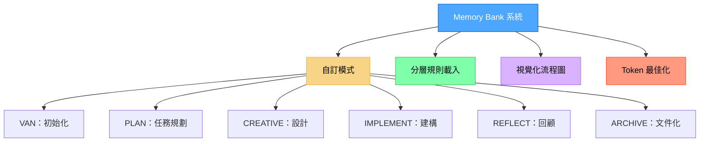
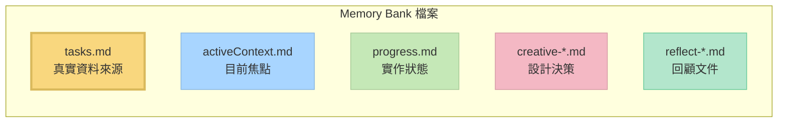

# Memory Bank 系統 v0.7-beta

[English](README.md) | 中文說明

一個針對 token 最佳化、分層式任務管理系統，整合 Cursor 自訂模式，提升開發流程效率。



> **個人說明**：Memory Bank 是我個人的興趣專案，專為我自己在程式開發時使用。由於這是個人專案，我不維護 issues 追蹤，也不主動收集回饋。不過，如果你在使用這些規則時遇到問題，其中一大優點是你可以直接請 Cursor AI 修改或更新規則，以更貼合你的工作流程。系統設計上就是讓 AI 能夠協助你自訂，無需外部支援即可調整。

## 關於 Memory Bank

Memory Bank 是一個個人專案，提供結構化的開發流程，針對不同開發階段設計專屬模式。它採用分層式規則載入架構，僅載入每階段所需規則，最佳化 token 使用並提供專屬指引。

### Token 最佳化架構

0.7-beta 版帶來顯著的 token 最佳化改進：

- **分層規則載入**：僅於初始化時載入必要規則，並採用專屬 lazy-loading
- **漸進式文件化**：實作簡潔模板，隨任務複雜度擴展
- **最佳化模式切換**：於模式間有效保留關鍵上下文
- **等級專屬流程**：依任務複雜度調整文件需求

詳見 [Memory Bank 最佳化說明](MEMORY_BANK_OPTIMIZATIONS.md) 文件，了解所有最佳化方式。

### 超越基本自訂模式

雖然 Cursor 官方文件將自訂模式描述為獨立設定（僅有提示詞與工具選擇），Memory Bank 大幅擴展此概念：

- **圖形化模式整合**：各模式為開發流程中的節點，非孤立工具
- **流程推進**：模式設計有明確順序（VAN → PLAN → CREATIVE → IMPLEMENT → REFLECT → ARCHIVE）
- **共享記憶體**：透過 Memory Bank 檔案於模式間維持持久狀態
- **自適應行為**：每個模式會根據專案複雜度調整建議
- **內建 QA 函式**：任何模式皆可呼叫 QA 進行技術驗證

此設計將自訂模式從單純 AI 人格，轉變為協同合作的開發系統，各階段專責不同任務。

### CREATIVE 模式與 Claude「Think」工具

Memory Bank 的 CREATIVE 模式概念上參考 Anthropic Claude「Think」工具方法論，詳見其 [工程部落格](https://www.anthropic.com/engineering/claude-think-tool)。v0.7-beta 版實作了最佳化版本，具備：

- 漸進式文件化與表格式選項比較
- 「按需細節」策略，節省 token
- 隨複雜度擴展的結構化模板
- 實作階段的高效上下文保留

詳見 [CREATIVE 模式與 Claude「Think」工具](creative_mode_think_tool.md) 文件。

## 主要特色

- **分層規則載入**：僅載入必要規則，並支援 lazy-loading
- **漸進式文件化**：簡潔模板，隨任務複雜度擴展
- **統一上下文轉移**：模式間高效保留上下文
- **模式專屬視覺圖**：各開發階段皆有清晰流程圖
- **等級專屬流程**：依複雜度（1-4 級）調整流程
- **平台感知指令**：自動適應作業系統的指令

## 安裝說明

### 先決條件

- **Cursor 編輯器**：需 0.48 版以上
- **自訂模式**：需於 Cursor（設定 → 功能 → Chat → Custom modes）啟用
- **AI 模型**：建議使用 Claude 3.7 Sonnet，特別適合 CREATIVE 模式

### 步驟 1：取得檔案

直接將本專案複製到你的專案目錄：

```
git clone https://github.com/vanzan01/cursor-memory-bank.git
```

或從 GitHub 下載 ZIP 並解壓縮至專案資料夾。

你會取得所有必要檔案，包括：

- `.cursor/rules/isolation_rules/` 下的規則檔
- `custom_modes/` 目錄下的模式指令檔
- `memory-bank/` 下的 Memory Bank 範本檔案

### 步驟 2：於 Cursor 設定自訂模式

**這是安裝過程中最關鍵且最具挑戰的部分。** 你需手動於 Cursor 建立六個自訂模式，並將指令內容從對應檔案複製貼上：

#### 如何於 Cursor 新增自訂模式

1. 開啟 Cursor，點選聊天面板的模式選擇器
2. 選擇「新增自訂模式」
3. 在設定畫面：
   - 輸入模式名稱（可於開頭貼上 emoji，如 🔍、📋、🎨、⚒️）
   - 從 Cursor 預設圖示中選擇一個
   - 可設定快捷鍵（選填）
   - 勾選所需工具
   - 點選 **進階選項**
   - 在下方空白欄貼上對應檔案的自訂指令內容

<table>
  <tr>
    <td align="center"><em>設定畫面範例：</em></td>
    <td align="center"><em>模式選單結果：</em></td>
  </tr>
  <tr>
    <td valign="top">
      
    </td>
    <td valign="top">
      
    </td>
  </tr>
</table>

#### 模式設定

每個模式請依下列方式設定：

1. **VAN 模式**（初始化）

   - **名稱**：🔍 VAN
   - **工具**：啟用「程式碼庫搜尋」、「讀取檔案」、「終端機」、「列出目錄」
   - **進階選項**：貼上 `custom_modes/van_instructions.md` 內容

2. **PLAN 模式**（任務規劃）

   - **名稱**：📋 PLAN
   - **工具**：啟用「程式碼庫搜尋」、「讀取檔案」、「終端機」、「列出目錄」
   - **進階選項**：貼上 `custom_modes/plan_instructions.md` 內容

3. **CREATIVE 模式**（設計決策）

   - **名稱**：🎨 CREATIVE
   - **工具**：啟用「程式碼庫搜尋」、「讀取檔案」、「終端機」、「列出目錄」、「編輯檔案」
   - **進階選項**：貼上 `custom_modes/creative_instructions.md` 內容

4. **IMPLEMENT 模式**（程式碼實作）

   - **名稱**：⚒️ IMPLEMENT
   - **工具**：全部啟用
   - **進階選項**：貼上 `custom_modes/implement_instructions.md` 內容

5. **REFLECT 模式**（回顧）

   - **名稱**：🔍 REFLECT
   - **工具**：啟用「程式碼庫搜尋」、「讀取檔案」、「終端機」、「列出目錄」
   - **進階選項**：貼上 `custom_modes/reflect_archive_instructions.md`（REFLECT 區段）

6. **ARCHIVE 模式**（文件化）
   - **名稱**：📚 ARCHIVE
   - **工具**：啟用「程式碼庫搜尋」、「讀取檔案」、「終端機」、「列出目錄」、「編輯檔案」
   - **進階選項**：貼上 `custom_modes/reflect_archive_instructions.md`（ARCHIVE 區段）

> **注意**：REFLECT 與 ARCHIVE 指令合併於同一檔案，以最佳化 Cursor 字元限制並維持功能。感謝 GitHub 用戶 @joshmac007 實作此最佳化。

如需自訂模式設定協助，請參考 [Cursor 官方自訂模式文件](https://docs.cursor.com/chat/custom-modes)。

### QA 功能

QA 並非獨立自訂模式，而是一組可於任意模式呼叫的驗證函式。當你需要技術驗證時，在任何模式輸入「QA」即可。此設計讓你能於開發流程任意階段進行驗證。

## 基本用法

1. **從 VAN 模式開始**：

   - 切換至 VAN 模式
   - 輸入「VAN」啟動初始化流程
   - VAN 會分析專案結構並判斷複雜度

2. **依複雜度選擇流程**：

   - **1 級任務**：VAN 後可直接進入 IMPLEMENT
   - **2 級任務**：簡化流程（VAN → PLAN → IMPLEMENT → REFLECT）
   - **3-4 級任務**：完整流程（VAN → PLAN → CREATIVE → IMPLEMENT → REFLECT → ARCHIVE）
   - **任意階段**：輸入「QA」進行技術驗證

3. **模式專屬指令**：
   ```
   VAN - 初始化專案並判斷複雜度
   PLAN - 建立詳細實作計畫
   CREATIVE - 探索複雜元件設計方案
   IMPLEMENT - 系統化建構規劃元件
   REFLECT - 回顧並記錄經驗
   ARCHIVE - 建立完整文件
   QA - 驗證技術實作（可於任意模式呼叫）
   ```

## 核心檔案與用途



- **tasks.md**：任務追蹤的核心資料來源
- **activeContext.md**：維持當前開發階段焦點
- **progress.md**：追蹤實作進度
- **creative-\*.md**：CREATIVE 模式產生的設計決策文件
- **reflect-\*.md**：REFLECT 模式產生的回顧文件

## 疑難排解

### 常見問題

1. **模式未正確回應**：

   - 確認自訂指令是否完整貼上（最常見問題）
   - 檢查各模式所需工具是否已啟用
   - 確認切換至正確模式後再下指令
   - 指令是否貼在「進階選項」欄位

2. **規則未載入**：

   - 檢查 `.cursor/rules/isolation_rules/` 目錄位置是否正確
   - 檢查檔案權限是否允許讀取

3. **指令執行問題**：
   - 確認於正確目錄下執行指令
   - 檢查平台專屬指令是否正確使用

## 版本資訊

本系統為 Memory Bank v0.7-beta，帶來顯著 token 最佳化，並維持所有功能。詳見 [發行說明](RELEASE_NOTES.md)。

### 持續開發中

Memory Bank 系統持續開發與優化，重點如下：

- **持續進行**：本為 beta 版，將定期更新與新增功能
- **功能最佳化**：模組化架構可持續優化，且不影響現有功能
- **可用舊版**：如需穩定性，可繼續使用 v0.1-legacy
- **架構優勢**：建議先閱讀 [Memory Bank 升級指南](memory_bank_upgrade_guide.md) 了解新架構優點

## 資源

- [Memory Bank 最佳化說明](MEMORY_BANK_OPTIMIZATIONS.md) - Token 效率提升詳解
- [發行說明](RELEASE_NOTES.md) - 最新變更資訊
- [Cursor 自訂模式官方文件](https://docs.cursor.com/chat/custom-modes)
- [Memory Bank 升級指南](memory_bank_upgrade_guide.md)
- [CREATIVE 模式與 Claude「Think」工具](creative_mode_think_tool.md)
- `custom_modes/` 目錄下的模式指令檔

---

_註：本 README 為 v0.7-beta，隨系統演進將持續更新。_
