# CREATIVE 模式與 Claude「Think」工具

[English](creative_mode_think_tool.md) | 中文說明

本文件說明 Memory Bank 的 CREATIVE 模式如何實作類似於 Anthropic Claude「Think」工具方法論的概念，詳見其 [工程部落格](https://www.anthropic.com/engineering/claude-think-tool)。

## 概念對應

下圖說明 Claude「Think」工具方法論與 Memory Bank CREATIVE 模式的概念相似性：

```mermaid
graph TD
    subgraph "Claude Think Tool 方法"
        CT1["1：問題拆解"] --> CT2["2：探索解決空間"]
        CT2 --> CT3["3：分析取捨"]
        CT3 --> CT4["4：選擇並文件化決策"]
        CT4 --> CT5["5：驗證決策"]
    end

    subgraph "Memory Bank CREATIVE 模式"
        CM1["1：元件拆解"] --> CM2["2：選項探索"]
        CM2 --> CM3["3：取捨分析"]
        CM3 --> CM4["4：決策文件化"]
        CM4 --> CM5["5：決策驗證"]
    end

    style CT1 fill:#f9d77e,stroke:#d9b95c
    style CT2 fill:#f9d77e,stroke:#d9b95c
    style CT3 fill:#f9d77e,stroke:#d9b95c
    style CT4 fill:#f9d77e,stroke:#d9b95c
    style CT5 fill:#f9d77e,stroke:#d9b95c

    style CM1 fill:#a8d5ff,stroke:#88b5e0
    style CM2 fill:#a8d5ff,stroke:#88b5e0
    style CM3 fill:#a8d5ff,stroke:#88b5e0
    style CM4 fill:#a8d5ff,stroke:#88b5e0
    style CM5 fill:#a8d5ff,stroke:#88b5e0
```



## Claude「Think」工具核心原則

Claude「Think」工具方法論重點：

1. **結構化思考流程**：將複雜問題拆解為可管理元件
2. **明確推理**：清楚記錄推理過程
3. **選項探索**：系統性探索多種解法
4. **取捨分析**：比較各選項優缺點
5. **決策文件化**：記錄決策及其理由

## CREATIVE 模式如何實踐這些原則

Memory Bank CREATIVE 模式透過下列方式實作類似概念：

### 1. 結構化階段

CREATIVE 模式以明確階段強制結構化設計決策：

```
階段 1：元件拆解
階段 2：選項探索
階段 3：取捨分析
階段 4：決策文件化
階段 5：決策驗證
```

每個階段皆有明確產出與通過標準，須達標方可進入下一階段。

### 2. 元件拆解模板

CREATIVE 模式提供元件拆解模板：

```markdown
# 元件：[元件名稱]

## 功能需求

- [需求 1]
- [需求 2]

## 技術限制

- [限制 1]
- [限制 2]

## 整合點

- [整合點 1]
- [整合點 2]
```

### 3. 選項探索模板

用於探索設計替代方案：

```markdown
# 設計選項：[選項名稱]

## 核心方法

[簡述方法]

## 實作細節

[主要實作考量]

## 初步評估

- **優點**：[列出優點]
- **缺點**：[列出缺點]
- **未知**：[列出未知]
```

### 4. 取捨分析矩陣

系統性比較各選項：

```markdown
# 取捨分析

| 評比項目 | 選項 A | 選項 B | 選項 C |
| -------- | ------ | ------ | ------ |
| 效能     | 評分   | 評分   | 評分   |
| 維護性   | 評分   | 評分   | 評分   |
| 延展性   | 評分   | 評分   | 評分   |
| 複雜度   | 評分   | 評分   | 評分   |
| 風險     | 評分   | 評分   | 評分   |

## 詳細分析

[詳細取捨討論]
```

### 5. 決策文件化

記錄最終決策與理由：

```markdown
# 設計決策：[決策名稱]

## 選定方案

[描述選定方案]

## 理由

[說明為何選此方案]

## 捨棄選項

[簡述未採用方案]

## 實作指引

[實作注意事項]
```

## 實務範例

以下為設計資料快取系統時，CREATIVE 模式會話簡化範例：

### 步驟 1：拆解問題

```
CREATIVE：讓我們設計應用的快取系統。先拆解元件與需求。

元件：資料快取系統

功能需求：
- 快取常用資料以減輕資料庫負載
- 提供可設定的過期策略
- 處理快取失效
- 支援多實例分散式快取

技術限制：
- 必須相容現有 Redis 架構
- 記憶體使用不得超過 2GB
- 快取操作需於 10ms 內完成
```

### 步驟 2：探索選項

```
我們探索三種設計方案：

選項 A：簡單 Redis Key-Value 實作
- 直接用 Redis key-value 並字串序列化
- 簡單 TTL 過期
- 直接刪除 key 進行手動失效

選項 B：Redis Hash 分層快取
- 依實體類型用 Redis Hash 組織資料
- 用 Redis pub/sub 通知失效
- 實作分層過期策略

選項 C：混合本地-Redis 快取
- 本地記憶體 LRU 快取為第一層
- Redis 為第二層分散式快取
- 背景同步兩層資料
```

### 步驟 3：分析取捨

```
取捨分析：

| 評比項目         | 選項 A | 選項 B | 選項 C |
| ---------------- | ------ | ------ | ------ |
| 實作複雜度       | 低     | 中     | 高     |
| 效能             | 中     | 中     | 高     |
| 記憶體效率       | 中     | 高     | 中     |
| 延展性           | 中     | 高     | 高     |
| 維護性           | 低     | 中     | 高     |

詳細分析：
- 選項 A 最簡單但功能有限
- 選項 B 性能與功能平衡
- 選項 C 效能最佳但複雜度高
```

### 步驟 4：文件化決策

```
設計決策：Redis Hash 分層快取（選項 B）

理由：
- 性能與維護性平衡最佳
- Redis Hash 結構比選項 A 更省記憶體
- 較選項 C 複雜度低但仍滿足效能需求
- 更適合分散式架構

實作指引：
- 建立 CacheManager 類別，提供實體專屬 API
- 實作 Redis pub/sub 監聽失效事件
- 加入快取命中/失敗率監控
```

## 核心方法論對應

上述範例的結構化流程與 Claude「Think」工具方法論一致：

1. **拆解**快取問題，明確需求與限制
2. **探索**多種設計方案
3. **分析取捨**，明確評比標準
4. **文件化決策**，說明理由
5. **提供實作指引**，利於後續開發

## 對開發流程的影響

導入 Claude 方法論後，CREATIVE 模式帶來：

1. **決策品質提升**：更系統性探索選項
2. **決策文件更完善**：明確記錄設計理由
3. **知識持續保存**：設計決策可供未來參考
4. **減少設計偏誤**：結構化流程降低認知偏誤
5. **實作指引更明確**：實作階段方向更清楚

## 持續優化

隨 Claude 能力提升，CREATIVE 模式將持續優化：

- 納入更進階結構化思考法
- 改善設計決策模板與框架
- 強化與其他 Memory Bank 模式整合
- 最佳化結構與彈性平衡

目標是在維持核心方法論的同時，不斷提升 Memory Bank 生態系的實用性。

---

_註：本文件說明 Memory Bank v0.6-beta 如何實作類似 Claude「Think」工具方法論。未來將隨兩系統演進持續優化。_
