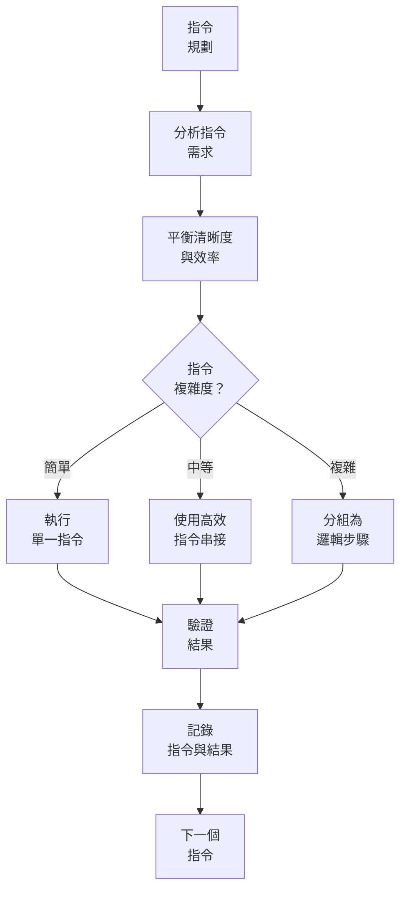
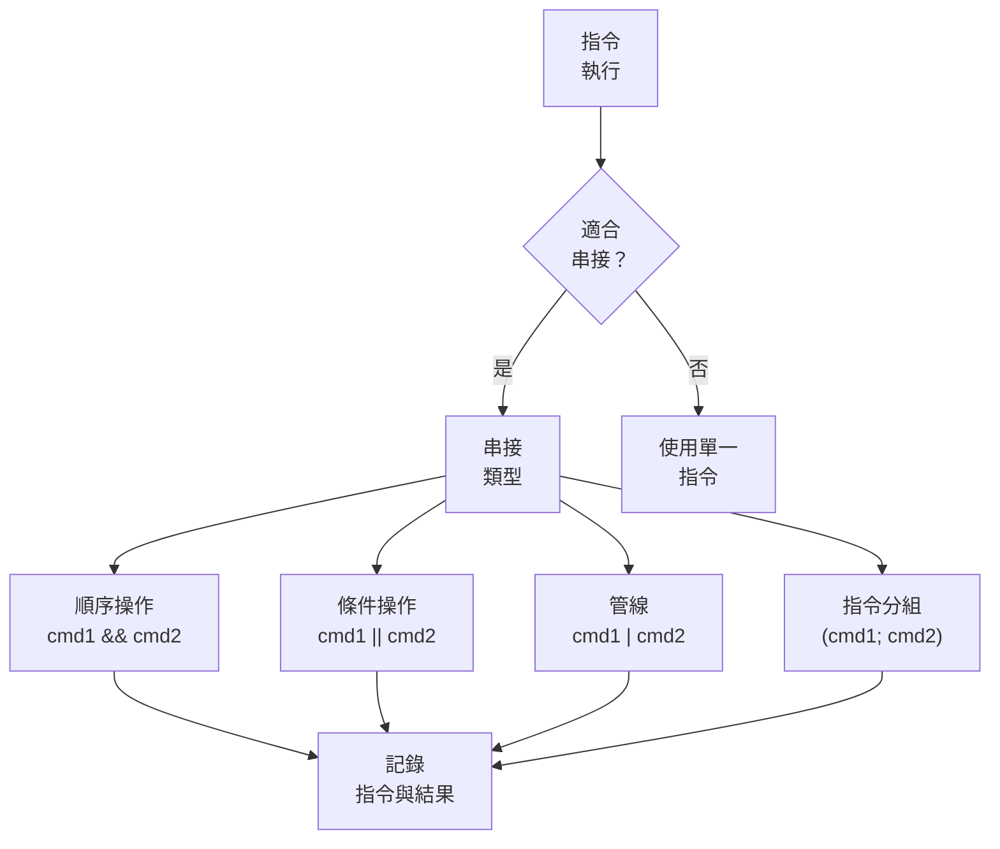
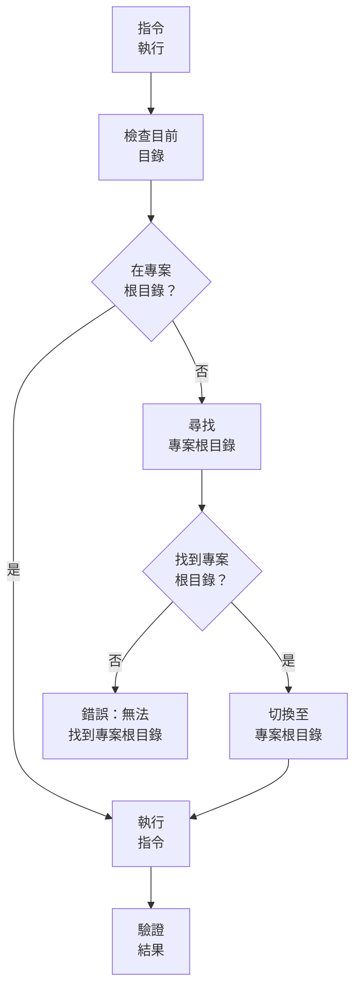
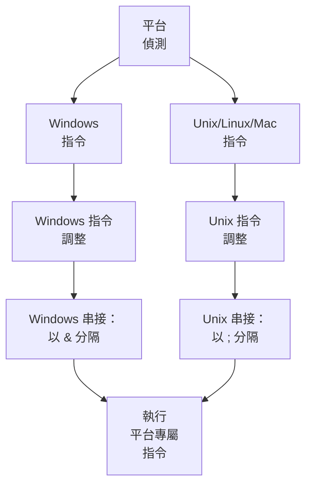
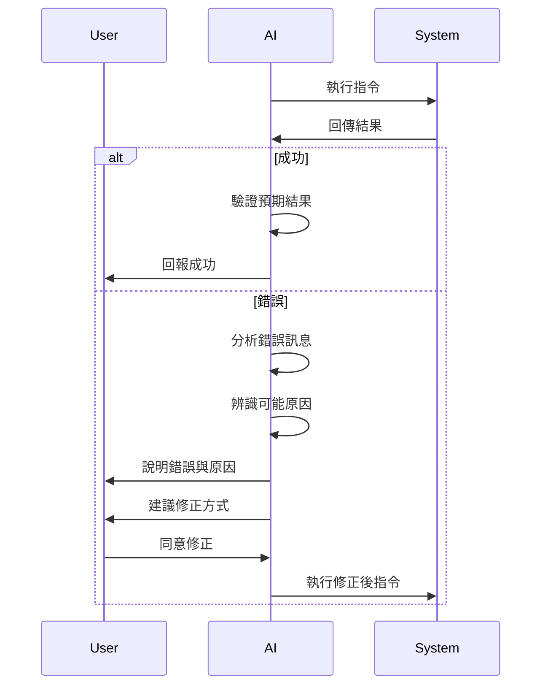
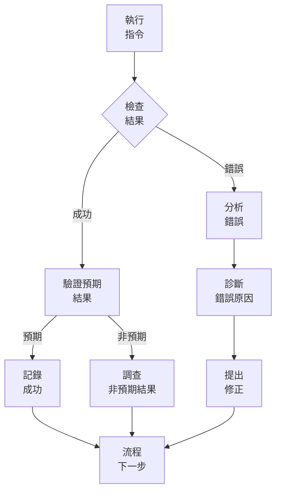
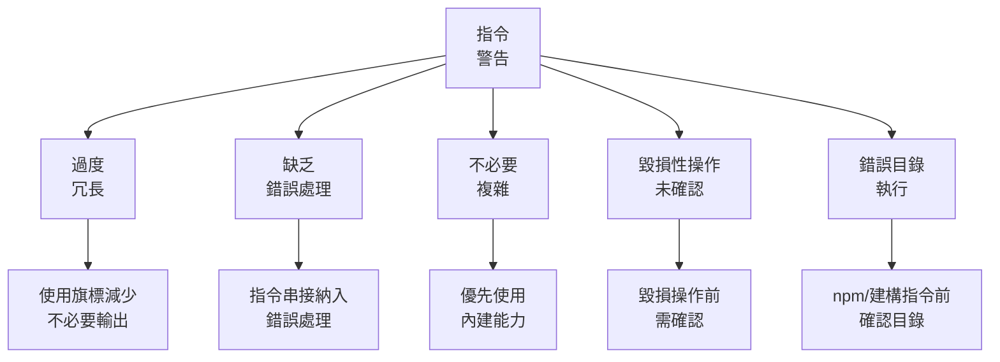

# 指令執行系統

> **重點摘要：** 本系統提供高效指令執行指引，透過適當的指令串接平衡清晰度與位元組最佳化，並妥善記錄指令與結果。

## 🔍 指令效率工作流程



## 📋 指令串接指引



## 🚦 目錄驗證工作流程



## 📋 目錄驗證檢查表

執行任何 npm 或建構指令前：

| 步驟                  | Windows (PowerShell)         | Unix/Linux/Mac                          | 目的                     |
| --------------------- | ---------------------------- | --------------------------------------- | ------------------------ |
| **檢查 package.json** | `Test-Path package.json`     | `ls package.json`                       | 確認目前目錄為專案根目錄 |
| **檢查父目錄**        | `Test-Path "*/package.json"` | `find . -maxdepth 2 -name package.json` | 尋找潛在專案目錄         |
| **切換至專案根目錄**  | `cd [project-dir]`           | `cd [project-dir]`                      | 執行指令前切換至正確目錄 |

## 📋 React 專案指令指引

針對 React 應用，請遵循以下嚴格指引：

| 指令              | 正確用法                                            | 錯誤用法                           | 備註                              |
| ----------------- | --------------------------------------------------- | ---------------------------------- | --------------------------------- |
| **npm start**     | `cd [project-root] && npm start`                    | `npm start`（於父目錄）            | 必須於含 package.json 目錄執行    |
| **npm run build** | `cd [project-root] && npm run build`                | `cd [parent-dir] && npm run build` | 必須於含 package.json 目錄執行    |
| **npm install**   | `cd [project-root] && npm install [pkg]`            | `npm install [pkg]`（錯誤目錄）    | 相依套件安裝於最近的 package.json |
| **npm create**    | `npm create vite@latest my-app -- --template react` | 手動設定 webpack                   | 請使用標準工具建立專案            |

## 🔄 指令串接模式

有效的指令串接模式包括：

| 模式     | 格式           | 範例                                   | 使用情境                     |
| -------- | -------------- | -------------------------------------- | ---------------------------- | ----------------- | --- | --------------- | ------------------ |
| **順序** | `cmd1 && cmd2` | `mkdir dir && cd dir`                  | 順序執行，前者成功才執行後者 |
| **條件** | `cmd1          |                                        | cmd2`                        | `test -f file.txt |     | touch file.txt` | 前者失敗才執行後者 |
| **管線** | `cmd1 \| cmd2` | `grep "pattern" file.txt \| wc -l`     | 前者輸出作為後者輸入         |
| **背景** | `cmd &`        | `npm start &`                          | 背景執行指令                 |
| **分組** | `(cmd1; cmd2)` | `(echo "Start"; npm test; echo "End")` | 一次執行一組指令             |

## 📋 指令記錄範本

```
## 指令執行：［用途］

### 指令
```

[實際指令或串接]

```

### 結果
```

[指令輸出]

```

### 效果
[簡述系統變動]

### 下一步
[後續動作]
```

## 🔍 平台專屬注意事項



## 📋 指令效率範例

高效指令使用範例：

| 低效                                                  | 高效                                   | 說明                 |
| ----------------------------------------------------- | -------------------------------------- | -------------------- |
| `mkdir dir`<br>`cd dir`<br>`npm init -y`              | `mkdir dir && cd dir && npm init -y`   | 合併相關順序操作     |
| `ls`<br>`grep "\.js$"`                                | `ls \| grep "\.js$"`                   | 管線串接             |
| `test -f file.txt`<br>`if not exists, touch file.txt` | `test -f file.txt \|\| touch file.txt` | 僅在不存在時建立檔案 |
| `mkdir dir1`<br>`mkdir dir2`<br>`mkdir dir3`          | `mkdir dir1 dir2 dir3`                 | 使用內建多參數能力   |
| `npm install pkg1`<br>`npm install pkg2`              | `npm install pkg1 pkg2`                | 一次安裝多個套件     |

## 📋 React 專案初始化標準

請務必使用以下標準方式建立 React 專案：

| 方式                              | 指令                                                | 優點                 | 避免              |
| --------------------------------- | --------------------------------------------------- | -------------------- | ----------------- |
| **Create React App**              | `npx create-react-app my-app`                       | 預設 webpack & babel | 手動設定錯誤      |
| **Create React App w/TypeScript** | `npx create-react-app my-app --template typescript` | 型別安全 + 預設設定  | 模組系統不一致    |
| **Vite**                          | `npm create vite@latest my-app -- --template react` | 更快建構             | 複雜 webpack 設定 |
| **Next.js**                       | `npx create-next-app@latest my-app`                 | SSR 支援             | 模組系統衝突      |

## ⚠️ 錯誤處理工作流程



## 📋 指令結果驗證

執行指令後，請驗證：



## 📝 指令執行檢查表

```
✓ 指令執行檢查表
- 指令用途明確？ [是/否]
- 清晰度與效率平衡？ [是/否]
- 平台專屬考量已處理？ [是/否]
- 指令與結果有記錄？ [是/否]
- 結果有依預期驗證？ [是/否]
- 錯誤有妥善處理？ [是/否/不適用]
- npm/建構指令：於專案根目錄執行？ [是/否/不適用]
- React 專案：使用標準工具？ [是/否/不適用]

→ 全部為是：指令執行完成
→ 有否：請補齊缺漏
```

## 🚨 指令執行警告

請避免以下常見指令問題：


