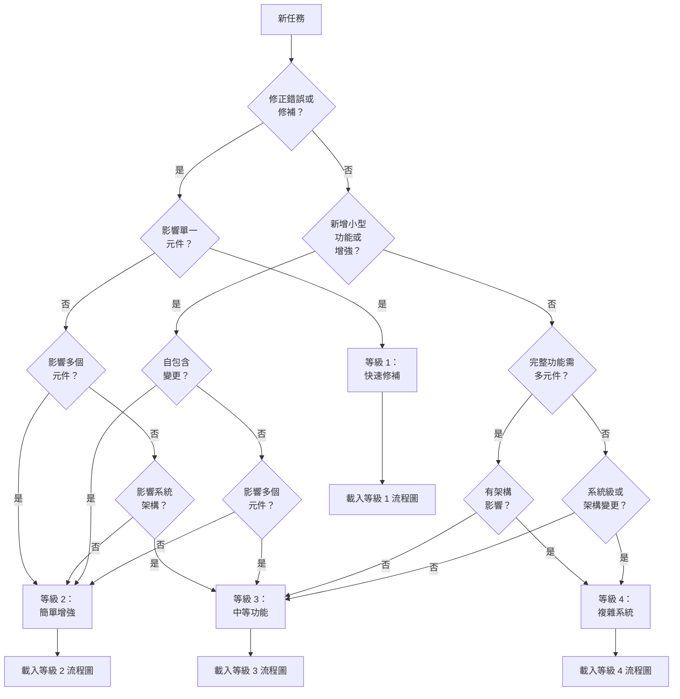

# 任務複雜度判斷

> **重點摘要：** 本文件協助判斷任務適用的複雜度等級（1-4）。請依決策樹與指標選擇正確流程等級，並載入對應流程圖。

## 🌳 複雜度決策樹



## 📊 複雜度等級指標

請依下列指標協助判斷任務複雜度：

### 等級 1：快速修補

- **關鍵字**："fix", "broken", "not working", "issue", "bug", "error", "crash"
- **範圍**：單一元件或 UI 元素
- **時程**：可於短時間（數分鐘至數小時）完成
- **風險**：低，變更具隔離性
- **範例**：
  - 修正按鈕無作用
  - 修正樣式問題
  - 修正驗證錯誤
  - 修復連結失效
  - 修正錯字或文字問題

### 等級 2：簡單增強

- **關鍵字**："add", "improve", "update", "change", "enhance", "modify"
- **範圍**：單一元件或子系統
- **時程**：數小時至 1-2 天
- **風險**：中等，影響範圍明確
- **範例**：
  - 新增表單欄位
  - 改善驗證
  - 更新樣式
  - 新增簡單功能
  - 變更文字內容
  - 增強現有元件

### 等級 3：中等功能

- **關鍵字**："implement", "create", "develop", "build", "feature"
- **範圍**：多個元件，完整功能
- **時程**：數天至 1-2 週
- **風險**：顯著，影響多處
- **範例**：
  - 實作使用者認證
  - 建立儀表板
  - 開發搜尋功能
  - 建立使用者個人系統
  - 實作資料視覺化
  - 建立複雜表單系統

### 等級 4：複雜系統

- **關鍵字**："system", "architecture", "redesign", "integration", "framework"
- **範圍**：多個子系統或整個應用
- **時程**：數週至數月
- **風險**：高，具架構性影響
- **範例**：
  - 實作認證系統
  - 建立付款處理框架
  - 建立微服務架構
  - 實作資料庫遷移系統
  - 開發即時通訊系統
  - 建立多租戶架構

## 🔍 複雜度評估問題

請回答下列問題以判斷複雜度：

1. **範圍影響**

   - 僅影響單一元件還是多個？
   - 是否有系統級影響？
   - 需修改多少檔案？

2. **設計決策**

   - 是否需複雜設計決策？
   - 是否需創意階段設計？
   - 是否有架構考量？

3. **風險評估**

   - 若失敗會有何影響？
   - 是否有安全性考量？
   - 是否影響關鍵功能？

4. **實作工作量**
   - 需花多久時間？
   - 是否需專業知識？
   - 是否需大量測試？

## 📊 關鍵字分析表

| 關鍵字         | 可能等級 | 備註         |
| -------------- | -------- | ------------ |
| "Fix"          | 等級 1   | 除非系統級   |
| "Bug"          | 等級 1   | 除非多元件   |
| "Error"        | 等級 1   | 除非架構性   |
| "Add"          | 等級 2   | 除非複雜功能 |
| "Update"       | 等級 2   | 除非架構性   |
| "Improve"      | 等級 2   | 除非系統級   |
| "Implement"    | 等級 3   | 複雜元件     |
| "Create"       | 等級 3   | 新功能       |
| "Develop"      | 等級 3   | 範圍大       |
| "System"       | 等級 4   | 架構性影響   |
| "Architecture" | 等級 4   | 重大結構變更 |
| "Framework"    | 等級 4   | 核心基礎建設 |

## 🔄 複雜度升級

若執行中發現任務比原先判斷更複雜：

```
⚠️ 需升級任務複雜度
目前等級：Level [X]
建議等級：Level [Y]
原因：[簡要說明]

是否要將此任務升級至 Level [Y]？
```

若同意，請切換至對應高等級流程圖。

## 🎯 流程選擇

判斷複雜度後，請載入對應流程圖：

| 等級 | 說明     | 流程圖                                                     |
| ---- | -------- | ---------------------------------------------------------- |
| 1    | 快速修補 | [Level 1 Map](mdc:.cursor/rules/visual-maps/level1-map.md) |
| 2    | 簡單增強 | [Level 2 Map](mdc:.cursor/rules/visual-maps/level2-map.md) |
| 3    | 中等功能 | [Level 3 Map](mdc:.cursor/rules/visual-maps/level3-map.md) |
| 4    | 複雜系統 | [Level 4 Map](mdc:.cursor/rules/visual-maps/level4-map.md) |

## 📝 複雜度判斷範本

請用此範本記錄複雜度判斷：

```
## 複雜度判斷

任務：[任務描述]

評估：
- 範圍：[單一元件/多元件/系統級]
- 設計決策：[簡單/中等/複雜]
- 風險：[低/中/高]
- 實作工作量：[低/中/高]

識別關鍵字：[列出相關關鍵字]

判斷結果：Level [1/2/3/4] - [快速修補/簡單增強/中等功能/複雜系統]

載入流程圖：[Level X Map]
```
