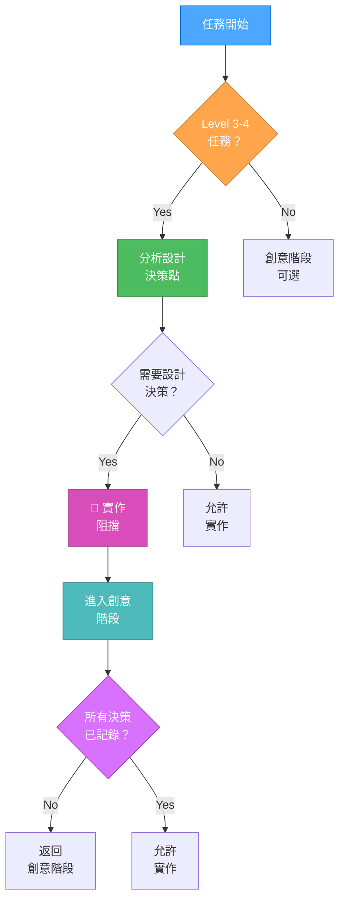
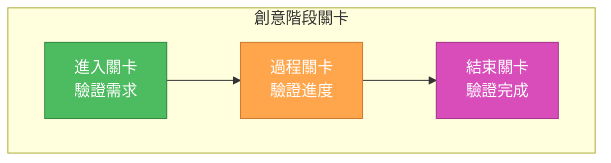
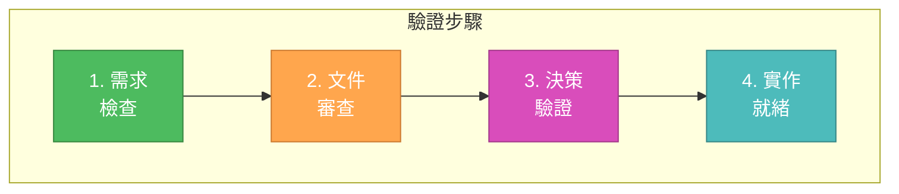
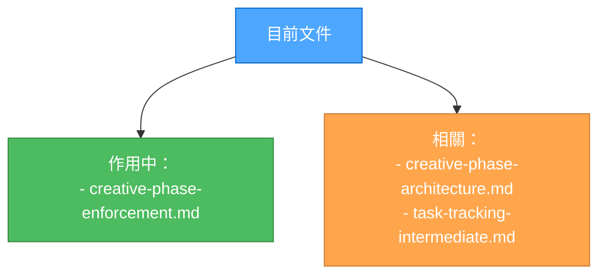

# 創意階段強制執行

> **重點摘要：** 本文件針對 Level 3-4 任務，嚴格強制執行創意階段需求，確保所有設計決策在進入實作前皆已妥善記錄與驗證。

## 🔍 強制執行流程



## 🚨 強制執行關卡



## 📋 強制執行檢查表

```markdown
## 進入關卡驗證

- [ ] 任務複雜度為 Level 3-4
- [ ] 已識別設計決策
- [ ] 已記錄創意階段需求
- [ ] 已通知必要參與者

## 過程關卡驗證

- [ ] 所有選項皆有考慮
- [ ] 優缺點已記錄
- [ ] 技術限制已識別
- [ ] 實作影響已評估

## 結束關卡驗證

- [ ] 所有決策已記錄
- [ ] 選擇理由已說明
- [ ] 已規劃實作方案
- [ ] 已對照需求驗證
```

## 🚨 實作阻擋通知

當創意階段尚未完成但已要求實作時：

```
🚨 實作阻擋
創意階段必須完成後才能進入實作。

必須完成的創意階段：
- [ ] [創意階段 1]
- [ ] [創意階段 2]
- [ ] [創意階段 3]

⛔ 這是嚴格阻擋
所有創意階段未完成前，實作不得進行。
輸入 "PHASE.REVIEW" 以開始創意階段審查。
```

## ✅ 驗證流程



## 🔄 創意階段標記

請使用下列標記明確標示創意階段界線：

```markdown
🎨🎨🎨 進入創意階段: [類型] 🎨🎨🎨
聚焦： [特定元件/功能]
目標： [本創意階段明確目標]
需求： [需求清單]

[創意階段內容]

🎨 創意檢查點: [里程碑]

- 進度: [狀態]
- 決策: [清單]
- 下一步: [計畫]

🎨🎨🎨 離開創意階段 🎨🎨🎨
摘要: [簡述]
關鍵決策: [清單]
下一步: [實作計畫]
```

## 🔄 文件管理


