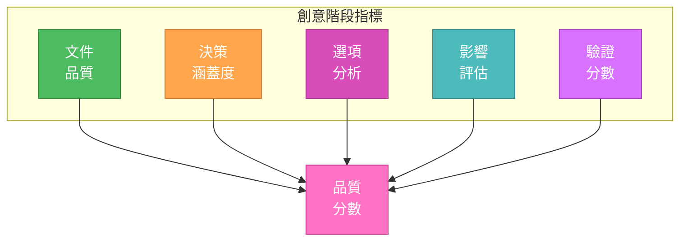
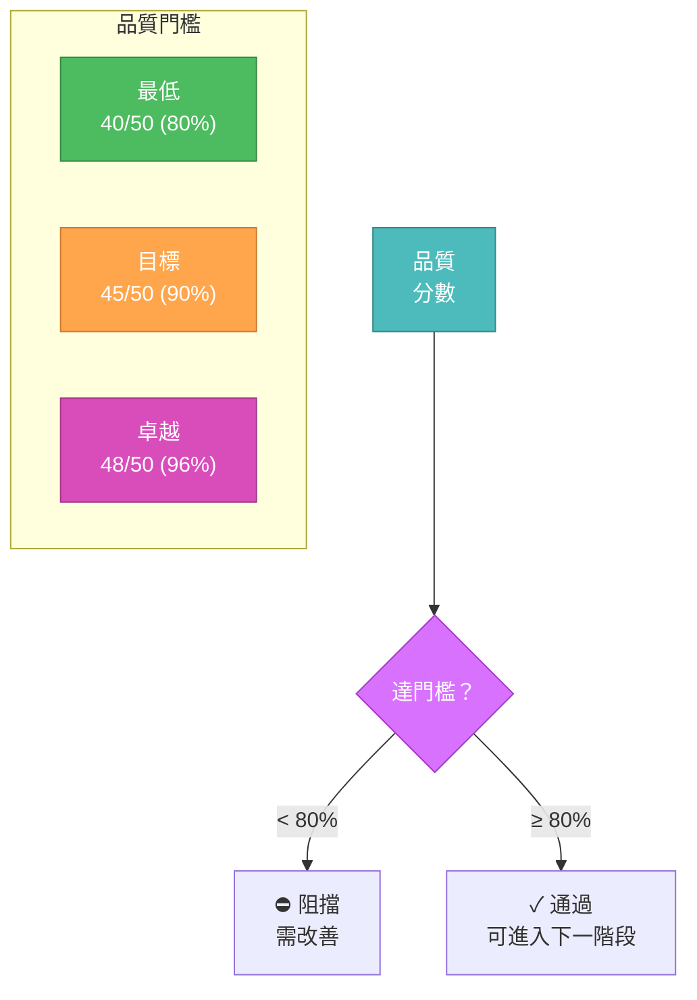
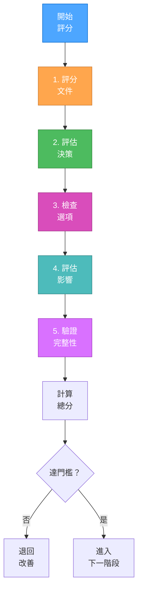
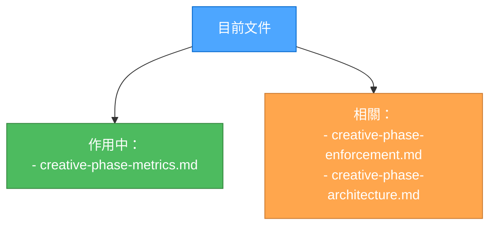

# 創意階段指標

> **重點摘要：** 本文件定義創意階段的完整品質指標與衡量標準，確保設計決策符合要求並妥善記錄。

## 📊 指標總覽



## 📋 品質指標評分卡

```markdown
# 創意階段品質評估

## 1. 文件品質 [0-10]

- [ ] 問題陳述清楚（2 分）
- [ ] 目標明確（2 分）
- [ ] 需求清單完整（2 分）
- [ ] 格式與結構妥當（2 分）
- [ ] 有相關文件交叉參照（2 分）

## 2. 決策涵蓋度 [0-10]

- [ ] 所有必要決策已識別（2 分）
- [ ] 每個決策點有記錄（2 分）
- [ ] 相依性有繪製（2 分）
- [ ] 包含影響分析（2 分）
- [ ] 有未來考量（2 分）

## 3. 選項分析 [0-10]

- [ ] 有多個選項考慮（2 分）
- [ ] 優缺點有記錄（2 分）
- [ ] 技術可行性有評估（2 分）
- [ ] 資源需求有估算（2 分）
- [ ] 風險因素有識別（2 分）

## 4. 影響評估 [0-10]

- [ ] 系統影響有記錄（2 分）
- [ ] 效能影響有評估（2 分）
- [ ] 安全性有考量（2 分）
- [ ] 維護影響有評估（2 分）
- [ ] 成本影響有分析（2 分）

## 5. 驗證分數 [0-10]

- [ ] 需求有追蹤（2 分）
- [ ] 限制條件有驗證（2 分）
- [ ] 測試情境有定義（2 分）
- [ ] 有納入審查回饋（2 分）
- [ ] 最終驗證已完成（2 分）

總分：[所有類別加總] / 50
最低通過分數：40/50（80%）
```

## 📈 品質門檻



## 🎯 指標評分流程



## 📊 改善建議

若分數未達門檻：

```markdown
## 文件品質改善

- 補充明確問題陳述
- 明確列出目標
- 完整列出所有需求
- 改善格式與結構
- 增加交叉參照

## 決策涵蓋度改善

- 補齊缺漏決策
- 完整記錄決策點
- 繪製相依性
- 增加影響分析
- 考慮未來發展

## 選項分析改善

- 考慮更多替代方案
- 詳列優缺點
- 評估技術可行性
- 估算資源需求
- 識別風險

## 影響評估改善

- 記錄系統影響
- 評估效能
- 加入安全性考量
- 評估維護影響
- 分析成本

## 驗證改善

- 追蹤需求
- 驗證限制條件
- 定義測試情境
- 納入回饋
- 完成最終驗證
```

## ✅ 指標驗證檢查表

```markdown
## 預審驗證

- [ ] 各區塊皆有評分
- [ ] 計算已驗證
- [ ] 有佐證資料
- [ ] 已標示需改善區域
- [ ] 已納入審查回饋

## 最終指標驗證

- [ ] 已達最低分數
- [ ] 各類別皆通過
- [ ] 文件完整
- [ ] 已處理改善事項
- [ ] 已取得最終核可
```

## 🔄 文件管理


