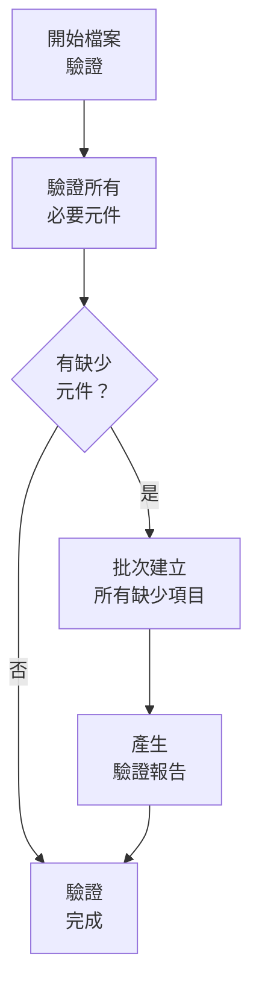
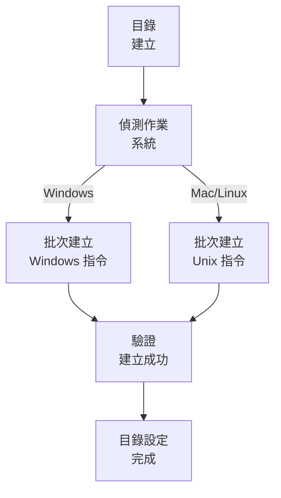

# 最佳化檔案驗證系統

> **重點摘要：** 本系統以批次操作與平台最佳化指令，高效驗證並建立所需記憶體庫檔案結構。

## 🔍 最佳化檔案驗證流程



## 📋 最佳化目錄建立



### 平台專屬指令

#### Windows (PowerShell)

```powershell
# 一次建立所有目錄
mkdir memory-bank, docs, docs\archive -ErrorAction SilentlyContinue

# 建立所有必要檔案
$files = @(".cursorrules", "tasks.md",
           "memory-bank\projectbrief.md",
           "memory-bank\productContext.md",
           "memory-bank\systemPatterns.md",
           "memory-bank\techContext.md",
           "memory-bank\activeContext.md",
           "memory-bank\progress.md")

foreach ($file in $files) {
    if (-not (Test-Path $file)) {
        New-Item -Path $file -ItemType File -Force
    }
}
```

#### Mac/Linux (Bash)

```bash
# 一次建立所有目錄
mkdir -p memory-bank docs/archive

# 建立所有必要檔案
touch .cursorrules tasks.md \
      memory-bank/projectbrief.md \
      memory-bank/productContext.md \
      memory-bank/systemPatterns.md \
      memory-bank/techContext.md \
      memory-bank/activeContext.md \
      memory-bank/progress.md
```

## 📝 精簡驗證流程

不需逐一檢查元件，請批次驗證：

```powershell
# Windows - PowerShell
$requiredDirs = @("memory-bank", "docs", "docs\archive")
$requiredFiles = @(".cursorrules", "tasks.md")
$mbFiles = @("projectbrief.md", "productContext.md", "systemPatterns.md",
             "techContext.md", "activeContext.md", "progress.md")

$missingDirs = $requiredDirs | Where-Object { -not (Test-Path $_) -or -not (Test-Path $_ -PathType Container) }
$missingFiles = $requiredFiles | Where-Object { -not (Test-Path $_) -or (Test-Path $_ -PathType Container) }
$missingMBFiles = $mbFiles | ForEach-Object { "memory-bank\$_" } |
                  Where-Object { -not (Test-Path $_) -or (Test-Path $_ -PathType Container) }

if ($missingDirs.Count -eq 0 -and $missingFiles.Count -eq 0 -and $missingMBFiles.Count -eq 0) {
    Write-Output "✓ 所有必要元件已驗證"
} else {
    # 一次建立所有缺少項目
    if ($missingDirs.Count -gt 0) {
        $missingDirs | ForEach-Object { mkdir $_ -Force }
    }
    if ($missingFiles.Count -gt 0 -or $missingMBFiles.Count -gt 0) {
        $allMissingFiles = $missingFiles + $missingMBFiles
        $allMissingFiles | ForEach-Object { New-Item -Path $_ -ItemType File -Force }
    }
}
```

## 📝 範本初始化

以單一腳本最佳化範本建立：

```powershell
# Windows - PowerShell
$templates = @{
    "tasks.md" = @"
# Memory Bank: Tasks

## Current Task
[Task not yet defined]

## Status
- [ ] Task definition
- [ ] Implementation plan
- [ ] Execution
- [ ] Documentation

## Requirements
[No requirements defined yet]
"@

    "memory-bank\activeContext.md" = @"
# Memory Bank: Active Context

## Current Focus
[No active focus defined]

## Status
[No status defined]

## Latest Changes
[No changes recorded]
"@

    # 其他範本可於此新增
}

foreach ($file in $templates.Keys) {
    if (Test-Path $file) {
        Set-Content -Path $file -Value $templates[$file]
    }
}
```

## 🔍 效能最佳化實務

1. **批次操作**：務必使用批次操作取代單一指令

   ```
   # 佳：一次建立所有目錄
   mkdir memory-bank docs docs\archive

   # 不佳：逐一建立目錄
   mkdir memory-bank
   mkdir docs
   mkdir docs\archive
   ```

2. **預先檢查最佳化**：先檢查所有需求，再只建立缺少項目

   ```
   # 先檢查缺少項目
   $missingItems = ...

   # 再只建立缺少項目
   if ($missingItems) { ... }
   ```

3. **錯誤處理**：所有指令均應納入錯誤處理

   ```
   mkdir memory-bank, docs, docs\archive -ErrorAction SilentlyContinue
   ```

4. **平台調整**：自動偵測平台並使用對應指令

   ```
   if ($IsWindows) {
       # Windows 指令
   } else {
       # Unix 指令
   }
   ```

5. **單次驗證**：一次性驗證目錄結構
   ```
   $requiredPaths = @("memory-bank", "docs", "docs\archive", ".cursorrules", "tasks.md")
   $missingPaths = $requiredPaths | Where-Object { -not (Test-Path $_) }
   ```

## 📝 驗證報告格式

```
✅ 驗證完成
- 已建立目錄: [清單]
- 已建立檔案: [清單]
- 所有元件已驗證

記憶體庫系統已可使用。
```
