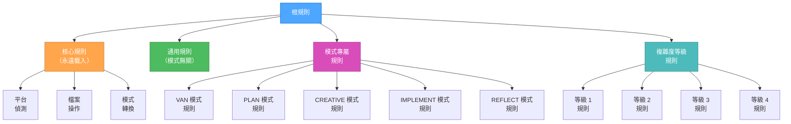
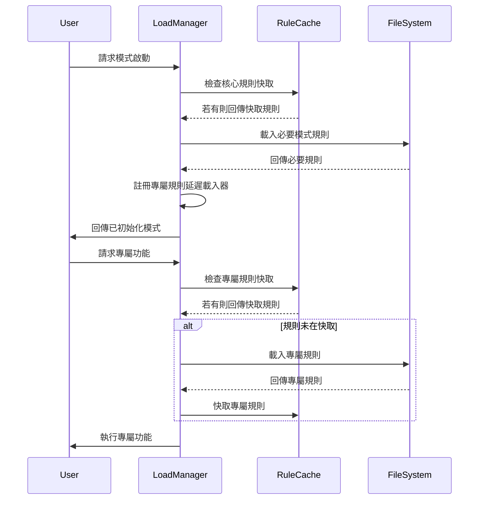
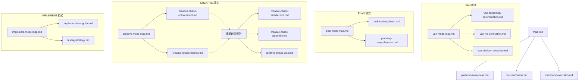

# 階層式規則載入系統

> **重點摘要：** 本規則實作最佳化載入系統，僅根據情境、複雜度等級與當前階段載入必要規則，以最大化位元組效率。

## 🧠 階層式規則結構



## 📊 規則載入協定



## 🔄 規則載入實作

```javascript
// Pseudocode for hierarchical rule loading
class RuleLoadManager {
  constructor() {
    this.cache = {
      core: {},
      common: {},
      mode: {},
      level: {},
    };
    this.lazyLoaders = {};
  }

  // Initialize a mode with only essential rules
  initializeMode(modeName, complexityLevel) {
    // Always load core rules
    this.loadCoreRules();

    // Load common rules
    this.loadCommonRules();

    // Load essential mode-specific rules
    this.loadEssentialModeRules(modeName);

    // Load complexity level rules
    this.loadComplexityRules(complexityLevel);

    // Register lazy loaders for specialized functionality
    this.registerLazyLoaders(modeName, complexityLevel);

    return {
      modeName,
      complexityLevel,
      status: "initialized",
    };
  }

  // Load only when specialized functionality is needed
  loadSpecializedRule(ruleType) {
    if (this.lazyLoaders[ruleType]) {
      if (!this.cache.specialized[ruleType]) {
        const rule = this.lazyLoaders[ruleType]();
        this.cache.specialized[ruleType] = rule;
      }
      return this.cache.specialized[ruleType];
    }
    return null;
  }

  // Register specialized rule loaders based on mode and complexity
  registerLazyLoaders(modeName, complexityLevel) {
    // Clear existing lazy loaders
    this.lazyLoaders = {};

    // Register mode-specific lazy loaders
    if (modeName === "CREATIVE") {
      this.lazyLoaders["architecture"] = () =>
        this.loadRule("creative-phase-architecture.md");
      this.lazyLoaders["algorithm"] = () =>
        this.loadRule("creative-phase-algorithm.md");
      this.lazyLoaders["uiux"] = () => this.loadRule("creative-phase-uiux.md");
    } else if (modeName === "IMPLEMENT") {
      this.lazyLoaders["testing"] = () =>
        this.loadRule("implementation-testing.md");
      this.lazyLoaders["deployment"] = () =>
        this.loadRule("implementation-deployment.md");
    }

    // Register complexity-specific lazy loaders
    if (complexityLevel >= 3) {
      this.lazyLoaders["comprehensive-planning"] = () =>
        this.loadRule("planning-comprehensive.md");
      this.lazyLoaders["advanced-verification"] = () =>
        this.loadRule("verification-advanced.md");
    }
  }
}
```

## 📋 規則相依地圖



## 🔍 模式專屬規則載入

### VAN 模式必要規則

```markdown
- main.md（核心）
- platform-awareness.md（核心）
- file-verification.md（核心）
- van-mode-map.md（模式）
```

### PLAN 模式必要規則

```markdown
- main.md（核心）
- plan-mode-map.md（模式）
- task-tracking-[complexity].mdc（等級）
```

### CREATIVE 模式必要規則

```markdown
- main.md（核心）
- creative-mode-map.md（模式）
- creative-phase-enforcement.md（模式）
```

### CREATIVE 模式專屬規則（延遲載入）

```markdown
- creative-phase-architecture.md（專屬）
- creative-phase-algorithm.md（專屬）
- creative-phase-uiux.md（專屬）
```

### IMPLEMENT 模式必要規則

```markdown
- main.md（核心）
- command-execution.md（核心）
- implement-mode-map.md（模式）
```

## 🚀 實作效益

階層式載入系統帶來：

1. **初始載入減少**：僅載入必要規則（約減少 70% 位元組）
2. **核心規則快取**：模式間共用規則快取
3. **專屬規則延遲載入**：僅於需要時載入專屬規則
4. **依複雜度載入**：僅載入符合任務複雜度的規則

## 📈 位元組用量比較

| 方式           | 初始位元組        | 專屬位元組      | 總位元組          |
| -------------- | ----------------- | --------------- | ----------------- |
| 原系統         | ~70,000           | 已含於初始      | ~70,000           |
| 階層式系統     | ~15,000           | ~10,000（隨需） | ~25,000           |
| **位元組減少** | **~55,000 (78%)** | **N/A**         | **~45,000 (64%)** |

## 🔄 使用範例

### 範例：創意階段搭配架構規則

```javascript
// Initialize the CREATIVE mode with only essential rules
const mode = ruleManager.initializeMode("CREATIVE", 3);

// Core and essential mode rules are loaded
// Architecture rules are NOT loaded yet

// Later, when architecture design is needed:
const architectureRule = ruleManager.loadSpecializedRule("architecture");

// Now the architecture rule is loaded and cached
```

## 🧪 規則載入驗證

為確保規則載入系統最佳運作：

```markdown
## 規則載入驗證

- 核心規則：[已載入]
- 模式必要規則：[已載入]
- 複雜度等級規則：[已載入]
- 專屬規則：[未載入]

目前位元組用量：[X] 位元組
潛在可節省位元組：[Y] 位元組
```

此階層式方法可確保最佳位元組用量，同時維持完整功能。
