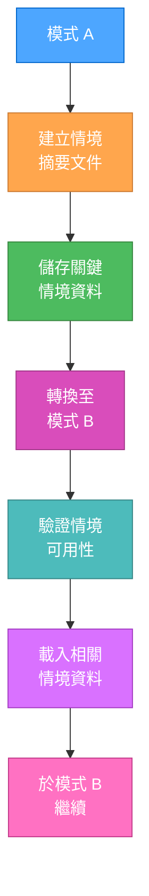
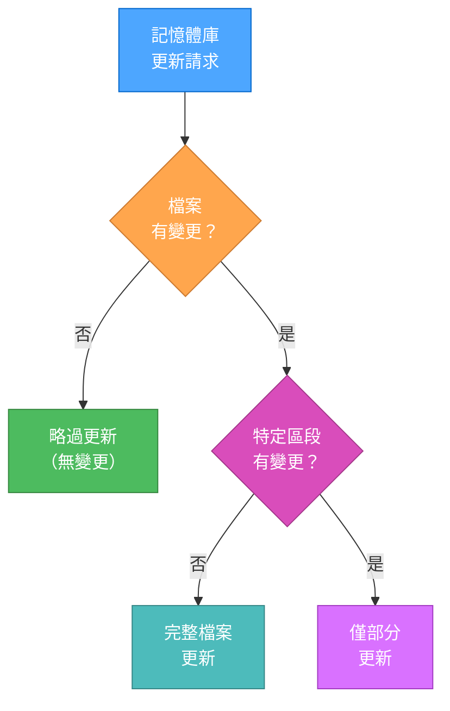

# 模式轉換最佳化

> **重點摘要：** 本檔案實作最佳化的模式轉換，於記憶體庫系統不同階段間高效保留情境。

## 🔄 統一情境轉移協定



## 📊 情境轉換文件

切換模式時請建立標準化轉換文件：

```markdown
# 模式轉換：[來源模式] → [目標模式]

## 情境摘要

- 任務: [任務名稱/描述]
- 複雜度: Level [1-4]
- 當前階段: [階段名稱]
- 進度: [百分比或狀態]

## 關鍵決策

- [決策 1]: [簡述]
- [決策 2]: [簡述]
- [決策 3]: [簡述]

## 關鍵情境

- [情境項目 1]: [值/狀態]
- [情境項目 2]: [值/狀態]
- [情境項目 3]: [值/狀態]

## 下一步

1. [下一步 1]
2. [下一步 2]
3. [下一步 3]

## 資源指標

- [資源 1]: [位置]
- [資源 2]: [位置]
- [資源 3]: [位置]
```

## 🔍 模式專屬轉換處理

### VAN → PLAN 轉換

```markdown
### VAN → PLAN

- 保留情境：複雜度等級、平台偵測、檔案結構
- 傳遞檔案：tasks.md（初始化）、activeContext.md（初始化）
- 規則最佳化：依複雜度預先載入規劃規則
```

### PLAN → CREATIVE 轉換

```markdown
### PLAN → CREATIVE

- 保留情境：任務需求、元件清單、創意階段旗標
- 傳遞檔案：tasks.md（含規劃內容）、創意階段元件清單
- 規則最佳化：僅載入已識別元件的創意範本
```

### CREATIVE → IMPLEMENT 轉換

```markdown
### CREATIVE → IMPLEMENT

- 保留情境：設計決策、實作指引、需求
- 傳遞檔案：tasks.md、設計文件、實作檢查清單
- 規則最佳化：依設計決策預先載入實作範本
```

### IMPLEMENT → REFLECT 轉換

```markdown
### IMPLEMENT → REFLECT

- 保留情境：實作狀態、遇到的挑戰、決策
- 傳遞檔案：tasks.md、progress.md、實作筆記
- 規則最佳化：依完成狀態載入反思範本
```

## 🧠 階層式規則快取

實作規則快取以避免重複載入：

```javascript
// Pseudocode for rule caching
const ruleCache = {
  core: {}, // Core rules shared across modes
  van: {},
  plan: {},
  creative: {},
  implement: {},
  reflect: {},
  archive: {},
};

// Check cache before loading
function loadRule(rulePath) {
  const cacheKey = getCacheKey(rulePath);
  const category = getCategoryFromPath(rulePath);

  if (ruleCache[category][cacheKey]) {
    return ruleCache[category][cacheKey];
  }

  const ruleContent = readRuleFromFile(rulePath);
  ruleCache[category][cacheKey] = ruleContent;

  return ruleContent;
}

// Only invalidate specific rules when needed
function invalidateRule(rulePath) {
  const cacheKey = getCacheKey(rulePath);
  const category = getCategoryFromPath(rulePath);

  if (ruleCache[category][cacheKey]) {
    delete ruleCache[category][cacheKey];
  }
}
```

## ⚡ 差異化記憶體庫更新



實作更高效的更新機制：

```javascript
// Pseudocode for differential updates
function updateMemoryBankFile(filePath, newContent) {
  // Read existing content
  const currentContent = readFile(filePath);

  // Skip if no changes
  if (currentContent === newContent) {
    return "No changes detected, update skipped";
  }

  // Check if we can do a partial update
  const sections = parseIntoSections(currentContent);
  const newSections = parseIntoSections(newContent);

  let updatedContent = currentContent;
  let updatedSections = 0;

  // Only update changed sections
  for (const [sectionName, sectionContent] of Object.entries(newSections)) {
    if (!sections[sectionName] || sections[sectionName] !== sectionContent) {
      updatedContent = replaceSection(
        updatedContent,
        sectionName,
        sectionContent
      );
      updatedSections++;
    }
  }

  // Write updated content
  writeFile(filePath, updatedContent);

  return `Updated ${updatedSections} section(s) in ${filePath}`;
}
```

## 🔗 CREATIVE → IMPLEMENT 橋接

針對關鍵 CREATIVE → IMPLEMENT 轉換進行特別處理：

````markdown
## CREATIVE → IMPLEMENT 橋接

### 設計決策摘要

自動產生所有創意階段決策摘要：

```json
{
  "components": [
    {
      "name": "ComponentA",
      "decision": "選擇方案 X",
      "rationale": "最佳效能特性",
      "implementation_notes": ["使用 X 函式庫", "實作快取", "加入錯誤處理"]
    },
    {
      "name": "ComponentB",
      "decision": "自訂解決方案",
      "rationale": "特殊需求",
      "implementation_notes": ["自行開發", "模組化架構", "需單元測試"]
    }
  ]
}
```
````

### 實作驗證檢查表

自動產生驗證檢查表：

```markdown
# 實作就緒檢查表

- [ ] 所有元件設計決策已備妥
- [ ] 每項決策皆有實作備註
- [ ] 相依套件明確標示
- [ ] 實作順序已決定
- [ ] 需用到的函式庫/框架已記錄
- [ ] 潛在挑戰已識別
```

## 🚀 自適應模式載入

實作漸進式模式載入以最佳化情境：

```javascript
// Pseudocode for adaptive mode loading
function loadMode(modeName, taskComplexity) {
  // Always load core rules
  loadCoreRules();

  // Load complexity-appropriate rules
  loadComplexityRules(taskComplexity);

  // Load mode-specific essential rules
  loadModeEssentialRules(modeName);

  // Only load specialized rules as needed
  registerLazyLoadHandlers(modeName, taskComplexity);
}

function registerLazyLoadHandlers(modeName, taskComplexity) {
  // Register handlers to load additional rules only when needed
  if (modeName === "CREATIVE") {
    registerHandler("architecture", () =>
      loadRule("creative-phase-architecture.md")
    );
    registerHandler("algorithm", () => loadRule("creative-phase-algorithm.md"));
    registerHandler("uiux", () => loadRule("creative-phase-uiux.md"));
  }

  // Similar patterns for other specialized rule types
}
```

## ✅ 模式轉換範例

### 範例：PLAN → CREATIVE 轉換

當從 PLAN 轉換至 CREATIVE 模式時：

```markdown
# 模式轉換：PLAN → CREATIVE

## 情境摘要

- 任務：實作使用者認證系統
- 複雜度：Level 3
- 當前階段：規劃已完成
- 進度：35%（規劃：100%，創意：0%，實作：0%）

## 關鍵決策

- 認證：需探索選項（JWT vs Sessions）
- 使用者管理：沿用現有資料庫結構
- 授權：選擇角色型存取控制

## 關鍵情境

- 創意階段元件：認證機制、Session 管理
- 相依套件：使用者資料庫、授權系統
- 限制：需支援 SSO、效能要求

## 下一步

1. 探索認證選項（JWT、Sessions、OAuth）
2. 設計 session 管理方式
3. 撰寫實作指引

## 資源指標

- 規劃文件：tasks.md（第 3 節）
- 需求：activeContext.md
- 參考架構：docs/system-architecture.md
```

### 範例：CREATIVE → IMPLEMENT 轉換

當從 CREATIVE 轉換至 IMPLEMENT 模式時：

```markdown
# 模式轉換：CREATIVE → IMPLEMENT

## 情境摘要

- 任務：實作使用者認證系統
- 複雜度：Level 3
- 當前階段：創意已完成
- 進度：70%（規劃：100%，創意：100%，實作：0%）

## 關鍵決策

- 認證：選擇 JWT 方案
- Token 儲存：安全 HttpOnly cookies 並加 CSRF 防護
- Refresh 策略：靜默刷新並滑動過期

## 關鍵情境

- 實作順序：Auth API、Middleware、Client 整合
- 測試需求：JWT 驗證單元測試、認證流程整合測試
- 安全考量：XSS 防護、CSRF 防護、流量限制

## 下一步

1. 實作 JWT 產生與驗證
2. 建立認證 middleware
3. 建立使用者登入/登出 API
4. 實作前端認證整合

## 資源指標

- 創意文件：creative-auth-decisions.md
- API 規格：api-spec.yaml
- 安全需求：security-policy.md
```

## 🔄 實作效益

本最佳化帶來：

1. 模式轉換時位元組用量降低（約 40%）
2. 模式間情境保留更佳
3. 規則快取提升效率
4. 僅載入必要規則
5. 記憶體庫更新最佳化
6. 明確轉換文件保留關鍵情境
