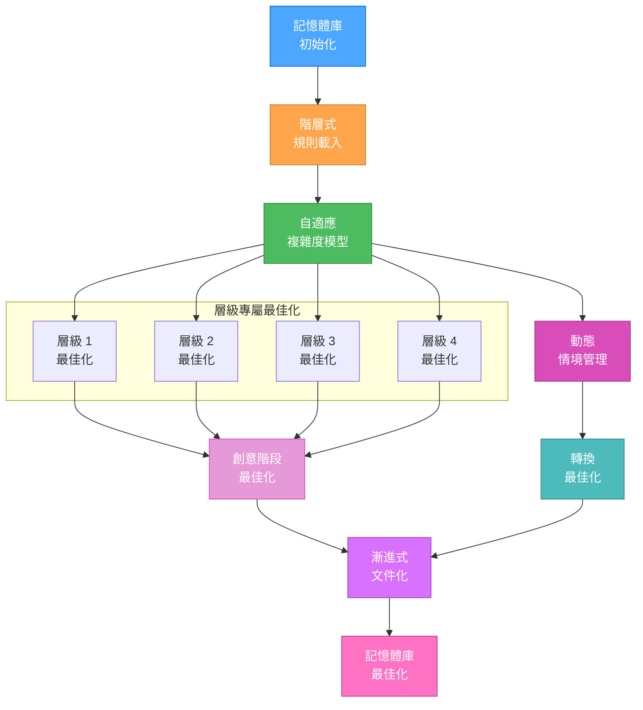
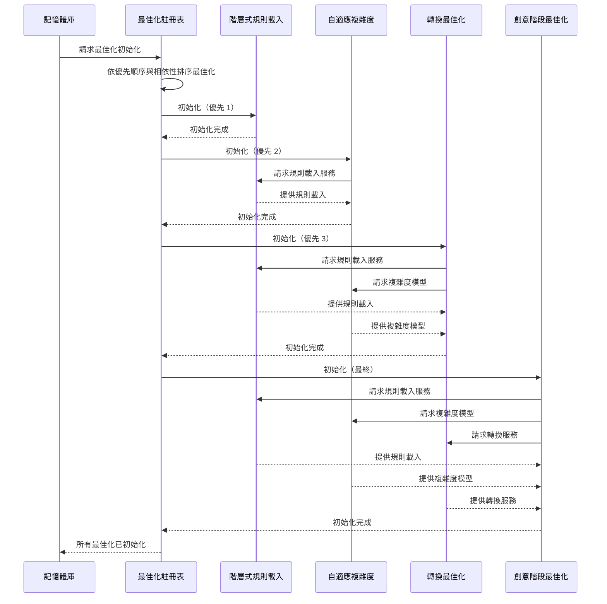
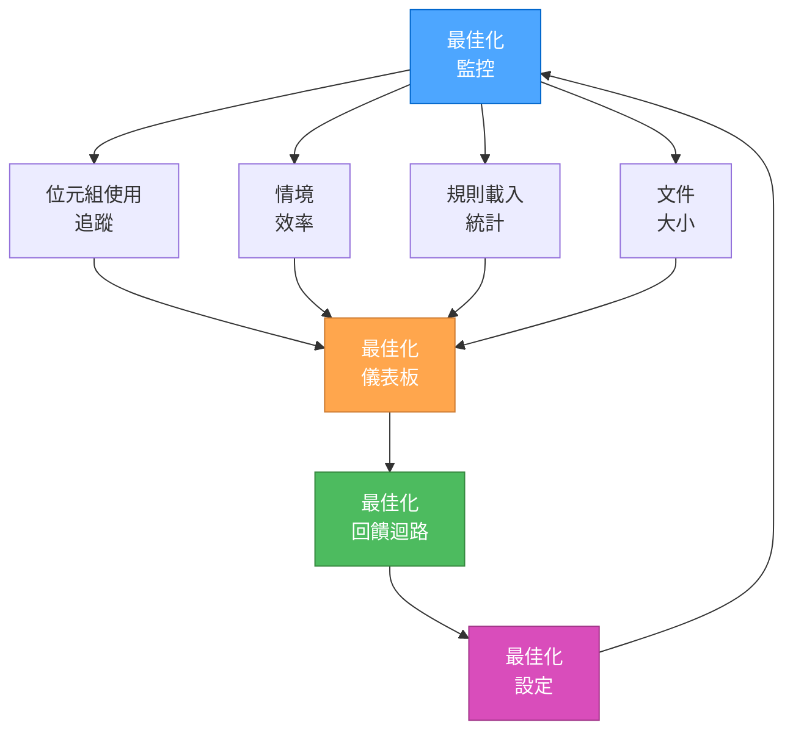

# 記憶體庫最佳化整合

> **重點摘要：** 本檔案作為所有記憶體庫最佳化的整合點，協調各最佳化元件無縫協作。

## 🔄 最佳化整合流程



## 📋 最佳化元件註冊表

```javascript
// Optimization component registry pseudocode
const optimizationRegistry = {
  // Core optimizations
  hierarchicalRuleLoading: {
    file: "Core/hierarchical-rule-loading.md",
    dependencies: [],
    priority: 1,
  },
  adaptiveComplexityModel: {
    file: "main-optimized.md",
    dependencies: ["hierarchicalRuleLoading"],
    priority: 2,
  },
  modeTransitionOptimization: {
    file: "Core/mode-transition-optimization.md",
    dependencies: ["hierarchicalRuleLoading", "adaptiveComplexityModel"],
    priority: 3,
  },

  // Level-specific optimizations
  level1Optimization: {
    file: "Level1/optimized-workflow-level1.md",
    dependencies: ["adaptiveComplexityModel"],
    priority: 4,
  },

  // Feature-specific optimizations
  creativePhaseOptimization: {
    file: "Phases/CreativePhase/optimized-creative-template.md",
    dependencies: ["hierarchicalRuleLoading", "adaptiveComplexityModel"],
    priority: 5,
  },
};
```

## 🔄 最佳化初始化序列



## 🔍 最佳化設定

```javascript
// Optimization configuration pseudocode
const optimizationConfig = {
  // Token optimization settings
  tokenOptimization: {
    enableHierarchicalLoading: true,
    enableProgressiveDocumentation: true,
    enableLazyRuleLoading: true,
    enableContextPruning: true,
  },

  // Context preservation settings
  contextPreservation: {
    preserveDesignDecisions: true,
    preserveImplementationContext: true,
    preserveUserPreferences: true,
    contextCompressionLevel: "high", // none, low, medium, high
  },

  // Documentation optimization
  documentationOptimization: {
    level1DocumentationLevel: "minimal", // minimal, standard, comprehensive
    level2DocumentationLevel: "standard",
    level3DocumentationLevel: "comprehensive",
    level4DocumentationLevel: "comprehensive",
    enableProgressiveDisclosure: true,
    enableTemplateCaching: true,
  },
};
```

## 📊 最佳化監控



## 📈 最佳化指標

```markdown
# Optimization Metrics

## Token Usage

- Core Rule Loading: [X] tokens
- Mode-Specific Rules: [Y] tokens
- Creative Phase Documentation: [Z] tokens
- Overall Token Reduction: [P]%

## Context Efficiency

- Context Utilization: [Q]%
- Context Waste: [R]%
- Effective Token Capacity: [S] tokens

## Rule Loading

- Rules Loaded: [T] / [U] (Total)
- Lazy-Loaded Rules: [V]
- Cached Rules: [W]

## Documentation

- Level 1 Documentation Size: [X] tokens
- Level 2 Documentation Size: [Y] tokens
- Level 3 Documentation Size: [Z] tokens
- Level 4 Documentation Size: [AA] tokens
```

## 🔄 整合使用範例

### 初始化所有最佳化

```javascript
// Pseudocode for initializing all optimizations
function initializeMemoryBankOptimizations() {
  // Load optimization registry
  const registry = loadOptimizationRegistry();

  // Sort by priority and dependencies
  const sortedOptimizations = sortOptimizations(registry);

  // Initialize each optimization in order
  for (const opt of sortedOptimizations) {
    initializeOptimization(opt);
  }

  // Configure optimization parameters
  configureOptimizations(loadOptimizationConfig());

  // Start monitoring
  initializeOptimizationMonitoring();

  return "Memory Bank optimizations initialized";
}
```

### 使用最佳化創意階段

```markdown
// Using the optimized creative phase with progressive documentation

// Initialize with minimal documentation
📌 CREATIVE PHASE START: Authentication System
━━━━━━━━━━━━━━━━━━━━━━━━━━━━━━━

1️⃣ PROBLEM
Description: Design an authentication system for the application
Requirements: Secure, scalable, supports SSO, easy to maintain
Constraints: Must work with existing user database, <100ms response time

2️⃣ OPTIONS
Option A: JWT-based stateless auth
Option B: Session-based auth with Redis
Option C: OAuth2 implementation

// Progressively add detail as needed
3️⃣ ANALYSIS
| Criterion | JWT | Sessions | OAuth2 |
|-----------|-----|----------|--------|
| Security | ⭐⭐⭐ | ⭐⭐⭐⭐ | ⭐⭐⭐⭐⭐ |
| Scalability | ⭐⭐⭐⭐⭐ | ⭐⭐⭐ | ⭐⭐⭐⭐ |
| Complexity | ⭐⭐ | ⭐⭐⭐ | ⭐⭐⭐⭐ |

// Focus on decision and implementation
4️⃣ DECISION
Selected: Option A: JWT-based auth with refresh tokens
Rationale: Best balance of performance and scalability

5️⃣ IMPLEMENTATION NOTES

- Use HS256 algorithm for token signing
- Implement short-lived access tokens (15min)
- Store token blacklist in Redis for revocation
```

## 🔄 模式轉換範例

```markdown
// Optimized mode transition from CREATIVE to IMPLEMENT

# MODE TRANSITION: CREATIVE → IMPLEMENT

## Context Summary

- Task: Authentication system implementation
- Complexity: Level 3
- Decision: JWT-based auth with refresh tokens

## Key Context

- Security requirements verified
- Algorithm selection: HS256
- Token lifecycle: 15min access / 7 days refresh

## Next Steps

1. Implement JWT generation module
2. Create token validation middleware
3. Build refresh token handling

// Transition happens with preserved context
// IMPLEMENT mode continues with this context available
```

## 🔄 階層式規則載入範例

```javascript
// Pseudocode example of hierarchical rule loading

// Initial load - only core rules
loadCoreRules();

// Determine complexity
const complexity = determineComplexity();

// Load mode-specific essential rules
loadModeEssentialRules("CREATIVE");

// Register lazy loaders for specialized rules
registerLazyLoader("architecture", () =>
  loadRule("creative-phase-architecture.md")
);
registerLazyLoader("algorithm", () => loadRule("creative-phase-algorithm.md"));
registerLazyLoader("uiux", () => loadRule("creative-phase-uiux.md"));

// Later, when architecture design is needed:
const architectureRule = loadSpecializedRule("architecture");
// Architecture rule is now loaded only when needed
```

這些整合式最佳化可無縫協作，為記憶體庫系統帶來顯著效率提升，同時維持完整功能。
