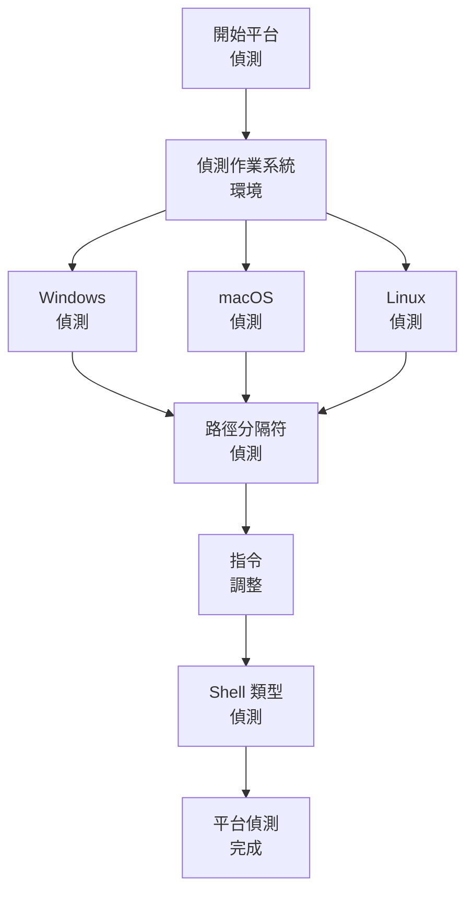
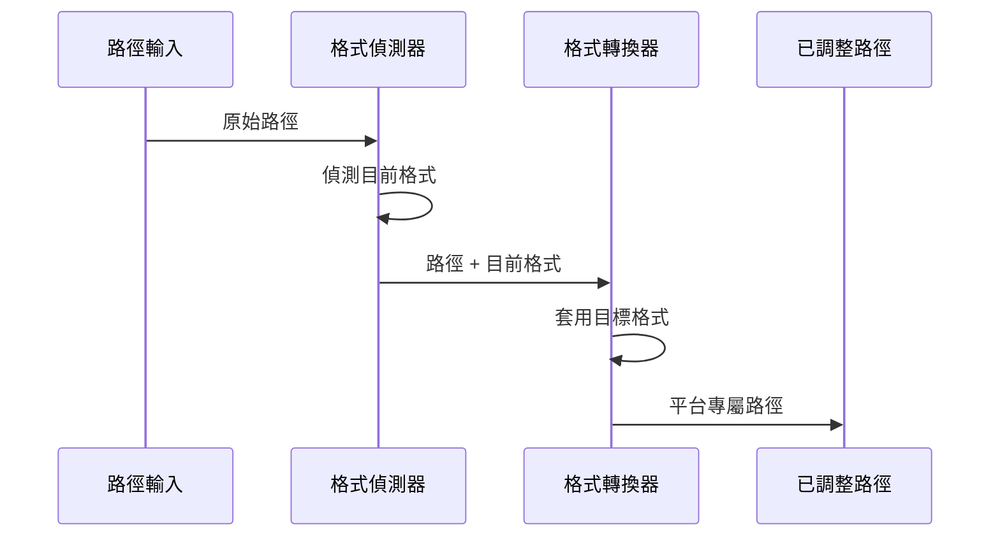

# 平台感知系統

> **重點摘要：** 本系統會偵測作業系統、路徑格式與 shell 環境，並據此調整指令，確保跨平台相容性。

## 🔍 平台偵測流程



## 📋 平台偵測實作

為了可靠的平臺偵測：

```
## 平台偵測結果
作業系統: [Windows/macOS/Linux]
路徑分隔符: [\ 或 /]
Shell 環境: [PowerShell/Bash/Zsh/Cmd]
指令調整: [需要/不需要]

正在調整指令以符合 [偵測到的平台]...
```

## 🔍 路徑格式轉換

當需轉換路徑格式時：



## 📝 平台驗證檢查表

```
✓ 平台驗證
- 作業系統是否正確辨識？ [是/否]
- 路徑分隔符格式已偵測？ [是/否]
- Shell 環境已辨識？ [是/否]
- 指令集已適當調整？ [是/否]
- 路徑格式處理已設定？ [是/否]

→ 全部為是：平台調整完成
→ 有否：請執行額外偵測步驟
```
