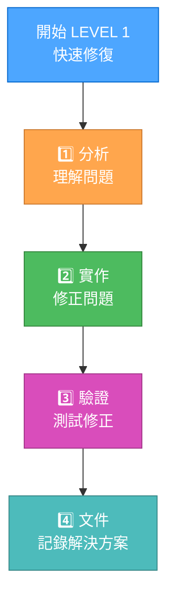

# 最佳化 LEVEL 1 工作流程

> **重點摘要：** 本文件針對 Level 1 任務（快速錯誤修復）提供最佳化流程，兼顧速度與 token 效率，同時維持品質。

## 🔧 LEVEL 1 流程圖



## 📝 合併式文件紀錄

Level 1 任務採用單一檔案方式，減少上下文切換：

```markdown
# 快速修復：[問題名稱]

## 問題摘要

- 類型：[錯誤/熱修/快速增強]
- 優先順序：[低/中/高/緊急]
- 回報者：[姓名/系統]
- 影響範圍：[元件/功能]

## 分析

- 根本原因：[簡要說明]
- 影響檔案：[檔案列表]
- 影響範圍：[影響範圍說明]

## 解決方案

- 方法：[簡要說明]
- 變更內容：[變更列表]
- 執行指令：[主要指令]

## 驗證

- 測試方式：[如何測試修正]
- 結果：[測試結果]
- 其他檢查：[其他驗證]

## 狀態

- [x] 修正已實作
- [x] 測試通過
- [x] 文件已更新
```

## 🔄 記憶體庫更新

Level 1 任務採用簡化的記憶體庫更新，減少負擔：

```markdown
## tasks.md 更新（Level 1）

### 任務：[任務名稱]

- 狀態：已完成
- 實作說明：[一句話摘要]
- 修正連結：[檔案/行數參考]
```

## ⚡ Token 最佳化範本

為達到最高效率，Level 1 任務可使用極簡範本：

```markdown
## 🔧 修正：[問題]

📌 問題：[簡要說明]
🔍 原因：[根本原因]
🛠️ 解決方案：[實作內容]
✅ 驗證：[驗證方式]
```

## 🔄 自動文件產生輔助

可使用以下輔助函式自動產生文件：

```javascript
function generateLevel1Documentation(issue, rootCause, solution, verification) {
  return `## 🔧 修正: ${issue}
📌 問題: ${issue}
🔍 原因: ${rootCause}
🛠️ 解決方案: ${solution}
✅ 驗證: ${verification}`;
}
```

## 📊 常見問題快速範本

### 效能修正

```markdown
## 🔧 修正：[元件]效能問題

📌 問題：[元件]回應速度緩慢
🔍 原因：查詢/演算法效率低落
🛠️ 解決方案：最佳化[具體優化內容]
✅ 驗證：回應時間由[X]ms 降至 [Y]ms
```

### 錯誤修正

```markdown
## 🔧 修正：[元件]錯誤

📌 問題：[具體行為]無法正確運作
🔍 原因：[根本原因分析]
🛠️ 解決方案：已修正，方式為[實作細節]
✅ 驗證：以[測試方式]驗證
```

### 快速增強

```markdown
## 🔧 增強：[功能]

📌 需求：新增[具體能力]
🛠️ 實作說明：已新增，方式為[實作細節]
✅ 驗證：以[測試方式]驗證
```

## ✅ 精簡驗證流程

Level 1 任務採用最小驗證流程：

```markdown
驗證：
[x] 修正已實作並測試
[x] 無回歸問題
[x] 文件已更新
```

## 🚀 合併式記憶體庫更新

最佳化 Level 1 記憶體庫更新，單一操作完成：

```javascript
// Level 1 記憶體庫最佳化更新偽程式碼
function updateLevel1MemoryBank(taskInfo) {
  // 讀取現有 tasks.md
  const tasksContent = readFile("tasks.md");

  // 建立最小更新區塊
  const updateBlock = `
### 任務: ${taskInfo.name}
- 狀態: 已完成
- 實作說明: ${taskInfo.solution}
- 修正連結: ${taskInfo.fileReference}
`;

  // 加入至 tasks.md「已完成任務」區段
  const updatedContent = appendToSection(
    tasksContent,
    "Completed Tasks",
    updateBlock
  );

  // 單一操作寫入
  writeFile("tasks.md", updatedContent);

  return "記憶體庫已更新";
}
```

## 🔄 最佳化 LEVEL 1 工作流程範例

````markdown
## 🔧 修正：行動裝置登入按鈕無作用

📌 問題：
使用者於行動裝置無法登入，按鈕顯示但未觸發認證

🔍 原因：
事件監聽僅使用桌面事件（mousedown），未處理觸控事件

🛠️ 解決方案：
更新事件處理，採用事件委派並同時支援 mouse 與 touch 事件：

```js
// 修正前:
loginButton.addEventListener("mousedown", handleLogin);

// 修正後:
loginButton.addEventListener("mousedown", handleLogin);
loginButton.addEventListener("touchstart", handleLogin);
```
````

✅ 驗證：

- 已於 iOS Safari 與 Android Chrome 測試
- 行動裝置登入功能正常
- 桌面瀏覽器無回歸

```

## ⚡ Token 效率優勢

本最佳化 Level 1 工作流程帶來：

1. 文件負擔減少（降低 70%）
2. 記憶體庫合併更新（單一操作取代多步驟）
3. 驗證流程聚焦（僅保留必要檢查）
4. 常見情境範本化
5. 精簡步驟，流程更順暢

此更新方式保留所有關鍵資訊，同時大幅降低 token 使用量。
```
