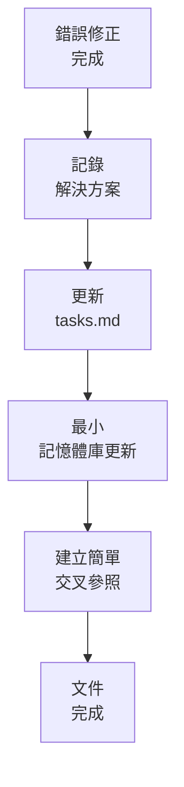
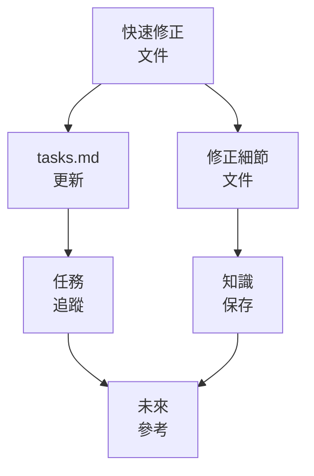

# LEVEL 1 任務快速文件

> **重點摘要：** 本文件說明 Level 1（快速錯誤修復）任務的快速文件方法，確保必要資訊被記錄，文件負擔極低。

## 🔍 快速文件總覽



Level 1 任務需高效率文件，僅記錄必要資訊，避免多餘細節。此方法確保關鍵知識被保留，同時維持速度與效率。

## 📋 文件原則

1. **簡明**：文件簡短但完整
2. **聚焦**：僅記錄理解修正所需內容
3. **脈絡**：提供足夠背景理解問題
4. **解決方案**：明確說明變更內容與原因
5. **可查找性**：確保修正日後易於查找

## 📋 快速修正文件範本

```markdown
# 快速修復：[問題標題]

## 問題

[問題簡述，1-2 句]

## 根本原因

[造成問題的簡述，1-2 句]

## 解決方案

[修正內容簡述，2-3 句]

## 變更檔案

- [檔案路徑 1]
- [檔案路徑 2]

## 驗證

[如何測試/驗證修正，1-2 句]

## 備註

[其他補充資訊（可選）]
```

## 📋 tasks.md 更新

Level 1 任務建議 tasks.md 格式：

```markdown
## 已完成錯誤修正

- [x] [Level 1] 已修正：[問題標題]（完成：YYYY-MM-DD）
  - 問題：[一句話描述]
  - 根本原因：[一句話描述]
  - 解決方案：[一句話描述]
  - 變更檔案：[檔案路徑]
```

進行中任務格式：

```markdown
## 進行中錯誤修正

- [ ] [Level 1] 修正：[問題標題]（預估：XX 分鐘）
  - 問題：[一句話描述]
  - 位置：[元件/檔案]
```

## 📋 記憶體庫更新

Level 1 任務建議最小記憶體庫更新：

1. **tasks.md**：

   - 依上方格式更新修正細節
   - 標記任務已完成

2. **activeContext.md**（如有需要）：

   ```markdown
   ## 最近修正

   - [YYYY-MM-DD] 已修正 [問題] 於 [元件/檔案]。[一句話修正說明]
   ```

3. **progress.md**（如有重大）：
   ```markdown
   ## 錯誤修正

   - [YYYY-MM-DD] 已修正 [問題] 於 [元件/檔案]。
   ```

Level 1 任務除非揭露重要系統資訊，否則通常不需更新其他記憶體庫文件。

## 📋 常見錯誤類型

分類有助於文件一致性：

1. **邏輯錯誤**：

   - 範例：「修正使用者驗證條件判斷錯誤」

2. **UI/顯示問題**：

   - 範例：「修正行動版按鈕錯位」

3. **效能問題**：

   - 範例：「修正使用者資料載入緩慢」

4. **資料處理錯誤**：

   - 範例：「修正日期格式解析錯誤」

5. **設定問題**：
   - 範例：「修正環境變數設定錯誤」

## 📋 快速文件流程

建議步驟：

1. **修正後立即記錄**：

   - 趁記憶猶新記錄
   - 聚焦於「做了什麼、為什麼、怎麼做」
   - 明確描述異動

2. **更新任務追蹤**：

   - 於 tasks.md 更新修正細節
   - 格式一致便於查找

3. **最小交叉參照**：

   - 僅建立必要交叉參照
   - 確保日後可查找

4. **檢查完整性**：
   - 確認所有必要資訊已記錄
   - 確保其他開發者能理解修正

## 📋 範例：良好 vs. 不足文件

### ❌ 不足

```markdown
修正登入錯誤。
```

### ✅ 良好

```markdown
# 快速修復：特殊字元登入失敗

## 問題

含特殊字元（如 +, %）的 email 無法登入。

## 根本原因

email 驗證 regex 錯誤處理特殊字元。

## 解決方案

更新 AuthValidator.js 的 email 驗證 regex，符合 RFC 5322，正確處理特殊字元。

## 變更檔案

- src/utils/AuthValidator.js

## 驗證

以多組特殊字元 email 測試登入（test+user@example.com, user%123@example.com）。
```

## 📋 文件驗證清單

```
✓ 文件驗證
- 問題明確描述？ [是/否]
- 根本原因已說明？ [是/否]
- 解決方案已說明？ [是/否]
- 變更檔案已列出？ [是/否]
- 驗證方式已說明？ [是/否]
- tasks.md 已更新？ [是/否]
- 記憶體庫已最小更新？ [是/否]

→ 全部是：文件完成
→ 有否：補齊資訊
```

## 📋 最小模式文件

最小模式可用極簡格式：

```
✓ 修正：[問題標題]
✓ 原因：[一句話根本原因]
✓ 解決：[一句話修正說明]
✓ 檔案：[檔案路徑]
✓ 驗證：[驗證方式]
```

## 🔄 文件整合

快速文件與其他系統整合：



## 🚨 文件效率原則

請記住：

```
┌─────────────────────────────────────────────────────┐
│ 僅記錄理解修正所需資訊。                             │
│ 聚焦於對未來遇到同問題者有幫助的關鍵內容。           │
└─────────────────────────────────────────────────────┘
```

這確保 Level 1 任務文件高效，無多餘負擔，關鍵知識得以保留。
