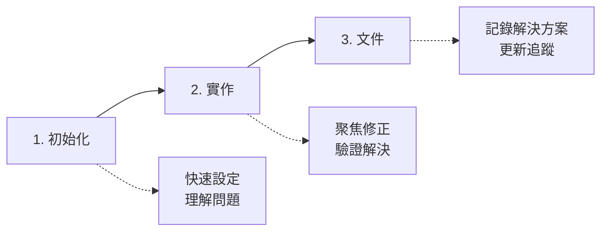
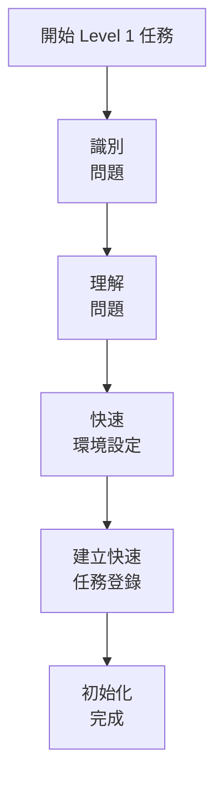
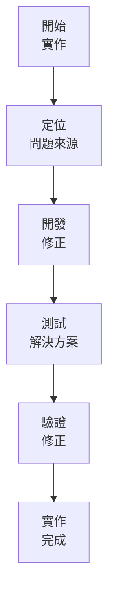
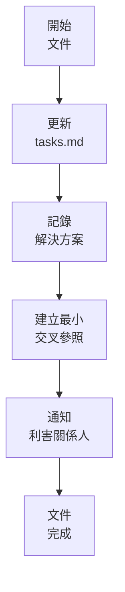
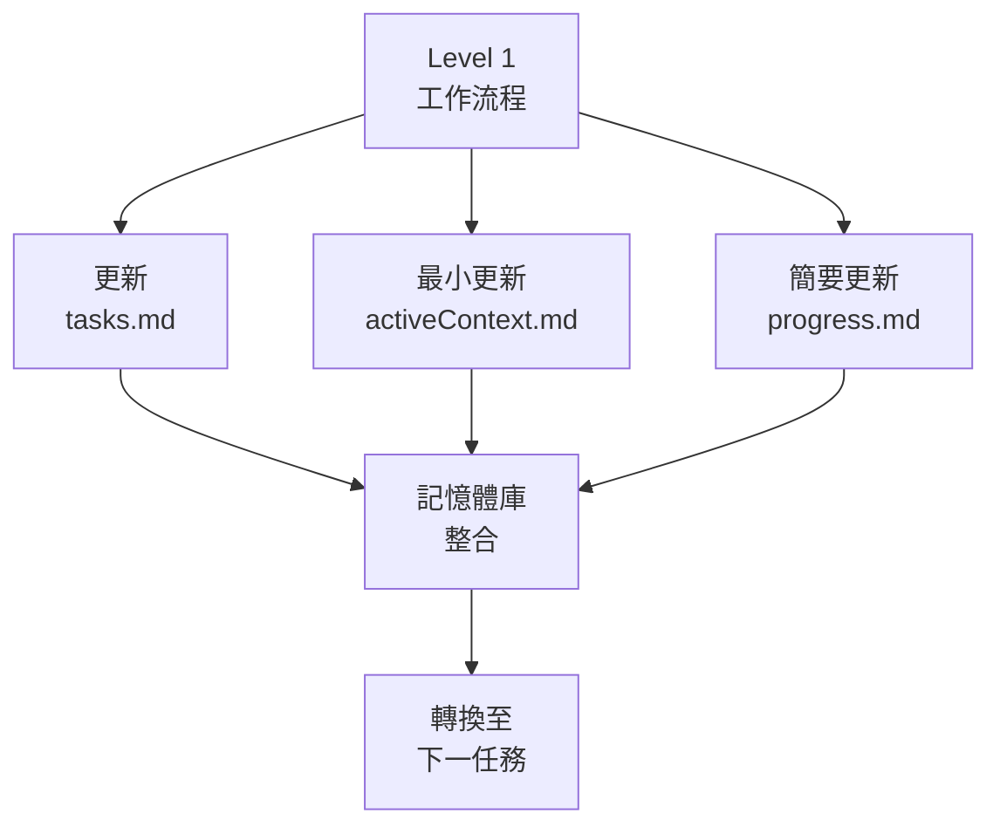

# LEVEL 1 任務精簡工作流程

> **重點摘要：** 本文件說明 Level 1（快速錯誤修復）任務的精簡工作流程，聚焦於高效率解決問題，文件負擔極低但仍保留必要紀錄。

## 🔍 LEVEL 1 工作流程總覽



## 📋 工作流程階段

### 階段 1：初始化



**步驟：**

1. 明確識別需修正的問題
2. 理解問題及其影響
3. 快速設定修正環境
4. 在 tasks.md 建立最小任務登錄

**里程碑檢查點：**

```
✓ 初始化檢查點
- 問題明確識別？ [是/否]
- 問題已理解？ [是/否]
- 環境已設定？ [是/否]
- 任務登錄已建立？ [是/否]

→ 全部是：進入實作
→ 有否：補齊初始化步驟
```

### 階段 2：實作



**步驟：**

1. 定位問題來源
2. 開發針對性修正
3. 徹底測試解決方案
4. 驗證問題已解決

**里程碑檢查點：**

```
✓ 實作檢查點
- 問題來源已定位？ [是/否]
- 修正已開發？ [是/否]
- 解決方案已測試？ [是/否]
- 修正已驗證？ [是/否]

→ 全部是：進入文件
→ 有否：補齊實作步驟
```

### 階段 3：文件



**步驟：**

1. 在 tasks.md 更新修正細節
2. 簡明記錄解決方案
3. 建立最小交叉參照
4. 必要時通知利害關係人

**里程碑檢查點：**

```
✓ 文件檢查點
- tasks.md 已更新？ [是/否]
- 解決方案已記錄？ [是/否]
- 交叉參照已建立？ [是/否]
- 已通知利害關係人？ [是/否]

→ 全部是：任務完成
→ 有否：補齊文件步驟
```

## 📋 tasks.md 任務結構

Level 1 任務建議最小結構：

```markdown
## 進行中錯誤修正

- [ ] [Level 1] 修正：[錯誤描述]（預估：XX 分鐘）

## 已完成錯誤修正

- [x] [Level 1] 已修正：[錯誤描述]（完成：YYYY-MM-DD）
  - 問題：[簡要問題描述]
  - 解決方案：[簡要解決方案]
  - 變更檔案：[檔案路徑]
```

## 📋 記憶體庫更新

Level 1 任務建議最小記憶體庫更新：

1. **tasks.md**：更新修正細節
2. **activeContext.md**：如有需要簡要提及
3. **progress.md**：加入已完成修正

## 📋 工作流程驗證清單

```
✓ 最終工作流程驗證
- 問題已識別並理解？ [是/否]
- 修正已實作並驗證？ [是/否]
- tasks.md 已更新？ [是/否]
- 解決方案已記錄？ [是/否]
- 記憶體庫已最小更新？ [是/否]

→ 全部是：Level 1 任務成功完成
→ 有否：補齊未完成項目
```

## 📋 任務升級

若 Level 1 流程中發現任務較複雜：

```
⚠️ 需升級任務
目前等級：Level 1
建議等級：Level [2/3/4]
原因：[簡要說明]

是否要將此任務升級至 Level [2/3/4]？
```

升級指標：

1. 修正需異動多個元件
2. 解決方案需設計決策
3. 測試發現更廣泛問題
4. 修正影響核心功能

## 🔄 與記憶體庫整合



## 🚨 效率原則

請記住：

```
┌─────────────────────────────────────────────────────┐
│ Level 1 工作流程優先速度與效率。                     │
│ 降低流程負擔，同時確保解決方案有適當紀錄。           │
└─────────────────────────────────────────────────────┘
```
