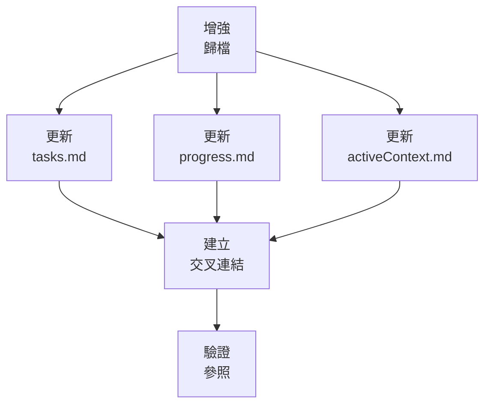

# LEVEL 2 任務基本歸檔

> **重點摘要：** 本文件說明 Level 2（簡易增強）任務的基本歸檔方法，確保已完成工作被妥善記錄，知識得以保留，無多餘負擔。

## 🔍 歸檔總覽

即使是 Level 2 任務，妥善歸檔可確保已完成工作被記錄、知識得以保留。本歸檔方法提供足夠結構，同時維持效率。

## 📋 歸檔原則

1. **完成**：明確記錄完成內容
2. **脈絡**：保留增強背景
3. **知識**：萃取關鍵洞見與經驗
4. **可查找性**：讓歸檔資訊易於查找
5. **參照**：建立相關工作的交叉參照

## 📋 基本歸檔結構

```markdown
# 增強歸檔：[功能名稱]

## 摘要

[增強簡要說明]

## 完成日期

YYYY-MM-DD

## 主要修改檔案

- [檔案路徑 1]
- [檔案路徑 2]
- [檔案路徑 3]

## 已解決需求

- [需求 1]
- [需求 2]
- [需求 3]

## 實作細節

[簡述增強如何實作]

## 測試內容

- [測試 1]
- [測試 2]
- [測試 3]

## 經驗教訓

- [經驗 1]
- [經驗 2]
- [經驗 3]

## 相關工作

- [相關任務/增強連結 1]
- [相關任務/增強連結 2]

## 備註

[其他補充資訊或背景]
```

## 📋 歸檔存放位置

建議歸檔結構如下：

```
docs/
└── archive/
    └── enhancements/
        └── YYYY-MM/
            ├── feature-name-1.md
            └── feature-name-2.md
```

## 📋 歸檔流程

Level 2 歸檔建議步驟：

1. **準備歸檔內容**：

   - 彙整所有相關資訊
   - 填寫歸檔範本
   - 包含所有關鍵實作細節

2. **建立交叉參照**：

   - 在 tasks.md 加入歸檔連結
   - 在 progress.md 加入參照
   - 在 activeContext.md 標記下一步重點

3. **建立與存放檔案**：

   - 必要時建立目錄
   - 以具描述性的檔名儲存歸檔
   - 檔名遵循命名規則

4. **最終驗證**：
   - 檢查歸檔內容完整
   - 驗證所有交叉參照
   - 確認所有連結可用

## 📋 交叉參照格式

建立交叉參照時：

1. **tasks.md**：

   ```markdown
   ## 已完成增強

   - [x] [功能名稱] (YYYY-MM-DD) - [歸檔連結](../docs/archive/enhancements/YYYY-MM/feature-name.md)
   ```

2. **progress.md**：

   ```markdown
   ## 已完成里程碑

   - [功能名稱] 增強於 YYYY-MM-DD 完成。詳見 [歸檔記錄](../docs/archive/enhancements/YYYY-MM/feature-name.md)。
   ```

3. **activeContext.md**：

   ```markdown
   ## 最近完成

   - [功能名稱] 增強已完成。歸檔：[連結](../docs/archive/enhancements/YYYY-MM/feature-name.md)

   ## 目前重點

   - 進入 [下一任務名稱]
   ```

## 📋 歸檔驗證清單

```
✓ 歸檔驗證
- 歸檔內容完整？ [是/否]
- 歸檔正確存放？ [是/否]
- 交叉參照已建立？ [是/否]
- tasks.md 已更新？ [是/否]
- progress.md 已更新？ [是/否]
- activeContext.md 已更新？ [是/否]

→ 全部是：歸檔完成
→ 有否：補齊歸檔流程
```

## 📋 最小模式歸檔

最小模式可用以下格式：

```
✓ 歸檔：[功能名稱]
✓ 日期：YYYY-MM-DD
✓ 檔案：[主要異動檔案]
✓ 摘要：[一句話摘要]
✓ 經驗：[關鍵收穫]
✓ 參照：[tasks.md, progress.md, activeContext.md]
```

## 🔄 與記憶體庫整合

歸檔與記憶體庫整合：



## 🚨 知識保存原則

請記住：

```
┌─────────────────────────────────────────────────────┐
│ 歸檔檔案是寶貴的知識資源。                          │
│ 請務必保留有助未來工作的洞見與經驗。                │
└─────────────────────────────────────────────────────┘
```

這確保知識得以保存，未來可隨時參考。
