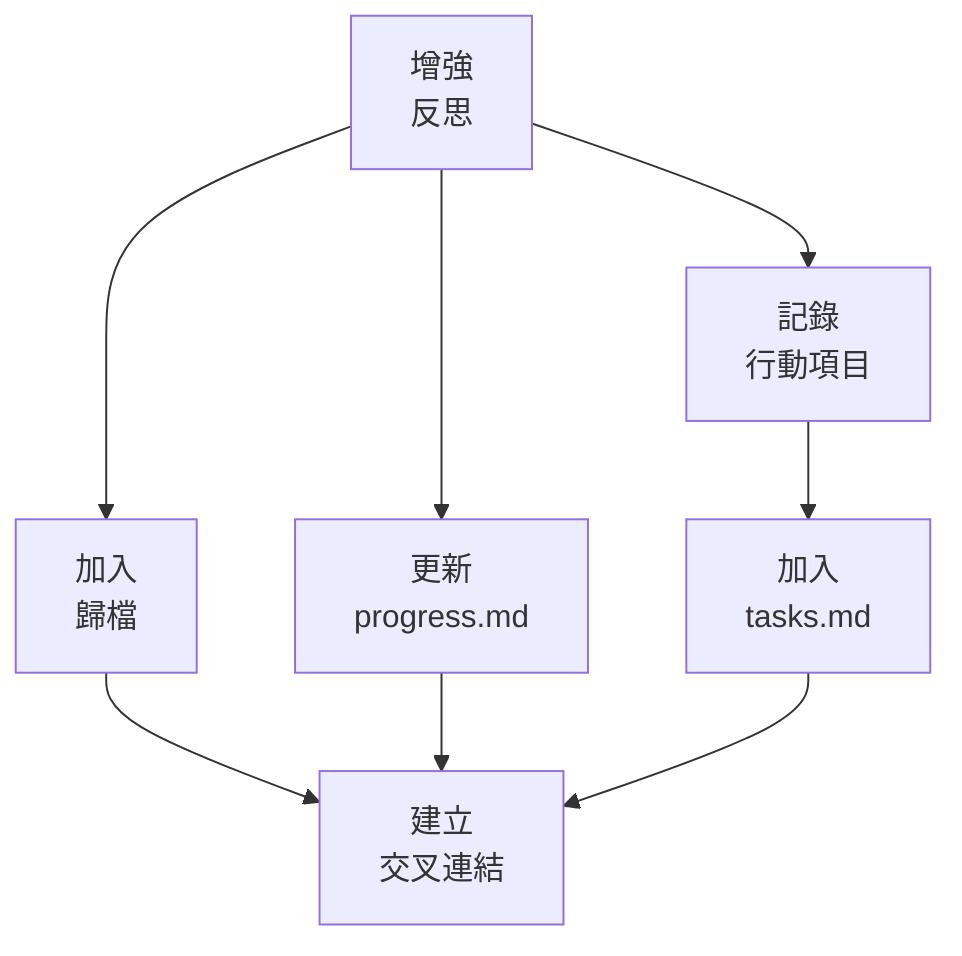

# LEVEL 2 任務基本反思

> **重點摘要：** 本文件說明 Level 2（簡易增強）任務的基本反思方法，確保關鍵洞見與經驗得以保留，無多餘負擔。

## 🔍 反思總覽

即使是 Level 2 增強，反思對未來工作改進至關重要。本反思方法聚焦於關鍵成果、挑戰與經驗教訓，同時維持效率。

## 📋 反思原則

1. **誠實**：如實呈現成功與挑戰
2. **具體**：包含具體範例與觀察
3. **洞見**：深入表面，萃取有用洞見
4. **改進**：聚焦於可行的未來行動
5. **效率**：反思簡明，聚焦重點

## 📋 基本反思結構

```markdown
# Level 2 增強反思：[功能名稱]

## 增強摘要

[一段話簡述增強內容]

## 成功之處

- [具體成功點 1]
- [具體成功點 2]
- [具體成功點 3]

## 遇到的挑戰

- [具體挑戰 1]
- [具體挑戰 2]
- [具體挑戰 3]

## 解決方案

- [挑戰 1 的解決方案]
- [挑戰 2 的解決方案]
- [挑戰 3 的解決方案]

## 關鍵技術洞見

- [技術洞見 1]
- [技術洞見 2]
- [技術洞見 3]

## 流程洞見

- [流程洞見 1]
- [流程洞見 2]
- [流程洞見 3]

## 未來行動項目

- [具體行動項目 1]
- [具體行動項目 2]
- [具體行動項目 3]

## 時間預估準確性

- 預估時間：[X 小時/天]
- 實際時間：[Y 小時/天]
- 差異：[Z%]
- 差異原因：[簡要說明]
```

## 📋 反思品質

高品質 Level 2 反思應：

1. **提供具體範例**，避免空泛陳述
2. **明確提出收穫**，非僅一般觀察
3. **挑戰與解決方案連結清楚**
4. **分析預估準確性**，利於未來規劃
5. **產生具體可行改進**

## 📋 反思流程

Level 2 任務反思建議步驟：

1. **安排反思時間**：

   - 預留專門時間
   - 任務完成 24 小時內完成反思

2. **收集資訊**：

   - 檢視原始任務需求
   - 檢查實作細節
   - 回顧遇到的挑戰
   - 檢查時間追蹤資料

3. **填寫範本**：

   - 完整填寫反思範本各區
   - 包含具體範例
   - 誠實面對挑戰

4. **萃取洞見**：

   - 找出挑戰模式
   - 連結挑戰與未來改進
   - 思考流程優化

5. **記錄行動項目**：

   - 建立具體可行改進
   - 如適用，連結至未來任務

6. **儲存反思**：
   - 反思與任務歸檔一併保存
   - 加入相關文件交叉參照

## 📋 範例：空泛 vs. 具體

### ❌ 空泛（不足）

- 「實作很順利。」
- 「程式碼有些挑戰。」
- 「功能如預期運作。」

### ✅ 具體（充分）

- 「模組化設計讓 UI 層與資料處理邏輯分離，易於整合現有程式碼。」
- 「挑戰：多用戶互動時狀態管理複雜。解決：採用結構化 reducer 模式，明確定義 action 與狀態轉換。」
- 「行動項目：建立可重用檔案選擇元件，涵蓋本次遇到的所有邊界情境。」

## 📋 反思驗證清單

```
✓ 反思驗證
- 範本各區已填寫？ [是/否]
- 有具體範例？ [是/否]
- 挑戰誠實呈現？ [是/否]
- 解決方案具體？ [是/否]
- 有可行洞見？ [是/否]
- 時間預估有分析？ [是/否]

→ 全部是：反思完成
→ 有否：提升反思品質
```

## 📋 最小模式反思

最小模式可用以下格式：

```
✓ 反思：[功能名稱]
✓ 成功：[關鍵成功]
✓ 挑戰：[關鍵挑戰]
✓ 解決：[關鍵解法]
✓ 洞見：[最重要收穫]
✓ 行動：[首要行動項目]
✓ 時間：預估 [X] 實際 [Y]（[Z%] 差異）
```

## 🔄 與記憶體庫整合

反思與記憶體庫整合：



## 🚨 持續改進原則

請記住：

```
┌─────────────────────────────────────────────────────┐
│ 每次反思都應產生至少一項可行改進。                  │
└─────────────────────────────────────────────────────┘
```

這確保反思能直接促進產品與流程的持續改進。
