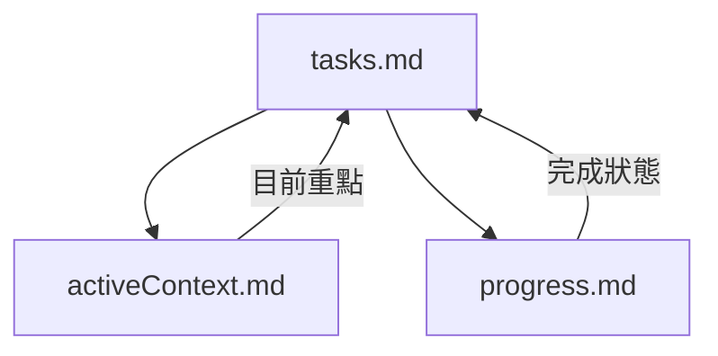

# LEVEL 2 基本任務追蹤

> **重點摘要：** 本文件說明 Level 2（簡易增強）任務的精簡任務追蹤方法，提供兼顧效率與結構的進度管理框架。

## 🔍 任務追蹤總覽

Level 2 任務需要比 Level 1 更結構化的追蹤，但不需高階任務的全面追蹤。本基本追蹤系統提供足夠結構，同時維持效率。

## 📋 任務追蹤原則

1. **明確**：任務需明確定義
2. **可見**：進度一目了然
3. **結構**：將工作拆解為合邏輯子任務
4. **更新**：定期維護進度
5. **完成**：明確標記任務完成

## 📋 Level 2 任務結構

```markdown
## [功能名稱] 增強

**狀態**：[未開始/進行中/完成]
**優先順序**：[高/中/低]
**預估工作量**：[小/中/大]

### 描述

[增強內容簡述]

### 需求

- [需求 1]
- [需求 2]
- [需求 3]

### 子任務

- [ ] [子任務 1]
- [ ] [子任務 2]
- [ ] [子任務 3]

### 相依

- [相依 1]
- [相依 2]

### 備註

[其他補充資訊或背景]
```

## 📋 tasks.md 組織方式

tasks.md 建議分為以下區段：

```markdown
# 任務

## 進行中增強

- [增強 1] - [狀態]
- [增強 2] - [狀態]

## 增強細節

### [增強 1]

[如上任務結構]

### [增強 2]

[如上任務結構]

## 已完成增強

- [x] [已完成增強 1] (YYYY-MM-DD)
- [x] [已完成增強 2] (YYYY-MM-DD)
```

## 📋 任務狀態更新

任務更新流程如下：

1. **開始任務**：

   - 狀態設為「進行中」
   - 備註中加入開始日期

2. **進度更新**：

   - 子任務完成即勾選
   - 備註簡述進度
   - 如有需求變更即時更新

3. **完成任務**：
   - 狀態設為「完成」
   - 所有子任務勾選
   - 移至已完成增強區
   - 加入完成日期

## 📋 子任務管理

Level 2 子任務應：

1. 可執行且具體
2. 約 30-60 分鐘工作量
3. 有邏輯順序
4. 完成即時更新
5. 包含驗證步驟

良好子任務範例：

```markdown
### 子任務

- [ ] 檢閱相關功能現有實作
- [ ] 建立新按鈕 UI 草稿設計
- [ ] 新增元件 HTML 結構
- [ ] 以 JavaScript 實作按鈕功能
- [ ] CSS 加入適當樣式
- [ ] 加入事件處理
- [ ] 桌面瀏覽器測試
- [ ] 行動瀏覽器測試
- [ ] 更新使用者文件
```

## 📋 進度視覺化

可用進度條顯示狀態：

```markdown
### 進度

[###-------] 30% 完成
```

子任務進度：

```markdown
### 子任務 (3/10 完成)

- [x] 子任務 1
- [x] 子任務 2
- [x] 子任務 3
- [ ] 子任務 4
- [ ] 子任務 5
```

## 📋 追蹤驗證清單

```
✓ 任務追蹤驗證
- 任務明確定義？ [是/否]
- 需求已列出？ [是/否]
- 子任務已建立？ [是/否]
- 相依已確認？ [是/否]
- 狀態即時更新？ [是/否]

→ 全部是：追蹤充分
→ 有否：補齊追蹤內容
```

## 📋 最小模式追蹤

最小模式可用以下格式：

```
✓ 任務：[增強名稱]
✓ 狀態：[進行中/完成]
✓ 子任務：[X/Y 完成]
✓ 下一步：[下一行動]
```

## 🔄 與記憶體庫整合

任務追蹤與記憶體庫整合：



## 🚨 tasks.md 單一真相原則

請記住：

```
┌─────────────────────────────────────────────────────┐
│ tasks.md 是所有任務追蹤的唯一真相來源。              │
│ 所有任務更新必須立即反映於 tasks.md。                │
└─────────────────────────────────────────────────────┘
```

這確保所有人隨時掌握任務最新狀態。
