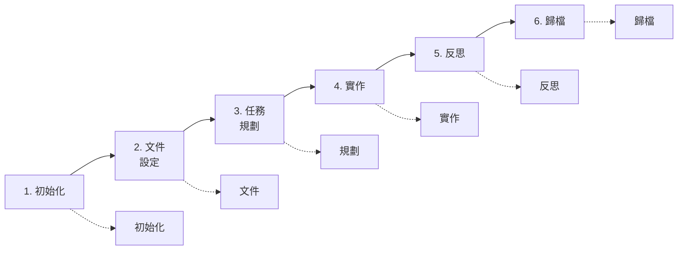
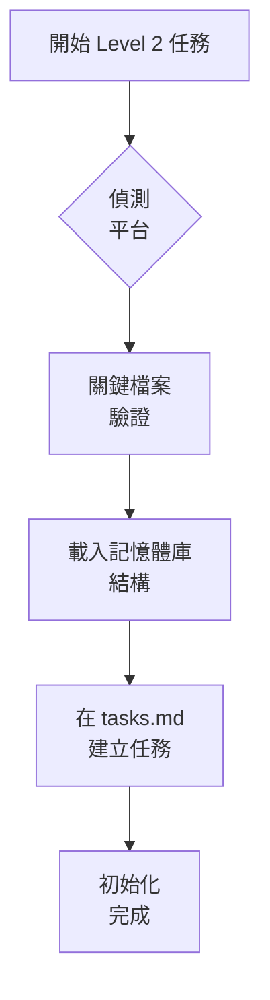
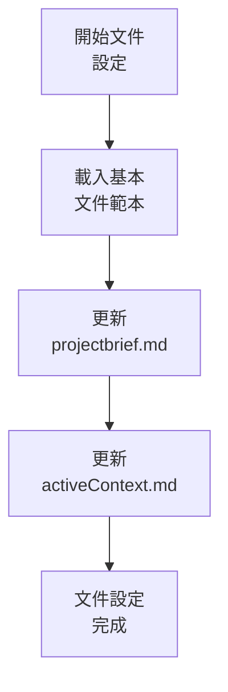
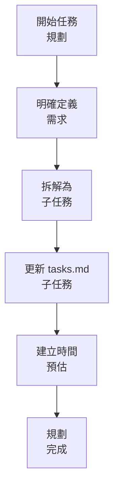
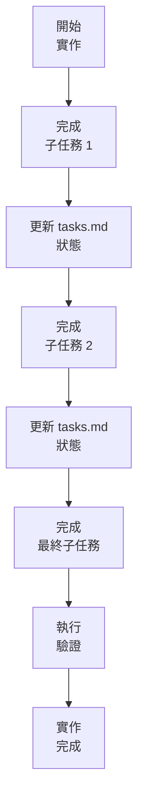
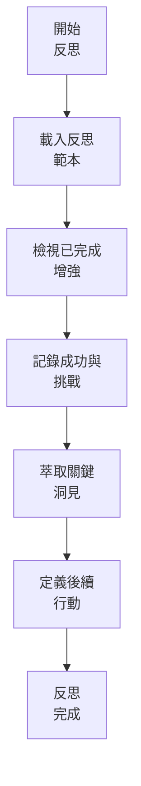
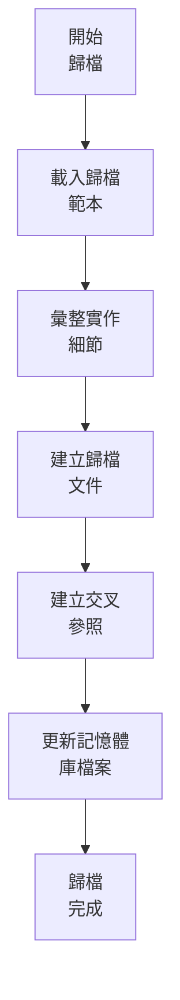
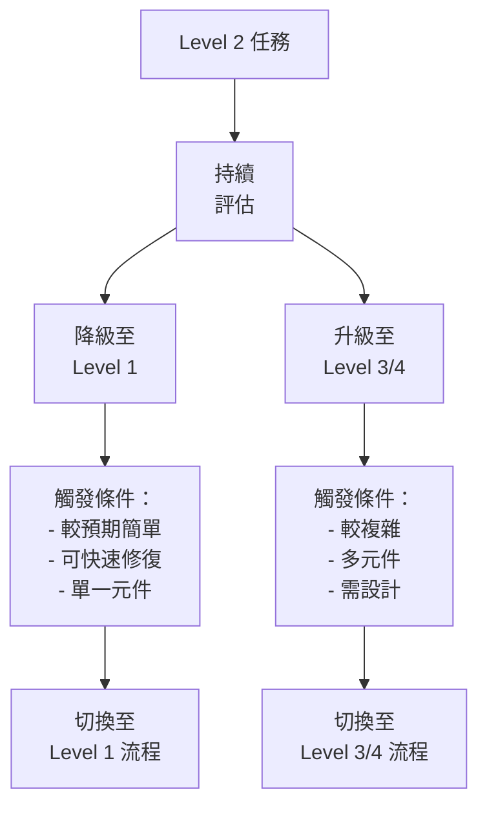
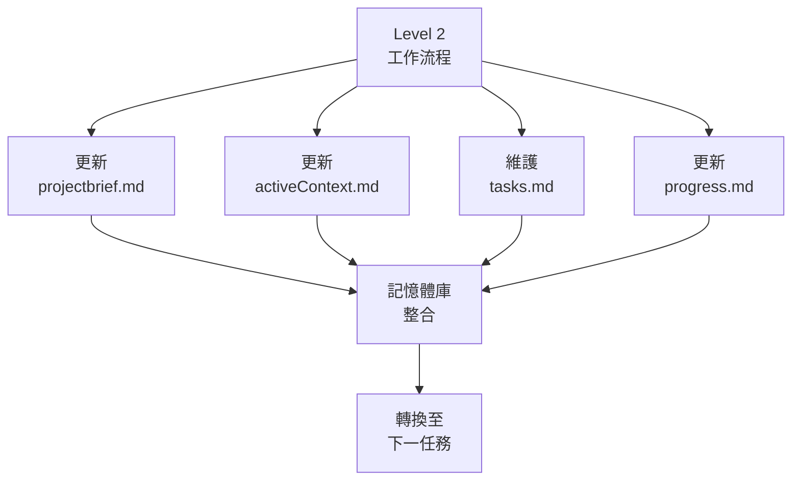

# LEVEL 2 任務工作流程

> **重點摘要：** 本文件說明 Level 2（簡易增強）任務的結構化且高效率工作流程，包含 6 個關鍵階段、里程碑檢查點與品質驗證。

## 🔍 LEVEL 2 工作流程總覽



Level 2 任務屬於簡易增強，需結構化流程與適度規劃、文件。本流程兼顧流程與效率。

## 📋 工作流程階段

### 階段 1：初始化



**步驟：**

1. 平台偵測
2. 關鍵檔案驗證
3. 載入記憶體庫結構
4. 在 tasks.md 建立任務
5. 定義初始任務範圍

**里程碑檢查點：**

```
✓ 初始化檢查點
- 平台已偵測並設定？ [是/否]
- 關鍵檔案已驗證？ [是/否]
- 記憶體庫已載入？ [是/否]
- 任務已建立於 tasks.md？ [是/否]
- 初始範圍已定義？ [是/否]

→ 全部是：進入文件設定
→ 有否：補齊初始化步驟
```

### 階段 2：文件設定



**步驟：**

1. 載入基本文件範本
2. 更新 projectbrief.md，記錄增強細節
3. 更新 activeContext.md，標記目前重點
4. 建立最小文件結構

**里程碑檢查點：**

```
✓ 文件檢查點
- 文件範本已載入？ [是/否]
- projectbrief.md 已更新？ [是/否]
- activeContext.md 已更新？ [是/否]
- 文件結構已建立？ [是/否]

→ 全部是：進入任務規劃
→ 有否：補齊文件設定
```

### 階段 3：任務規劃



**步驟：**

1. 明確定義需求
2. 拆解為子任務
3. 在 tasks.md 更新子任務
4. 建立時間預估
5. 記錄相依與限制

**里程碑檢查點：**

```
✓ 規劃檢查點
- 需求明確定義？ [是/否]
- 任務已拆解為子任務？ [是/否]
- tasks.md 已更新子任務？ [是/否]
- 時間預估已建立？ [是/否]
- 相依已記錄？ [是/否]

→ 全部是：進入實作
→ 有否：補齊規劃步驟
```

### 階段 4：實作



**步驟：**

1. 實作第一個子任務
2. 在 tasks.md 更新狀態
3. 實作其餘子任務
4. 每個子任務後定期更新狀態
5. 驗證整體實作

**里程碑檢查點：**

```
✓ 實作檢查點
- 所有子任務已完成？ [是/否]
- 狀態更新有維護？ [是/否]
- 增強功能已完整實作？ [是/否]
- 已執行基本驗證？ [是/否]
- tasks.md 已完整更新？ [是/否]

→ 全部是：進入反思
→ 有否：補齊實作步驟
```

### 階段 5：反思



**步驟：**

1. 載入反思範本
2. 檢視已完成增強
3. 記錄成功與挑戰
4. 萃取關鍵洞見
5. 定義未來行動項目

**里程碑檢查點：**

```
✓ 反思檢查點
- 反思範本已載入？ [是/否]
- 增強已檢視？ [是/否]
- 成功與挑戰已記錄？ [是/否]
- 關鍵洞見已萃取？ [是/否]
- 行動項目已定義？ [是/否]

→ 全部是：進入歸檔
→ 有否：補齊反思步驟
```

### 階段 6：歸檔



**步驟：**

1. 載入歸檔範本
2. 彙整實作細節
3. 建立歸檔文件
4. 建立交叉參照
5. 更新記憶體庫檔案

**里程碑檢查點：**

```
✓ 歸檔檢查點
- 歸檔範本已載入？ [是/否]
- 實作細節已彙整？ [是/否]
- 歸檔文件已建立？ [是/否]
- 交叉參照已建立？ [是/否]
- 記憶體庫檔案已更新？ [是/否]

→ 全部是：任務完成
→ 有否：補齊歸檔步驟
```

## 📋 工作流程驗證清單

```
✓ 最終工作流程驗證
- 所有階段已完成？ [是/否]
- 所有里程碑檢查點通過？ [是/否]
- tasks.md 已完整更新？ [是/否]
- 反思文件已建立？ [是/否]
- 歸檔文件已建立？ [是/否]
- 記憶體庫已完整更新？ [是/否]

→ 全部是：Level 2 任務成功完成
→ 有否：補齊未完成項目
```

## 📋 最小模式工作流程

最小模式可用以下精簡流程：

```
1. 初始化：驗證環境、建立任務登錄
2. 文件：更新 projectbrief 與 activeContext
3. 規劃：定義需求、子任務、預估
4. 實作：完成子任務、更新狀態
5. 反思：記錄關鍵洞見與行動
6. 歸檔：記錄完成與交叉參照
```

## 🔄 等級轉換處理



## 🔄 與記憶體庫整合



## 🚨 效率原則

請記住：

```
┌─────────────────────────────────────────────────────┐
│ Level 2 工作流程兼顧流程與效率。                     │
│ 遵循結構但避免不必要的負擔。                         │
└─────────────────────────────────────────────────────┘
```

這確保簡易增強能以適當的文件與流程完成。
