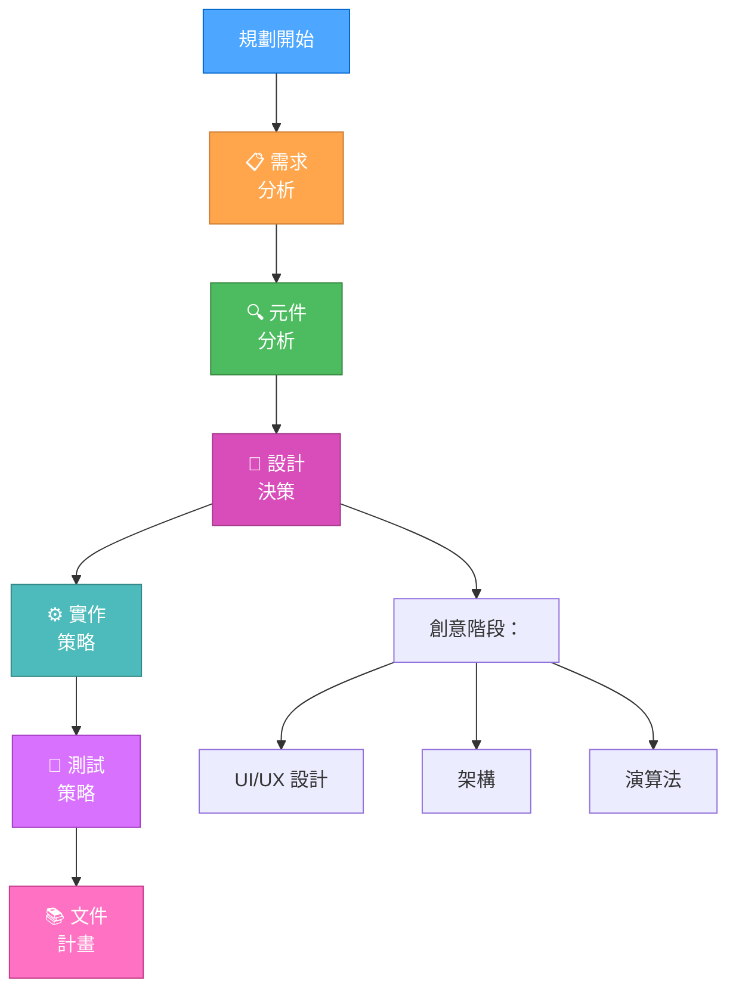
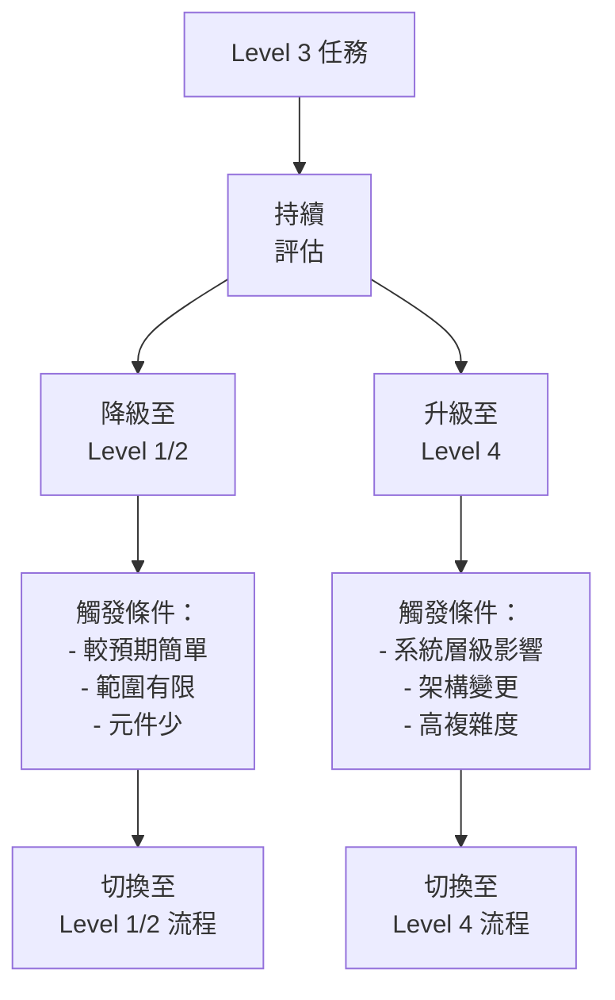
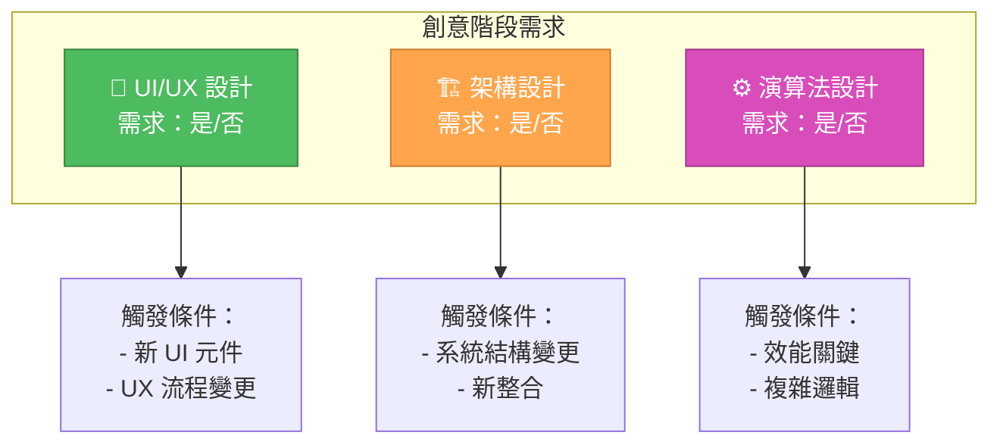
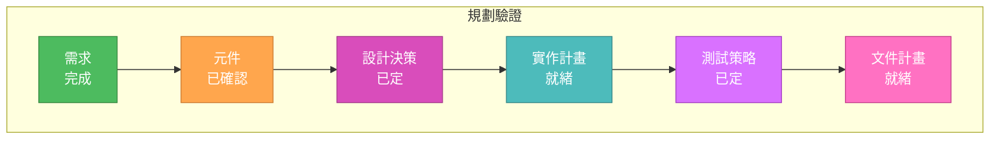
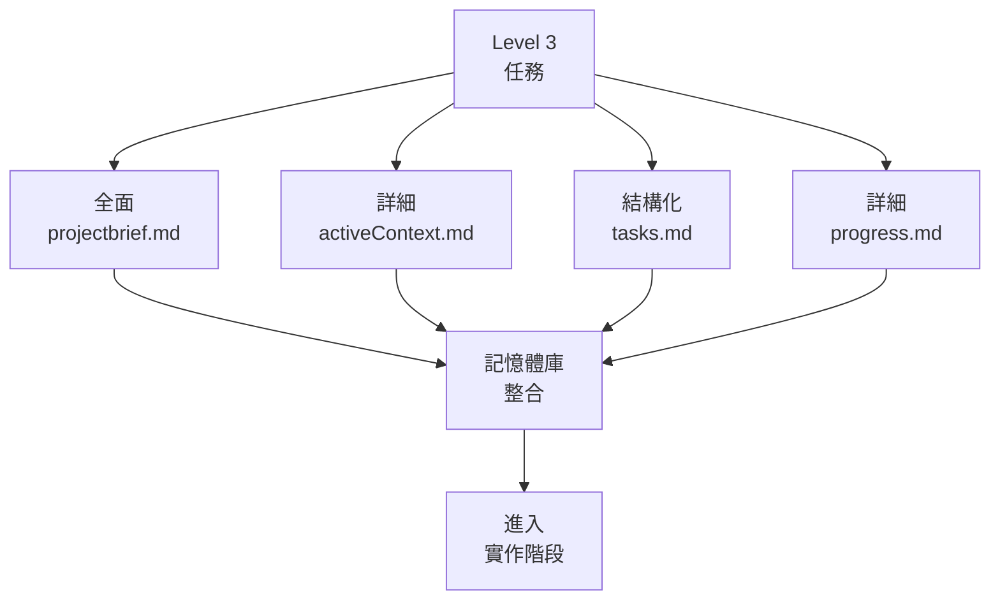

# LEVEL 3 全面規劃

> **重點摘要：** 本文件提供 Level 3（中階功能）任務的結構化規劃指引，強調全面規劃、創意階段與明確實作策略。

## 🏗️ 規劃流程



## 🔄 等級轉換處理



## 📋 規劃範本

```markdown
# 功能規劃文件

## 需求分析

- 核心需求：
  - [ ] 需求 1
  - [ ] 需求 2
- 技術限制：
  - [ ] 限制 1
  - [ ] 限制 2

## 元件分析

- 影響元件：
  - 元件 1
    - 需變更內容：
    - 相依性：
  - 元件 2
    - 需變更內容：
    - 相依性：

## 設計決策

- 架構：
  - [ ] 決策 1
  - [ ] 決策 2
- UI/UX：
  - [ ] 設計 1
  - [ ] 設計 2
- 演算法：
  - [ ] 演算法 1
  - [ ] 演算法 2

## 實作策略

1. 階段 1：
   - [ ] 任務 1
   - [ ] 任務 2
2. 階段 2：
   - [ ] 任務 3
   - [ ] 任務 4

## 測試策略

- 單元測試：
  - [ ] 測試 1
  - [ ] 測試 2
- 整合測試：
  - [ ] 測試 3
  - [ ] 測試 4

## 文件計畫

- [ ] API 文件
- [ ] 使用者指南更新
- [ ] 架構文件
```

## 🎨 創意階段識別



## ✅ 驗證檢查清單



## 🔄 實作階段


## 🔄 與記憶體庫整合



## 🚨 規劃效率原則

請記住：

```
┌─────────────────────────────────────────────────────┐
│ Level 3 規劃需全面設計，但避免過度設計。              │
│ 專注於可維護、文件完善的功能交付。                   │
└─────────────────────────────────────────────────────┘
```
