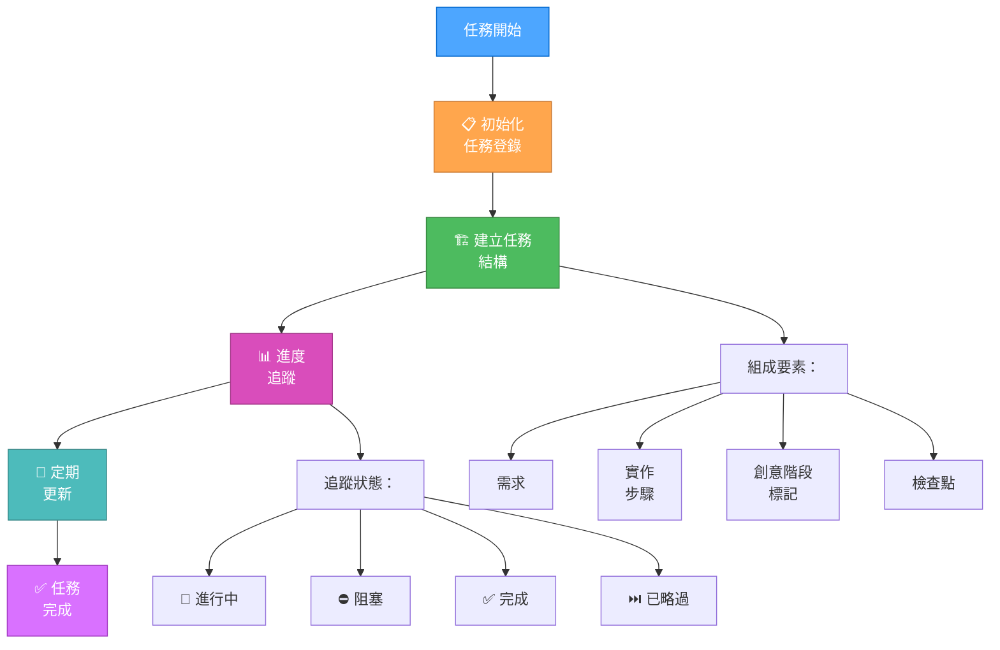
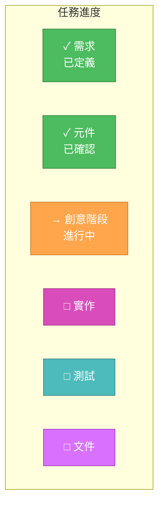
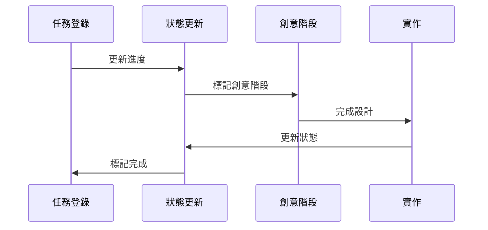
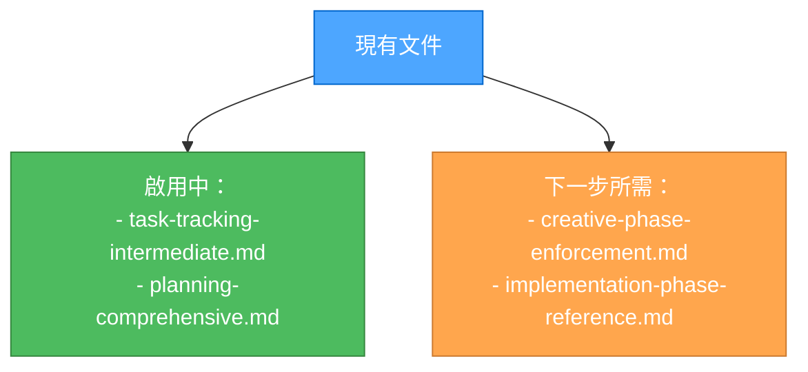

# LEVEL 3 中階任務追蹤

> **重點摘要：** 本文件提供 Level 3（中階功能）任務的結構化追蹤指引，包含視覺化追蹤元素與明確檢查點。

## 🔍 任務追蹤流程



## 📋 任務登錄範本

```markdown
# [任務標題]

## 需求

- [ ] 需求 1
- [ ] 需求 2
- [ ] 需求 3

## 影響元件

- 元件 1
- 元件 2
- 元件 3

## 實作步驟

1. [ ] 步驟 1
2. [ ] 步驟 2
3. [ ] 步驟 3

## 創意階段需求

- [ ] 🎨 UI/UX 設計
- [ ] 🏗️ 架構設計
- [ ] ⚙️ 演算法設計

## 檢查點

- [ ] 需求已驗證
- [ ] 創意階段完成
- [ ] 實作已測試
- [ ] 文件已更新

## 目前狀態

- 階段：[目前階段]
- 狀態：[進行中/阻塞/完成]
- 阻礙事項：[如有]
```

## 🔄 進度追蹤視覺化



## ✅ 更新協議



## 🎯 檢查點驗證

| 階段 | 驗證項目         | 狀態 |
| ---- | ---------------- | ---- |
| 需求 | 所有需求已記錄   | [ ]  |
| 元件 | 影響元件已列出   | [ ]  |
| 創意 | 設計決策已記錄   | [ ]  |
| 實作 | 程式碼變更已追蹤 | [ ]  |
| 測試 | 測試結果已記錄   | [ ]  |
| 文件 | 更新已完成       | [ ]  |

## 🔄 文件管理


