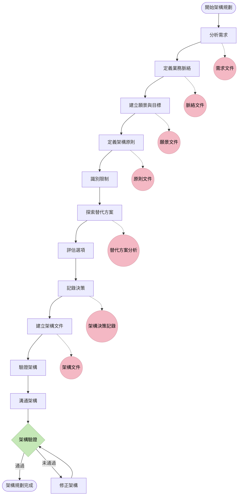
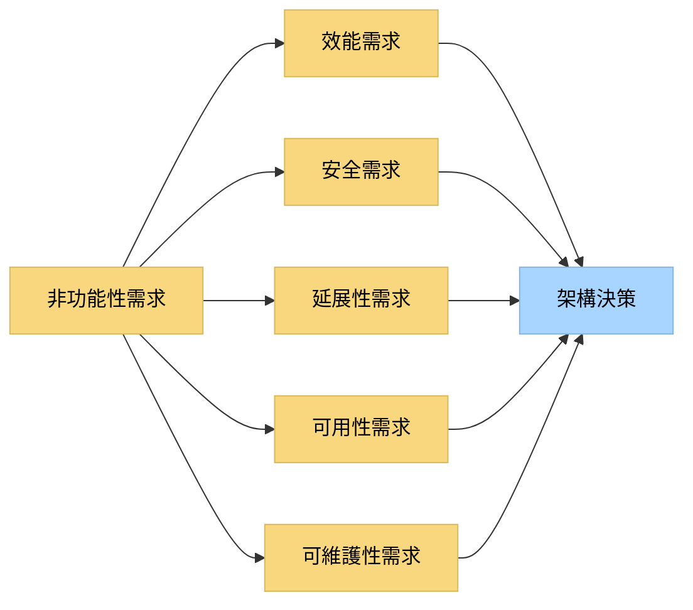
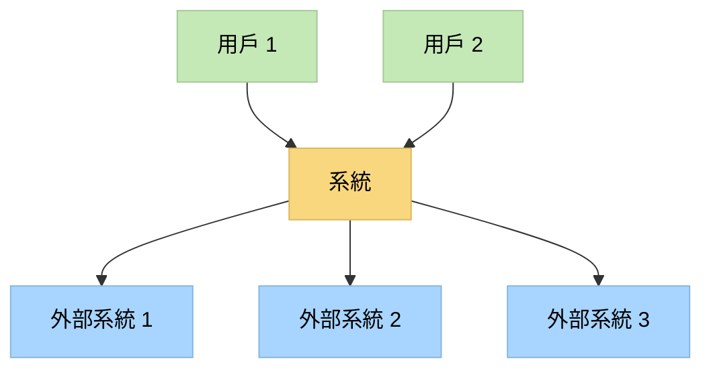
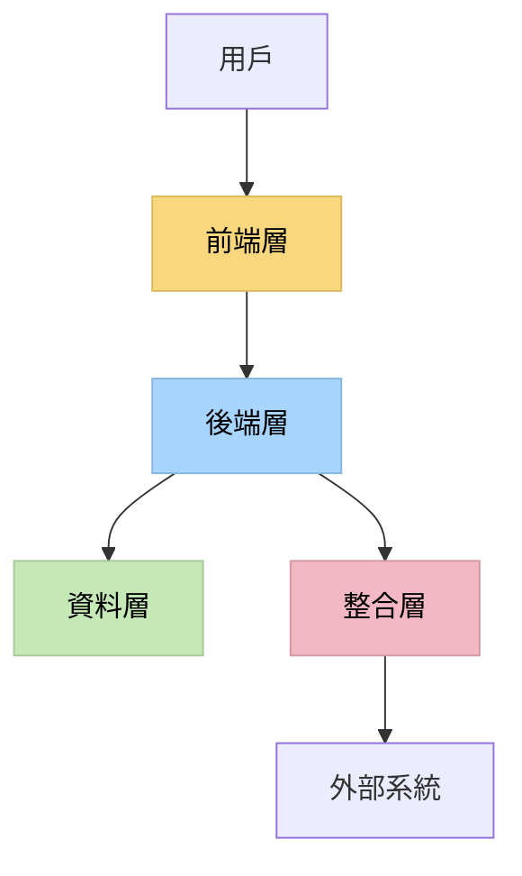
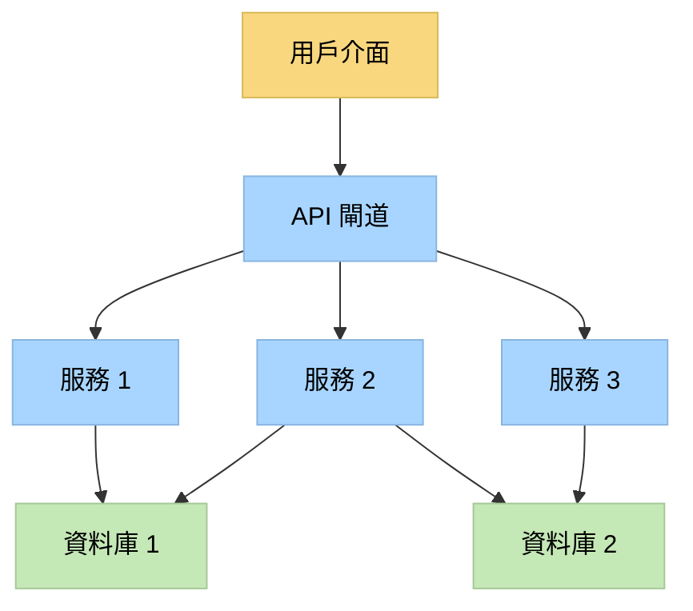
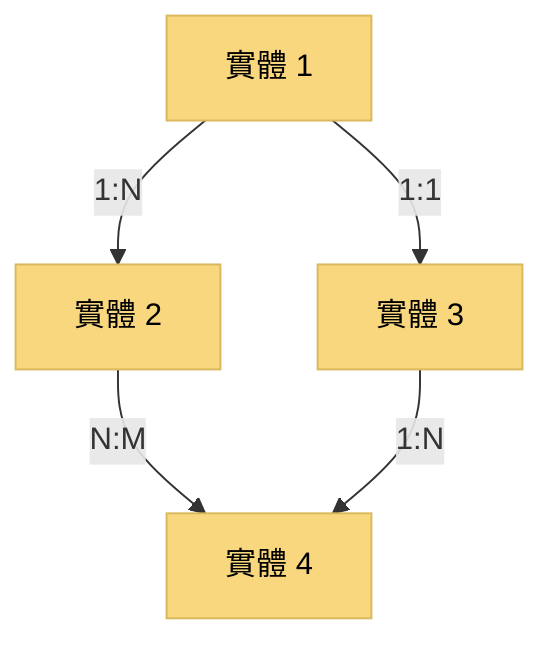
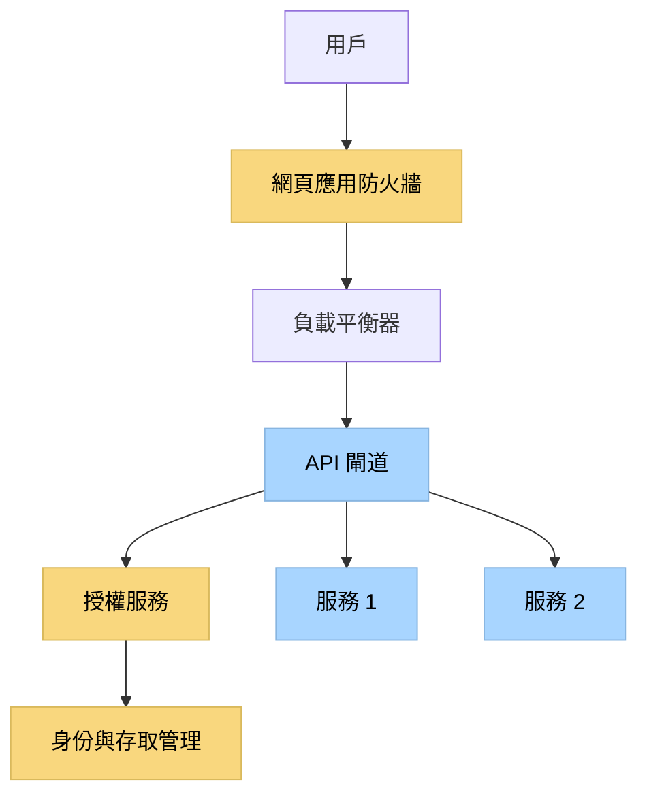
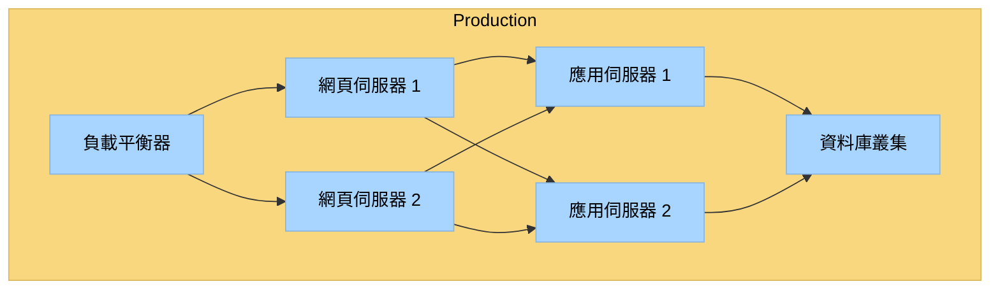
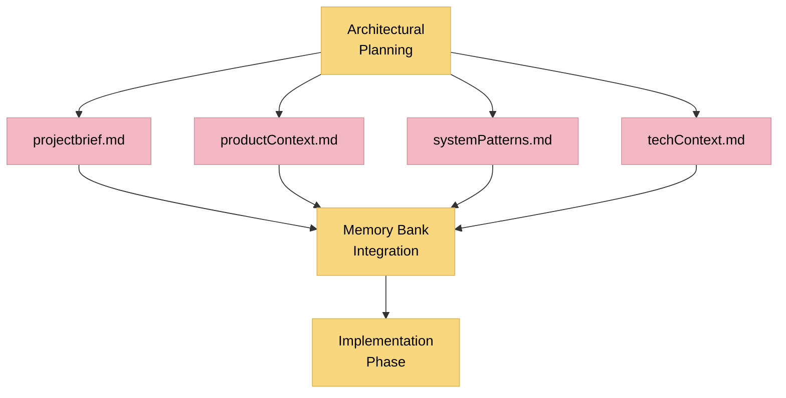

# Level 4 任務的架構規劃

> **重點摘要：** 本文件說明 Level 4（複雜系統）任務的完整架構規劃方法，確保產生穩健、可延展、易維護且符合業務目標與技術需求的架構。

## 🔍 架構規劃總覽

Level 4 複雜系統任務需徹底的架構規劃，以確保最終系統穩健、可延展、易於維護，並與業務目標一致。本文件說明一套有系統的架構規劃流程，逐步處理關鍵議題並產出完整文件。



## 📋 架構規劃原則

1. **業務對齊**：架構必須直接支持業務目標與用戶需求。
2. **前瞻性**：架構需預見未來需求並便於變更。
3. **簡單優先**：在可能情況下，優先選擇簡單方案。
4. **關注點分離**：系統應劃分為明確、最小重疊的元件。
5. **縱深防禦**：應採多層安全控制。
6. **鬆耦合**：元件間應透過明確介面互動，減少依賴。
7. **高內聚**：相關功能應集中，不相關功能應分離。
8. **韌性**：架構應預期失敗並提供恢復機制。
9. **可延展性**：架構應支持用戶、資料、功能的成長。
10. **可量測性**：架構應能監控並量測關鍵指標。

## 📋 架構需求分析

以完整需求分析展開架構規劃：

### 功能性需求分析


**功能性需求分析範本：**

```markdown
## 功能性需求分析

### 主要用例

- 用例 1：[說明]
- 用例 2：[說明]
- 用例 3：[說明]

### 領域模型

- 實體 1：[說明與屬性]
- 實體 2：[說明與屬性]
- 實體 3：[說明與屬性]
- 關聯：
  - 實體 1 → 實體 2：[關聯型態與說明]
  - 實體 2 → 實體 3：[關聯型態與說明]

### 元件識別

- 元件 1：[說明與職責]
- 元件 2：[說明與職責]
- 元件 3：[說明與職責]

### 介面定義

- 介面 1：[說明、方法、參數]
- 介面 2：[說明、方法、參數]
- 介面 3：[說明、方法、參數]

### 資訊流

- 流程 1：[資訊交換說明]
- 流程 2：[資訊交換說明]
- 流程 3：[資訊交換說明]
```

### 非功能性需求分析



**非功能性需求分析範本：**

```markdown
## 非功能性需求分析

### 效能需求

- 回應時間：[需求]
- 吞吐量：[需求]
- 資源使用率：[需求]
- 架構影響：[對架構的影響]

### 安全需求

- 認證：[需求]
- 授權：[需求]
- 資料保護：[需求]
- 稽核/日誌：[需求]
- 架構影響：[對架構的影響]

### 延展性需求

- 用戶延展性：[需求]
- 資料延展性：[需求]
- 交易延展性：[需求]
- 架構影響：[對架構的影響]

### 可用性需求

- 上線時間需求：[需求]
- 容錯能力：[需求]
- 災難復原：[需求]
- 架構影響：[對架構的影響]

### 可維護性需求

- 模組化：[需求]
- 可擴充性：[需求]
- 可測試性：[需求]
- 架構影響：[對架構的影響]
```

## 📋 業務脈絡文件

文件化業務脈絡以確保架構對齊：

```markdown
## 業務脈絡文件

### 業務目標

- 目標 1：[說明]
- 目標 2：[說明]
- 目標 3：[說明]

### 主要利害關係人

- 利害關係人群體 1：[說明、需求與關注]
- 利害關係人群體 2：[說明、需求與關注]
- 利害關係人群體 3：[說明、需求與關注]

### 業務流程

- 流程 1：[說明與流程]
- 流程 2：[說明與流程]
- 流程 3：[說明與流程]

### 業務限制

- 限制 1：[說明與影響]
- 限制 2：[說明與影響]
- 限制 3：[說明與影響]

### 業務指標

- 指標 1：[說明與目標]
- 指標 2：[說明與目標]
- 指標 3：[說明與目標]

### 業務風險

- 風險 1：[說明、機率、影響與緩解措施]
- 風險 2：[說明、機率、影響與緩解措施]
- 風險 3：[說明、機率、影響與緩解措施]
```

## 📋 架構願景與目標

文件化架構願景與目標：

```markdown
## 架構願景與目標

### 願景聲明

[架構願景的簡潔聲明]

### 策略目標

- 目標 1：[說明與成功標準]
- 目標 2：[說明與成功標準]
- 目標 3：[說明與成功標準]

### 品質屬性

- 品質屬性 1：[說明與重要性]
- 品質屬性 2：[說明與重要性]
- 品質屬性 3：[說明與重要性]

### 技術路線圖

- 短期（0-6 個月）：[主要架構里程碑]
- 中期（6-18 個月）：[主要架構里程碑]
- 長期（18+ 個月）：[主要架構里程碑]

### 主要成功指標

- 指標 1：[說明與測量]
- 指標 2：[說明與測量]
- 指標 3：[說明與測量]
```

## 📋 架構原則

文件化架構原則以指導決策：

```markdown
## 架構原則

### 原則 1：[名稱]

- **聲明**：[原則的簡潔聲明]
- **理由**：[此原則重要性]
- **影響**：[此原則對架構的意義]
- **範例**：[應用此原則的範例]

### 原則 2：[名稱]

- **聲明**：[原則的簡潔聲明]
- **理由**：[此原則重要性]
- **影響**：[此原則對架構的意義]
- **範例**：[應用此原則的範例]

### 原則 3：[名稱]

- **聲明**：[原則的簡潔聲明]
- **理由**：[此原則重要性]
- **影響**：[此原則對架構的意義]
- **範例**：[應用此原則的範例]

...
```

## 📋 限制條件識別

文件化影響架構決策的限制條件：

```markdown
## 架構限制

### 技術限制

- 限制 1：[說明與影響]
- 限制 2：[說明與影響]
- 限制 3：[說明與影響]

### 組織限制

- 限制 1：[說明與影響]
- 限制 2：[說明與影響]
- 限制 3：[說明與影響]

### 外部限制

- 限制 1：[說明與影響]
- 限制 2：[說明與影響]
- 限制 3：[說明與影響]

### 法規/合規限制

- 限制 1：[說明與影響]
- 限制 2：[說明與影響]
- 限制 3：[說明與影響]

### 資源限制

- 限制 1：[說明與影響]
- 限制 2：[說明與影響]
- 限制 3：[說明與影響]
```

## 📋 架構替代方案探索

文件化並評估架構替代方案：

```markdown
## 架構替代方案

### 替代方案 1：[名稱]

- **說明**：[替代方案簡述]
- **主要元件**：
  - 元件 1：[說明]
  - 元件 2：[說明]
  - 元件 3：[說明]
- **優點**：
  - [優點 1]
  - [優點 2]
  - [優點 3]
- **缺點**：
  - [缺點 1]
  - [缺點 2]
  - [缺點 3]
- **風險**：
  - [風險 1]
  - [風險 2]
  - [風險 3]
- **成本因素**：
  - [成本因素 1]
  - [成本因素 2]
  - [成本因素 3]
- **與需求對齊**：
  - [此替代方案滿足需求的程度]

### 替代方案 2：[名稱]

...

### 替代方案 3：[名稱]

...

## 評估標準

- 標準 1：[說明與權重]
- 標準 2：[說明與權重]
- 標準 3：[說明與權重]

## 評估矩陣

| 標準   | 替代方案 1 | 替代方案 2 | 替代方案 3 |
| ------ | ---------- | ---------- | ---------- |
| 標準 1 | 分數       | 分數       | 分數       |
| 標準 2 | 分數       | 分數       | 分數       |
| 標準 3 | 分數       | 分數       | 分數       |
| 總分   | 總和       | 總和       | 總和       |

## 建議方案

[建議的架構方案描述與理由]
```

## 📋 架構決策記錄（ADRs）

文件化主要架構決策：

```markdown
# 架構決策記錄： [決策標題]

## 狀態

[提議/接受/已廢止/被取代]

## 背景

[背景與問題陳述]

## 決策

[所做決策的描述]

## 後果

[決策後果的描述]

## 考慮的替代方案

[考慮的替代方案描述]

## 相關決策

[相關決策的參考]

## 附註

[其他注意事項與考量]
```

## 📋 完整架構文件

建立完整的架構文件：

### 系統脈絡圖



### 高階架構圖



### 元件架構圖



### 資料架構圖



### 安全架構圖



### 部署架構圖



### 架構文件範本

```markdown
# 系統架構文件

## 1. 介紹

- **目的**：[架構的目的]
- **範圍**：[架構的範圍]
- **讀者**：[文件的預期讀者]
- **參考資料**：[相關文件與參考資料]

## 2. 系統脈絡

- **系統目的**：[系統目的的簡要說明]
- **脈絡圖**：[系統脈絡圖]
- **外部系統**：[外部系統與介面的說明]
- **用戶類型**：[用戶類型與互動的說明]

## 3. 架構總覽

- **架構風格**：[架構風格/模式的說明]
- **高階架構**：[高階架構圖]
- **主要元件**：[主要元件的概述]
- **技術棧**：[技術棧的概述]

## 4. 元件架構

- **元件圖**：[元件架構圖]
- **元件說明**：
  - 元件 1：[說明、職責、介面]
  - 元件 2：[說明、職責、介面]
  - 元件 3：[說明、職責、介面]
- **元件互動**：[元件互動的說明]
- **API 規範**：[主要 API 的概述]

## 5. 資料架構

- **資料模型**：[資料架構圖]
- **實體說明**：
  - 實體 1：[說明、屬性、關聯]
  - 實體 2：[說明、屬性、關聯]
  - 實體 3：[說明、屬性、關聯]
- **資料儲存**：[資料儲存方式的說明]
- **資料存取**：[資料存取模式的說明]
- **資料遷移**：[資料遷移方式的概述]

## 6. 安全架構

- **安全模型**：[安全架構圖]
- **認證**：[認證方式]
- **授權**：[授權方式]
- **資料保護**：[資料保護機制]
- **安全控制**：[主要安全控制措施]
- **稽核與日誌**：[稽核與日誌方式]

## 7. 部署架構

- **部署模型**：[部署架構圖]
- **環境說明**：
  - 環境 1：[說明與配置]
  - 環境 2：[說明與配置]
  - 環境 3：[說明與配置]
- **基礎設施需求**：[基礎設施需求]
- **擴展方式**：[擴展方式]

## 8. 品質屬性

- **效能**：[效能特徵與機制]
- **可延展性**：[可延展性方式]
- **可用性**：[可用性方式]
- **可維護性**：[可維護性方式]
- **可靠性**：[可靠性方式]
- **可攜性**：[可攜性考量]

## 9. 橫向關注事項

- **日誌記錄**：[日誌記錄方式]
- **錯誤處理**：[錯誤處理方式]
- **監控**：[監控方式]
- **配置管理**：[配置管理方式]
- **國際化**：[國際化方式]

## 10. 架構決策

- [架構決策記錄的參考]

## 11. 風險與緩解措施

- 風險 1：[說明與緩解措施]
- 風險 2：[說明與緩解措施]
- 風險 3：[說明與緩解措施]

## 12. 附錄

- **術語表**：
  - 術語 1：[定義]
  - 術語 2：[定義]
  - 術語 3：[定義]
```

## 📋 架構驗證

驗證架構是否符合需求與原則：

```markdown
## 架構驗證

### 需求覆蓋

- 需求 1：[已覆蓋/部分覆蓋/未覆蓋] - [說明]
- 需求 2：[已覆蓋/部分覆蓋/未覆蓋] - [說明]
- 需求 3：[已覆蓋/部分覆蓋/未覆蓋] - [說明]

### 原則對齊

- 原則 1：[對齊/部分對齊/未對齊] - [說明]
- 原則 2：[對齊/部分對齊/未對齊] - [說明]
- 原則 3：[對齊/部分對齊/未對齊] - [說明]

### 品質屬性情境

- 情境 1：[說明與驗證]
- 情境 2：[說明與驗證]
- 情境 3：[說明與驗證]

### 架構審查結果

- 發現 1：[說明與解決方案]
- 發現 2：[說明與解決方案]
- 發現 3：[說明與解決方案]

### 風險評估

- 風險 1：[說明、機率、影響與緩解措施]
- 風險 2：[說明、機率、影響與緩解措施]
- 風險 3：[說明、機率、影響與緩解措施]

### 驗證結果

[驗證結果摘要與後續步驟]
```

## 📋 架構溝通

與利害關係人溝通架構：

```markdown
## 架構溝通計畫

### 主要利害關係人

- 利害關係人群體 1：[溝通需求]
- 利害關係人群體 2：[溝通需求]
- 利害關係人群體 3：[溝通需求]

### 溝通材料

- **執行摘要**：[目的與對象]
- **技術參考**：[目的與對象]
- **開發者指南**：[目的與對象]
- **運維指南**：[目的與對象]

### 溝通時間表

- 事件 1：[日期、對象、目的]
- 事件 2：[日期、對象、目的]
- 事件 3：[日期、對象、目的]

### 反饋機制

[反饋收集與整合方式的說明]
```

## 📋 記憶庫整合



### 記憶庫更新

在架構規劃期間更新以下記憶庫文件：

1. **projectbrief.md**

   - 更新架構願景
   - 文件化高階架構方法
   - 連結架構文件

2. **productContext.md**

   - 更新業務脈絡文件
   - 文件化主要利害關係人需求
   - 捕捉架構決策的業務驅動因素

3. **systemPatterns.md**

   - 文件化選擇的架構模式與風格
   - 捕捉主要架構決策及其理由
   - 文件化將要使用的技術模式

4. **techContext.md**
   - 更新技術棧決策
   - 文件化技術限制與考量
   - 捕捉整合方法

## 📋 架構規劃驗證清單

```
✓ 架構規劃驗證清單

需求分析
- 功能性需求已分析？ [是/否]
- 非功能性需求已分析？ [是/否]
- 領域模型已建立？ [是/否]
- 元件識別已完成？ [是/否]

業務脈絡
- 業務目標已文件化？ [是/否]
- 主要利害關係人已識別？ [是/否]
- 業務流程已文件化？ [是/否]
- 業務限制已識別？ [是/否]

願景與目標
- 架構願景已聲明？ [是/否]
- 策略目標已定義？ [是/否]
- 品質屬性已識別？ [是/否]
- 技術路線圖已建立？ [是/否]

架構原則
- 核心原則已定義？ [是/否]
- 原則具有明確理由？ [是/否]
- 原則的影響已文件化？ [是/否]
- 原則應用範例已提供？ [是/否]

限制條件識別
- 技術限制已文件化？ [是/否]
- 組織限制已文件化？ [是/否]
- 外部限制已文件化？ [是/否]
- 法規限制已文件化？ [是/否]

替代方案探索
- 已識別多個替代方案？ [是/否]
- 替代方案已根據標準評估？ [是/否]
- 優缺點已文件化？ [是/否]
- 建議方案已獲得合理化？ [是/否]

架構文件
- 系統脈絡已文件化？ [是/否]
- 高階架構已文件化？ [是/否]
- 元件架構已文件化？ [是/否]
- 資料架構已文件化？ [是/否]
- 安全架構已文件化？ [是/否]
- 部署架構已文件化？ [是/否]

架構驗證
- 需求覆蓋已驗證？ [是/否]
- 原則對齊已檢查？ [是/否]
- 品質屬性情境已評估？ [是/否]
- 架構審查已進行？ [是/否]

記憶庫整合
- projectbrief.md 已更新？ [是/否]
- productContext.md 已更新？ [是/否]
- systemPatterns.md 已更新？ [是/否]
- techContext.md 已更新？ [是/否]
```

## 📋 簡化模式架構規劃格式

對於需要更簡潔架構規劃方法的情況：

```markdown
## Level 4 架構規劃： [系統名稱]

### 系統脈絡

- **目的**：[系統目的簡述]
- **用戶**：[主要用戶]
- **外部系統**：[關鍵外部系統]

### 主要架構決策

- **架構風格**：[選擇的風格與簡要理由]
- **元件結構**：[主要元件與簡要說明]
- **資料模型**：[資料處理的簡要說明]
- **技術棧**：[關鍵技術]

### 品質屬性

- **效能**：[處理方式簡述]
- **安全性**：[處理方式簡述]
- **可延展性**：[處理方式簡述]
- **可維護性**：[處理方式簡述]

### 架構圖

[簡單的架構圖]

### 主要風險與緩解措施

- **風險 1**：[簡要說明] - **緩解**：[簡要方法]
- **風險 2**：[簡要說明] - **緩解**：[簡要方法]

### 記憶庫更新

- [需要更新的簡要說明]
```

## 🚨 架構規劃強制原則

```
┌─────────────────────────────────────────────────────┐
│ 對於 Level 4 任務，架構規劃是強制性的。實作不能在架構規劃完成並獲得批准之前開始。 │
└─────────────────────────────────────────────────────┘
```
