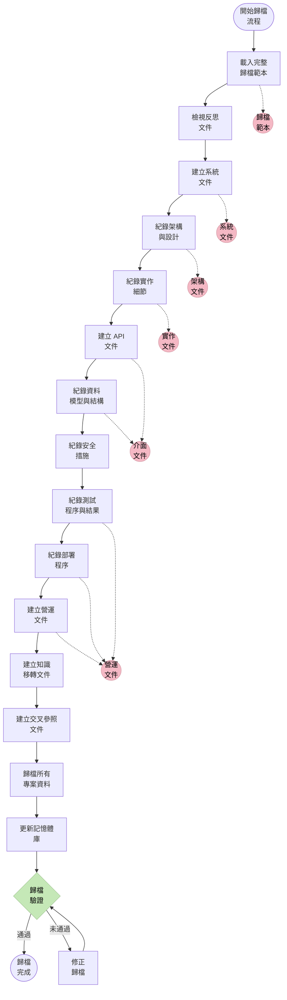
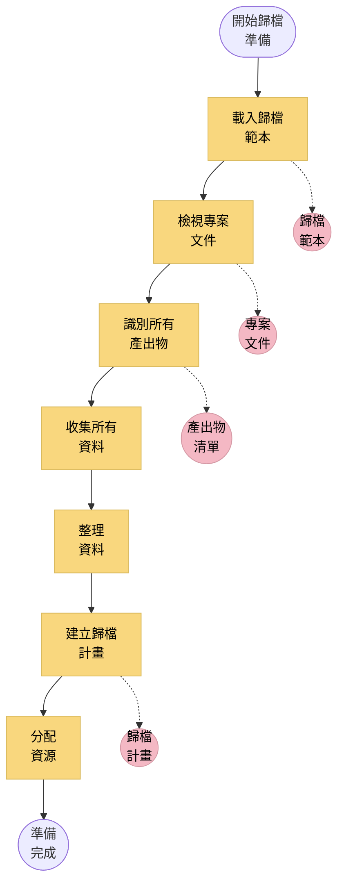
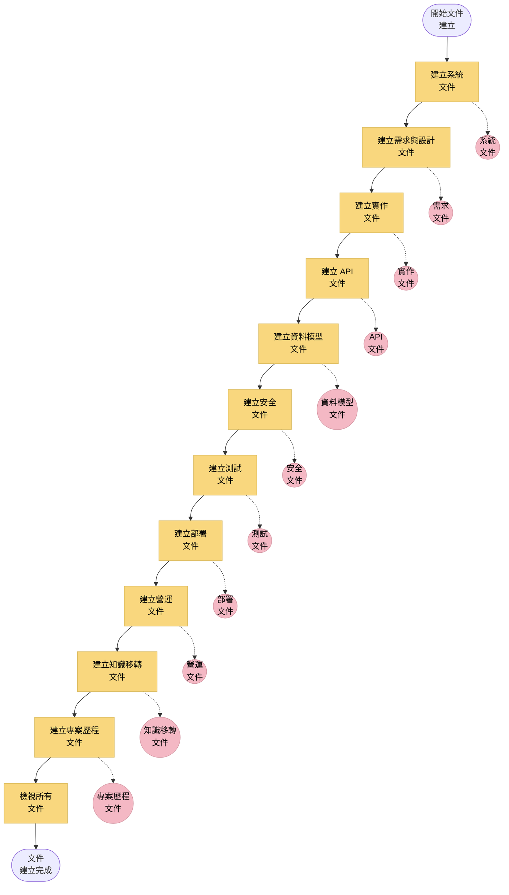
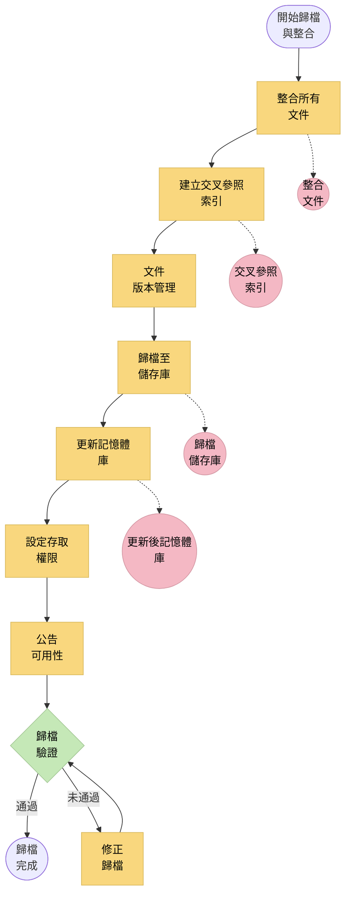
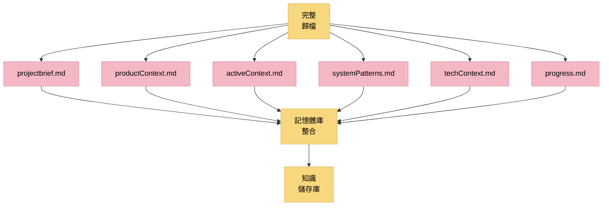

# LEVEL 4 任務完整歸檔

> **重點摘要：** 本文件說明 Level 4（複雜系統）任務的完整歸檔方法，確保所有系統知識、決策、實作細節與經驗教訓皆被保存，供未來參考與重用。

## 🔍 完整歸檔總覽

Level 4 複雜系統任務需徹底歸檔，以保存系統知識、設計決策、實作細節與經驗教訓。此系統化歸檔流程確保組織能保有制度性知識，並讓未來團隊能理解、維護與擴充系統。



## 📋 歸檔範本結構

### 1. 系統概述

```markdown
## 系統概述

### 系統目的與範圍

[系統目的、範圍與商業情境的完整說明]

### 系統架構

[架構摘要，含圖示、模式與關鍵設計決策]

### 主要元件

- 元件 1：[說明與目的]
- 元件 2：[說明與目的]
- 元件 3：[說明與目的]

### 整合點

[所有內部與外部整合點說明]

### 技術棧

[所有使用技術、框架與工具的完整清單]

### 部署環境

[部署環境、基礎設施與設定說明]
```

### 2. 需求與設計文件

```markdown
## 需求與設計文件

### 商業需求

[完整商業需求清單，含可追蹤性]

### 功能需求

[詳細功能需求與實作對應]

### 非功能需求

[非功能需求與實作方式]

### 架構決策紀錄

[所有架構決策紀錄（ADR）彙整]

### 使用設計模式

[所有設計模式目錄與範例]

### 設計限制

[所有設計限制及其影響說明]

### 考慮過的設計替代方案

[替代方案摘要與最終選擇理由]
```

### 3. 實作文件

```markdown
## 實作文件

### 元件實作細節

- **元件 1**：

  - **目的**：[元件目的]
  - **實作方式**：[實作細節]
  - **關鍵類別/模組**：[清單與說明]
  - **相依**：[內外部相依]
  - **特別注意事項**：[重點說明]

- **元件 2**：
  - **目的**：[元件目的]
  - **實作方式**：[實作細節]
  - **關鍵類別/模組**：[清單與說明]
  - **相依**：[內外部相依]
  - **特別注意事項**：[重點說明]

### 演算法與複雜邏輯

[關鍵演算法與商業邏輯說明]

### 第三方整合

[所有第三方整合（API、函式庫）細節]

### 設定參數

[所有設定參數及其用途完整清單]

### 建構與套件細節

[建構流程、套件與產出物說明]
```

### 4. API 文件

```markdown
## API 文件

### API 概述

[所有 API（內外部）的高階說明]

### API 端點

- **端點 1**：

  - **URL/路徑**：[端點 URL 或路徑]
  - **方法**：[HTTP 方法]
  - **目的**：[端點用途]
  - **請求格式**：[請求格式與範例]
  - **回應格式**：[回應格式與範例]
  - **錯誤碼**：[可能錯誤碼與意義]
  - **安全性**：[安全性考量]
  - **流量限制**：[流量限制]
  - **備註**：[其他說明]

- **端點 2**：
  - **URL/路徑**：[端點 URL 或路徑]
  - **方法**：[HTTP 方法]
  - **目的**：[端點用途]
  - **請求格式**：[請求格式與範例]
  - **回應格式**：[回應格式與範例]
  - **錯誤碼**：[可能錯誤碼與意義]
  - **安全性**：[安全性考量]
  - **流量限制**：[流量限制]
  - **備註**：[其他說明]

### API 驗證

[驗證方式與實作細節]

### API 版本策略

[版本管理與遷移策略]

### SDK 或客戶端函式庫

[可用 SDK 或客戶端函式庫與範例]
```

### 5. 資料模型與結構文件

```markdown
## 資料模型與結構文件

### 資料模型概述

[資料模型高階說明與 ER 圖]

### 資料庫結構

[詳細資料庫結構，含表格、欄位與關聯]

### 資料字典

[所有實體與屬性的完整資料字典]

### 資料驗證規則

[資料驗證規則與執行機制]

### 資料遷移程序

[資料遷移與版本管理程序]

### 資料歸檔策略

[資料歸檔與保存策略]
```

### 6. 安全性文件

```markdown
## 安全性文件

### 安全架構

[安全架構與設計原則說明]

### 驗證與授權

[驗證與授權實作細節]

### 資料保護措施

[保護敏感資料的措施]

### 安全控制

[技術與程序性安全控制]

### 漏洞管理

[漏洞管理與修補方式]

### 安全測試結果

[安全測試與評估摘要]

### 合規性考量

[法規與合規性處理說明]
```

### 7. 測試文件

```markdown
## 測試文件

### 測試策略

[整體測試策略與方法]

### 測試案例

[測試案例目錄與預期結果]

### 自動化測試

[自動化測試與框架說明]

### 效能測試結果

[效能測試結果與基準]

### 安全測試結果

[安全測試結果與發現]

### 用戶驗收測試

[UAT 方法、情境與結果]

### 已知問題與限制

[已知問題與系統限制說明]
```

### 8. 部署文件

```markdown
## 部署文件

### 部署架構

[詳細部署架構與圖示]

### 環境設定

[所有環境的設定細節]

### 部署程序

[逐步部署程序]

### 設定管理

[設定管理方式與工具]

### 發佈管理

[發佈管理流程與程序]

### 回滾程序

[部署回滾程序]

### 監控與警示

[監控設定、指標與警示設定]
```

### 9. 營運文件

```markdown
## 營運文件

### 操作程序

[日常操作程序]

### 維護任務

[例行維護任務與排程]

### 疑難排解指南

[常見問題處理指南]

### 備份與還原

[備份與還原程序]

### 災難復原

[災難復原計畫與程序]

### 效能調校

[效能調校指引與程序]

### SLA 與指標

[服務水準協議與關鍵績效指標]
```

### 10. 知識移轉文件

```markdown
## 知識移轉文件

### 新成員系統概述

[新進人員導入的簡明系統說明]

### 關鍵概念與術語

[關鍵概念與術語詞彙表]

### 常見任務與程序

[常見任務與操作指南]

### 常見問答

[系統用戶與維護者常見問答]

### 訓練教材

[不同角色的訓練教材]

### 支援升級流程

[支援問題升級流程]

### 延伸閱讀與資源

[補充資源與文件]
```

### 11. 專案歷程與經驗

```markdown
## 專案歷程與經驗

### 專案時程

[專案時程與關鍵里程碑摘要]

### 關鍵決策與理由

[關鍵決策與理由紀錄]

### 挑戰與解決方案

[遇到的挑戰與處理方式]

### 經驗教訓

[對未來專案有幫助的經驗教訓]

### 目標達成情形

[與原始目標的達成度評估]

### 未來擴充建議

[未來可能的擴充與延伸]
```

## 📋 歸檔流程

### 1. 準備階段



**主要準備步驟：**

1. 載入完整歸檔範本
2. 檢視所有專案文件（含反思文件）
3. 識別所有需歸檔產出物
4. 從各處收集所有資料
5. 依歸檔結構整理資料
6. 建立詳細歸檔計畫
7. 分配歸檔所需資源

### 2. 文件建立



**主要文件建立步驟：**

1. 建立完整系統文件
2. 紀錄需求與設計決策
3. 紀錄所有元件實作細節
4. 建立完整 API 文件
5. 紀錄資料模型與結構
6. 紀錄安全措施與控制
7. 建立完整測試文件
8. 紀錄部署程序
9. 建立營運文件
10. 準備知識移轉文件
11. 紀錄專案歷程與經驗
12. 檢視所有文件完整性與正確性

### 3. 歸檔與整合



**主要歸檔步驟：**

1. 整合所有文件成完整套件
2. 建立交叉參照索引
3. 適當版本管理所有文件
4. 歸檔至指定儲存庫
5. 更新記憶體庫相關資訊
6. 設定適當存取權限
7. 向相關利害關係人公告可用性
8. 驗證歸檔完整性與可存取性

## 📋 記憶體庫整合



### 記憶體庫更新

需對記憶體庫文件進行的具體更新：

1. **projectbrief.md**

   - 更新最終系統說明
   - 紀錄完成狀態
   - 加入歸檔文件連結

2. **productContext.md**

   - 更新最終商業情境
   - 紀錄交付的商業價值
   - 加入需求文件連結

3. **activeContext.md**

   - 更新系統狀態（已完成）
   - 紀錄交接資訊
   - 加入營運文件連結

4. **systemPatterns.md**

   - 更新最終架構模式
   - 紀錄成功實作模式
   - 加入架構文件連結

5. **techContext.md**

   - 更新最終技術棧
   - 紀錄整合點
   - 加入技術文件連結

6. **progress.md**
   - 更新最終專案狀態
   - 紀錄完成指標
   - 加入專案歷程文件連結

## 📋 歸檔驗證清單

```
✓ 歸檔驗證清單

系統文件
- 系統概述完整？ [是/否]
- 架構有圖示文件？ [是/否]
- 主要元件有紀錄？ [是/否]
- 整合點有紀錄？ [是/否]

需求與設計
- 商業需求有紀錄？ [是/否]
- 功能需求有紀錄？ [是/否]
- 架構決策有紀錄？ [是/否]
- 設計模式有紀錄？ [是/否]

實作
- 元件實作細節有紀錄？ [是/否]
- 關鍵演算法有紀錄？ [是/否]
- 第三方整合有紀錄？ [是/否]
- 設定參數有紀錄？ [是/否]

API 文件
- API 端點有紀錄？ [是/否]
- 請求/回應格式有紀錄？ [是/否]
- 驗證有紀錄？ [是/否]
- 錯誤處理有紀錄？ [是/否]

資料文件
- 資料模型有紀錄？ [是/否]
- 資料庫結構有紀錄？ [是/否]
- 資料字典有提供？ [是/否]
- 資料驗證規則有紀錄？ [是/否]

安全性文件
- 安全架構有紀錄？ [是/否]
- 驗證/授權有紀錄？ [是/否]
- 資料保護措施有紀錄？ [是/否]
- 安全測試結果有紀錄？ [是/否]

測試文件
- 測試策略有紀錄？ [是/否]
- 測試案例有紀錄？ [是/否]
- 測試結果有紀錄？ [是/否]
- 已知問題有紀錄？ [是/否]

部署文件
- 部署架構有紀錄？ [是/否]
- 環境設定有紀錄？ [是/否]
- 部署程序有紀錄？ [是/否]
- 回滾程序有紀錄？ [是/否]

營運文件
- 操作程序有紀錄？ [是/否]
- 疑難排解指南有提供？ [是/否]
- 備份與還原有紀錄？ [是/否]
- 監控設定有紀錄？ [是/否]

知識移轉
- 導入說明有提供？ [是/否]
- 關鍵概念有紀錄？ [是/否]
- 常見任務有紀錄？ [是/否]
- 常見問答有提供？ [是/否]

專案歷程
- 專案時程有紀錄？ [是/否]
- 關鍵決策有紀錄？ [是/否]
- 經驗教訓有紀錄？ [是/否]
- 未來擴充有建議？ [是/否]

記憶體庫整合
- 所有記憶體庫文件已更新？ [是/否]
- 交叉參照已建立？ [是/否]
- 文件有適當版本管理？ [是/否]
- 歸檔儲存庫已建立？ [是/否]
```

## 📋 精簡模式歸檔格式

如需簡化歸檔方式：

```markdown
## Level 4 任務歸檔： [系統名稱]

### 系統摘要

- **目的**：[系統目的簡要說明]
- **主要元件**：[主要元件列表]
- **架構**：[簡要架構說明與圖示]

### 實作摘要

- **技術棧**：[主要技術]
- **關鍵模組**：[重要模組簡述]
- **整合點**：[主要整合點列表]

### 關鍵文件

- **API 文件**：[連結或簡述]
- **資料模型**：[連結或簡述]
- **部署設定**：[連結或簡述]
- **安全措施**：[連結或簡述]

### 營運資訊

- **部署程序**：[連結或簡述]
- **關鍵設定參數**：[重要參數列表]
- **監控設定**：[監控重點說明]
- **常見問題**：[常見問題與解決方式]

### 儲存庫資訊

- **程式碼儲存庫**：[儲存庫連結]
- **文件儲存庫**：[文件連結]
- **建構產出物**：[產出物連結]

### 知識移轉摘要

- **關鍵聯絡人**：[知識持有人列表]
- **關鍵知識領域**：[需專業知識領域]
- **訓練資源**：[訓練教材連結]

### 記憶體庫連結

- [已更新的記憶體庫文件連結]
```

## 🚨 歸檔強制原則

```
┌─────────────────────────────────────────────────────┐
│ 完整歸檔是 Level 4 任務的強制要求。                 │
│ 未完成完整歸檔與驗證，複雜系統不得視為完成。        │
└─────────────────────────────────────────────────────┘
```
