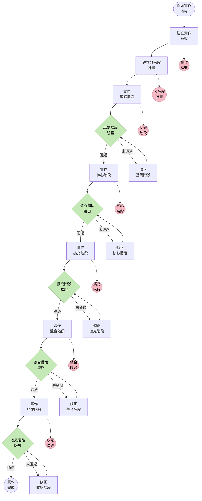
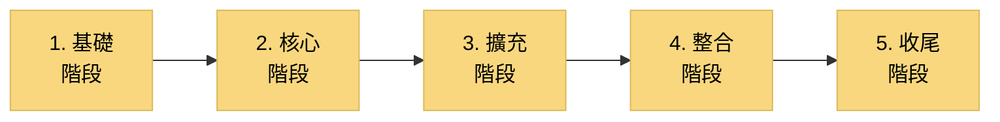
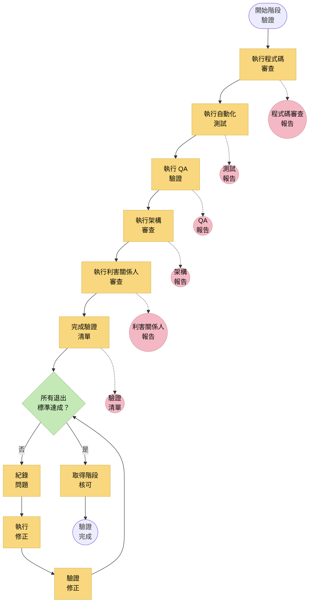
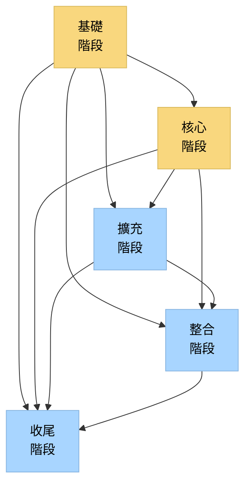
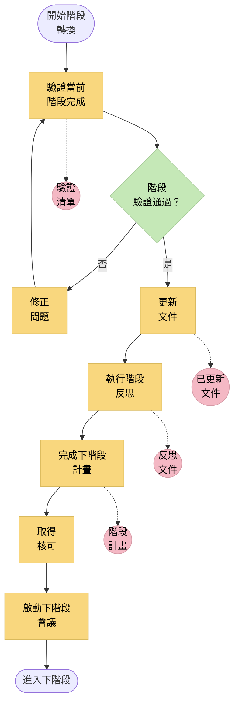
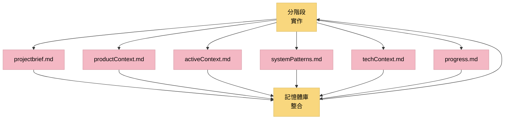

# LEVEL 4 任務分階段實作

> **重點摘要：** 本文件說明 Level 4（複雜系統）任務的結構化分階段實作方法，確保複雜系統能以可控、漸進方式交付，每階段皆有適當驗證。

## 🔍 分階段實作總覽

Level 4 複雜系統任務需以可控、漸進方式實作，以管理複雜度、降低風險並確保品質。本文說明將複雜系統開發劃分為明確、可驗證階段的方法，每階段皆有明確進入與退出標準。



## 📋 分階段實作原則

1. **漸進價值交付**：每階段皆交付可驗證的實質價值。
2. **逐步複雜化**：複雜度隨階段逐步提升。
3. **風險控管**：前期階段優先處理高風險項目，及早發現問題。
4. **驗證關卡**：每階段皆有明確進入與退出標準。
5. **商業對齊**：各階段與商業優先順序及用戶需求對齊。
6. **技術完整性**：每階段皆維持架構與技術完整性。
7. **持續整合**：持續整合與測試各項工作。
8. **知識累積**：每階段皆建立於前一階段的知識基礎上。
9. **明確相依**：各階段間相依關係明確紀錄。
10. **彈性調整**：分階段計畫可因新資訊調整，仍維持結構。

## 📋 標準實作階段

Level 4 複雜系統任務通常採五階段實作：



### 階段 1：基礎階段

基礎階段建立系統所需的基本架構與基礎設施。

**重點活動：**

- 設定開發、測試與部署環境
- 建立核心架構元件與模式
- 實作資料庫結構與基本資料存取
- 建立應用程式骨架
- 實作驗證與授權框架
- 建立日誌、監控與錯誤處理
- 建立基本 CI/CD 流程

**退出標準：**

- 基本架構框架可運作
- 環境設定完成並有文件
- 核心基礎設施元件就緒
- 基本 CI/CD 流程可運作
- 架構審查確認設計一致

### 階段 2：核心階段

核心階段實作最基本、不可或缺的系統功能。

**重點活動：**

- 實作核心商業邏輯
- 開發主要用戶流程與介面
- 建立主要系統服務
- 實作關鍵 API 端點
- 開發基本報表功能
- 建立主要整合點
- 為核心功能建立自動化測試

**退出標準：**

- 核心商業功能已實作
- 主要用戶流程可運作
- 主要 API 可用
- 核心自動化測試通過
- 商業利害關係人驗證核心功能

### 階段 3：擴充階段

擴充階段為核心系統增加額外功能與能力。

**重點活動：**

- 實作次要商業流程
- 增加額外用戶介面與功能
- 根據回饋強化現有功能
- 實作進階功能
- 擴充整合能力
- 強化錯誤處理與邊界情境
- 擴大測試覆蓋率

**退出標準：**

- 所有規劃功能皆已實作
- 擴充功能運作正常
- 次要商業流程可用
- 強化功能已驗證
- 測試覆蓋率達標

### 階段 4：整合階段

整合階段確保所有元件能正確協作，並與外部系統整合。

**重點活動：**

- 深度整合測試
- 實作所有外部系統整合
- 進行端到端測試
- 執行效能與負載測試
- 進行安全性測試
- 實作必要資料遷移
- 驗證系統於各種情境下表現

**退出標準：**

- 所有整合皆運作正常
- 端到端測試通過
- 效能達標
- 安全測試無重大漏洞
- 系統能妥善處理錯誤情境

### 階段 5：收尾階段

收尾階段為系統正式上線做準備。

**重點活動：**

- 效能最佳化
- 執行用戶驗收測試
- 完成所有文件
- 進行最終安全審查
- 建立正式部署計畫
- 準備支援與訓練資料
- 進行最終系統審查

**退出標準：**

- 所有驗收標準皆達成
- 文件完整
- 用戶驗收測試通過
- 正式部署計畫核可
- 支援與維護程序建立

## 📋 階段計畫範本

每個實作階段請依下列範本詳細規劃：

```markdown
## [階段名稱] 實作計畫

### 階段概述

- **目的**：[階段目的簡述]
- **時程**：[起訖日期]
- **相依**：[對其他階段或外部因素的相依]
- **利害關係人**：[本階段關鍵利害關係人]

### 進入標準

- [ ] [標準 1]
- [ ] [標準 2]
- [ ] [標準 3]

### 實作元件

- **元件 1**：[說明]
  - [ ] 任務 1.1：[說明]
  - [ ] 任務 1.2：[說明]
- **元件 2**：[說明]
  - [ ] 任務 2.1：[說明]
  - [ ] 任務 2.2：[說明]

### 技術考量

- [本階段需注意的技術重點]

### 風險評估

- **風險 1**：[說明]
  - 影響：[高/中/低]
  - 因應：[策略]
- **風險 2**：[說明]
  - 影響：[高/中/低]
  - 因應：[策略]

### 品質保證

- [本階段 QA 方法]
- [測試需求]

### 退出標準

- [ ] [標準 1]
- [ ] [標準 2]
- [ ] [標準 3]

### 交付物

- [本階段交付物清單]
```

## 📋 階段驗證

每個階段皆需正式驗證，方可進入下一階段。



### 階段驗證清單範本

```markdown
## 階段驗證清單

### 實作完整性

- [ ] 所有規劃元件皆已實作
- [ ] 所有任務皆標記為完成
- [ ] 程式碼無未完成 TODO
- [ ] 所有文件已更新

### 程式碼品質

- [ ] 程式碼審查已完成
- [ ] 靜態分析無重大問題
- [ ] 程式碼符合標準
- [ ] 技術債已紀錄

### 測試

- [ ] 單元測試完成且通過
- [ ] 整合測試完成且通過
- [ ] 端到端測試完成且通過
- [ ] 效能測試完成（如適用）
- [ ] 安全測試完成（如適用）
- [ ] 測試覆蓋率達標

### 架構

- [ ] 實作符合架構設計
- [ ] 無架構違規
- [ ] 技術模式正確實作
- [ ] 非功能需求達成

### 利害關係人驗證

- [ ] 商業需求達成
- [ ] 完成利害關係人展示
- [ ] 已納入回饋
- [ ] 驗收標準已驗證

### 風險評估

- [ ] 所有已識別風險已處理
- [ ] 無新風險產生
- [ ] 已有已知問題的應變計畫

### 退出標準

- [ ] 所有退出標準達成
- [ ] 例外情形已紀錄並核可
- [ ] 已取得階段簽核
```

## 📋 處理階段相依



### 相依管理策略

1. **垂直切片**：優先實作跨所有階段的完整功能。
2. **Stub 與 Mock**：建立暫時實作以推進相依元件開發。
3. **介面契約**：明確定義元件介面，允許平行開發。
4. **功能開關**：實作功能但暫不啟用，待相依就緒再開啟。
5. **漸進整合**：元件就緒即逐步整合。

### 相依文件格式

```markdown
## 實作相依

### 基礎階段相依

- **外部相依**：
  - 開發環境設定
  - 原始碼管理權限
  - CI/CD 流程權限

### 核心階段相依

- **基礎階段相依**：
  - 驗證框架
  - 資料庫結構
  - 日誌基礎設施
  - 應用骨架
- **外部相依**：
  - 外部系統 API 規格
  - 測試資料

### 擴充階段相依

- **核心階段相依**：
  - 核心商業邏輯
  - 主要用戶介面
  - 主要服務
- **外部相依**：
  - [外部相依清單]

### 整合階段相依

- **核心階段相依**：
  - [核心相依清單]
- **擴充階段相依**：
  - [擴充相依清單]
- **外部相依**：
  - 整合測試環境權限
  - 外部系統測試帳號

### 收尾階段相依

- **所有前階段皆須完成**
- **外部相依**：
  - 用戶驗收測試環境
  - 正式部署核可
```

## 📋 階段轉換流程



### 階段轉換清單

```markdown
## 階段轉換清單

### 當前階段結束

- [ ] 所有退出標準已達成並有文件
- [ ] 所有驗證步驟已完成
- [ ] 所有問題已解決或有紀錄
- [ ] 階段回顧已完成

### 文件更新

- [ ] 技術文件已更新
- [ ] 用戶文件已更新
- [ ] 架構文件已更新
- [ ] 測試文件已更新

### 知識移轉

- [ ] 經驗教訓已紀錄
- [ ] 團隊已分享知識
- [ ] 如需已完成訓練

### 下階段準備

- [ ] 下階段計畫已檢視並更新
- [ ] 資源已到位
- [ ] 相依已確認
- [ ] 進入標準已確認

### 核可

- [ ] 技術負責人核可
- [ ] 商業利害關係人核可
- [ ] 專案管理核可
```

## 📋 tasks.md 分階段實作追蹤

請於 `tasks.md` 追蹤分階段實作進度：

```markdown
## [SYSTEM-ID]: 系統名稱

### 實作階段

#### 1. 基礎階段

- **狀態**：[未開始/進行中/完成]
- **進度**：[0-100%]
- **開始日期**：[日期]
- **目標完成**：[日期]
- **實際完成**：[日期]

**重點元件**:

- [ ] 元件 1：[狀態] - [進度 %]
- [ ] 元件 2：[狀態] - [進度 %]

**驗證狀態**:

- [ ] 程式碼審查：[狀態]
- [ ] 測試：[狀態]
- [ ] 架構審查：[狀態]
- [ ] 利害關係人核可：[狀態]

**問題/阻礙**:

- [如有，請列出]

#### 2. 核心階段

...

#### 3. 擴充階段

...

#### 4. 整合階段

...

#### 5. 收尾階段

...
```

## 📋 記憶體庫整合



### 記憶體庫更新

分階段實作時請更新下列記憶體庫文件：

1. **projectbrief.md**

   - 更新實作方法
   - 紀錄各階段目標
   - 加入階段計畫連結

2. **activeContext.md**

   - 更新目前實作階段
   - 紀錄進行中實作任務
   - 強調當前重點

3. **systemPatterns.md**

   - 紀錄實作時採用的模式
   - 更新實作過程中的架構決策
   - 紀錄模式調整

4. **techContext.md**

   - 更新實作技術
   - 紀錄遇到的技術限制
   - 紀錄技術決策

5. **progress.md**
   - 依階段更新實作進度
   - 紀錄已完成元件
   - 追蹤整體實作狀態

## 📋 實作驗證清單

```
✓ 實作驗證清單

規劃
- 實作框架已建立？ [是/否]
- 分階段計畫已建立？ [是/否]
- 階段相依已紀錄？ [是/否]
- 各階段進入/退出標準已定義？ [是/否]
- 已執行風險評估？ [是/否]

基礎階段
- 環境設定完成？ [是/否]
- 核心架構已實作？ [是/否]
- 基礎設施就緒？ [是/否]
- CI/CD 流程可用？ [是/否]
- 基礎階段驗證完成？ [是/否]

核心階段
- 核心商業邏輯已實作？ [是/否]
- 主要用戶流程可用？ [是/否]
- 主要服務可運作？ [是/否]
- 核心 API 已實作？ [是/否]
- 核心階段驗證完成？ [是/否]

擴充階段
- 次要功能已實作？ [是/否]
- 強化功能可用？ [是/否]
- 額外用戶介面完成？ [是/否]
- 測試覆蓋率已擴大？ [是/否]
- 擴充階段驗證完成？ [是/否]

整合階段
- 所有元件已整合？ [是/否]
- 外部整合可用？ [是/否]
- 端到端測試完成？ [是/否]
- 效能測試已執行？ [是/否]
- 整合階段驗證完成？ [是/否]

收尾階段
- 所有最佳化已完成？ [是/否]
- 用戶驗收測試通過？ [是/否]
- 文件已完成？ [是/否]
- 正式部署計畫就緒？ [是/否]
- 最終系統審查完成？ [是/否]

記憶體庫整合
- 所有記憶體庫文件已更新？ [是/否]
- 實作狀態已反映？ [是/否]
- 技術決策已紀錄？ [是/否]
- 進度追蹤為最新？ [是/否]
```

## 📋 精簡模式實作格式

如需簡化實作追蹤：

```markdown
## [SYSTEM-ID]: 分階段實作

### 階段狀態摘要

- **基礎**：[狀態] - [進度 %]
- **核心**：[狀態] - [進度 %]
- **擴充**：[狀態] - [進度 %]
- **整合**：[狀態] - [進度 %]
- **收尾**：[狀態] - [進度 %]

### 當前階段：[階段名稱]

- **重點元件**：[目前實作重點元件]
- **阻礙**：[如有，請列出]
- **下一步**：[立即後續步驟]

### 驗證狀態

- [驗證步驟與狀態列表]

### 記憶體庫更新

- [需更新的記憶體庫文件列表]
```

## 🚨 實作驗證原則

```
┌─────────────────────────────────────────────────────┐
│ 未通過所有驗證步驟且有文件紀錄，任何階段皆不得視為完成。 │
│ 不得為趕進度犧牲品質或架構完整性。                   │
└─────────────────────────────────────────────────────┘
```
