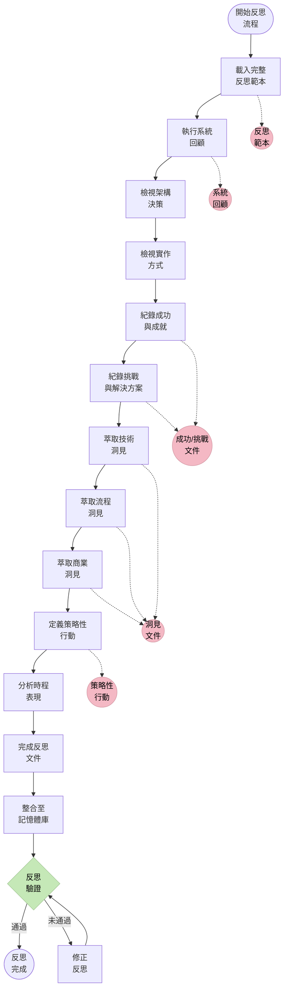
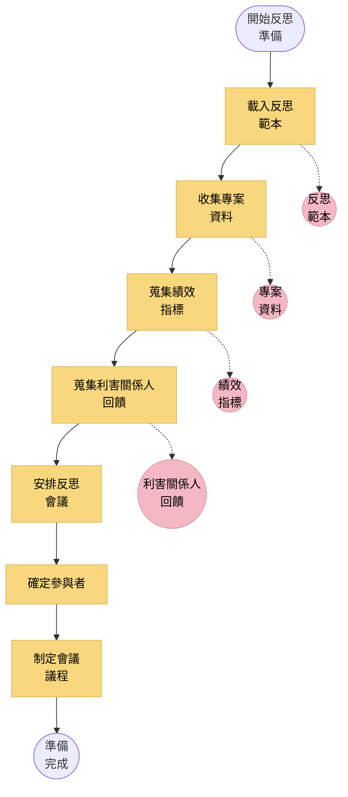
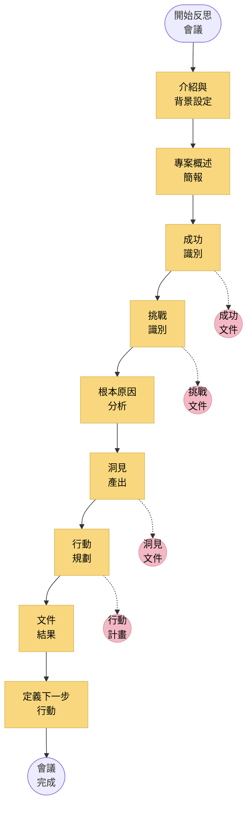
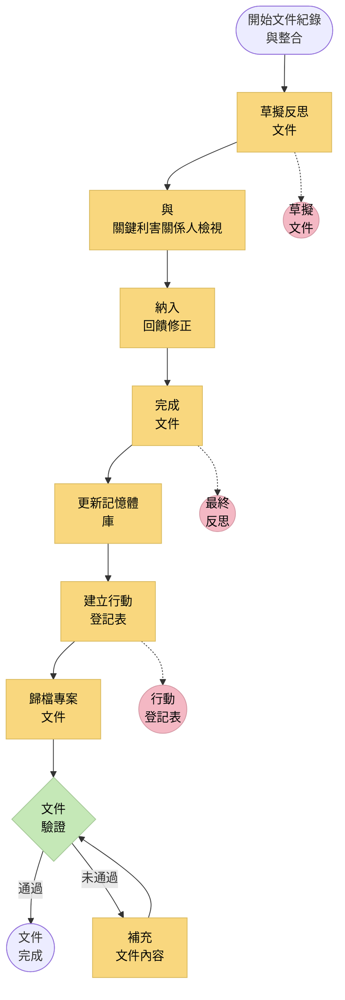
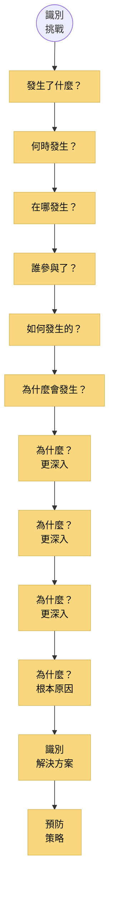
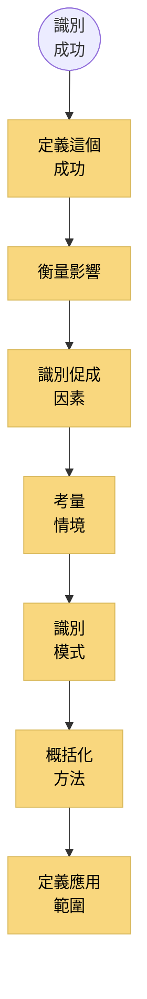
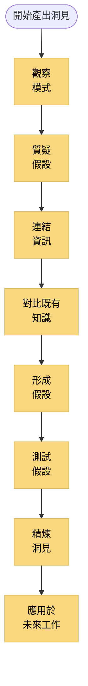
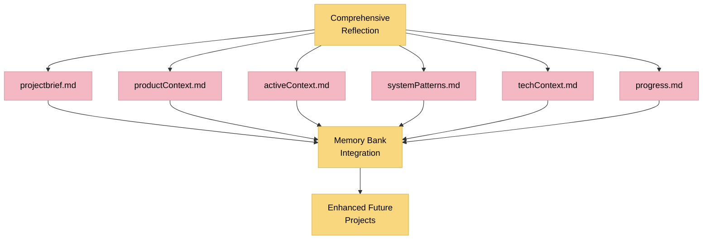

# LEVEL 4 任務完整反思

> **重點摘要：** 本文件說明 Level 4（複雜系統）任務的結構化完整反思方法，涵蓋系統回顧、成功與挑戰分析、策略洞見與行動規劃。

## 🔍 完整反思總覽

Level 4 複雜系統任務需深入反思，以萃取關鍵洞見、紀錄成功與挑戰、提煉策略經驗並指引未來改進。此系統化反思流程確保組織學習與持續精進。



## 📋 反思範本結構

### 1. 系統概述

```markdown
## 系統概述

### 系統說明

[已實作系統的完整說明，包括目的、範圍與主要功能]

### 系統情境

[系統如何融入更廣泛技術與商業生態的說明]

### 主要元件

- 元件 1：[說明與目的]
- 元件 2：[說明與目的]
- 元件 3：[說明與目的]

### 系統架構

[架構方法、關鍵模式與設計決策摘要]

### 系統邊界

[系統邊界、介面與整合點說明]

### 實作摘要

[實作方法、技術與採用方式總覽]
```

### 2. 專案表現分析

```markdown
## 專案表現分析

### 時程表現

- **規劃時長**：[X] 週/月
- **實際時長**：[Y] 週/月
- **差異**：[+/-Z] 週/月 ([P]%)
- **說明**：[時程差異分析]

### 資源利用

- **規劃人力**：[X] 人月
- **實際人力**：[Y] 人月
- **差異**：[+/-Z] 人月 ([P]%)
- **說明**：[資源差異分析]

### 品質指標

- **規劃品質目標**：[品質目標清單]
- **實際品質成果**：[實際品質成果清單]
- **差異分析**：[品質差異分析]

### 風險管理成效

- **已識別風險**：[識別風險數量]
- **實際發生風險**：[發生數量與百分比]
- **因應成效**：[風險因應策略成效]
- **突發風險**：[過程中新出現風險說明]
```

### 3. 成就與成功

```markdown
## 成就與成功

### 主要成就

1. **成就 1**：[說明]

   - **證據**：[具體成功證據]
   - **影響**：[商業/技術影響]
   - **促成因素**：[成功關鍵]

2. **成就 2**：[說明]
   - **證據**：[具體成功證據]
   - **影響**：[商業/技術影響]
   - **促成因素**：[成功關鍵]

### 技術成功

- **成功 1**：[技術成功說明]

  - **採用方法**：[方法說明]
  - **成果**：[達成結果]
  - **可重用性**：[可重用方式]

- **成功 2**：[技術成功說明]
  - **採用方法**：[方法說明]
  - **成果**：[達成結果]
  - **可重用性**：[可重用方式]

### 流程成功

- **成功 1**：[流程成功說明]
  - **採用方法**：[方法說明]
  - **成果**：[達成結果]
  - **可重用性**：[可重用方式]

### 團隊成功

- **成功 1**：[團隊成功說明]
  - **採用方法**：[方法說明]
  - **成果**：[達成結果]
  - **可重用性**：[可重用方式]
```

### 4. 挑戰與解決方案

```markdown
## 挑戰與解決方案

### 主要挑戰

1. **挑戰 1**：[說明]

   - **影響**：[商業/技術影響]
   - **解決方式**：[如何處理]
   - **結果**：[最終結果]
   - **預防措施**：[未來如何預防]

2. **挑戰 2**：[說明]
   - **影響**：[商業/技術影響]
   - **解決方式**：[如何處理]
   - **結果**：[最終結果]
   - **預防措施**：[未來如何預防]

### 技術挑戰

- **挑戰 1**：[技術挑戰說明]

  - **根本原因**：[原因分析]
  - **解決方案**：[如何解決]
  - **替代方案**：[考慮過的其他方式]
  - **經驗教訓**：[重點收穫]

- **挑戰 2**：[技術挑戰說明]
  - **根本原因**：[原因分析]
  - **解決方案**：[如何解決]
  - **替代方案**：[考慮過的其他方式]
  - **經驗教訓**：[重點收穫]

### 流程挑戰

- **挑戰 1**：[流程挑戰說明]
  - **根本原因**：[原因分析]
  - **解決方案**：[如何解決]
  - **流程改進**：[已改進或建議改進]

### 未解決議題

- **議題 1**：[未解決議題說明]
  - **目前狀態**：[狀態]
  - **建議後續**：[建議後續步驟]
  - **所需資源**：[解決所需資源]
```

### 5. 技術洞見

```markdown
## 技術洞見

### 架構洞見

- **洞見 1**：[架構洞見說明]

  - **情境**：[觀察時間/地點]
  - **影響**：[對未來工作的啟示]
  - **建議**：[建議的變更或行動]

- **洞見 2**：[架構洞見說明]
  - **情境**：[觀察時間/地點]
  - **影響**：[對未來工作的啟示]
  - **建議**：[建議的變更或行動]

### 實作洞見

- **洞見 1**：[實作洞見說明]
  - **情境**：[觀察時間/地點]
  - **影響**：[對未來工作的啟示]
  - **建議**：[建議的變更或行動]

### 技術棧洞見

- **洞見 1**：[技術棧洞見說明]
  - **情境**：[觀察時間/地點]
  - **影響**：[對未來工作的啟示]
  - **建議**：[建議的變更或行動]

### 效能洞見

- **洞見 1**：[效能洞見說明]
  - **情境**：[觀察時間/地點]
  - **指標**：[相關效能指標]
  - **影響**：[對未來工作的啟示]
  - **建議**：[建議的優化措施]

### 安全性洞見

- **洞見 1**：[安全性洞見說明]
  - **情境**：[觀察時間/地點]
  - **影響**：[對未來工作的啟示]
  - **建議**：[建議的安全性改進]
```

### 6. 流程洞見

```markdown
## 流程洞見

### 規劃洞見

- **洞見 1**：[規劃流程洞見說明]
  - **情境**：[觀察時間/地點]
  - **影響**：[對未來工作的啟示]
  - **建議**：[建議的流程改進]

### 開發流程洞見

- **洞見 1**：[開發流程洞見說明]
  - **情境**：[觀察時間/地點]
  - **影響**：[對未來工作的啟示]
  - **建議**：[建議的流程改進]

### 測試洞見

- **洞見 1**：[測試流程洞見說明]
  - **情境**：[觀察時間/地點]
  - **影響**：[對未來工作的啟示]
  - **建議**：[建議的流程改進]

### 協作洞見

- **洞見 1**：[協作洞見說明]
  - **情境**：[觀察時間/地點]
  - **影響**：[對未來工作的啟示]
  - **建議**：[建議的協作改進]

### 文件紀錄洞見

- **洞見 1**：[文件紀錄洞見說明]
  - **情境**：[觀察時間/地點]
  - **影響**：[對未來工作的啟示]
  - **建議**：[建議的文件紀錄改進]
```

### 7. 商業洞見

```markdown
## 商業洞見

### 價值交付洞見

- **洞見 1**：[價值交付洞見說明]
  - **情境**：[觀察時間/地點]
  - **商業影響**：[對商業結果的影響]
  - **建議**：[建議的改進措施]

### 利害關係人洞見

- **洞見 1**：[利害關係人洞見說明]
  - **情境**：[觀察時間/地點]
  - **影響**：[對利害關係人管理的啟示]
  - **建議**：[建議的改進措施]

### 市場/用戶洞見

- **洞見 1**：[市場/用戶洞見說明]
  - **情境**：[觀察時間/地點]
  - **影響**：[對產品方向的啟示]
  - **建議**：[建議的改進措施]

### 商業流程洞見

- **洞見 1**：[商業流程洞見說明]
  - **情境**：[觀察時間/地點]
  - **影響**：[對商業流程的啟示]
  - **建議**：[建議的改進措施]
```

### 8. 策略性行動

```markdown
## 策略性行動

### 立即行動

- **行動 1**：[立即行動說明]

  - **負責人**：[負責人姓名]
  - **時程**：[預期完成日期]
  - **成功標準**：[如何衡量成功]
  - **所需資源**：[所需資源]
  - **優先順序**：[高/中/低]

- **行動 2**：[立即行動說明]
  - **負責人**：[負責人姓名]
  - **時程**：[預期完成日期]
  - **成功標準**：[如何衡量成功]
  - **所需資源**：[所需資源]
  - **優先順序**：[高/中/低]

### 短期改進（1-3 個月）

- **改進 1**：[短期改進說明]
  - **負責人**：[負責人姓名]
  - **時程**：[預期完成日期]
  - **成功標準**：[如何衡量成功]
  - **所需資源**：[所需資源]
  - **優先順序**：[高/中/低]

### 中期計畫（3-6 個月）

- **計畫 1**：[中期計畫說明]
  - **負責人**：[負責人姓名]
  - **時程**：[預期完成日期]
  - **成功標準**：[如何衡量成功]
  - **所需資源**：[所需資源]
  - **優先順序**：[高/中/低]

### 長期策略方向（6 個月以上）

- **方向 1**：[長期策略方向說明]
  - **商業對齊**：[如何與商業策略對齊]
  - **預期影響**：[預期結果]
  - **主要里程碑**：[主要檢查點]
  - **成功標準**：[如何衡量成功]
```

### 9. 知識轉移

```markdown
## 知識轉移

### 組織關鍵學習

- **學習 1**：[關鍵學習說明]
  - **情境**：[學習時間/地點]
  - **適用性**：[可應用領域]
  - **建議傳達方式**：[如何分享]

### 技術知識轉移

- **技術知識 1**：[技術知識說明]
  - **對象**：[需要此知識的人]
  - **轉移方式**：[如何轉移]
  - **文件紀錄**：[紀錄位置]

### 流程知識轉移

- **流程知識 1**：[流程知識說明]
  - **對象**：[需要此知識的人]
  - **轉移方式**：[如何轉移]
  - **文件紀錄**：[紀錄位置]

### 文件更新

- **文件 1**：[需更新文件名稱]
  - **更新內容**：[需更新的內容]
  - **負責人**：[負責人姓名]
  - **時程**：[更新完成時間]
```

### 10. 反思總結

```markdown
## 反思總結

### 關鍵收穫

- **收穫 1**：[關鍵收穫說明]
- **收穫 2**：[關鍵收穫說明]
- **收穫 3**：[關鍵收穫說明]

### 成功模式複製

1. [模式 1 說明]
2. [模式 2 說明]
3. [模式 3 說明]

### 未來避免議題

1. [議題 1 說明]
2. [議題 2 說明]
3. [議題 3 說明]

### 整體評估

[對專案成功、挑戰與策略價值的綜合評估]

### 後續步驟

[反思後立即採取的後續步驟說明]
```

## 📋 反思流程

### 1. 準備階段



**主要準備步驟：**

1. 載入完整反思範本
2. 收集專案資料（tasks.md、文件、工件）
3. 蒐集績效指標（時程、資源利用、品質）
4. 蒐集利害關係人回饋（內部與外部）
5. 安排與關鍵參與者的反思會議
6. 準備會議議程與會前資料

### 2. 進行反思會議



**會議格式：**

- **時長**：2-4 小時（可分為多個會議）
- **參與者**：專案團隊、關鍵利害關係人、技術負責人
- **主持**：中立的主持人引導過程
- **文件紀錄**：專人負責紀錄洞見與行動

### 3. 文件紀錄與整合



**文件紀錄主要步驟：**

1. 使用範本草擬完整反思文件
2. 與關鍵利害關係人檢視草擬文件
3. 修正草擬文件並完成最終文件
4. 更新記憶體庫，記錄關鍵洞見與學習
5. 建立行動登記表，追蹤改進行動
6. 歸檔專案文件與反思文件
7. 驗證文件的完整性與品質

## 📋 反思技術

### 根本原因分析



### 成功分析



### 洞見產出



## 📋 記憶體庫整合



### 記憶體庫更新

需對記憶體庫文件進行的具體更新：

1. **projectbrief.md**

   - 更新策略洞見
   - 紀錄關鍵成就
   - 納入經驗教訓

2. **productContext.md**

   - 更新商業洞見
   - 紀錄市場/用戶洞見
   - 包含價值交付洞見

3. **activeContext.md**

   - 更新當前狀態
   - 紀錄行動項目
   - 包含後續步驟

4. **systemPatterns.md**

   - 更新架構洞見
   - 紀錄成功模式
   - 包含技術知識

5. **techContext.md**

   - 更新實作洞見
   - 紀錄技術棧洞見
   - 包含效能與安全性洞見

6. **progress.md**
   - 更新最終狀態
   - 紀錄成就
   - 包含專案指標

## 📋 反思驗證清單

```
✓ 反思驗證清單

系統回顧
- 系統概述完整且準確？ [是/否]
- 專案績效指標已收集並分析？ [是/否]
- 系統邊界與介面已描述？ [是/否]

成功與挑戰分析
- 主要成就已紀錄並附有證據？ [是/否]
- 技術成功已紀錄並附有方法？ [是/否]
- 主要挑戰已紀錄並附有解決方案？ [是/否]
- 技術挑戰已紀錄並附有解決方案？ [是/否]
- 未解決議題已紀錄並附有後續處理建議？ [是/否]

洞見產出
- 技術洞見已萃取並紀錄？ [是/否]
- 流程洞見已萃取並紀錄？ [是/否]
- 商業洞見已萃取並紀錄？ [是/否]

策略規劃
- 立即行動已定義並指定負責人？ [是/否]
- 短期改進已識別？ [是/否]
- 中期計畫已規劃？ [是/否]
- 長期策略方向已勾勒？ [是/否]

知識轉移
- 關鍵學習已紀錄？ [是/否]
- 技術知識轉移已規劃？ [是/否]
- 流程知識轉移已規劃？ [是/否]
- 文件更新已識別？ [是/否]

記憶體庫整合
- projectbrief.md 已更新洞見？ [是/否]
- productContext.md 已更新洞見？ [是/否]
- activeContext.md 已更新洞見？ [是/否]
- systemPatterns.md 已更新洞見？ [是/否]
- techContext.md 已更新洞見？ [是/否]
- progress.md 已更新最終狀態？ [是/否]
```

## 📋 簡化模式反思格式

對於需要更簡潔反思的情況：

```markdown
## Level 4 任務反思： [系統名稱]

### 系統摘要

- **目的**：[系統目的簡要說明]
- **主要元件**：[主要元件列表]
- **架構**：[簡要架構說明]

### 表現摘要

- **時程**：[規劃] vs [實際] ([差異])
- **資源**：[規劃] vs [實際] ([差異])
- **品質**：[品質成果摘要]

### 主要成功

1. [成功 1 及其證據與影響]
2. [成功 2 及其證據與影響]
3. [成功 3 及其證據與影響]

### 主要挑戰

1. [挑戰 1 及其解決方案與教訓]
2. [挑戰 2 及其解決方案與教訓]
3. [挑戰 3 及其解決方案與教訓]

### 關鍵洞見

- **技術**：[關鍵技術洞見及建議]
- **流程**：[關鍵流程洞見及建議]
- **商業**：[關鍵商業洞見及建議]

### 優先行動

1. [立即行動及負責人與時程]
2. [短期改進及負責人與時程]
3. [中期計畫及負責人與時程]

### 記憶體庫更新

- [需進行的記憶體庫具體更新列表]
```

## 🚨 反思強制原則

```
┌─────────────────────────────────────────────────────┐
│ 完整反思是 Level 4 任務的強制要求。未完成反思前， │
│ 專案歸檔程序不得進行。                           │
└─────────────────────────────────────────────────────┘
```
