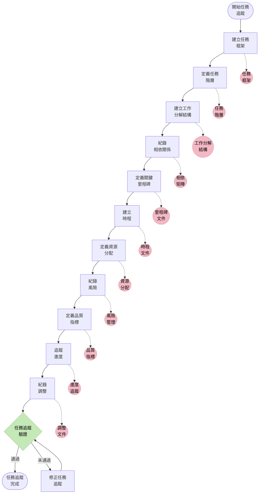
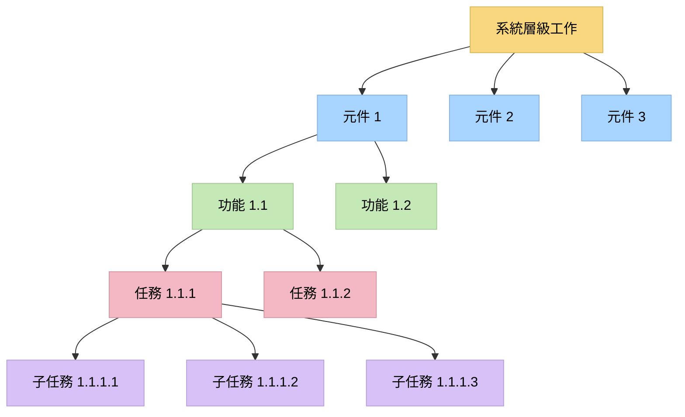
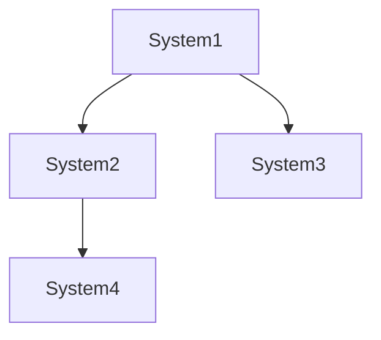
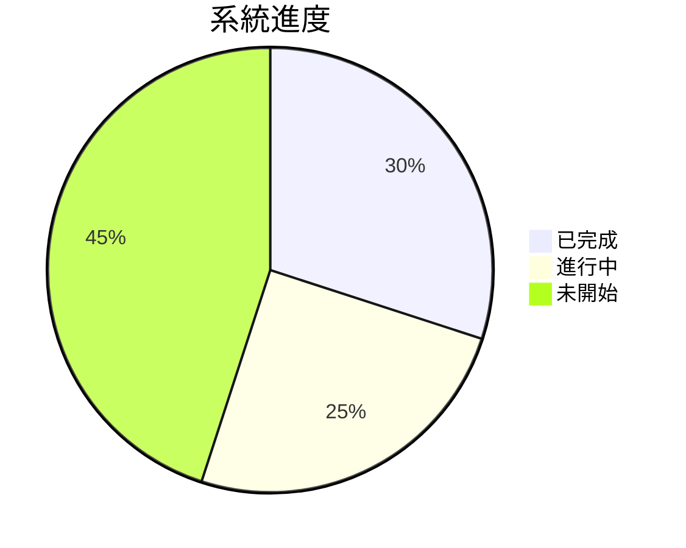
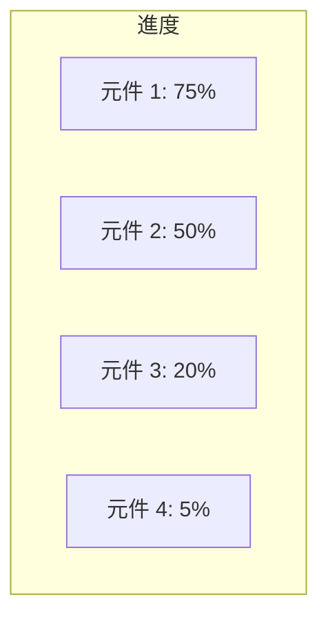
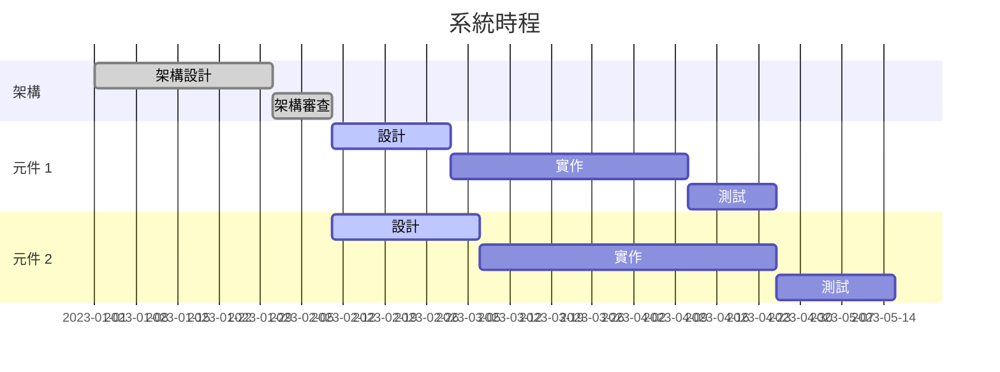

# LEVEL 4 任務進階追蹤

> **重點摘要：** 本文件說明 Level 4（複雜系統）任務的完整任務追蹤方法，確保複雜多階段工作能詳細追蹤，明確管理相依、進度與架構對齊。

## 🔍 進階任務追蹤總覽

Level 4 複雜系統任務需高度進階的任務追蹤，以管理系統開發的複雜度、協調多位團隊成員、追蹤相依關係，並確保與架構原則一致。本文說明此類複雜任務的完整追蹤方法。



## 📋 任務追蹤原則

1. **架構對齊**：所有任務必須符合既定架構原則與模式。
2. **階層組織**：任務以階層結構組織，明確父子關係。
3. **相依管理**：所有任務相依需明確紀錄並追蹤。
4. **進度透明**：任務狀態與進度需清楚紀錄並對所有利害關係人可見。
5. **品質整合**：品質指標與驗證納入任務定義。
6. **資源分配**：任務需明確分配完成所需資源。
7. **風險意識**：重大任務需評估風險並規劃因應。
8. **彈性規劃**：任務追蹤可因應變動調整，並維持系統完整性。
9. **里程碑追蹤**：明確定義里程碑並用以追蹤整體進度。
10. **完整文件**：任務生命週期所有面向皆需完整文件化。

## 📋 任務階層結構

Level 4 任務採用階層式結構：



### 階層說明：

1. **系統層級**：整體建構或修改的系統。
2. **元件層級**：系統中的主要元件或子系統。
3. **功能層級**：各元件內的具體功能。
4. **任務層級**：實作功能所需的具體任務。
5. **子任務層級**：複雜任務的細部子任務。

## 📋 完整任務結構

每個 Level 4 任務於 `tasks.md` 需依下列結構撰寫：

```markdown
## [SYSTEM-ID]: 系統名稱

### 系統概述

- **目的**：[系統目的簡述]
- **架構對齊**：[系統如何符合架構原則]
- **狀態**：[規劃中/進行中/審查中/完成]
- **里程碑**：
  - 里程碑 1: [日期] - [狀態]
  - 里程碑 2: [日期] - [狀態]
  - 里程碑 3: [日期] - [狀態]

### 元件

#### [COMP-ID]: 元件名稱

- **目的**：[元件目的簡述]
- **狀態**：[規劃中/進行中/審查中/完成]
- **相依**：[相依清單]
- **負責人**：[負責團隊或個人]

##### [FEAT-ID]: 功能名稱

- **說明**：[功能說明]
- **狀態**：[規劃中/進行中/審查中/完成]
- **優先順序**：[關鍵/高/中/低]
- **相關需求**：[此功能對應的需求 ID 清單]
- **品質標準**：[可衡量的完成標準]
- **進度**：[0-100%]

###### [TASK-ID]: 任務名稱

- **說明**：[任務說明]
- **狀態**：[TODO/進行中/審查中/完成]
- **指派給**：[負責人]
- **預估工時**：[預估工時]
- **實際工時**：[實際工時]
- **相依**：[此任務依賴的任務]
- **阻擋**：[被此任務阻擋的任務]
- **風險評估**：[風險等級與說明]
- **品質關卡**：[必須通過的品質關卡]
- **實作備註**：[重點實作說明]

**子任務**:

- [ ] [SUB-ID]: [子任務說明] - [狀態]
- [ ] [SUB-ID]: [子任務說明] - [狀態]
- [ ] [SUB-ID]: [子任務說明] - [狀態]

### 系統層級任務

- [ ] [SYS-TASK-ID]: [系統層級任務說明] - [狀態]
- [ ] [SYS-TASK-ID]: [系統層級任務說明] - [狀態]

### 風險與因應

- **風險 1**：[說明] - **因應**：[因應策略]
- **風險 2**：[說明] - **因應**：[因應策略]

### 進度摘要

- **整體進度**：[0-100%]
- **元件 1**：[0-100%]
- **元件 2**：[0-100%]
- **元件 3**：[0-100%]

### 最新更新

- [日期]：[更新說明]
- [日期]：[更新說明]
```

## 📋 TASKS.MD 組織方式

Level 4 複雜系統任務，請依下列方式組織 `tasks.md`：

````markdown
# 任務追蹤

## 進行中系統

- [SYSTEM-ID]: [系統名稱] - [狀態]
- [SYSTEM-ID]: [系統名稱] - [狀態]

## 系統細節

[依上方範本撰寫每個系統的詳細任務結構]

## 已完成系統

- [SYSTEM-ID]: [系統名稱] - 完成 [日期]
- [SYSTEM-ID]: [系統名稱] - 完成 [日期]

## 系統相依關係


````

## 風險登錄

| 風險 ID | 說明   | 機率     | 影響     | 因應   |
| ------- | ------ | -------- | -------- | ------ |
| RISK-01 | [說明] | 高/中/低 | 高/中/低 | [策略] |
| RISK-02 | [說明] | 高/中/低 | 高/中/低 | [策略] |

## 資源分配

| 資源        | 系統        | 分配百分比 | 時間區間 |
| ----------- | ----------- | ---------- | -------- |
| [姓名/團隊] | [SYSTEM-ID] | [%]        | [起-迄]  |
| [姓名/團隊] | [SYSTEM-ID] | [%]        | [起-迄]  |

````

## 📋 相依管理

```mermaid
flowchart TD
    classDef critical fill:#f8707e,stroke:#d85060,color:#000
    classDef high fill:#f9d77e,stroke:#d9b95c,color:#000
    classDef medium fill:#a8d5ff,stroke:#88b5e0,color:#000
    classDef low fill:#c5e8b7,stroke:#a5c897,color:#000

    Task1[任務 1] --> Task2[任務 2]
    Task1 --> Task3[任務 3]
    Task2 --> Task4[任務 4]
    Task3 --> Task4
    Task4 --> Task5[任務 5]
    Task4 --> Task6[任務 6]
    Task5 --> Task7[任務 7]
    Task6 --> Task7

    class Task1,Task4,Task7 critical
    class Task2,Task5 high
    class Task3 medium
    class Task6 low
````

複雜系統請於專區紀錄相依關係：

```markdown
## 相依矩陣

| 任務 ID | 依賴             | 阻擋             | 類型 | 狀態   |
| ------- | ---------------- | ---------------- | ---- | ------ |
| TASK-01 | -                | TASK-02, TASK-03 | 技術 | 已完成 |
| TASK-02 | TASK-01          | TASK-04          | 技術 | 進行中 |
| TASK-03 | TASK-01          | TASK-04          | 資源 | 未開始 |
| TASK-04 | TASK-02, TASK-03 | TASK-05, TASK-06 | 技術 | 未開始 |
```

### 相依類型：

- **技術**：需先完成另一任務才能技術上進行
- **資源**：任務間競爭同一資源
- **資訊**：需取得另一任務產生的資訊
- **架構**：有架構層級相依
- **時序**：必須依特定時序完成

## 📋 里程碑追蹤

Level 4 任務請明確追蹤里程碑：

```markdown
## 系統里程碑

| 里程碑 ID | 說明         | 目標日期 | 實際日期 | 狀態   | 交付物       |
| --------- | ------------ | -------- | -------- | ------ | ------------ |
| MILE-01   | 架構審核通過 | [日期]   | [日期]   | 已完成 | 架構文件     |
| MILE-02   | 元件設計完成 | [日期]   | -        | 進行中 | 設計文件     |
| MILE-03   | 元件 1 實作  | [日期]   | -        | 未開始 | 程式碼、測試 |
| MILE-04   | 整合完成     | [日期]   | -        | 未開始 | 整合系統     |
| MILE-05   | 系統測試完成 | [日期]   | -        | 未開始 | 測試報告     |
| MILE-06   | 部署就緒     | [日期]   | -        | 未開始 | 部署套件     |
```

## 📋 進度視覺化

於 `tasks.md` 中加入進度視覺化：

````markdown
## 進度視覺化

### 系統整體進度


````

### 元件進度



### 時間軸



```

## 📋 任務狀態更新

Level 4 任務狀態更新包含：

1. **進度更新**：更新任務狀態與進度百分比
2. **工時追蹤**：紀錄實際工時與預估比較
3. **風險更新**：更新風險評估與因應
4. **相依狀態**：更新相依任務狀態
5. **里程碑追蹤**：更新里程碑狀態
6. **問題紀錄**：紀錄遇到的問題
7. **調整紀錄**：紀錄對原計畫的調整
8. **品質關卡狀態**：更新品質關卡狀態

狀態更新週期：
- **每日**：更新任務與子任務狀態
- **每週**：更新元件狀態與進度視覺化
- **雙週**：更新系統層級進度與里程碑狀態
- **每月**：完成系統回顧，含風險與調整

## 📋 任務追蹤驗證清單

```

✓ 任務追蹤驗證清單

任務結構

- 系統層級工作正確定義？ [是/否]
- 元件層級任務已識別？ [是/否]
- 功能層級任務已明確？ [是/否]
- 任務層級細節已提供？ [是/否]
- 複雜任務有子任務？ [是/否]

任務資訊

- 所有任務有明確說明？ [是/否]
- 狀態正確反映？ [是/否]
- 指派正確？ [是/否]
- 工時預估已提供？ [是/否]
- 相依已紀錄？ [是/否]

進度追蹤

- 整體進度已計算？ [是/否]
- 元件進度已更新？ [是/否]
- 里程碑狀態已更新？ [是/否]
- 進度視覺化為最新？ [是/否]
- 最新更新已紀錄？ [是/否]

風險管理

- 風險已識別與評估？ [是/否]
- 因應策略已紀錄？ [是/否]
- 風險登錄已更新？ [是/否]
- 對時程影響已評估？ [是/否]
- 應變計畫已紀錄？ [是/否]

資源分配

- 資源已分配至任務？ [是/否]
- 資源衝突已識別？ [是/否]
- 資源分配已最佳化？ [是/否]
- 未來資源需求已預測？ [是/否]
- 資源分配已紀錄？ [是/否]

品質整合

- 任務有品質標準？ [是/否]
- 品質關卡已明確？ [是/否]
- 驗證程序已紀錄？ [是/否]
- 品質指標有追蹤？ [是/否]
- 品質問題已紀錄？ [是/否]

架構對齊

- 任務符合架構？ [是/否]
- 架構相依有追蹤？ [是/否]
- 架構限制已紀錄？ [是/否]
- 架構演進有追蹤？ [是/否]
- 架構決策已紀錄？ [是/否]

````

## 📋 與記憶體庫整合

Level 4 任務追蹤與記憶體庫高度整合：

1. **projectbrief.md**：系統層級任務來自並連結至專案簡述
2. **productContext.md**：任務與商業情境及目標對齊
3. **systemPatterns.md**：任務遵循並實作既定架構模式
4. **techContext.md**：任務與技術棧及限制對齊
5. **activeContext.md**：`tasks.md` 的現況與狀態同步至 active context
6. **progress.md**：`tasks.md` 的系統進度反映於總進度

```mermaid
flowchart TD
    classDef memfile fill:#f4b8c4,stroke:#d498a4,color:#000
    classDef process fill:#f9d77e,stroke:#d9b95c,color:#000

    TaskTracking[進階任務<br>追蹤] --> PB[projectbrief.md]
    TaskTracking --> PC[productContext.md]
    TaskTracking --> AC[activeContext.md]
    TaskTracking --> SP[systemPatterns.md]
    TaskTracking --> TC[techContext.md]
    TaskTracking --> P[progress.md]

    P --> TU[任務<br>更新]
    TU --> TaskTracking

    class PB,PC,AC,SP,TC,P memfile
    class TaskTracking,TU process
````

## 📋 精簡模式任務追蹤

如需簡化追蹤方式，請參考下列格式：

```markdown
## [SYSTEM-ID]: 系統名稱 - [狀態]

### 主要元件：

- [COMP-ID]: [元件名稱] - [狀態] - [進度 %]
- [COMP-ID]: [元件名稱] - [狀態] - [進度 %]

### 進行中任務：

- [ ] [TASK-ID]: [任務說明] - [負責人] - [狀態]
  - 相依： [任務 ID 清單]
  - 風險： [簡要風險說明]
- [ ] [TASK-ID]: [任務說明] - [負責人] - [狀態]

### 里程碑：

- [MILE-ID]: [里程碑說明] - [目標日期] - [狀態]
- [MILE-ID]: [里程碑說明] - [目標日期] - [狀態]

### 關鍵路徑：

- [TASK-ID] → [TASK-ID] → [TASK-ID] → [TASK-ID]
- [TASK-ID] → [TASK-ID] → [TASK-ID]

### 更新：

- [日期]：[簡要更新]
```

## 🚨 任務追蹤唯一性原則

```
┌─────────────────────────────────────────────────────┐
│ tasks.md 是所有任務追蹤的唯一真實來源。              │
│ 所有任務相關決策與狀態更新必須反映於 tasks.md。      │
└─────────────────────────────────────────────────────┘
```
