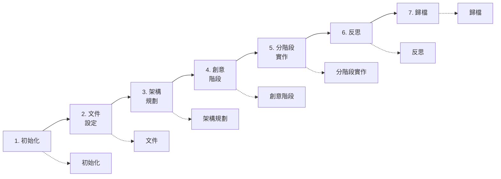
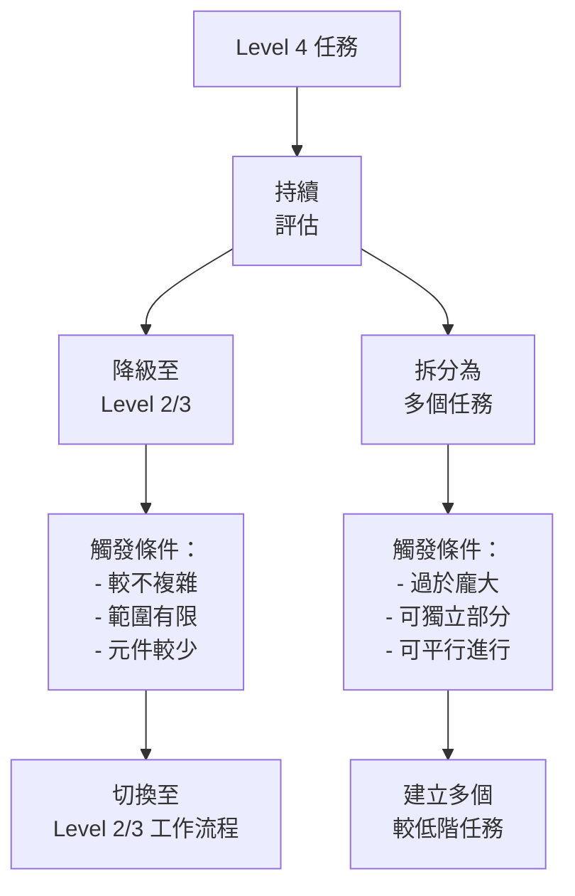
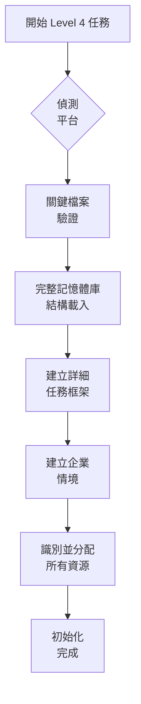
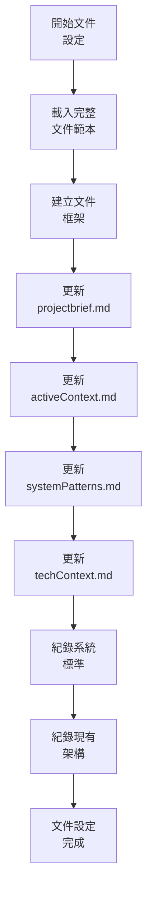
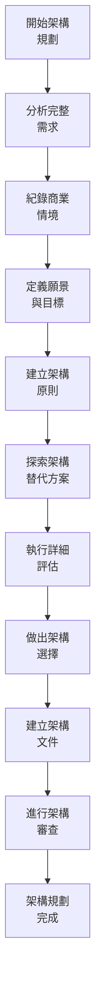
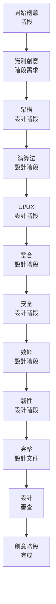
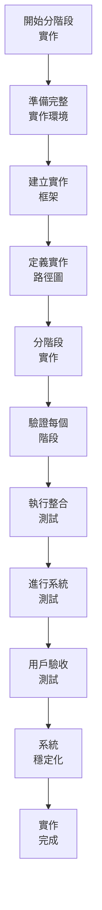
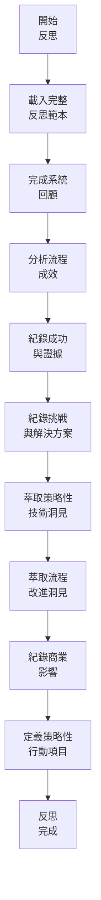
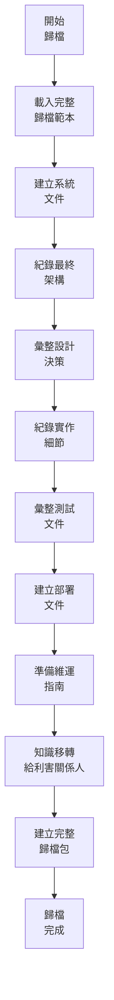
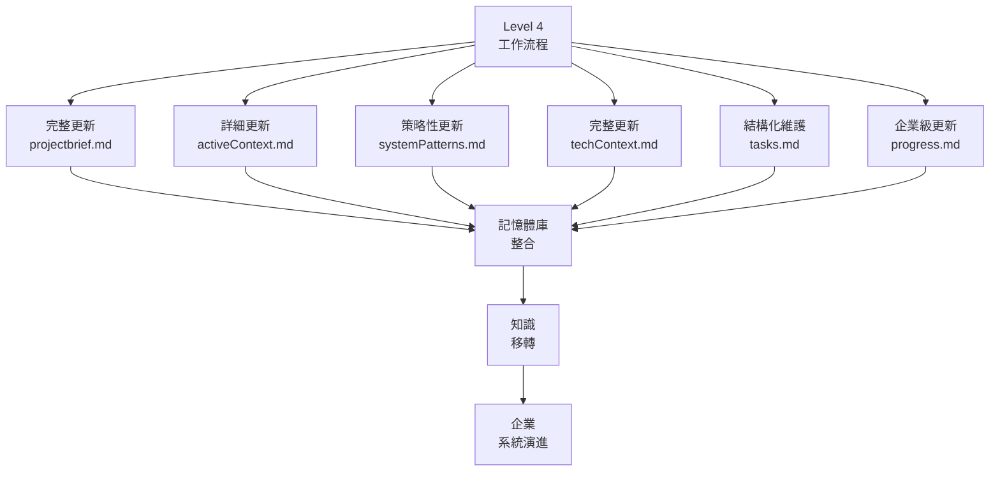

# LEVEL 4 任務綜合工作流程

> **重點摘要：** 本文件說明 Level 4（複雜系統）任務的完整工作流程，涵蓋 7 個關鍵階段，包含嚴謹規劃、必須的創意階段、架構設計、分階段實作，以及完整文件紀錄。

## 🔍 LEVEL 4 工作流程總覽



## 🔄 LEVEL 階段轉換處理



Level 4 任務涉及複雜系統，需完整規劃、嚴謹設計、系統化實作與徹底文件紀錄。本工作流程確保所有面向皆以適當細節、結構與驗證處理。

## 📋 工作流程階段

### 階段 1：初始化



**步驟：**

1. 平台偵測與完整環境設定
2. 關鍵檔案驗證與完整性檢查
3. 載入完整記憶體庫結構並建立參照對應
4. 在 tasks.md 建立詳細任務框架與結構
5. 建立完整企業情境與利害關係人需求
6. 識別並分配所有必要資源（技術、人力、時間）
7. 執行系統就緒性評估

**里程碑檢查點：**

```
✓ 初始化檢查點
- 平台已偵測並完整設定？ [是/否]
- 關鍵檔案已驗證並通過完整性檢查？ [是/否]
- 記憶體庫已完整載入並建立對應？ [是/否]
- 詳細任務框架已建立？ [是/否]
- 企業情境已建立？ [是/否]
- 利害關係人需求已紀錄？ [是/否]
- 所有資源已識別並分配？ [是/否]
- 系統就緒性已評估？ [是/否]

→ 全部為是：進入文件設定
→ 有否：補齊初始化步驟
```

### 階段 2：文件設定



**步驟：**

1. 載入所有面向的完整文件範本
2. 建立完整文件框架與結構
3. 詳細更新 projectbrief.md，說明系統與需求
4. 完整更新 activeContext.md，紀錄現況、相依與利害關係人
5. 完整更新 systemPatterns.md，紀錄架構模式與原則
6. 完整更新 techContext.md，紀錄技術全貌
7. 紀錄系統標準、限制與慣例
8. 紀錄現有架構與整合點

**里程碑檢查點：**

```
✓ 文件檢查點
- 文件範本已載入？ [是/否]
- 文件框架已建立？ [是/否]
- projectbrief.md 已完整更新？ [是/否]
- activeContext.md 已完整更新？ [是/否]
- systemPatterns.md 已完整更新？ [是/否]
- techContext.md 已完整更新？ [是/否]
- 系統標準已紀錄？ [是/否]
- 現有架構已紀錄？ [是/否]

→ 全部為是：進入架構規劃
→ 有否：補齊文件設定
```

### 階段 3：架構規劃



**步驟：**

1. 以可追蹤方式分析完整需求
2. 完整紀錄商業情境與限制
3. 明確定義願景與可衡量目標
4. 建立架構原則與非功能性需求
5. 徹底分析多種架構替代方案
6. 以加權標準執行詳細評估
7. 以完整理由做出架構選擇
8. 建立完整架構文件與圖示
9. 與利害關係人進行正式架構審查

**里程碑檢查點：**

```
✓ 架構規劃檢查點
- 需求已完整分析？ [是/否]
- 商業情境已完整紀錄？ [是/否]
- 願景與目標明確定義？ [是/否]
- 架構原則已建立？ [是/否]
- 替代方案已徹底探索？ [是/否]
- 詳細評估已執行？ [是/否]
- 架構選擇有完整理由？ [是/否]
- 架構文件已完成？ [是/否]
- 架構審查已執行？ [是/否]

→ 全部為是：進入創意階段
→ 有否：補齊架構規劃
```

### 階段 4：創意階段



**步驟：**

1. 根據系統需求識別所有必須的創意階段
2. 執行完整架構設計，應用模式與原則
3. 為所有複雜流程進行徹底演算法設計
4. 以用戶研究與測試進行詳細 UI/UX 設計
5. 為所有系統介面建立整合設計
6. 以威脅建模發展安全設計
7. 以容量規劃設計效能
8. 以失效模式與復原規劃韌性
9. 為所有面向建立完整設計文件
10. 與利害關係人進行正式設計審查

**里程碑檢查點：**

```
✓ 創意階段檢查點
- 所有必須創意階段已識別？ [是/否]
- 架構設計已完成並應用模式？ [是/否]
- 複雜流程已進行演算法設計？ [是/否]
- UI/UX 設計已進行並有用戶研究？ [是/否]
- 介面整合設計已建立？ [是/否]
- 安全設計已發展並有威脅建模？ [是/否]
- 效能設計已完成並有容量規劃？ [是/否]
- 韌性設計已規劃並有失效模式？ [是/否]
- 完整設計文件已建立？ [是/否]
- 正式設計審查已執行？ [是/否]

→ 全部為是：進入分階段實作
→ 有否：補齊創意階段
```

### 階段 5：分階段實作



**步驟：**

1. 準備完整實作環境與所有工具
2. 建立實作框架，明訂標準與流程
3. 定義詳細實作路徑圖，含階段與相依
4. 依階段順序實作並驗證里程碑
5. 依需求與設計驗證每階段
6. 跨階段執行完整整合測試
7. 進行完整系統測試
8. 與利害關係人執行正式用戶驗收測試
9. 執行系統穩定化與效能調校
10. 紀錄所有實作細節與部署程序

**里程碑檢查點：**

```
✓ 分階段實作檢查點
- 實作環境已完整準備？ [是/否]
- 實作框架已建立？ [是/否]
- 詳細路徑圖已定義？ [是/否]
- 所有階段已依序實作？ [是/否]
- 每階段已依需求驗證？ [是/否]
- 完整整合測試已執行？ [是/否]
- 完整系統測試已進行？ [是/否]
- 用戶驗收測試已執行？ [是/否]
- 系統穩定化已完成？ [是/否]
- 實作細節已紀錄？ [是/否]

→ 全部為是：進入反思
→ 有否：補齊實作步驟
```

### 階段 6：反思



**步驟：**

1. 載入完整反思範本，涵蓋所有區塊
2. 依原始目標進行完整系統回顧
3. 以指標分析流程成效
4. 以具體證據紀錄成功與影響
5. 紀錄挑戰、解決方案與經驗
6. 萃取策略性技術洞見，供企業知識庫
7. 萃取流程改進洞見，供未來專案
8. 紀錄商業影響與價值
9. 定義策略性行動項目並排序
10. 建立完整反思文件

**里程碑檢查點：**

```
✓ 反思檢查點
- 完整反思範本已載入？ [是/否]
- 完整系統回顧已執行？ [是/否]
- 流程成效已分析？ [是/否]
- 成功已以證據紀錄？ [是/否]
- 挑戰已以解決方案紀錄？ [是/否]
- 策略性技術洞見已萃取？ [是/否]
- 流程改進洞見已萃取？ [是/否]
- 商業影響已紀錄？ [是/否]
- 策略性行動項目已定義？ [是/否]
- 完整反思文件已建立？ [是/否]

→ 全部為是：進入歸檔
→ 有否：補齊反思步驟
```

### 階段 7：歸檔



**步驟：**

1. 載入完整歸檔範本，涵蓋所有區塊
2. 建立完整系統文件，涵蓋所有面向
3. 以圖示與理由紀錄最終架構
4. 彙整所有設計決策與理由
5. 以技術細節紀錄所有實作內容
6. 彙整完整測試文件與結果
7. 建立詳細部署文件與程序
8. 準備維運指南與操作程序
9. 以訓練方式將知識移轉給利害關係人
10. 建立完整歸檔包，包含所有產出物

**里程碑檢查點：**

```
✓ 歸檔檢查點
- 完整歸檔範本已載入？ [是/否]
- 完整系統文件已建立？ [是/否]
- 最終架構已紀錄？ [是/否]
- 設計決策已彙整？ [是/否]
- 實作細節已紀錄？ [是/否]
- 測試文件已彙整？ [是/否]
- 部署文件已建立？ [是/否]
- 維運指南已準備？ [是/否]
- 知識已移轉給利害關係人？ [是/否]
- 完整歸檔包已建立？ [是/否]

→ 全部為是：任務完成
→ 有否：補齊歸檔步驟
```

## 📋 工作流程驗證清單

```
✓ 最終工作流程驗證
- 七大階段皆已完成？ [是/否]
- 所有里程碑檢查點皆通過？ [是/否]
- 架構規劃正確執行？ [是/否]
- 所有必須創意階段皆完成？ [是/否]
- 實作依正確階段進行？ [是/否]
- 完整反思已執行？ [是/否]
- 完整系統文件已歸檔？ [是/否]
- 記憶體庫已完整更新？ [是/否]
- 知識已成功移轉？ [是/否]

→ 全部為是：Level 4 任務成功完成
→ 有否：補齊未完成項目
```

## 📋 精簡模式工作流程

精簡模式下，請採用以下簡化流程，保留關鍵要素：

```
1. 初始化：驗證環境、建立結構化任務框架、建立情境
2. 文件：更新所有記憶體庫文件，紀錄標準與架構
3. 規劃：定義架構，含原則、替代方案、評估、選擇
4. 創意：執行所有必須創意階段並紀錄
5. 實作：分階段實作，含驗證、整合、測試
6. 反思：紀錄成功、挑戰、洞見與策略行動
7. 歸檔：建立完整文件並知識移轉
```

## 🔄 與記憶體庫整合

本工作流程與記憶體庫完整整合：



## 🚨 LEVEL 4 治理原則

請記住：

```
┌─────────────────────────────────────────────────────┐
│ Level 4 任務代表企業關鍵工作。                      │
│ 各階段必須嚴格治理、完整文件紀錄與徹底驗證。        │
│ 絕無例外。                                          │
└─────────────────────────────────────────────────────┘
```

這確保複雜系統能以最高標準設計、實作與文件化，達到企業級品質與治理。
