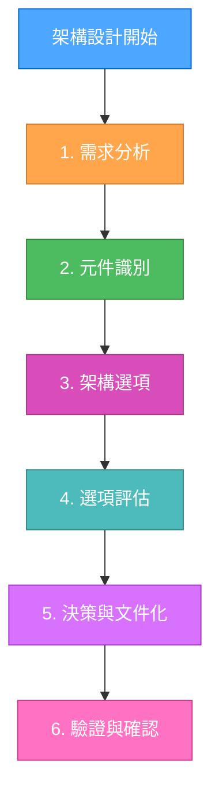
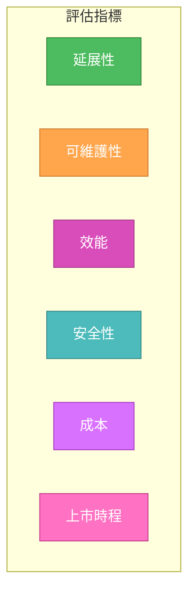
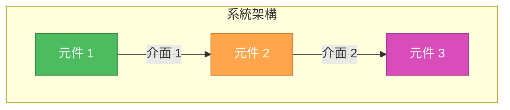
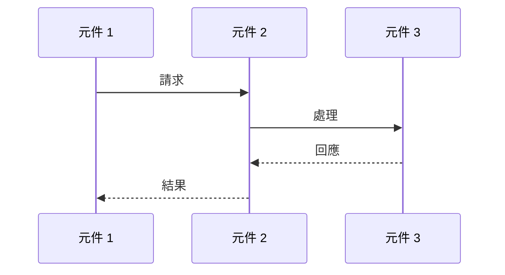
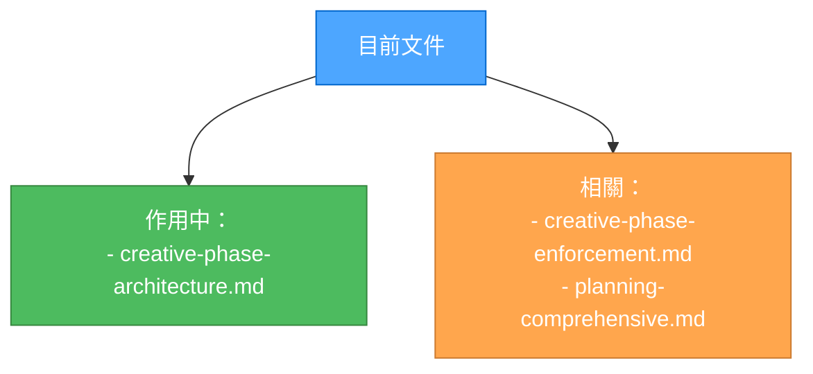

# 創意階段：架構設計

> **重點摘要：** 本文件為創意階段中的架構設計決策提供結構化指引，確保對各種選項進行全面評估，並清楚記錄架構選擇。

## 🏗️ 架構設計工作流程



## 📋 架構決策範本

```markdown
# 架構決策紀錄

## 背景

- 系統需求：
  - [需求 1]
  - [需求 2]
- 技術限制：
  - [限制 1]
  - [限制 2]

## 元件分析

- 核心元件：
  - [元件 1]： [用途/角色]
  - [元件 2]： [用途/角色]
- 互動關係：
  - [互動 1]
  - [互動 2]

## 架構選項

### 選項 1：[名稱]

- 說明：[簡要說明]
- 優點：
  - [優點 1]
  - [優點 2]
- 缺點：
  - [缺點 1]
  - [缺點 2]
- 技術適配度：[高/中/低]
- 複雜度：[高/中/低]
- 延展性：[高/中/低]

### 選項 2：[名稱]

[與選項 1 相同結構]

## 決策

- 選擇方案：[選項名稱]
- 理由：[說明]
- 實作考量：
  - [考量 1]
  - [考量 2]

## 驗證

- 滿足需求：
  - [✓] 需求 1
  - [✓] 需求 2
- 技術可行性：[評估]
- 風險評估：[說明]
```

## 🎯 架構評估指標



## 📊 架構視覺化範本

### 元件圖範本



### 資料流範本



## ✅ 驗證清單

```markdown
## 架構設計驗證

- [ ] 所有系統需求皆已覆蓋
- [ ] 元件職責明確
- [ ] 介面已明確定義
- [ ] 資料流已記錄
- [ ] 已考慮安全性
- [ ] 滿足延展性需求
- [ ] 滿足效能需求
- [ ] 維護方式已定義

## 實作準備度

- [ ] 所有元件已識別
- [ ] 相依關係已繪製
- [ ] 技術限制已記錄
- [ ] 風險評估已完成
- [ ] 資源需求已定義
- [ ] 時程預估已提供
```

## 🔄 架構審查流程


## 🔄 文件管理


