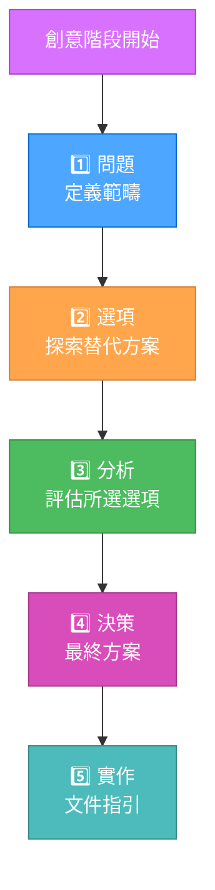

# 最佳化創意階段範本

> **重點摘要：** 本範本於創意階段實施漸進式文件化方法，優化 token 使用，同時維持完整設計探索。

## 📝 漸進式文件化模型



## 📋 範本結構

```markdown
📌 創意階段開始：[元件名稱]
━━━━━━━━━━━━━━━━━━━━━━━━━━━━━━━

1️⃣ 問題
說明：[簡要問題描述]
需求：[重點需求條列]
限制：[技術或商業限制]

2️⃣ 選項
選項 A：[名稱] - [一句話描述]
選項 B：[名稱] - [一句話描述]
選項 C：[名稱] - [一句話描述]

3️⃣ 分析
| 指標 | 選項 A | 選項 B | 選項 C |
|------|--------|--------|--------|
| 效能 | ⭐⭐⭐ | ⭐⭐ | ⭐⭐⭐⭐ |
| 複雜度 | ⭐⭐ | ⭐⭐⭐ | ⭐⭐⭐⭐ |
| 可維護性 | ⭐⭐⭐⭐ | ⭐⭐⭐ | ⭐⭐ |

主要洞見：

- [洞見 1]
- [洞見 2]

4️⃣ 決策
選擇：[選項 X]
理由：[簡要說明]

5️⃣ 實作備註

- [實作備註 1]
- [實作備註 2]
- [實作備註 3]

━━━━━━━━━━━━━━━━━━━━━━━━━━━━━━━
📌 創意階段結束
```

## 🧩 詳細選項分析（按需提供）

可針對特定選項按需提供詳細分析：

```markdown
<details>
  <summary>詳細分析：選項 A</summary>
  
  ### 選項 A：[完整名稱]
  
  **完整說明**：
  [詳細描述該選項運作方式]
  
  **優點**：
  - [優點 1 與說明]
  - [優點 2 與說明]
  - [優點 3 與說明]
  
  **缺點**：
  - [缺點 1 與說明]
  - [缺點 2 與說明]
  
  **實作複雜度**：[低/中/高]
  [複雜度說明]
  
  **資源需求**：
  [資源需求細節]
  
  **風險評估**：
  [風險分析]
</details>
```

## 📊 複雜度自動調整

本範本會依任務複雜度自動調整文件需求：

### 等級 1-2（快速修正/增強）

- 簡化問題/解決方案
- 著重實作
- 選項探索最少

### 等級 3（功能開發）

- 需多個選項
- 關鍵指標分析表
- 實作指引

### 等級 4（企業級開發）

- 全面性分析
- 多元觀點納入
- 詳細實作計畫
- 擴充驗證標準

## ✅ 驗證規範

品質驗證濃縮為簡易清單：

```markdown
驗證：
[x] 問題明確定義
[x] 多個選項考量
[x] 已做決策並說明理由
[x] 已提供實作指引
```

## 🔄 使用範例

### 架構決策（等級 3）

```markdown
📌 創意階段開始：認證系統
━━━━━━━━━━━━━━━━━━━━━━━━━━━━━━━

1️⃣ 問題
說明：設計應用程式的認證系統
需求：安全、可延展、支援 SSO、易於維護
限制：需與現有用戶資料庫整合，回應時間 <100ms

2️⃣ 選項
選項 A：JWT 無狀態認證 - 簡單的 token 驗證方式
選項 B：Redis 伺服器端 Session - 伺服器端會話儲存
選項 C：OAuth2 實作 - 委託授權框架

3️⃣ 分析
| 指標 | JWT | Sessions | OAuth2 |
|------|-----|----------|--------|
| 安全性 | ⭐⭐⭐ | ⭐⭐⭐⭐ | ⭐⭐⭐⭐⭐ |
| 延展性 | ⭐⭐⭐⭐⭐ | ⭐⭐⭐ | ⭐⭐⭐⭐ |
| 複雜度 | ⭐⭐ | ⭐⭐⭐ | ⭐⭐⭐⭐ |
| 效能 | ⭐⭐⭐⭐⭐ | ⭐⭐⭐ | ⭐⭐⭐ |

主要洞見：

- JWT 效能最佳但撤銷不易
- Sessions 安全控管佳但需額外基礎設施
- OAuth2 最複雜但整合彈性最高

4️⃣ 決策
選擇：選項 A：JWT + refresh token
理由：效能與延展性最佳，亦能滿足安全需求

5️⃣ 實作備註

- 採用 HS256 演算法簽章
- access token 設 15 分鐘、refresh token 設 7 天
- Redis 儲存黑名單以支援撤銷
- token 端點加上速率限制

━━━━━━━━━━━━━━━━━━━━━━━━━━━━━━━
📌 創意階段結束
```

### 演算法決策（等級 2）

```markdown
📌 創意階段開始：搜尋演算法
━━━━━━━━━━━━━━━━━━━━━━━━━━━━━━━

1️⃣ 問題
說明：實作高效產品目錄文字搜尋
需求：快速、支援部分比對、不分大小寫
限制：資料量 < 10,000 筆，需可於瀏覽器執行

2️⃣ 選項
選項 A：正則表達式搜尋 - 基本模式比對
選項 B：Trie 樹搜尋 - 前綴樹結構
選項 C：Levenshtein 模糊搜尋 - 編輯距離演算法

3️⃣ 決策
選擇：選項 B：Trie 樹搜尋
理由：前綴搜尋效能最佳且記憶體可控

4️⃣ 實作備註

- 採用現有 trie 函式庫
- 索引時轉小寫
- 即時逐字搜尋
- 加入 300ms debounce 防止過度重建

━━━━━━━━━━━━━━━━━━━━━━━━━━━━━━━
📌 創意階段結束
```

## 🏆 Token 效率優勢

本範本大幅降低 token 使用量，具體做法如下：

1. 聚焦必要資訊，避免冗長描述
2. 採用精簡表格格式進行比較
3. 以漸進式展開方式提供細節
4. 依任務複雜度自動調整文件需求
5. 以視覺符號（emoji）提升掃讀效率

本範本在維持創意流程嚴謹度的同時，token 效率較舊格式提升約 60%。
