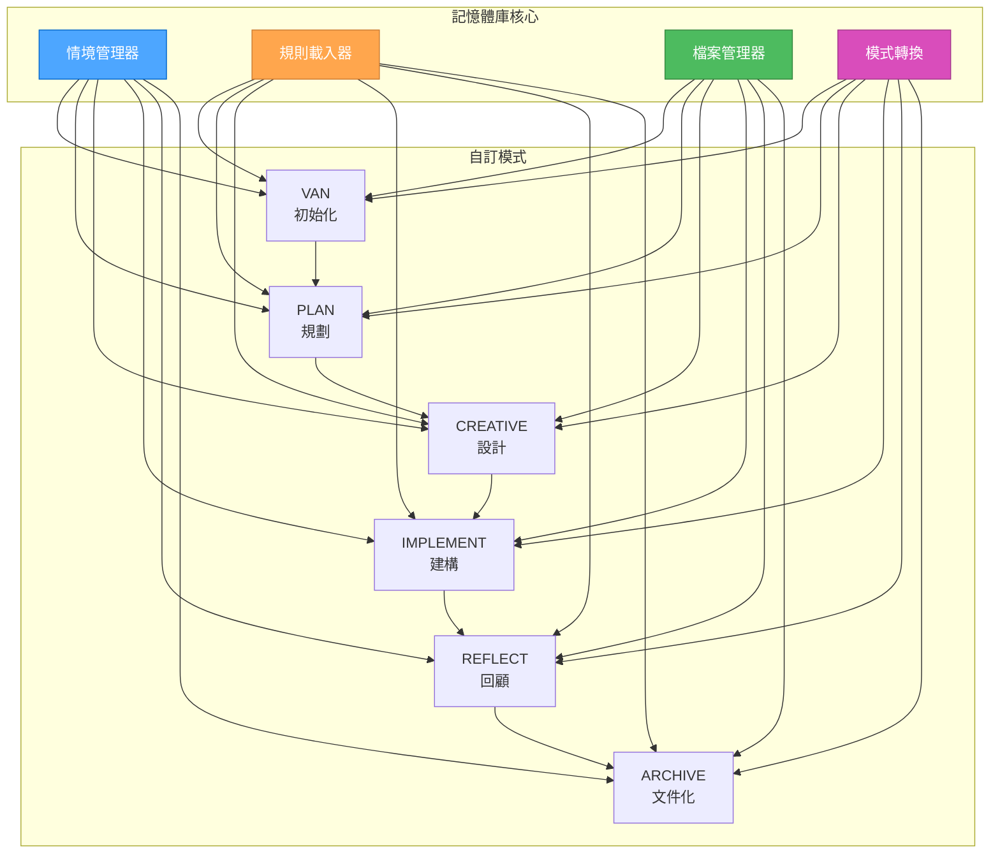
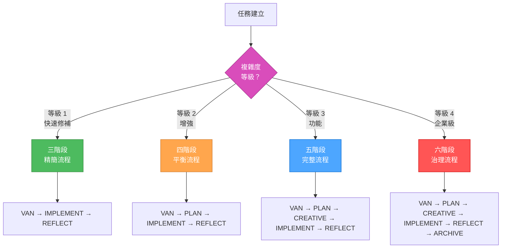
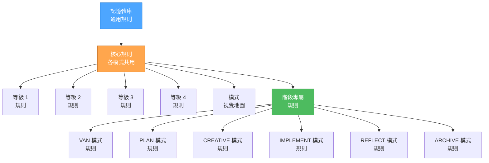
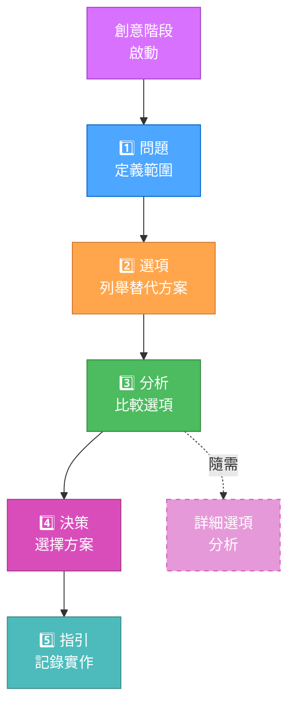
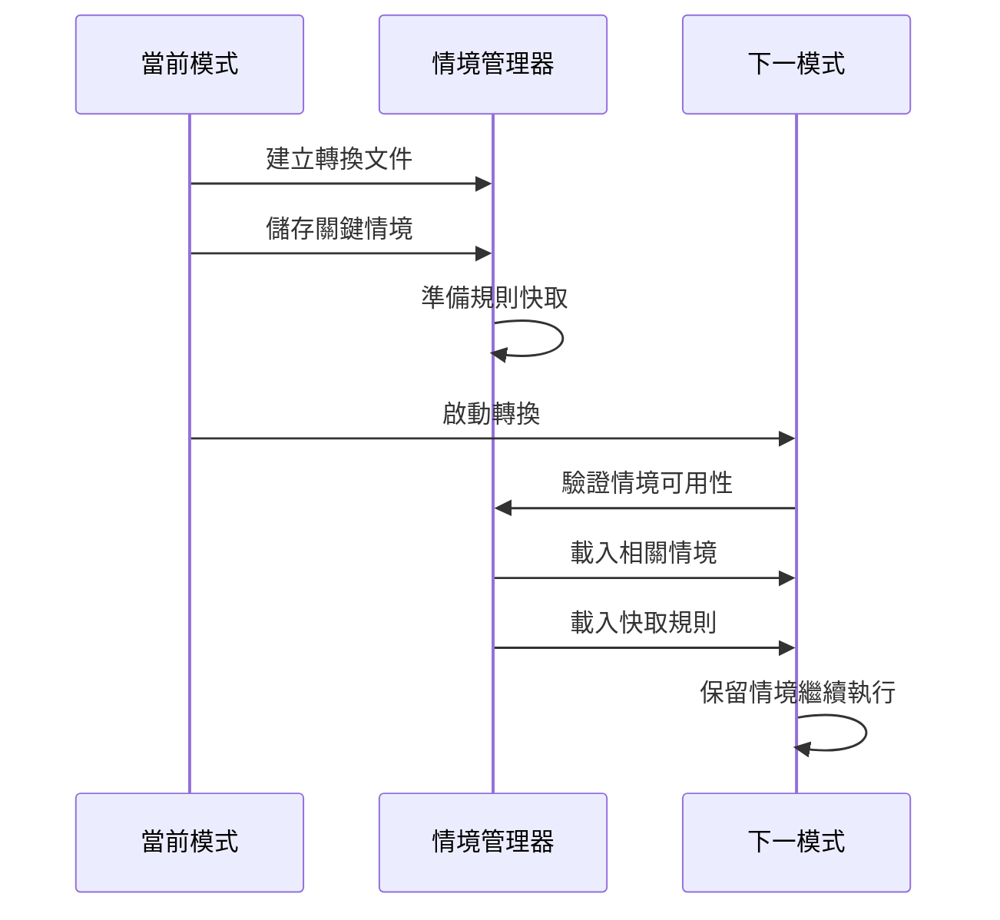
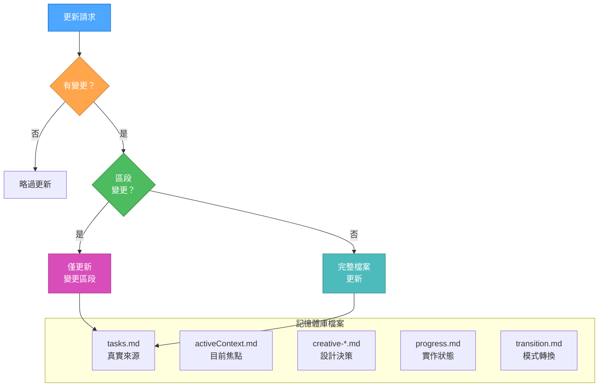

# 🔍 最佳化記憶體庫系統

🚨 關鍵規則：必須建立記憶體庫 🚨
記憶體庫必須在任何模式下的任何操作前建立
未驗證記憶體庫存在時，任何流程皆不得繼續

> **重點摘要：** 本系統採用最佳化情境管理與自適應規則載入，於最大化位元組效率同時保留結構化開發流程。

## 🧭 最佳化模式架構



## 📈 自適應複雜度模型



## 🧠 階層式規則載入

規則以階層式載入以最佳化情境使用：



## 🔄 位元組最佳化創意階段

創意階段文件以漸進方式產生：



## 🔀 最佳化模式轉換

模式轉換採用統一情境轉移協定：



## 📊 記憶體庫高效更新



## 💻 依複雜度調整文件

文件需求依複雜度等級調整：

| 文件內容 | 等級 1 | 等級 2 | 等級 3 | 等級 4 |
| -------- | ------ | ------ | ------ | ------ |
| 問題定義 | 簡要   | 標準   | 詳細   | 全面   |
| 選項分析 | 可選   | 基本   | 多選項 | 詳盡   |
| 實作計畫 | 簡單   | 標準   | 詳細   | 分階段 |
| 測試需求 | 基本   | 標準   | 完整   | 嚴謹   |
| 文件化   | 最少   | 標準   | 詳細   | 全面   |

## 📑 各等級最佳化範本

### 等級 1：快速修補範本

```markdown
## 快速修補：[問題名稱]

- 問題： [簡要描述]
- 解決方案： [實作方式]
- 驗證： [如何測試修補]
```

### 等級 2：增強範本

```markdown
## 增強：[功能名稱]

- 需求： [需完成事項]
- 方法： [實作方式]
- 測試： [驗證方式]
- 文件化： [文件位置]
```

### 等級 3-4：完整範本

採用最佳化創意階段範本，並依複雜度調整文件深度

## 🔄 參考地圖

各模式視覺流程圖皆已最佳化位元組效率：

- @VAN 模式地圖（最佳化）
- @PLAN 模式地圖（最佳化）
- @CREATIVE 模式地圖（最佳化）
- @IMPLEMENT 模式地圖（最佳化）
- @REFLECT 模式地圖（最佳化）
- @ARCHIVE 模式地圖（最佳化）

## ⚡ 位元組效率提升

本版本最佳化重點：

1. 階層式規則載入（減少 65% 位元組）
2. 創意階段漸進式文件（減少 60% 位元組）
3. 模式轉換時情境保留（減少 40% 位元組）
4. 記憶體庫差異化更新（減少 30% 位元組）
5. 依複雜度調整範本（依等級變動）

## 💡 使用指引

使用最佳化系統請依下列步驟：

1. 以 VAN 指令初始化並判斷複雜度
2. 依複雜度流程執行
3. 依任務複雜度採用漸進式文件
4. 讓系統自動管理規則載入與情境保留
5. 享受最佳化位元組效率並維持結構化開發
