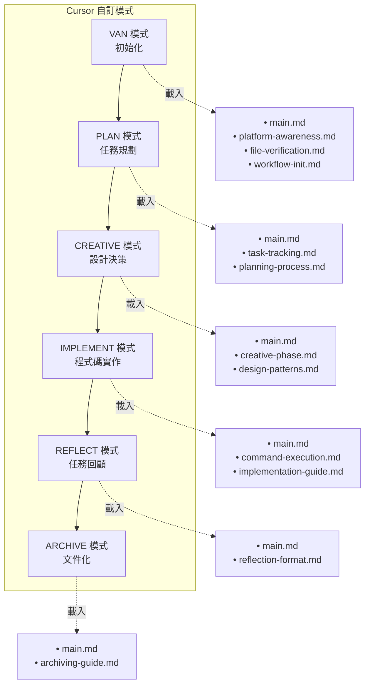
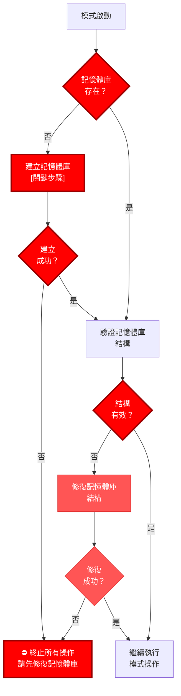
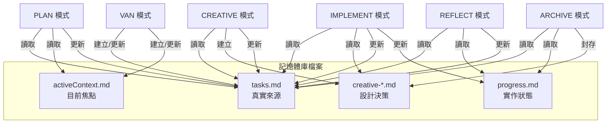
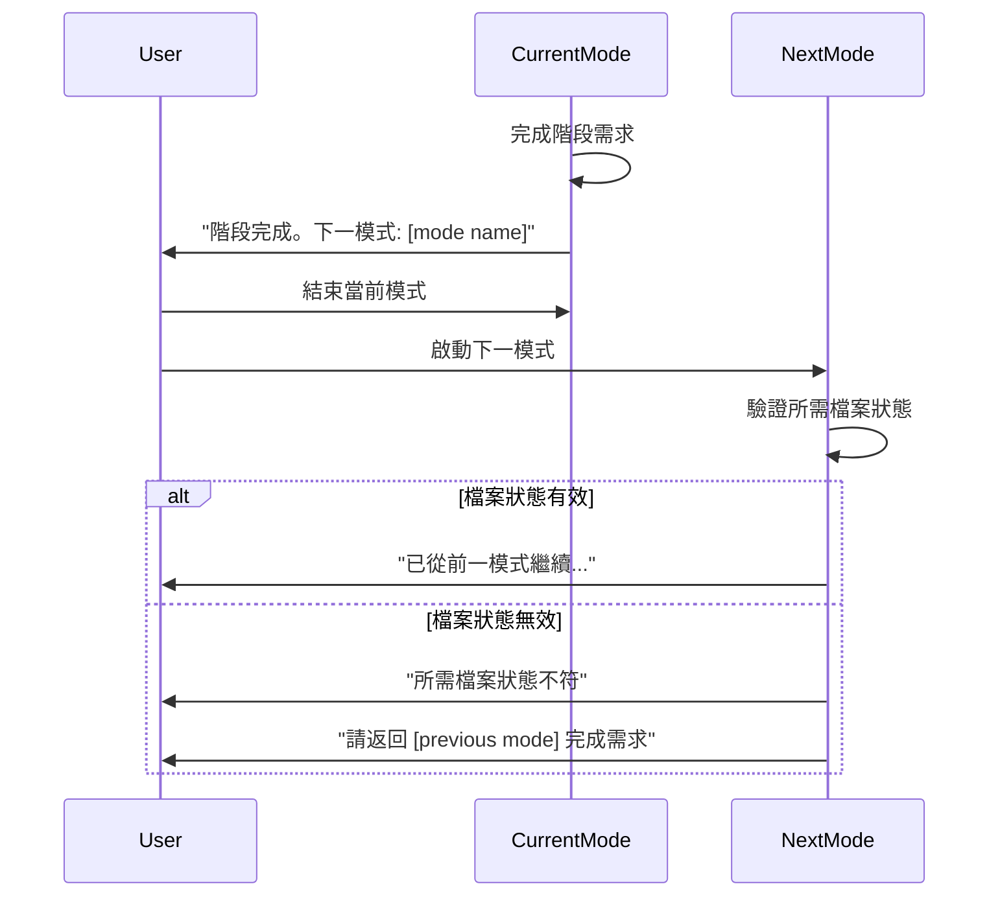

# 🔍 隔離導向記憶體庫系統

🚨 關鍵規則：必須建立記憶體庫 🚨
記憶體庫必須在任何模式下的任何操作前建立
未驗證記憶體庫存在時，任何流程皆不得繼續

> **重點摘要：** 本系統設計用於 Cursor 自訂模式，每個模式僅載入所需規則。系統利用 Mermaid 視覺圖與選擇性文件載入，最佳化情境使用。

## 🧭 模式專屬視覺地圖



## 📋 記憶體庫驗證－所有模式皆強制



## 📚 視覺流程圖

每個模式皆有專屬視覺流程圖：

- @VAN 模式地圖
- @PLAN 模式地圖
- @CREATIVE 模式地圖
- @IMPLEMENT 模式地圖
- @REFLECT 模式地圖
- @ARCHIVE 模式地圖

## 🔄 檔案狀態驗證

在此隔離導向架構下，記憶體庫檔案於各模式間維持連續性：



## 📋 模式轉換協定



## 💻 平台專屬指令

| 動作         | Windows            | Mac/Linux            |
| ------------ | ------------------ | -------------------- |
| 建立檔案     | `echo. > file.ext` | `touch file.ext`     |
| 建立目錄     | `mkdir directory`  | `mkdir -p directory` |
| 切換目錄     | `cd directory`     | `cd directory`       |
| 列出檔案     | `dir`              | `ls`                 |
| 顯示檔案內容 | `type file.ext`    | `cat file.ext`       |

## ⚠️ 指令效率指引

為獲得最佳效能，請於適當時機使用高效指令串接：

```
# 高效指令串接範例：
mkdir -p project/{src,tests,docs} && cd project
grep "TODO" $(find . -name "*.js")
npm install && npm start
```

詳細指引請參閱 [command-execution.md](mdc:.cursor/rules/isolation_rules/Core/command-execution.md)。
