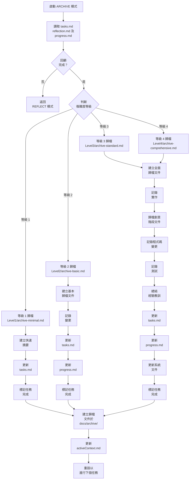
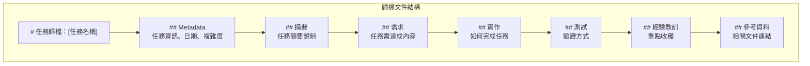
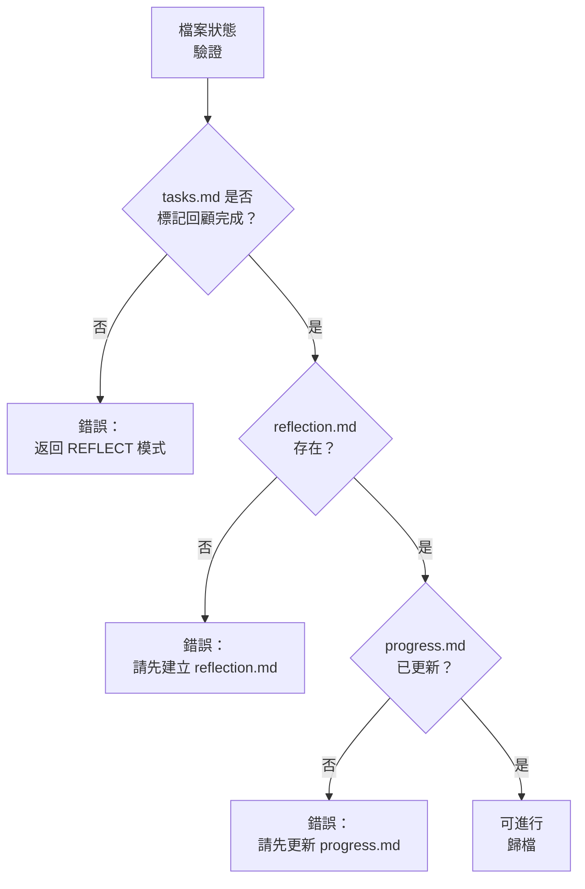
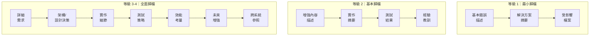
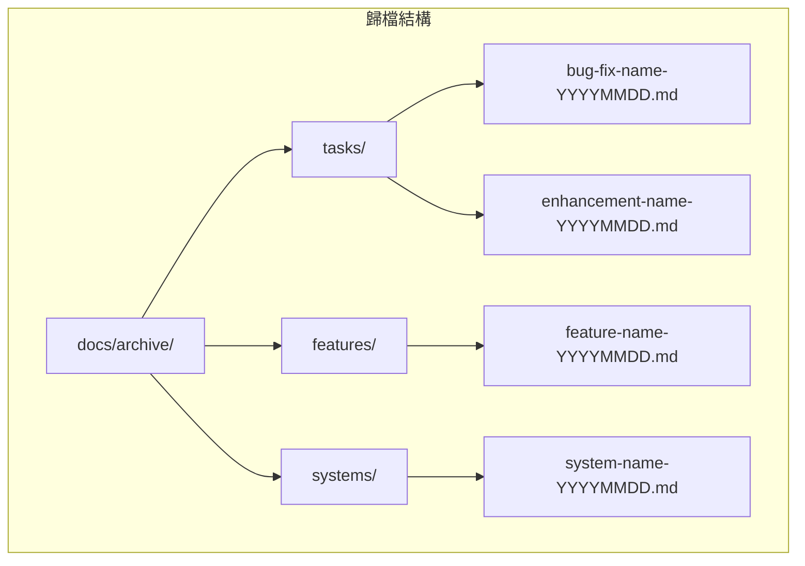

# ARCHIVE 模式：任務文件化流程圖

> **重點摘要：** 本視覺化地圖引導 ARCHIVE 模式流程，聚焦於建立完整的任務文件、歸檔相關檔案，並更新記憶體庫以供未來參考。

## 🧭 ARCHIVE 模式流程



## 📋 歸檔文件結構

歸檔文件應遵循以下結構：



## 📊 必要檔案狀態驗證

開始歸檔前，請驗證檔案狀態：



## 🔍 依複雜度歸檔類型



## 📝 歸檔文件範本

### 等級 1（最小）歸檔

```
# 錯誤修復歸檔：[錯誤名稱]

## 日期
[修復日期]

## 摘要
[錯誤與解決方案簡述]

## 實作
[修正內容說明]

## 變更檔案
- [檔案 1]
- [檔案 2]
```

### 等級 2-4（全面）歸檔

```
# 任務歸檔：[任務名稱]

## Metadata
- **複雜度**：等級 [2/3/4]
- **類型**：[增強/功能/系統]
- **完成日期**：[日期]
- **相關任務**：[相關任務參照]

## 摘要
[任務完整摘要]

## 需求
- [需求 1]
- [需求 2]
- [需求 3]

## 實作
### 方法
[實作方法說明]

### 主要元件
- [元件 1]：[說明]
- [元件 2]：[說明]

### 變更檔案
- [檔案 1]：[變更說明]
- [檔案 2]：[變更說明]

## 測試
- [測試 1]：[結果]
- [測試 2]：[結果]

## 經驗教訓
- [經驗 1]
- [經驗 2]
- [經驗 3]

## 未來考量
- [未來增強 1]
- [未來增強 2]

## 參考資料
- [reflection 文件連結]
- [創意階段文件連結]
- [其他相關參照]
```

## 📋 歸檔位置與命名

歸檔文件應依下列結構組織：



## 📊 TASKS.MD 最終更新

歸檔完成時，請於 tasks.md 更新：

```
## 狀態
- [x] 初始化完成
- [x] 規劃完成
[等級 3-4:]
- [x] 創意階段完成
- [x] 實作完成
- [x] 回顧完成
- [x] 歸檔完成

## 歸檔
- **日期**：[完成日期]
- **歸檔文件**：[歸檔文件連結]
- **狀態**：COMPLETED
```

## 📋 歸檔驗證清單

```
✓ 歸檔驗證
- 已檢閱回顧文件？ [是/否]
- 歸檔文件已建立且內容完整？ [是/否]
- 歸檔文件已放置正確位置？ [是/否]
- tasks.md 已標記完成？ [是/否]
- progress.md 已更新歸檔參照？ [是/否]
- activeContext.md 已更新下個任務？ [是/否]
- 創意階段文件已歸檔（等級 3-4）？ [是/否/不適用]

→ 全部為是：歸檔完成，記憶體庫可進行下個任務
→ 任一為否：請補齊缺漏歸檔內容
```

## 🔄 任務完成通知

歸檔完成時，請通知使用者：

```
## 任務已歸檔

✅ 歸檔文件已建立於 docs/archive/
✅ 所有任務文件已保存
✅ 記憶體庫已更新參照
✅ 任務已標記為 COMPLETED

→ 記憶體庫已可進行下個任務
→ 開始新任務請使用 VAN 模式
```
