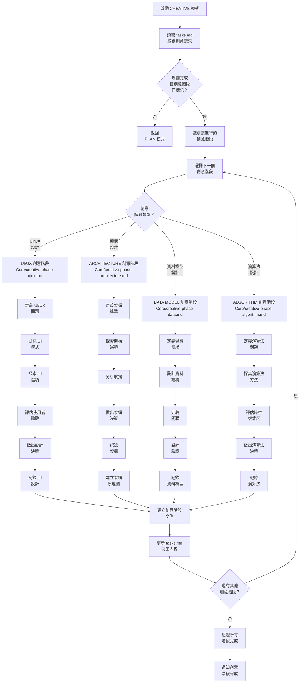
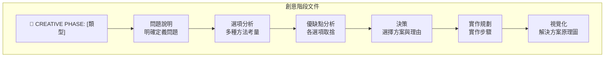
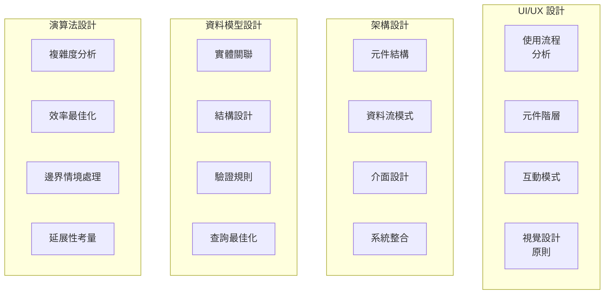
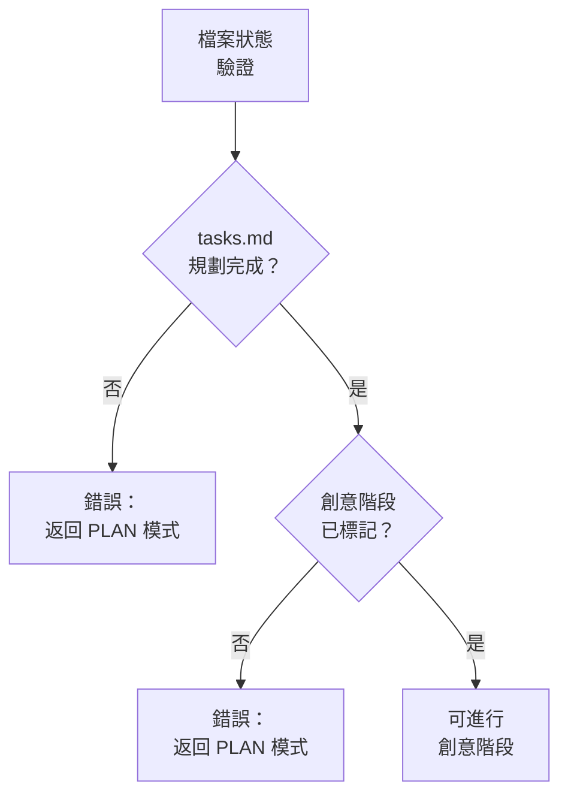

# CREATIVE 模式：設計流程圖

> **重點摘要：** 本視覺化地圖引導 CREATIVE 模式流程，聚焦於針對需深入探索的元件進行結構化設計決策，於實作前完成設計。

## 🧭 CREATIVE 模式流程



## 📋 創意階段文件格式

每個創意階段應產出如下結構的文件：



## 🔍 創意類型與方法



## 📊 必要檔案狀態驗證

開始創意階段前，請驗證檔案狀態：



## 📋 選項分析範本

每個創意階段請分析多種選項：

```
## 選項分析

### 選項 1：[名稱]
**說明**：[簡要說明]
**優點**：
- [優點 1]
- [優點 2]
**缺點**：
- [缺點 1]
- [缺點 2]
**複雜度**：[低/中/高]
**實作時間**：[預估]

### 選項 2：[名稱]
**說明**：[簡要說明]
**優點**：
- [優點 1]
- [優點 2]
**缺點**：
- [缺點 1]
- [缺點 2]
**複雜度**：[低/中/高]
**實作時間**：[預估]

### 選項 3：[名稱]
**說明**：[簡要說明]
**優點**：
- [優點 1]
- [優點 2]
**缺點**：
- [缺點 1]
- [缺點 2]
**複雜度**：[低/中/高]
**實作時間**：[預估]
```

## 🎨 創意階段標記

創意階段請使用以下視覺標記：

```
🎨🎨🎨 進入創意階段：[類型] 🎨🎨🎨

[創意階段內容]

🎨 創意檢查點：[里程碑]

[補充內容]

🎨🎨🎨 離開創意階段 - 決策已定 🎨🎨🎨
```

## 📊 創意階段驗證清單

```
✓ 創意階段驗證
- 問題明確定義？ [是/否]
- 至少考慮三種選項？ [是/否]
- 每個選項皆有優缺點？ [是/否]
- 決策有明確理由？ [是/否]
- 包含實作規劃？ [是/否]
- 有視覺化/原理圖？ [是/否]
- tasks.md 已更新決策？ [是/否]

→ 全部為是：創意階段完成
→ 任一為否：請補齊缺漏內容
```

## 🔄 模式切換通知

所有創意階段完成時，請通知使用者：

```
## 創意階段完成

✅ 所有設計決策已完成
✅ 已建立創意階段文件
✅ tasks.md 已更新決策
✅ 實作規劃已更新

→ 下一推薦模式：IMPLEMENT 模式
```
