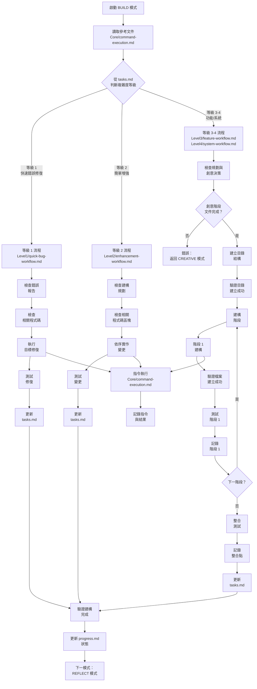
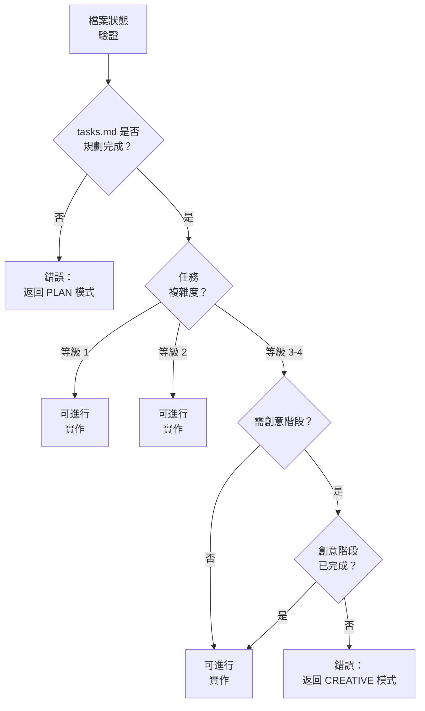
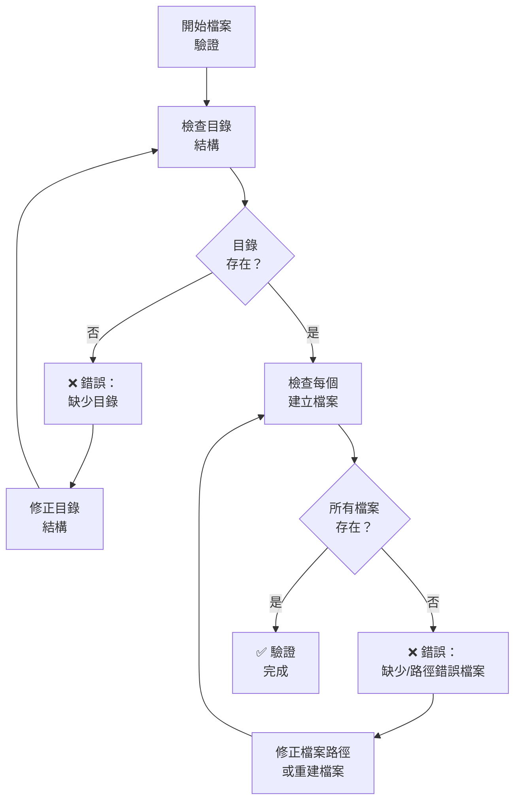
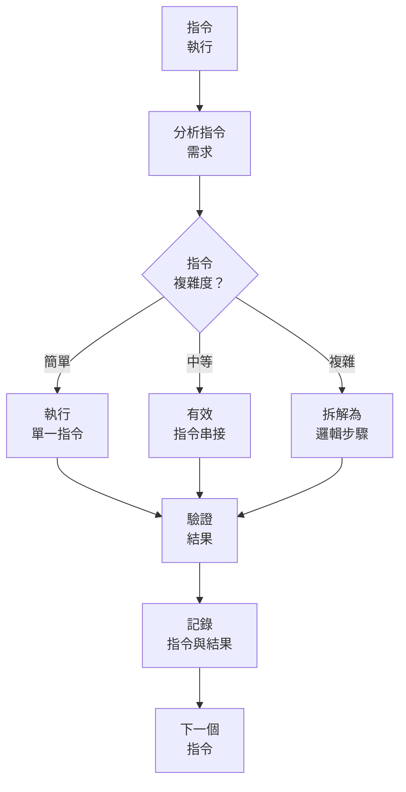

# BUILD 模式：程式碼執行流程圖

> **重點摘要：** 本視覺化地圖引導 BUILD 模式流程，聚焦於根據規劃與創意階段高效執行程式碼，並正確執行指令與追蹤進度。

## 🧭 BUILD 模式流程



## 📋 必要檔案狀態驗證

開始實作前，請驗證檔案狀態：



## 🔄 檔案系統驗證流程



## 📋 目錄驗證步驟

建立任何檔案前：

```
✓ 目錄驗證程序
1. 所有目錄必須先於檔案建立前建立
2. 使用絕對路徑：/full/path/to/directory
3. 建立後驗證每個目錄：
   ls -la /full/path/to/directory     # Linux/Mac
   dir "C:\full\path\to\directory"    # Windows
4. 於 progress.md 記錄目錄結構
5. 僅於所有目錄驗證存在後才可建立檔案
```

## 📋 檔案建立驗證

建立檔案後：

```
✓ 檔案驗證程序
1. 所有檔案操作皆用絕對路徑：/full/path/to/file.ext
2. 驗證每個檔案建立成功：
   ls -la /full/path/to/file.ext     # Linux/Mac
   dir "C:\full\path\to\file.ext"    # Windows
3. 若驗證失敗：
   a. 檢查路徑解析問題
   b. 驗證目錄存在
   c. 嘗試用正確路徑重建
   d. 修正後再次驗證檔案存在
4. 於 progress.md 記錄所有檔案路徑
```

## 🔄 指令執行流程



## 📋 等級專屬建構方式


## 📝 BUILD 文件格式

建構過程請記錄：

```
## Build: [元件/功能]

### 方法
[建構方法簡述]

### 目錄結構
- [/absolute/path/to/dir1/]: [用途]
- [/absolute/path/to/dir2/]: [用途]

### 程式碼變更
- [/absolute/path/to/file1.ext]: [變更說明]
- [/absolute/path/to/file2.ext]: [變更說明]

### 驗證步驟
- [✓] 目錄結構已建立並驗證
- [✓] 所有檔案已建立於正確位置
- [✓] 檔案內容已驗證

### 執行指令
```

[指令 1]
[結果]

```

```

[指令 2]
[結果]

```

### 測試
- [測試 1]：[結果]
- [測試 2]：[結果]

### 狀態
- [x] 建構完成
- [x] 已執行測試
- [x] 檔案驗證完成
- [ ] 文件已更新
```

## 📊 TASKS.MD 更新格式

建構過程中，請於 tasks.md 記錄進度：

```
## 狀態
- [x] 初始化完成
- [x] 規劃完成
[等級 3-4:]
- [x] 創意階段完成
- [x] 目錄結構已建立並驗證
- [x] [已建構元件 1]
- [x] [已建構元件 2]
- [ ] [剩餘元件]

## 建構進度
- [元件 1]：完成
  - 檔案：[/absolute/path/to/files]
  - [實作細節]
- [元件 2]：完成
  - 檔案：[/absolute/path/to/files]
  - [實作細節]
- [元件 3]：進行中
  - [目前狀態]
```

## 📋 PROGRESS.MD 更新格式

請於 progress.md 記錄：

```
# 建構進度

## 目錄結構
- [/absolute/path/to/dir1/]: 已建立並驗證
- [/absolute/path/to/dir2/]: 已建立並驗證

## [日期]：[元件/功能] 已建構
- **建立檔案**：
  - [/absolute/path/to/file1.ext]：已驗證
  - [/absolute/path/to/file2.ext]：已驗證
- **主要變更**：
  - [變更 1]
  - [變更 2]
- **測試**：[測試結果]
- **下一步**：[後續工作]
```

## 📊 BUILD 驗證清單

```
✓ BUILD 驗證
- 目錄結構正確建立？ [是/否]
- 所有檔案皆於正確位置？ [是/否]
- 所有檔案路徑皆為絕對路徑？ [是/否]
- 所有規劃變更皆已實作？ [是/否]
- 所有變更皆已測試？ [是/否]
- 程式碼符合專案標準？ [是/否]
- 邊界情境皆有處理？ [是/否]
- 建構文件皆用絕對路徑？ [是/否]
- tasks.md 已更新進度？ [是/否]
- progress.md 已更新細節？ [是/否]

→ 全部為是：建構完成，可進入 REFLECT 模式
→ 任一為否：請補齊缺漏建構內容
```

## 🔄 模式切換通知

建構完成時，請通知使用者：

```
## 建構完成

✅ 目錄結構已驗證
✅ 所有檔案皆於正確位置
✅ 所有規劃變更皆已實作
✅ 測試皆已成功執行
✅ tasks.md 已更新狀態
✅ progress.md 已更新細節

→ 下一推薦模式：REFLECT 模式
```
