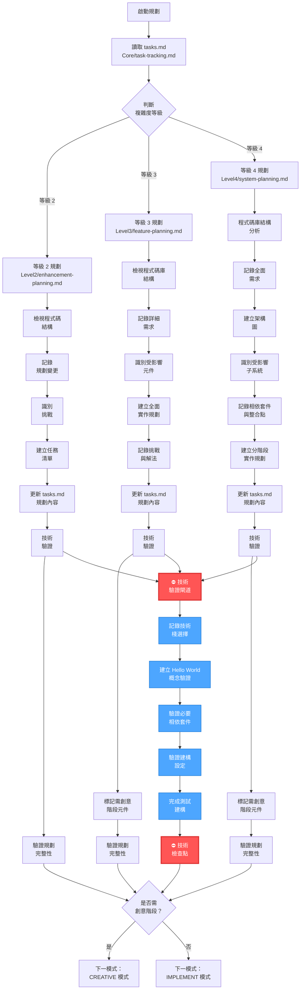
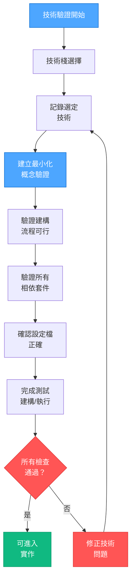
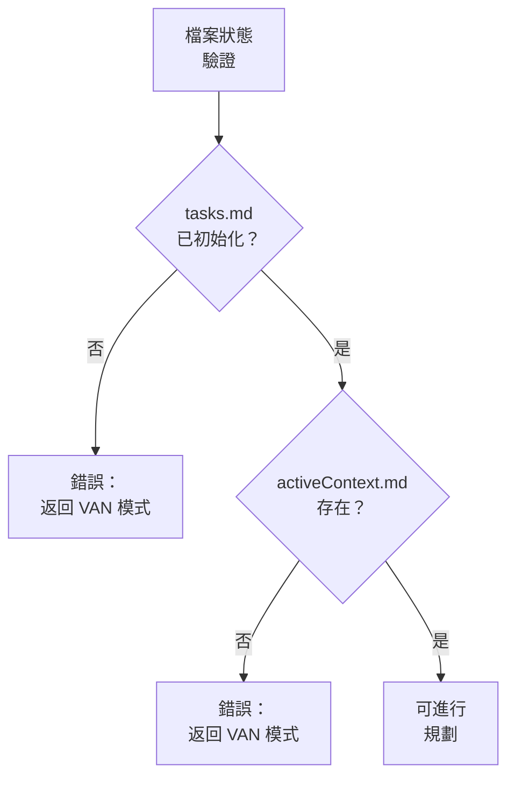
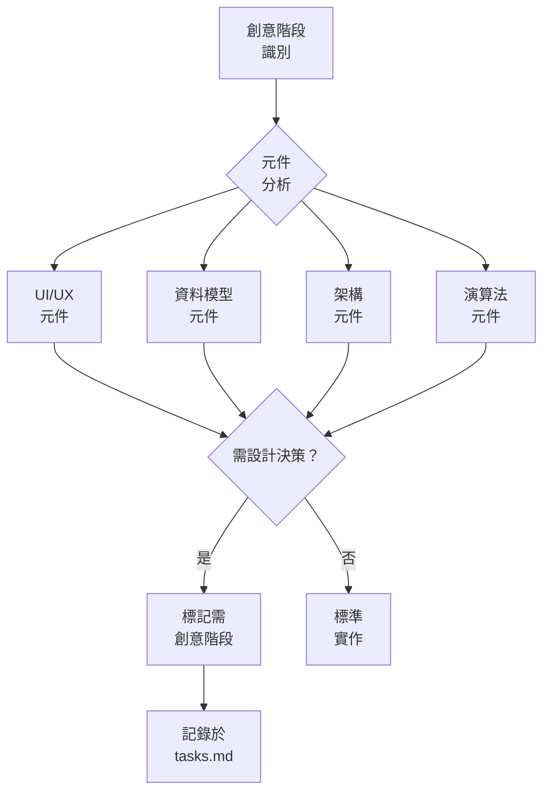

# PLAN 模式：任務規劃流程圖

> **重點摘要：** 本視覺化地圖引導 PLAN 模式流程，聚焦於根據初始化階段判斷的複雜度等級，建立詳細的實作規劃，並於實作前強制進行技術驗證。

## 🧭 PLAN 模式流程



## 📋 等級專屬規劃方式

```mermaid
graph TD
    subgraph "等級 2：增強"
        L2A["基本需求<br>分析"]
        L2B["簡單元件<br>識別"]
        L2C["線性實作<br>規劃"]
        L2D["基本清單<br>建立"]
    end

    subgraph "等級 3：功能"
        L3A["詳細需求<br>分析"]
        L3B["元件對應<br>與相依"]
        L3C["多階段<br>實作規劃"]
        L3D["全面清單"]
        L3E["創意階段<br>識別"]
    end

    subgraph "等級 4：系統"
        L4A["架構需求<br>分析"]
        L4B["系統元件<br>對應"]
        L4C["子系統<br>整合規劃"]
        L4D["分階段實作<br>策略"]
        L4E["風險評估<br>與緩解"]
        L4F["多個創意<br>階段需求"]
    end

    L2A --> L2B --> L2C --> L2D
    L3A --> L3B --> L3C --> L3D --> L3E
    L4A --> L4B --> L4C --> L4D --> L4E --> L4F
```



## 🔧 技術驗證流程



## 📊 必要檔案狀態驗證

開始規劃前，請驗證檔案狀態：



## 📝 TASKS.MD 更新格式

規劃過程中，請於 tasks.md 依下列結構更新：

```
# 任務：[任務名稱]

## 描述
[詳細描述]

## 複雜度
等級：[2/3/4]
類型：[增強/功能/複雜系統]

## 技術棧
- 框架：[選定框架]
- 建構工具：[選定建構工具]
- 語言：[選定語言]
- 儲存：[選定儲存機制]

## 技術驗證檢查點
- [ ] 專案初始化指令已驗證
- [ ] 必要相依套件已識別並安裝
- [ ] 建構設定已驗證
- [ ] Hello world 驗證已完成
- [ ] 測試建構成功

## 狀態
- [x] 初始化完成
- [x] 規劃完成
- [ ] 技術驗證完成
- [ ] [實作步驟]

## 實作規劃
1. [步驟 1]
   - [子任務 1.1]
   - [子任務 1.2]
2. [步驟 2]
   - [子任務 2.1]
   - [子任務 2.2]

## 創意階段需求
- [ ] [元件 1] 設計
- [ ] [元件 2] 架構
- [ ] [元件 3] 資料模型

## 相依套件
- [相依套件 1]
- [相依套件 2]

## 挑戰與緩解
- [挑戰 1]：[緩解策略]
- [挑戰 2]：[緩解策略]
```

## 📋 創意階段識別

等級 3-4 任務需識別需創意階段的元件：



## 📊 技術驗證清單

```
✓ 技術驗證清單
- 技術棧明確定義？ [是/否]
- 專案初始化指令已記錄？ [是/否]
- 必要相依套件已識別？ [是/否]
- 已建立最小概念驗證？ [是/否]
- Hello world 建構/執行成功？ [是/否]
- 設定檔已驗證？ [是/否]
- 測試建構成功？ [是/否]

→ 全部為是：技術驗證完成，可進入下一階段
→ 任一為否：請先解決技術問題
```

## 📊 規劃驗證清單

```
✓ 規劃驗證清單
- 需求已明確記錄？ [是/否]
- 技術棧已驗證？ [是/否]
- 受影響元件已識別？ [是/否]
- 實作步驟已詳列？ [是/否]
- 相依套件已記錄？ [是/否]
- 挑戰與緩解已處理？ [是/否]
- 創意階段已識別（等級 3-4）？ [是/否/不適用]
- tasks.md 已更新規劃？ [是/否]

→ 全部為是：規劃完成，可進入下一模式
→ 任一為否：請補齊缺漏規劃內容
```

## 🔄 模式切換通知

規劃完成時，請通知使用者：

```
## 規劃完成

✅ 已建立實作規劃
✅ 技術棧已驗證
✅ tasks.md 已更新規劃
✅ 挑戰與緩解已記錄
[✅ 創意階段已識別（等級 3-4）]

→ 下一推薦模式：[CREATIVE/IMPLEMENT] 模式
```
