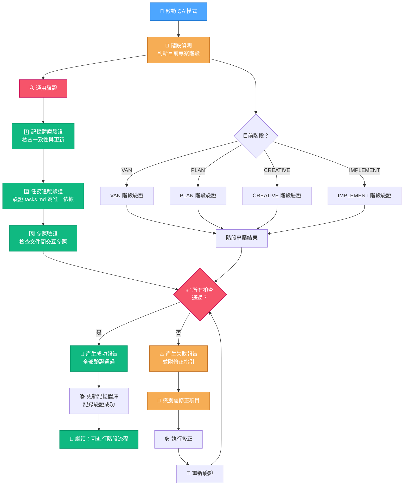
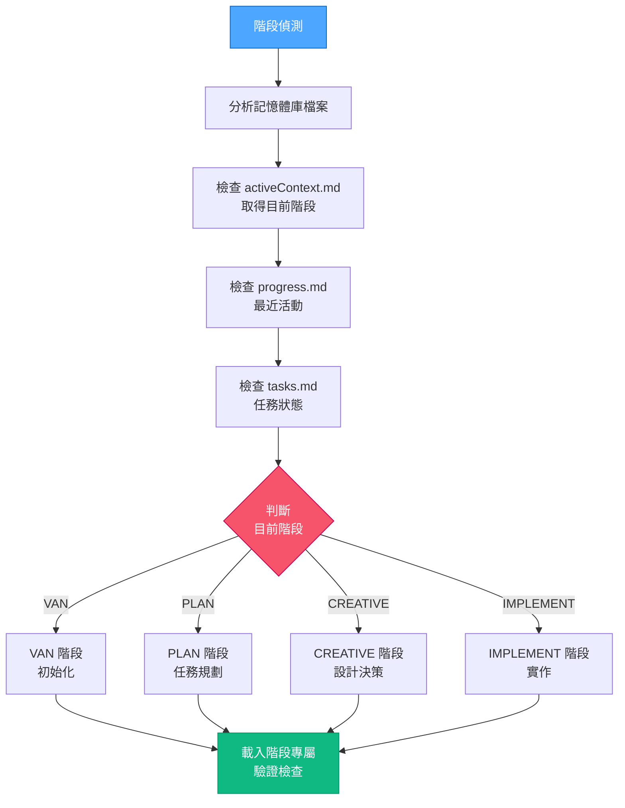
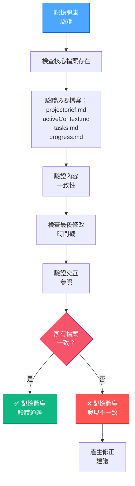
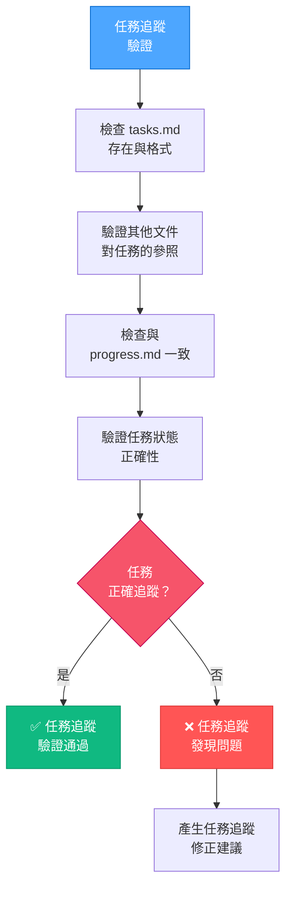
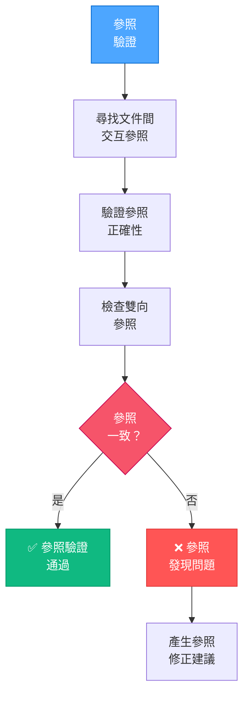
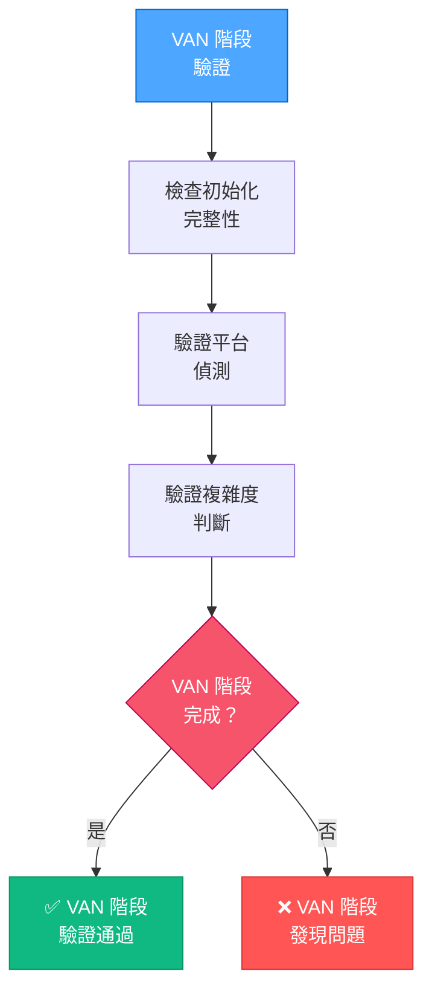
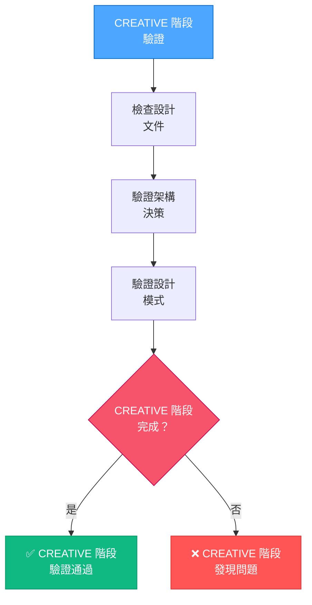
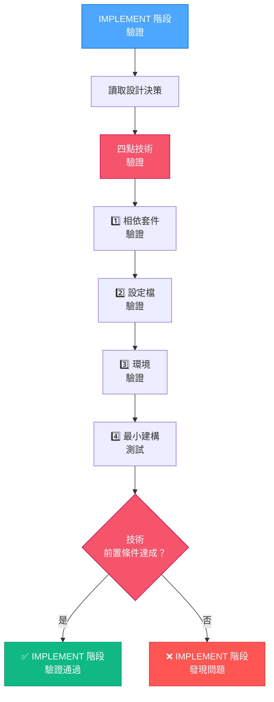
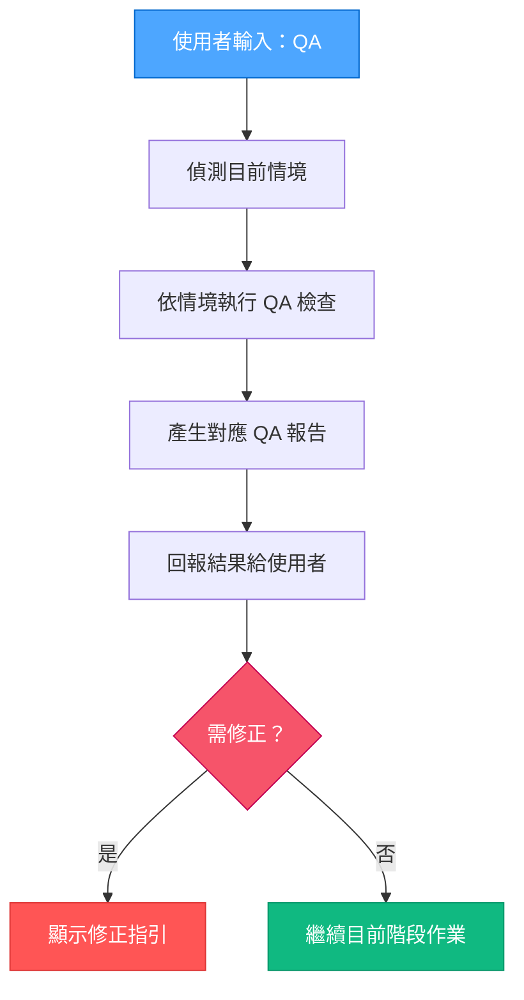

> **重點摘要：** 強化版 QA 模式可於開發任意階段進行全面驗證。它會自動偵測目前階段，驗證記憶體庫一致性、任務追蹤、並執行階段專屬技術驗證，確保專案品質於開發全程皆受控。

## 🔍 強化 QA 模式流程



## 🧭 階段偵測流程

強化 QA 模式會先判斷目前專案所處階段：



## 📝 通用記憶體庫驗證

此流程確保記憶體庫檔案於各階段皆一致且最新：



## 📋 任務追蹤驗證

此流程驗證 tasks.md 為唯一依據：



## 🔄 參照驗證流程

此流程確保文件間交互參照正確：



## 🚨 階段專屬驗證流程

### VAN 階段驗證



### PLAN 階段驗證


### CREATIVE 階段驗證



### IMPLEMENT 階段技術驗證

保留原 QA 驗證四點流程：



## 📋 通用驗證指令執行

### 記憶體庫驗證指令：

```bash
# 檢查記憶體庫檔案存在與新舊
ls -la memory-bank/
find memory-bank/ -type f -mtime -7 | sort

# 檢查檔案間一致性
grep -r "task" memory-bank/
grep -r "requirement" memory-bank/
```

### 任務追蹤驗證指令：

```bash
# 驗證 tasks.md 是否存在
test -f tasks.md && echo "✅ tasks.md 存在" || echo "❌ tasks.md 缺失"

# 檢查其他檔案對 tasks 的參照
grep -r "Task" --include="*.md" .
grep -r "task" --include="*.md" . | grep -v "tasks.md" | wc -l

# 驗證任務狀態一致性
grep -i "completed\|done\|finished" tasks.md
grep -i "in progress\|started" tasks.md
```

### 參照驗證指令：

```bash
# 尋找檔案間交互參照
grep -r "see\|refer\|reference" --include="*.md" .

# 檢查斷裂參照
for file in $(grep -l "see\|refer\|reference" --include="*.md" .); do
  for ref in $(grep -o '[a-zA-Z0-9_-]*\.md' $file); do
    test -f $ref || echo "❌ 斷裂參照: $ref in $file"
  done
done
```

## 📋 1️⃣ 相依套件驗證流程（原始）

此驗證點確保所有必要套件皆正確安裝。

### 指令執行：

```bash
# 檢查套件是否已安裝
npm list react react-dom tailwindcss postcss autoprefixer

# 驗證套件版本是否符合需求
npm list | grep -E "react|tailwind|postcss"

# 檢查 peer dependency 警告
npm ls --depth=0
```

### 驗證標準：

- 所有必要套件皆已安裝
- 版本需與需求相容
- 無重大 peer dependency 警告
- 必要開發套件需存在

### 常見修正：

- `npm install [缺少套件]` - 安裝缺少套件
- `npm install [套件]@[版本]` - 修正版本不符
- `npm install --save-dev [開發套件]` - 補齊開發相依

## 📝 2️⃣ 設定檔驗證流程（原始）

此驗證點確保設定檔格式正確。

### 指令執行：

```bash
# 檢查 package.json 的 module type
grep "\"type\":" package.json

# 驗證設定檔副檔名與 module type 是否相符
find . -name "*.config.*" | grep -E "\.(js|cjs|mjs)$"

# 測試設定檔語法
node -c *.config.js || node -c *.config.cjs || node -c *.config.mjs
```

### 驗證標準：

- 設定檔副檔名需與 package.json module type 相符
- 檔案語法需正確
- 設定需參照已安裝套件

### 常見修正：

- ES module 專案將 `.js` 改為 `.cjs`
- 修正設定檔語法錯誤
- 設定內容需參照已安裝套件

## 🌐 3️⃣ 環境驗證流程（原始）

此驗證點確保開發環境設置正確。

### 指令執行：

```bash
# 檢查建構工具
npm run --help

# 驗證 node 版本相容性
node -v

# 檢查環境變數
printenv | grep -E "NODE_|PATH|HOME"

# 驗證存取權限
ls -la .
```

### 驗證標準：

- Node.js 版本需相容
- package.json 需有建構指令
- 環境需有必要權限
- 必要環境變數需設置

### 常見修正：

- 更新 Node.js 版本
- 補齊 package.json scripts
- 修正檔案權限（chmod/icacls）
- 設定必要環境變數

## 🔥 4️⃣ 最小建構測試流程（原始）

此驗證點測試最小建構，確保基本功能可運作。

### 指令執行：

```bash
# 執行最小建構
npm run build -- --dry-run || npm run dev -- --dry-run

# 驗證進入點檔案存在
find src -name "main.*" -o -name "index.*"

# 驗證 HTML 進入點
grep -i "script.*src=" index.html
```

### 驗證標準：

- 建構過程無錯誤
- 進入點檔案存在且正確參照
- HTML 需正確參照 JS 進入點
- 測試環境可正常渲染

### 常見修正：

- 修正 HTML 進入點參照
- 修正 JS 匯入路徑
- 修正建構設定錯誤
- 修正路徑或參照錯誤

## 📊 強化綜合 QA 報告格式

```
╔═════════════════════════ 🔍 強化 QA 驗證報告 ═════════════════════╗
│                                                                               │
│ 專案： [專案名稱]               日期： [當前日期]                    │
│ 平台： [作業系統]               偵測階段： [目前階段]               │
│                                                                               │
│ ━━━━━━━━━━━━━━━━━━━━━━━━ 通用驗證結果 ━━━━━━━━━━━━━━━━━━━━━━━ │
│                                                                               │
│ 1️⃣ 記憶體庫驗證                                                           │
│    ✓ 核心檔案： [狀態]                                                     │
│    ✓ 內容一致性： [狀態]                                                    │
│    ✓ 最後修改： [狀態]                                                      │
│                                                                               │
│ 2️⃣ 任務追蹤驗證                                                           │
│    ✓ tasks.md 狀態： [狀態]                                                 │
│    ✓ 任務參照： [狀態]                                                      │
│    ✓ 狀態一致性： [狀態]                                                    │
│                                                                               │
│ 3️⃣ 參照驗證                                                               │
│    ✓ 交互參照： [狀態]                                                      │
│    ✓ 參照正確性： [狀態]                                                    │
│                                                                               │
│ ━━━━━━━━━━━━━━━━━━━━━━━ 階段專屬驗證 ━━━━━━━━━━━━━━━━━━━━━━━━━ │
│                                                                               │
│ [VAN/PLAN/CREATIVE/IMPLEMENT] 階段驗證                                       │
│    ✓ [階段專屬檢查 1]： [狀態]                                              │
│    ✓ [階段專屬檢查 2]： [狀態]                                              │
│    ✓ [階段專屬檢查 3]： [狀態]                                              │
│                                                                               │
│ [技術驗證區塊僅於 IMPLEMENT 階段顯示]                                        │
│                                                                               │
│ ━━━━━━━━━━━━━━━━━━━━━━━━━━━ 整體狀態 ━━━━━━━━━━━━━━━━━━━━━━━━━━ │
│                                                                               │
│ ✅ 驗證通過 - 目前階段專案品質已驗證                                         │
│                                                                               │
╚═══════════════════════════════════════════════════════════════════════════════╝
```

## 🚫 強化失敗報告格式

若驗證失敗，將產生詳細失敗報告：

```
╔═════════════════════════ ⚠️ QA 驗證失敗 ═════════════════════════════╗
│                                                                                 │
│ 專案： [專案名稱]               日期： [當前日期]                      │
│ 平台： [作業系統]               偵測階段： [目前階段]                 │
│                                                                                 │
│ ━━━━━━━━━━━━━━━━━━━━━━━━━━ 失敗檢查 ━━━━━━━━━━━━━━━━━━━━━━━━━━━ │
│                                                                                 │
│ ❌ 記憶體庫問題                                                           │
│    • [具體問題細節]                                                       │
│    • [具體問題細節]                                                       │
│                                                                                 │
│ ❌ 任務追蹤問題                                                           │
│    • [具體問題細節]                                                       │
│    • [具體問題細節]                                                       │
│                                                                                 │
│ ❌ 參照問題                                                               │
│    • [具體問題細節]                                                       │
│    • [具體問題細節]                                                       │
│                                                                                 │
│ ❌ [階段]專屬問題                                                         │
│    • [具體問題細節]                                                       │
│    • [具體問題細節]                                                       │
│                                                                                 │
│ ━━━━━━━━━━━━━━━━━━━━━━━━━━━ 必要修正 ━━━━━━━━━━━━━━━━━━━━━━━━━━━ │
│                                                                                 │
│ 1. [具體修正指令與說明]                                                    │
│ 2. [具體修正指令與說明]                                                    │
│ 3. [具體修正指令與說明]                                                    │
│                                                                                 │
│ ⚠️ 驗證失敗 - 請先修正問題再繼續                                          │
│                                                                                 │
╚═════════════════════════════════════════════════════════════════════════════════╝
```

## 🔄 QA-ANYTIME 啟動協定

強化 QA 模式可於開發任意時機啟動：



此強化 QA 模式為開發全程的「品質守門員」，確保文件持續維護且各階段需求皆滿足後方可進入下一階段。
