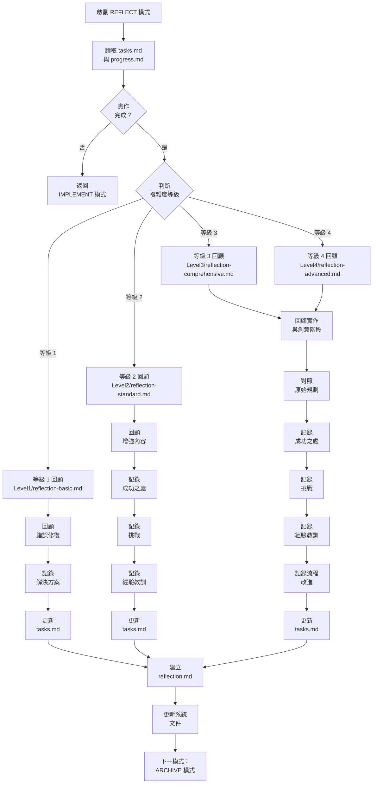
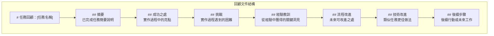
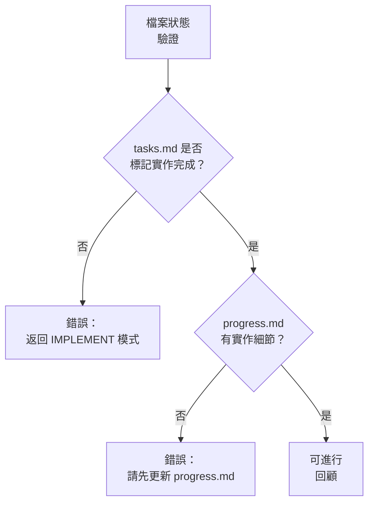
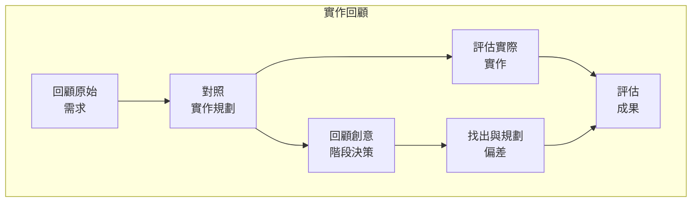
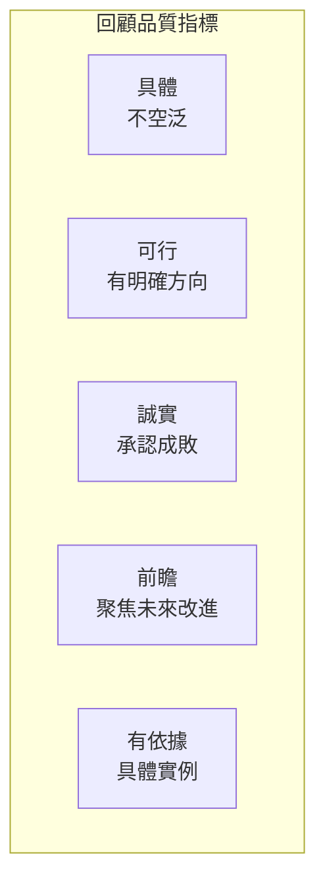

# REFLECT 模式：任務回顧流程圖

> **重點摘要：** 本視覺化地圖引導 REFLECT 模式流程，聚焦於結構化回顧實作、記錄經驗教訓，並為未來參考準備洞見。

## 🧭 REFLECT 模式流程



## 📋 回顧結構

回顧應遵循以下結構化格式：



## 📊 必要檔案狀態驗證

開始回顧前，請驗證檔案狀態：



## 🔍 實作回顧方法



## 📝 回顧文件範本

### 等級 1（基礎）回顧

```
# 錯誤修復回顧：[錯誤名稱]

## 摘要
[簡要描述錯誤與解決方案]

## 實作
[修正內容說明]

## 測試
[測試方式說明]

## 其他說明
[其他相關資訊]
```

### 等級 2-4（全面）回顧

```
# 任務回顧：[任務名稱]

## 摘要
[任務簡要與成果]

## 成功之處
- [成功點 1]
- [成功點 2]
- [成功點 3]

## 挑戰
- [挑戰 1]：[如何解決]
- [挑戰 2]：[如何解決]
- [挑戰 3]：[如何解決]

## 經驗教訓
- [經驗 1]
- [經驗 2]
- [經驗 3]

## 流程改進
- [流程改進 1]
- [流程改進 2]

## 技術改進
- [技術改進 1]
- [技術改進 2]

## 後續步驟
- [後續任務 1]
- [後續任務 2]
```

## 📊 回顧品質指標



## 📋 TASKS.MD 更新格式

回顧過程中，請於 tasks.md 更新：

```
## 狀態
- [x] 初始化完成
- [x] 規劃完成
[等級 3-4:]
- [x] 創意階段完成
- [x] 實作完成
- [x] 回顧完成
- [ ] 歸檔中

## 回顧重點
- **成功之處**：[主要亮點]
- **挑戰**：[主要挑戰]
- **經驗教訓**：[主要經驗]
- **後續步驟**：[後續行動]
```

## 📊 回顧驗證清單

```
✓ 回顧驗證
- 是否徹底回顧實作？ [是/否]
- 成功之處已填寫？ [是/否]
- 挑戰已填寫？ [是/否]
- 經驗教訓已填寫？ [是/否]
- 流程改進已識別？ [是/否]
- 技術改進已識別？ [是/否]
- 後續步驟已記錄？ [是/否]
- 已建立 reflection.md？ [是/否]
- tasks.md 已更新回顧狀態？ [是/否]

→ 全部為是：回顧完成，可進入 ARCHIVE 模式
→ 任一為否：請補齊缺漏回顧內容
```

## 🔄 模式切換通知

回顧完成時，請通知使用者：

```
## 回顧完成

✅ 實作已徹底回顧
✅ 已建立回顧文件
✅ 已記錄經驗教訓
✅ 已識別流程改進
✅ tasks.md 已更新回顧狀態

→ 下一推薦模式：ARCHIVE 模式
```
