# VAN 模式：初始化流程圖

> **重點摘要：** 本視覺化地圖定義了 VAN 模式下的專案初始化、任務分析與技術驗證流程。它引導使用者完成平台偵測、檔案驗證、複雜度判斷與技術驗證，確保在實作前正確完成設定。

## 🧭 VAN 模式流程

```mermaid
graph TD
    Start["啟動 VAN 模式"] --> PlatformDetect["平台偵測"]
    PlatformDetect --> DetectOS["偵測作業系統"]
    DetectOS --> CheckPath["檢查路徑分隔符格式"]
    CheckPath --> AdaptCmds["如有需要調整指令"]
    AdaptCmds --> PlatformCP["⛔ 平台檢查點"]

    %% 基本檔案驗證與檢查點
    PlatformCP --> BasicFileVerify["基本檔案驗證"]
    BasicFileVerify --> BatchCheck["批次檢查必要組件"]
    BatchCheck --> BatchCreate["批次建立必要結構"]
    BatchCreate --> BasicFileCP["⛔ 基本檔案檢查點"]

    %% 早期複雜度判斷
    BasicFileCP --> EarlyComplexity["早期複雜度判斷"]
    EarlyComplexity --> AnalyzeTask["分析任務需求"]
    AnalyzeTask --> EarlyLevelCheck{"複雜度等級？"}

    %% 等級處理路徑
    EarlyLevelCheck -->|"等級 1"| ComplexityCP["⛔ 複雜度檢查點"]
    EarlyLevelCheck -->|"等級 2-4"| CRITICALGATE["🚫 關鍵閘道：強制切換模式"]
    CRITICALGATE --> ForceExit["跳轉至 PLAN 模式"]

    %% 等級 1 正常繼續
    ComplexityCP --> InitSystem["初始化記憶體庫"]
    InitSystem --> Complete1["等級 1 初始化完成"]

    %% 等級 2+ 任務經過 PLAN 與 CREATIVE 模式
    ForceExit -.-> OtherModes["PLAN → CREATIVE 模式"]
    OtherModes -.-> VANQA["VAN QA 模式"]
    VANQA --> QAProcess["技術驗證流程"]
    QAProcess --> QACheck{"所有檢查通過？"}
    QACheck -->|"是"| BUILD["進入 BUILD 模式"]
    QACheck -->|"否"| FixIssues["修正技術問題"]
    FixIssues --> QAProcess

    %% 節點樣式
    style PlatformCP fill:#f55,stroke:#d44,color:white
    style BasicFileCP fill:#f55,stroke:#d44,color:white
    style ComplexityCP fill:#f55,stroke:#d44,color:white
    style CRITICALGATE fill:#ff0000,stroke:#990000,color:white,stroke-width:3px
    style ForceExit fill:#ff0000,stroke:#990000,color:white,stroke-width:2px
    style VANQA fill:#4da6ff,stroke:#0066cc,color:white,stroke-width:3px
    style QAProcess fill:#4da6ff,stroke:#0066cc,color:white
    style QACheck fill:#4da6ff,stroke:#0066cc,color:white
    style FixIssues fill:#ff5555,stroke:#dd3333,color:white
```

## 🌐 平台偵測流程

```mermaid
graph TD
    PD["平台偵測"] --> CheckOS["偵測作業系統"]
    CheckOS --> Win["Windows"]
    CheckOS --> Mac["macOS"]
    CheckOS --> Lin["Linux"]

    Win & Mac & Lin --> Adapt["針對平台調整指令"]

    Win --> WinPath["路徑：反斜線 (\\)"]
    Mac --> MacPath["路徑：斜線 (/)"]
    Lin --> LinPath["路徑：斜線 (/)"]

    Win --> WinCmd["指令調整：<br>dir, icacls 等"]
    Mac --> MacCmd["指令調整：<br>ls, chmod 等"]
    Lin --> LinCmd["指令調整：<br>ls, chmod 等"]

    WinPath & MacPath & LinPath --> PathCP["路徑分隔符<br>檢查點"]
    WinCmd & MacCmd & LinCmd --> CmdCP["指令<br>檢查點"]

    PathCP & CmdCP --> PlatformComplete["平台偵測<br>完成"]

    style PD fill:#4da6ff,stroke:#0066cc,color:white
    style PlatformComplete fill:#10b981,stroke:#059669,color:white
```

## 📁 檔案驗證流程

```mermaid
graph TD
    FV["檔案驗證"] --> CheckFiles["檢查必要檔案"]
    CheckFiles --> CheckMB["檢查記憶體庫<br>結構"]
    CheckMB --> MBExists{"記憶體庫<br>是否存在？"}

    MBExists -->|"是"| VerifyMB["驗證記憶體庫<br>內容"]
    MBExists -->|"否"| CreateMB["建立記憶體庫<br>結構"]

    CheckFiles --> CheckDocs["檢查文件<br>檔案"]
    CheckDocs --> DocsExist{"文件<br>是否存在？"}

    DocsExist -->|"是"| VerifyDocs["驗證文件<br>結構"]
    DocsExist -->|"否"| CreateDocs["建立文件<br>結構"]

    VerifyMB & CreateMB --> MBCP["記憶體庫<br>檢查點"]
    VerifyDocs & CreateDocs --> DocsCP["文件<br>檢查點"]

    MBCP & DocsCP --> FileComplete["檔案驗證<br>完成"]

    style FV fill:#4da6ff,stroke:#0066cc,color:white
    style FileComplete fill:#10b981,stroke:#059669,color:white
    style MBCP fill:#f6546a,stroke:#c30052,color:white
    style DocsCP fill:#f6546a,stroke:#c30052,color:white
```

## 🧩 複雜度判斷流程

```mermaid
graph TD
    CD["複雜度<br>判斷"] --> AnalyzeTask["分析任務<br>需求"]

    AnalyzeTask --> CheckKeywords["檢查任務<br>關鍵字"]
    CheckKeywords --> ScopeCheck["評估<br>範圍影響"]
    ScopeCheck --> RiskCheck["評估<br>風險等級"]
    RiskCheck --> EffortCheck["估算<br>實作工作量"]

    EffortCheck --> DetermineLevel{"判斷<br>複雜度等級"}
    DetermineLevel -->|"等級 1"| L1["等級 1：<br>快速修復"]
    DetermineLevel -->|"等級 2"| L2["等級 2：<br>簡單增強"]
    DetermineLevel -->|"等級 3"| L3["等級 3：<br>中等功能"]
    DetermineLevel -->|"等級 4"| L4["等級 4：<br>複雜系統"]

    L1 --> CDComplete["複雜度判斷<br>完成"]
    L2 & L3 & L4 --> ModeSwitch["強制切換模式<br>至 PLAN"]

    style CD fill:#4da6ff,stroke:#0066cc,color:white
    style CDComplete fill:#10b981,stroke:#059669,color:white
    style ModeSwitch fill:#ff0000,stroke:#990000,color:white
    style DetermineLevel fill:#f6546a,stroke:#c30052,color:white
```

## 🔄 完整流程與 QA 驗證

完整流程於實作前包含技術驗證：

```mermaid
flowchart LR
    VAN1["VAN 模式
    （初步分析）"] --> PLAN["PLAN 模式
    （任務規劃）"]
    PLAN --> CREATIVE["CREATIVE 模式
    （設計決策）"]
    CREATIVE --> VANQA["VAN QA 模式
    （技術驗證）"]
    VANQA --> BUILD["BUILD 模式
    （實作）"]
```

## 🔍 技術驗證總覽

VAN QA 技術驗證流程包含四大驗證點：

```mermaid
graph TD
    VANQA["VAN QA 模式"] --> FourChecks["四點驗證"]

    FourChecks --> DepCheck["1️⃣ 相依套件驗證<br>檢查所有必要套件"]
    DepCheck --> ConfigCheck["2️⃣ 設定檔驗證<br>檢查格式與相容性"]
    ConfigCheck --> EnvCheck["3️⃣ 環境驗證<br>檢查建構環境"]
    EnvCheck --> MinBuildCheck["4️⃣ 最小建構測試<br>測試核心功能"]

    MinBuildCheck --> ValidationResults{"所有檢查<br>通過？"}
    ValidationResults -->|"是"| SuccessReport["產生成功報告"]
    ValidationResults -->|"否"| FailureReport["產生失敗報告"]

    SuccessReport --> BUILD["進入 BUILD 模式"]
    FailureReport --> FixIssues["修正技術問題"]
    FixIssues --> ReValidate["重新驗證"]
    ReValidate --> ValidationResults

    style VANQA fill:#4da6ff,stroke:#0066cc,color:white
    style FourChecks fill:#f6546a,stroke:#c30052,color:white
    style ValidationResults fill:#f6546a,stroke:#c30052,color:white
    style BUILD fill:#10b981,stroke:#059669,color:white
    style FixIssues fill:#ff5555,stroke:#dd3333,color:white
```

## 📝 驗證狀態格式

QA 驗證步驟包含明確狀態指示：

```
╔═════════════════ 🔍 QA 驗證狀態 ═════════════════╗
│ ✓ 設計決策         │ 已驗證可實作                  │
│ ✓ 相依套件         │ 所有必要套件已安裝            │
│ ✓ 設定檔           │ 格式已驗證，符合平台          │
│ ✓ 環境             │ 適合進行實作                  │
╚══════════════════════════════════════════════════╝
✅ 已驗證 - 可進入 BUILD 模式
```

## 🚨 模式切換觸發條件

### VAN → PLAN 切換

對於複雜度等級 2-4：

```
🚫 偵測到等級 [2-4] 任務
VAN 模式下禁止實作
此任務需進入 PLAN 模式
請務必切換至 PLAN 模式以進行文件與規劃
輸入 'PLAN' 以切換至規劃模式
```

### CREATIVE → VAN QA 切換

完成 CREATIVE 模式後：

```
⏭️ 下一模式：VAN QA
為驗證技術需求，請輸入 'VAN QA'
```

### VAN QA → BUILD 切換

驗證成功後：

```
✅ 技術驗證完成
所有前置條件已驗證
可進入 BUILD 模式
輸入 'BUILD' 開始實作
```

## 🔒 BUILD 模式阻擋機制

系統會阻止未通過 QA 驗證時進入 BUILD 模式：

```mermaid
graph TD
    Start["使用者輸入：BUILD"] --> CheckQA{"QA 驗證<br>已完成？"}
    CheckQA -->|"是且通過"| AllowBuild["允許進入 BUILD 模式"]
    CheckQA -->|"否或失敗"| BlockBuild["阻擋 BUILD 模式"]
    BlockBuild --> Message["顯示：<br>⚠️ 需先完成 QA 驗證"]
    Message --> ReturnToVANQA["提示：請輸入 VAN QA"]

    style CheckQA fill:#f6546a,stroke:#c30052,color:white
    style BlockBuild fill:#ff0000,stroke:#990000,color:white,stroke-width:3px
    style Message fill:#ff5555,stroke:#dd3333,color:white
    style ReturnToVANQA fill:#4da6ff,stroke:#0066cc,color:white
```

## 🔄 QA 指令優先權

QA 驗證可於任意流程階段呼叫，並立即取得最高優先權，包括強制模式切換時：

```mermaid
graph TD
    UserQA["使用者輸入：QA"] --> HighPriority["⚠️ 高優先權指令"]
    HighPriority --> CurrentTask["暫停目前任務/流程"]
    CurrentTask --> LoadQA["載入 QA 模式地圖"]
    LoadQA --> RunQA["執行 QA 驗證流程"]
    RunQA --> QAResults{"QA 結果"}

    QAResults -->|"通過"| ResumeFlow["恢復先前流程"]
    QAResults -->|"失敗"| FixIssues["修正發現問題"]
    FixIssues --> ReRunQA["重新執行 QA 驗證"]
    ReRunQA --> QAResults

    style UserQA fill:#f8d486,stroke:#e8b84d,color:black
    style HighPriority fill:#ff0000,stroke:#cc0000,color:white,stroke-width:3px
    style LoadQA fill:#4da6ff,stroke:#0066cc,color:white
    style RunQA fill:#4da6ff,stroke:#0066cc,color:white
    style QAResults fill:#f6546a,stroke:#c30052,color:white
```

### QA 中斷規則

當使用者於任意時機輸入 **QA**：

1. **QA 指令必須立即取得最高優先權**，即使複雜度評估已觸發「強制切換模式」。
2. 系統必須：
   - 立即載入 QA 模式地圖
   - 執行完整 QA 驗證流程
   - 於繼續前修正所有失敗項目
3. **必要修正步驟優先於所有待處理模式切換或複雜度規則**
4. 完成並通過 QA 驗證後：
   - 恢復原先流程
   - 繼續執行必要模式切換

```
⚠️ QA 覆蓋已啟動
所有其他流程已暫停
正在執行 QA 驗證檢查...
發現任何問題必須先修正，才能繼續正常流程
```

## 📋 檢查點驗證範本

VAN 模式每個主要檢查點皆使用此格式：

```
✓ 區段檢查點：[區段名稱]
- 條件 1？ [是/否]
- 條件 2？ [是/否]
- 條件 3？ [是/否]

→ 全部為是：可進入下一區段
→ 任一為否：請先修正缺漏項目
```

## 🚀 VAN 模式啟動

當使用者輸入 "VAN" 時，請回應：

```
使用者：VAN

回應：OK VAN - 開始初始化流程
```

完成 CREATIVE 模式後，當使用者輸入 "VAN QA" 時，請回應：

```
使用者：VAN QA

回應：OK VAN QA - 開始技術驗證
```

確保明確溝通目前 VAN 模式所處階段。

## 🔍 詳細 QA 驗證流程

### 1️⃣ 相依套件驗證

此步驟驗證所有必要套件是否已安裝且相容：

```mermaid
graph TD
    Start["相依套件驗證"] --> ReadDeps["讀取創意階段所需相依套件"]
    ReadDeps --> CheckInstalled["檢查相依套件是否已安裝"]
    CheckInstalled --> DepStatus{"所有相依套件<br>已安裝？"}

    DepStatus -->|"是"| VerifyVersions["驗證版本與相容性"]
    DepStatus -->|"否"| InstallMissing["安裝缺少的相依套件"]
    InstallMissing --> VerifyVersions

    VerifyVersions --> VersionStatus{"版本<br>相容？"}
    VersionStatus -->|"是"| DepSuccess["相依套件驗證<br>✅ 通過"]
    VersionStatus -->|"否"| UpgradeVersions["升級/降級至相容版本"]
    UpgradeVersions --> RetryVerify["重新驗證"]
    RetryVerify --> VersionStatus

    style Start fill:#4da6ff,stroke:#0066cc,color:white
    style DepSuccess fill:#10b981,stroke:#059669,color:white
    style DepStatus fill:#f6546a,stroke:#c30052,color:white
    style VersionStatus fill:#f6546a,stroke:#c30052,color:white
```

#### Windows (PowerShell) 實作：

```powershell
# 範例：驗證 React 專案的 Node.js 相依性
function Verify-Dependencies {
    $requiredDeps = @{
        "node" = ">=14.0.0"
        "npm" = ">=6.0.0"
    }

    $missingDeps = @()
    $incompatibleDeps = @()

    # 檢查 Node.js 版本
    $nodeVersion = $null
    try {
        $nodeVersion = node -v
        if ($nodeVersion -match "v(\d+)\.(\d+)\.(\d+)") {
            $major = [int]$Matches[1]
            if ($major -lt 14) {
                $incompatibleDeps += "node (found $nodeVersion, required >=14.0.0)"
            }
        }
    } catch {
        $missingDeps += "node"
    }

    # 檢查 npm 版本
    $npmVersion = $null
    try {
        $npmVersion = npm -v
        if ($npmVersion -match "(\d+)\.(\d+)\.(\d+)") {
            $major = [int]$Matches[1]
            if ($major -lt 6) {
                $incompatibleDeps += "npm (found $npmVersion, required >=6.0.0)"
            }
        }
    } catch {
        $missingDeps += "npm"
    }

    # 顯示結果
    if ($missingDeps.Count -eq 0 -and $incompatibleDeps.Count -eq 0) {
        Write-Output "✅ 所有相依性已驗證且相容"
        return $true
    } else {
        if ($missingDeps.Count -gt 0) {
            Write-Output "❌ 缺少的相依性：$($missingDeps -join ', ')"
        }
        if ($incompatibleDeps.Count -gt 0) {
            Write-Output "❌ 不相容的版本：$($incompatibleDeps -join ', ')"
        }
        return $false
    }
}
```

#### Mac/Linux (Bash) 實作：

```bash
#!/bin/bash

# 範例：驗證 React 專案的 Node.js 相依性
verify_dependencies() {
    local missing_deps=()
    local incompatible_deps=()

    # 檢查 Node.js 版本
    if command -v node &> /dev/null; then
        local node_version=$(node -v)
        if [[ $node_version =~ v([0-9]+)\.([0-9]+)\.([0-9]+) ]]; then
            local major=${BASH_REMATCH[1]}
            if (( major < 14 )); then
                incompatible_deps+=("node (found $node_version, required >=14.0.0)")
            fi
        fi
    else
        missing_deps+=("node")
    fi

    # 檢查 npm 版本
    if command -v npm &> /dev/null; then
        local npm_version=$(npm -v)
        if [[ $npm_version =~ ([0-9]+)\.([0-9]+)\.([0-9]+) ]]; then
            local major=${BASH_REMATCH[1]}
            if (( major < 6 )); then
                incompatible_deps+=("npm (found $npm_version, required >=6.0.0)")
            fi
        fi
    else
        missing_deps+=("npm")
    fi

    # 顯示結果
    if [ ${#missing_deps[@]} -eq 0 ] && [ ${#incompatible_deps[@]} -eq 0 ]; then
        echo "✅ 所有相依性已驗證且相容"
        return 0
    else
        if [ ${#missing_deps[@]} -gt 0 ]; then
            echo "❌ 缺少的相依性：${missing_deps[*]}"
        fi
        if [ ${#incompatible_deps[@]} -gt 0 ]; then
            echo "❌ 不相容的版本：${incompatible_deps[*]}"
        fi
        return 1
    fi
}
```

### 2️⃣ 設定檔驗證

此步驟驗證設定檔格式與相容性：

```mermaid
graph TD
    Start["設定檔驗證"] --> IdentifyConfigs["識別設定檔<br>文件"]
    IdentifyConfigs --> ReadConfigs["讀取設定檔<br>文件"]
    ReadConfigs --> ValidateSyntax["驗證語法<br>與格式"]
    ValidateSyntax --> SyntaxStatus{"語法<br>有效？"}

    SyntaxStatus -->|"是"| CheckCompatibility["檢查與平台的相容性"]
    SyntaxStatus -->|"否"| FixSyntax["修正語法<br>錯誤"]
    FixSyntax --> RetryValidate["重新驗證"]
    RetryValidate --> SyntaxStatus

    CheckCompatibility --> CompatStatus{"與平台相容<br>？"}
    CompatStatus -->|"是"| ConfigSuccess["設定檔驗證<br>✅ 通過"]
    CompatStatus -->|"否"| AdaptConfigs["調整設定檔<br>以符合平台"]
    AdaptConfigs --> RetryCompat["重新檢查相容性"]
    RetryCompat --> CompatStatus

    style Start fill:#4da6ff,stroke:#0066cc,color:white
    style ConfigSuccess fill:#10b981,stroke:#059669,color:white
    style SyntaxStatus fill:#f6546a,stroke:#c30052,color:white
    style CompatStatus fill:#f6546a,stroke:#c30052,color:white
```

#### 設定檔驗證實作：

```powershell
# 範例：驗證網頁專案的設定檔
function Validate-Configurations {
    $configFiles = @(
        "package.json",
        "tsconfig.json",
        "vite.config.js"
    )

    $invalidConfigs = @()
    $incompatibleConfigs = @()

    foreach ($configFile in $configFiles) {
        if (Test-Path $configFile) {
            # 檢查 JSON語法
            if ($configFile -match "\.json$") {
                try {
                    Get-Content $configFile -Raw | ConvertFrom-Json | Out-Null
                } catch {
                    $invalidConfigs += "$configFile (JSON 語法錯誤：$($_.Exception.Message))"
                    continue
                }
            }

            # 特定設定檔相容性檢查
            if ($configFile -eq "vite.config.js") {
                $content = Get-Content $configFile -Raw
                # 檢查 Vite 設定檔中是否有 React 外掛
                if ($content -notmatch "react\(\)") {
                    $incompatibleConfigs += "$configFile (缺少 React 外掛)"
                }
            }
        } else {
            $invalidConfigs += "$configFile (檔案不存在)"
        }
    }

    # 顯示結果
    if ($invalidConfigs.Count -eq 0 -and $incompatibleConfigs.Count -eq 0) {
        Write-Output "✅ 所有設定檔已驗證且相容"
        return $true
    } else {
        if ($invalidConfigs.Count -gt 0) {
            Write-Output "❌ 無效的設定檔：$($invalidConfigs -join ', ')"
        }
        if ($incompatibleConfigs.Count -gt 0) {
            Write-Output "❌ 不相容的設定檔：$($incompatibleConfigs -join ', ')"
        }
        return $false
    }
}
```

### 3️⃣ 環境驗證

此步驟檢查環境是否已正確設置以進行實作：

```mermaid
graph TD
    Start["環境驗證"] --> CheckEnv["檢查建構環境"]
    CheckEnv --> VerifyBuildTools["驗證建構工具"]
    VerifyBuildTools --> ToolsStatus{"建構工具<br>可用？"}

    ToolsStatus -->|"是"| CheckPerms["檢查權限<br>與訪問"]
    ToolsStatus -->|"否"| InstallTools["安裝所需的<br>建構工具"]
    InstallTools --> RetryTools["重新驗證"]
    RetryTools --> ToolsStatus

    CheckPerms --> PermsStatus{"權限<br>足夠？"}
    PermsStatus -->|"是"| EnvSuccess["環境驗證<br>✅ 通過"]
    PermsStatus -->|"否"| FixPerms["修正權限<br>問題"]
    FixPerms --> RetryPerms["重新檢查權限"]
    RetryPerms --> PermsStatus

    style Start fill:#4da6ff,stroke:#0066cc,color:white
    style EnvSuccess fill:#10b981,stroke:#059669,color:white
    style ToolsStatus fill:#f6546a,stroke:#c30052,color:white
    style PermsStatus fill:#f6546a,stroke:#c30052,color:white
```

#### 環境驗證實作：

```powershell
# 範例：驗證網頁專案的環境
function Validate-Environment {
    $requiredTools = @(
        @{Name = "git"; Command = "git --version"},
        @{Name = "node"; Command = "node --version"},
        @{Name = "npm"; Command = "npm --version"}
    )

    $missingTools = @()
    $permissionIssues = @()

    # 檢查建構工具
    foreach ($tool in $requiredTools) {
        try {
            Invoke-Expression $tool.Command | Out-Null
        } catch {
            $missingTools += $tool.Name
        }
    }

    # 檢查專案目錄的寫入權限
    try {
        $testFile = ".__permission_test"
        New-Item -Path $testFile -ItemType File -Force | Out-Null
        Remove-Item -Path $testFile -Force
    } catch {
        $permissionIssues += "當前目錄（寫入權限被拒）"
    }

    # 檢查 3000 埠是否可用（通常用於開發伺服器）
    try {
        $listener = New-Object System.Net.Sockets.TcpListener([System.Net.IPAddress]::Loopback, 3000)
        $listener.Start()
        $listener.Stop()
    } catch {
        $permissionIssues += "3000 埠（已在使用中或訪問被拒）"
    }

    # 顯示結果
    if ($missingTools.Count -eq 0 -and $permissionIssues.Count -eq 0) {
        Write-Output "✅ 環境驗證成功"
        return $true
    } else {
        if ($missingTools.Count -gt 0) {
            Write-Output "❌ 缺少的工具：$($missingTools -join ', ')"
        }
        if ($permissionIssues.Count -gt 0) {
            Write-Output "❌ 權限問題：$($permissionIssues -join ', ')"
        }
        return $false
    }
}
```

### 4️⃣ 最小建構測試

此步驟執行最小建構測試以確保核心功能正常：

```mermaid
graph TD
    Start["最小建構測試"] --> CreateTest["建立最小化<br>測試專案"]
    CreateTest --> BuildTest["嘗試<br>建構"]
    BuildTest --> BuildStatus{"建構<br>成功？"}

    BuildStatus -->|"是"| RunTest["執行基本<br>功能測試"]
    BuildStatus -->|"否"| FixBuild["修正建構<br>問題"]
    FixBuild --> RetryBuild["重新嘗試建構"]
    RetryBuild --> BuildStatus

    RunTest --> TestStatus{"測試<br>通過？"}
    TestStatus -->|"是"| TestSuccess["最小建構測試<br>✅ 通過"]
    TestStatus -->|"否"| FixTest["修正測試<br>問題"]
    FixTest --> RetryTest["重新測試"]
    RetryTest --> TestStatus

    style Start fill:#4da6ff,stroke:#0066cc,color:white
    style TestSuccess fill:#10b981,stroke:#059669,color:white
    style BuildStatus fill:#f6546a,stroke:#c30052,color:white
    style TestStatus fill:#f6546a,stroke:#c30052,color:white
```

#### 最小建構測試實作：

```powershell
# 範例：對 React 專案執行最小建構測試
function Perform-MinimalBuildTest {
    $buildSuccess = $false
    $testSuccess = $false

    # 建立最小測試專案
    $testDir = ".__build_test"
    if (Test-Path $testDir) {
        Remove-Item -Path $testDir -Recurse -Force
    }

    try {
        # 建立最小測試目錄
        New-Item -Path $testDir -ItemType Directory | Out-Null
        Push-Location $testDir

        # 初始化最小 package.json
        @"
{
  "name": "build-test",
  "version": "1.0.0",
  "description": "最小建構測試",
  "main": "index.js",
  "scripts": {
    "build": "echo 建構測試成功"
  }
}
"@ | Set-Content -Path "package.json"

        # 嘗試建構
        npm run build | Out-Null
        $buildSuccess = $true

        # 建立最小測試檔案
        @"
console.log('測試成功');
"@ | Set-Content -Path "index.js"

        # 執行基本測試
        node index.js | Out-Null
        $testSuccess = $true

    } catch {
        Write-Output "❌ 建構測試失敗：$($_.Exception.Message)"
    } finally {
        Pop-Location
        if (Test-Path $testDir) {
            Remove-Item -Path $testDir -Recurse -Force
        }
    }

    # 顯示結果
    if ($buildSuccess -and $testSuccess) {
        Write-Output "✅ 最小建構測試通過"
        return $true
    } else {
        if (-not $buildSuccess) {
            Write-Output "❌ 建構過程失敗"
        }
        if (-not $testSuccess) {
            Write-Output "❌ 基本功能測試失敗"
        }
        return $false
    }
}
```

## 📋 綜合 QA 報告格式

執行所有驗證步驟後，產生綜合報告：

```
╔═════════════════════ 🔍 QA 驗證報告 ══════════════════════╗
│                                                                     │
│  專案： [專案名稱]                                                  │
│  時間戳： [當前日期/時間]                                           │
│                                                                     │
│  1️⃣ 相依套件驗證                                                  │
│  ✓ 必要： [必要相依套件清單]                                      │
│  ✓ 已安裝： [已安裝相依套件清單]                                  │
│  ✓ 相容： [是/否]                                                  │
│                                                                     │
│  2️⃣ 設定檔驗證                                                    │
│  ✓ 設定檔： [設定檔清單]                                          │
│  ✓ 語法有效： [是/否]                                            │
│  ✓ 與平台相容： [是/否]                                         │
│                                                                     │
│  3️⃣ 環境驗證                                                      │
│  ✓ 建構工具： [可用/缺少]                                        │
│  ✓ 權限： [足夠/不足]                                            │
│  ✓ 環境準備： [是/否]                                            │
│                                                                     │
│  4️⃣ 最小建構測試                                                  │
│  ✓ 建構過程： [成功/失敗]                                        │
│  ✓ 功能測試： [通過/未通過]                                      │
│  ✓ 可建構： [是/否]                                              │
│                                                                     │
│  🚨 最終判定： [通過/失敗]                                          │
│  ➡️ [成功訊息或錯誤細節]                                          │
╚═════════════════════════════════════════════════════════════════════╝
```

## ❌ 失敗報告格式

如果任何驗證步驟失敗，將產生詳細失敗報告：

```
⚠️⚠️⚠️ QA 驗證失敗 ⚠️⚠️⚠️

在進入 BUILD 模式之前，必須先解決以下問題：

1️⃣ 相依性問題：
- [相依性問題詳細描述]
- [建議修正方法]

2️⃣ 設定檔問題：
- [設定檔問題詳細描述]
- [建議修正方法]

3️⃣ 環境問題：
- [環境問題詳細描述]
- [建議修正方法]

4️⃣ 建構測試問題：
- [建構測試問題詳細描述]
- [建議修正方法]

⚠️ 在解決這些問題之前，BUILD 模式將被阻擋。
修正問題後，請輸入 'VAN QA' 重新驗證。
```

## 🔄 與設計決策整合

VAN QA 模式從 CREATIVE 階段讀取並驗證設計決策：

```mermaid
graph TD
    Start["讀取設計決策"] --> ReadCreative["解析創意階段<br>文件"]
    ReadCreative --> ExtractTech["提取技術<br>選擇"]
    ExtractTech --> ExtractDeps["提取所需的<br>相依套件"]
    ExtractDeps --> BuildValidationPlan["建立驗證<br>計畫"]
    BuildValidationPlan --> StartValidation["開始四點<br>驗證流程"]

    style Start fill:#4da6ff,stroke:#0066cc,color:white
    style ExtractTech fill:#f6546a,stroke:#c30052,color:white
    style BuildValidationPlan fill:#10b981,stroke:#059669,color:white
    style StartValidation fill:#f6546a,stroke:#c30052,color:white
```

### 技術提取過程：

```powershell
# 範例：從創意階段文件中提取技術選擇
function Extract-TechnologyChoices {
    $techChoices = @{}

    # 從 systemPatterns.md 讀取
    if (Test-Path "memory-bank\systemPatterns.md") {
        $content = Get-Content "memory-bank\systemPatterns.md" -Raw

        # 提取框架選擇
        if ($content -match "Framework:\s*(\w+)") {
            $techChoices["framework"] = $Matches[1]
        }

        # 提取 UI 函式庫選擇
        if ($content -match "UI Library:\s*(\w+)") {
            $techChoices["ui_library"] = $Matches[1]
        }

        # 提取狀態管理選擇
        if ($content -match "State Management:\s*([^\\n]+)") {
            $techChoices["state_management"] = $Matches[1].Trim()
        }
    }

    return $techChoices
}
```

## 🚨 實作阻擋機制

如果 QA 驗證失敗，系統將阻止進入 BUILD 模式：

```powershell
# 範例：在允許進入 BUILD 模式之前強制進行 QA 驗證
function Check-QAValidationStatus {
    $qaStatusFile = "memory-bank\.qa_validation_status"

    if (Test-Path $qaStatusFile) {
        $status = Get-Content $qaStatusFile -Raw
        if ($status -match "PASS") {
            return $true
        }
    }

    # 顯示阻擋訊息
    Write-Output "`n`n"
    Write-Output "🚫🚫🚫🚫🚫🚫🚫🚫🚫🚫🚫🚫🚫🚫🚫🚫🚫🚫🚫🚫🚫🚫🚫🚫🚫🚫🚫🚫🚫"
    Write-Output "⛔️ BUILD 模式被阻擋：需要 QA 驗證"
    Write-Output "⛔️ 必須完成 QA 驗證後才能進入 BUILD 模式"
    Write-Output "`n"
    Write-Output "輸入 'VAN QA' 以執行技術驗證"
    Write-Output "`n"
    Write-Output "🚫 在未通過驗證之前，禁止進行任何實作 🚫"
    Write-Output "🚫🚫🚫🚫🚫🚫🚫🚫🚫🚫🚫🚫🚫🚫🚫🚫🚫🚫🚫🚫🚫🚫🚫🚫🚫🚫🚫🚫🚫"

    return $false
}
```

## 🧪 常見 QA 驗證修正

以下是 QA 驗證中常見問題的修正建議：

### 相依性問題：

- **缺少 Node.js**：從 https://nodejs.org/ 安裝 Node.js
- **npm 版本過舊**：執行 `npm install -g npm@latest` 進行更新
- **缺少套件**：執行 `npm install` 或 `npm install [package-name]`

### 設定檔問題：

- **JSON 無效**：使用 JSON 驗證工具檢查語法
- **Vite 設定缺少 React 外掛**：在 vite.config.js 中新增 `import react from '@vitejs/plugin-react'` 及 `plugins: [react()]`
- **TypeScript 設定不相容**：更新 `tsconfig.json` 以符合正確的 React 設定

### 環境問題：

- **權限被拒**：以管理員身份執行終端機（Windows）或使用 sudo（Mac/Linux）
- **埠已被佔用**：終止佔用該埠的進程或在設定中更改埠號
- **缺少建構工具**：安裝所需的命令列工具

### 建構測試問題：

- **建構失敗**：檢查控制台中的具體錯誤訊息
- **測試失敗**：驗證最小配置是否正確
- **路徑問題**：確保路徑使用正確的分隔符號，符合平台要求

## 🔒 最終 QA 驗證檢查點

```
✓ SECTION CHECKPOINT: QA VALIDATION
- 相依套件驗證通過？ [是/否]
- 設定檔驗證通過？ [是/否]
- 環境驗證通過？ [是/否]
- 最小建構測試通過？ [是/否]

→ 全部為是：準備進入 BUILD 模式
→ 任一為否：修正識別出的問題後再繼續
```
