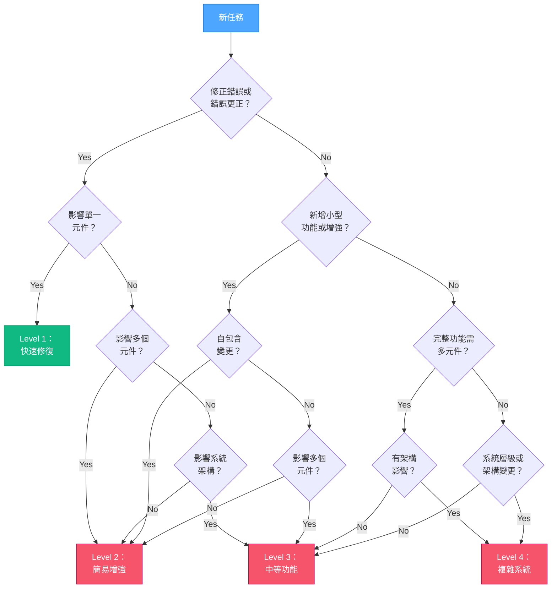
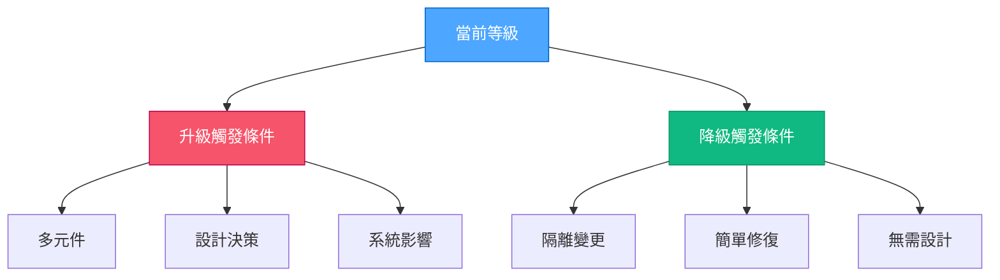

# VAN 模式：複雜度判定

> **重點摘要：** 本元件用於判定當前任務的適當複雜度等級（1-4），並據此引導後續流程。

## 🔍 複雜度決策樹



## 📋 等級指標

### Level 1：快速修復

- **關鍵字**：fix、bug、error、crash、issue
- **範圍**：單一元件
- **時間**：數分鐘至數小時
- **風險**：低，具隔離性
- **範例**：按鈕無法運作、樣式問題

### Level 2：簡易增強

- **關鍵字**：add、improve、update、enhance
- **範圍**：單一元件/子系統
- **時間**：數小時至 1-2 天
- **風險**：中等，具封閉性
- **範例**：新增表單欄位、改善驗證

### Level 3：中等功能

- **關鍵字**：implement、create、develop
- **範圍**：多個元件
- **時間**：數天至 1-2 週
- **風險**：顯著
- **範例**：用戶認證、儀表板

### Level 4：複雜系統

- **關鍵字**：system、architecture、redesign
- **範圍**：多個子系統
- **時間**：數週至數月
- **風險**：高，架構層級
- **範例**：支付系統、微服務

## 📋 複雜度檢查清單

```
✓ 複雜度判定
- 任務類型已識別？ [YES/NO]
- 範圍已評估？ [YES/NO]
- 時間已估算？ [YES/NO]
- 風險已評估？ [YES/NO]
- 相依套件已繪製？ [YES/NO]

→ 全部 YES：依等級進入對應流程
→ 任一 NO：請完成評估
```

## 🔄 等級切換觸發條件



## 📋 流程載入

依判定等級：

- Level 1：繼續於 VAN 模式
- Level 2-4：切換至 PLAN 模式

**下一步：** 載入對應等級的專屬流程

## 🚨 模式切換觸發（VAN → PLAN）

若複雜度為 Level 2、3 或 4：

```
🚫 偵測到 Level [2-4] 任務
VAN 模式下禁止實作
此任務必須進入 PLAN 模式
請輸入 'PLAN' 切換至規劃模式
```

## 📋 檢查點驗證範本（範例）

```
✓ 區段檢查點：複雜度判定
- 任務已分析？ [YES/NO]
- 複雜度等級已判定？ [YES/NO]

→ 若為 Level 1：進入 VAN 模式結束。
→ 若為 Level 2-4：觸發 PLAN 模式切換。
```

**下一步（Level 1）：** 完成 VAN 初始化（如有需要，初始化記憶體庫）。
**下一步（Level 2-4）：** 離開 VAN 模式並啟動 PLAN 模式。
