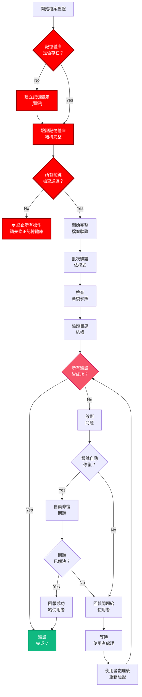
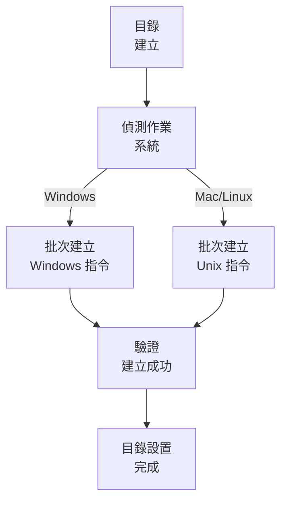

# 最佳化檔案驗證系統

🚨 關鍵：必須進行記憶體庫驗證 🚨
記憶體庫結構必須存在，否則不得進行任何檔案操作
此檢查必須於所有驗證流程中最先執行

> **重點摘要：** 本系統提供一套結構化方法，於任務實作前驗證檔案結構完整性，強調高效檢查與明確狀態回報。

## 🔍 檔案驗證流程



## 🧩 記憶體庫驗證 - 關鍵元件

記憶體庫驗證必須於任何檔案驗證流程中最先執行：

```javascript
function verifyMemoryBank() {
  // 檢查記憶體庫是否存在
  const memoryBankExists = checkDirectoryExists("memory-bank");
  if (!memoryBankExists) {
    console.error("⛔ 關鍵錯誤：記憶體庫不存在");
    createMemoryBankStructure();
    return verifyMemoryBankCreation();
  }

  // 檢查必要子目錄
  const requiredDirs = [
    "memory-bank/active-context",
    "memory-bank/system-patterns",
    "memory-bank/creative-phase",
    "memory-bank/implementation",
  ];

  const missingDirs = requiredDirs.filter((dir) => !checkDirectoryExists(dir));
  if (missingDirs.length > 0) {
    console.error(`⛔ 關鍵錯誤：缺少記憶體庫子目錄: ${missingDirs.join(", ")}`);
    createMissingDirectories(missingDirs);
    return verifyMemoryBankCreation();
  }

  // 檢查關鍵檔案
  const criticalFiles = [
    "memory-bank/active-context/activeContext.md",
    "memory-bank/system-patterns/systemPatterns.md",
  ];

  const missingFiles = criticalFiles.filter((file) => !checkFileExists(file));
  if (missingFiles.length > 0) {
    console.error(`⛔ 關鍵錯誤：缺少關鍵檔案: ${missingFiles.join(", ")}`);
    createMissingFiles(missingFiles);
    return verifyMemoryBankCreation();
  }

  return true; // 記憶體庫驗證成功
}

// 必須：此函式必須於其他驗證前呼叫
const memoryBankVerified = verifyMemoryBank();
if (!memoryBankVerified) {
  throw new Error("⛔ 記憶體庫驗證失敗 - 無法繼續");
}
```

## 📋 記憶體庫驗證清單

```
✓ 記憶體庫驗證清單
- 記憶體庫目錄存在？ [YES/NO]
- 必要子目錄存在？ [YES/NO]
- 關鍵檔案存在？ [YES/NO]
- 檔案內容有效？ [YES/NO]

→ 全部 YES：記憶體庫驗證通過 - 繼續檔案驗證
→ 任一 NO：停止所有處理並修正記憶體庫
```

## 🔍 批次驗證流程

## 📋 最佳化目錄建立



### 各平台專用指令

#### Windows (PowerShell)

```powershell
# 一次建立所有目錄
mkdir memory-bank, docs, docs\archive -ErrorAction SilentlyContinue

# 建立所有必要檔案
$files = @(".cursorrules", "tasks.md",
           "memory-bank\projectbrief.md",
           "memory-bank\productContext.md",
           "memory-bank\systemPatterns.md",
           "memory-bank\techContext.md",
           "memory-bank\activeContext.md",
           "memory-bank\progress.md")

foreach ($file in $files) {
    if (-not (Test-Path $file)) {
        New-Item -Path $file -ItemType File -Force
    }
}
```

#### Mac/Linux (Bash)

```bash
# 一次建立所有目錄
mkdir -p memory-bank docs/archive

# 建立所有必要檔案
touch .cursorrules tasks.md \
      memory-bank/projectbrief.md \
      memory-bank/productContext.md \
      memory-bank/systemPatterns.md \
      memory-bank/techContext.md \
      memory-bank/activeContext.md \
      memory-bank/progress.md
```

## 📝 流程最佳化驗證

請以批次驗證取代逐一檢查元件：

```powershell
# Windows - PowerShell
$requiredDirs = @("memory-bank", "docs", "docs\archive")
$requiredFiles = @(".cursorrules", "tasks.md")
$mbFiles = @("projectbrief.md", "productContext.md", "systemPatterns.md",
             "techContext.md", "activeContext.md", "progress.md")

$missingDirs = $requiredDirs | Where-Object { -not (Test-Path $_) -or -not (Test-Path $_ -PathType Container) }
$missingFiles = $requiredFiles | Where-Object { -not (Test-Path $_) -or (Test-Path $_ -PathType Container) }
$missingMBFiles = $mbFiles | ForEach-Object { "memory-bank\$_" } |
                  Where-Object { -not (Test-Path $_) -or (Test-Path $_ -PathType Container) }

if ($missingDirs.Count -eq 0 -and $missingFiles.Count -eq 0 -and $missingMBFiles.Count -eq 0) {
    Write-Output "✓ 所有必要元件已驗證"
} else {
    # 一次建立所有缺少項目
    if ($missingDirs.Count -gt 0) {
        $missingDirs | ForEach-Object { mkdir $_ -Force }
    }
    if ($missingFiles.Count -gt 0 -or $missingMBFiles.Count -gt 0) {
        $allMissingFiles = $missingFiles + $missingMBFiles
        $allMissingFiles | ForEach-Object { New-Item -Path $_ -ItemType File -Force }
    }
}
```

## 📝 範本初始化

以單一腳本最佳化範本建立：

```powershell
# Windows - PowerShell
$templates = @{
    "tasks.md" = @"
# 記憶體庫：任務

## 當前任務
[尚未定義任務]

## 狀態
- [ ] 任務定義
- [ ] 實作計畫
- [ ] 執行
- [ ] 文件

## 需求
[尚未定義需求]
"@

    "memory-bank\activeContext.md" = @"
# 記憶體庫：目前情境

## 當前焦點
[尚未定義焦點]

## 狀態
[尚未定義狀態]

## 最新變更
[尚未記錄變更]
"@

    # 其他範本可於此新增
}

foreach ($file in $templates.Keys) {
    if (Test-Path $file) {
        Set-Content -Path $file -Value $templates[$file]
    }
}
```

## 🔍 效能最佳化實務

1. **批次操作**：請務必以批次操作取代逐一指令

   ```
   # 正確：一次建立所有目錄
   mkdir memory-bank docs docs\archive

   # 錯誤：逐一建立目錄
   mkdir memory-bank
   mkdir docs
   mkdir docs\archive
   ```

2. **預先檢查最佳化**：先檢查所有需求，再只建立缺少項目

   ```
   # 先檢查缺少項目
   $missingItems = ...

   # 再只建立缺少項目
   if ($missingItems) { ... }
   ```

3. **錯誤處理**：所有指令皆應包含錯誤處理

   ```
   mkdir memory-bank, docs, docs\archive -ErrorAction SilentlyContinue
   ```

4. **平台自動適應**：自動偵測平台並使用對應指令

   ```
   if ($IsWindows) {
       # Windows 指令
   } else {
       # Unix 指令
   }
   ```

5. **單次驗證**：於單一流程中驗證目錄結構
   ```
   $requiredPaths = @("memory-bank", "docs", "docs\archive", ".cursorrules", "tasks.md")
   $missingPaths = $requiredPaths | Where-Object { -not (Test-Path $_) }
   ```

## 📝 驗證報告格式

```
✅ 驗證完成
- 已建立目錄：[清單]
- 已建立檔案：[清單]
- 所有元件已驗證

記憶體庫系統可用。
```
