# VAN 模式：初始化流程圖

🚨 強制第一步：記憶體庫建立 🚨
未建立記憶體庫結構前，所有操作皆不可進行

> **重點摘要：** 本視覺流程圖定義 VAN 模式下的專案初始化、任務分析與技術驗證流程。引導使用者完成平台偵測、檔案驗證、複雜度判定與技術驗證，確保在實作前正確設定。

## 🧭 VAN 模式流程

```mermaid
graph TD
    Start["啟動 VAN 模式"] --> PlatformDetect["平台偵測"]
    PlatformDetect --> DetectOS["偵測作業系統"]
    DetectOS --> CheckPath["檢查路徑分隔符格式"]
    CheckPath --> AdaptCmds["如有需要，調整指令"]
    AdaptCmds --> PlatformCP["⛔ 平台檢查點"]

    %% 加入關鍵記憶體庫檢查點
    PlatformCP --> MemoryBankCheck{"記憶體庫<br>是否存在？"}
    MemoryBankCheck -->|"No"| CreateMemoryBank["建立記憶體庫<br>[關鍵步驟]"]
    MemoryBankCheck -->|"Yes"| BasicFileVerify["基本檔案驗證"]
    CreateMemoryBank --> MemoryBankCP["⛔ 記憶體庫驗證 [必須]"]
    MemoryBankCP --> BasicFileVerify

    %% 基本檔案驗證與檢查點
    BasicFileVerify --> BatchCheck["批次檢查必要元件"]
    BatchCheck --> BatchCreate["批次建立必要結構"]
    BatchCreate --> BasicFileCP["⛔ 基本檔案檢查點"]

    %% 早期複雜度判定
    BasicFileCP --> EarlyComplexity["早期複雜度判定"]
    EarlyComplexity --> AnalyzeTask["分析任務需求"]
    AnalyzeTask --> EarlyLevelCheck{"複雜度等級？"}

    %% 等級處理路徑
    EarlyLevelCheck -->|"Level 1"| ComplexityCP["⛔ 複雜度檢查點"]
    EarlyLevelCheck -->|"Level 2-4"| CRITICALGATE["🚫 關鍵閘道：強制模式切換"]
    CRITICALGATE --> ForceExit["跳轉至 PLAN 模式"]

    %% Level 1 正常繼續
    ComplexityCP --> InitSystem["初始化記憶體庫"]
    InitSystem --> Complete1["Level 1 初始化完成"]

    %% Level 2+ 任務，經過 PLAN 與 CREATIVE 模式
    ForceExit -.-> OtherModes["PLAN → CREATIVE 模式"]
    OtherModes -.-> VANQA["VAN QA 模式"]
    VANQA --> QAProcess["技術驗證流程"]
    QAProcess --> QACheck{"所有檢查通過？"}
    QACheck -->|"Yes"| BUILD["進入 BUILD 模式"]
    QACheck -->|"No"| FixIssues["修正技術問題"]
    FixIssues --> QAProcess

    %% 節點樣式
    style PlatformCP fill:#f55,stroke:#d44,color:white
    style MemoryBankCP fill:#ff0000,stroke:#990000,color:white,stroke-width:3px
    style MemoryBankCheck fill:#ff0000,stroke:#990000,color:white,stroke-width:3px
    style CreateMemoryBank fill:#ff0000,stroke:#990000,color:white,stroke-width:3px
    style BasicFileCP fill:#f55,stroke:#d44,color:white
    style ComplexityCP fill:#f55,stroke:#d44,color:white
    style CRITICALGATE fill:#ff0000,stroke:#990000,color:white,stroke-width:3px
    style ForceExit fill:#ff0000,stroke:#990000,color:white,stroke-width:2px
    style VANQA fill:#4da6ff,stroke:#0066cc,color:white,stroke-width:3px
    style QAProcess fill:#4da6ff,stroke:#0066cc,color:white
    style QACheck fill:#4da6ff,stroke:#0066cc,color:white
    style FixIssues fill:#ff5555,stroke:#dd3333,color:white
```

## 🌐 平台偵測流程

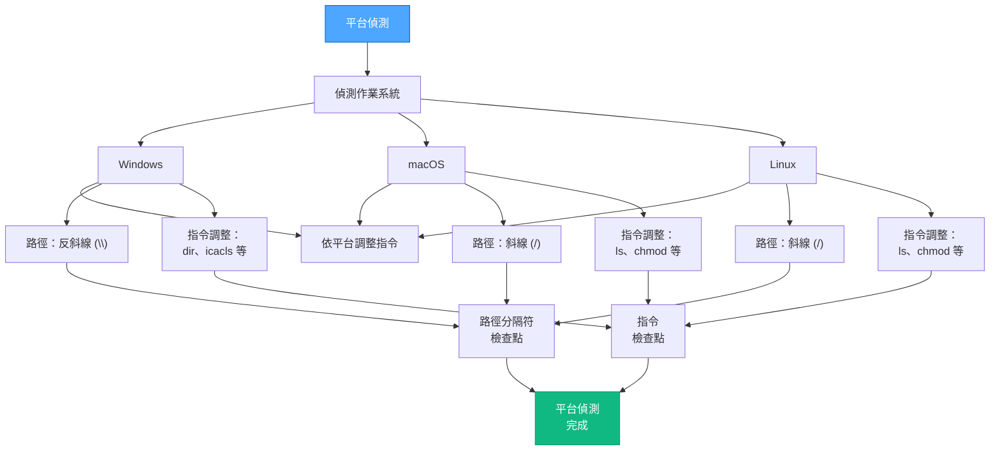

## 📁 檔案驗證流程

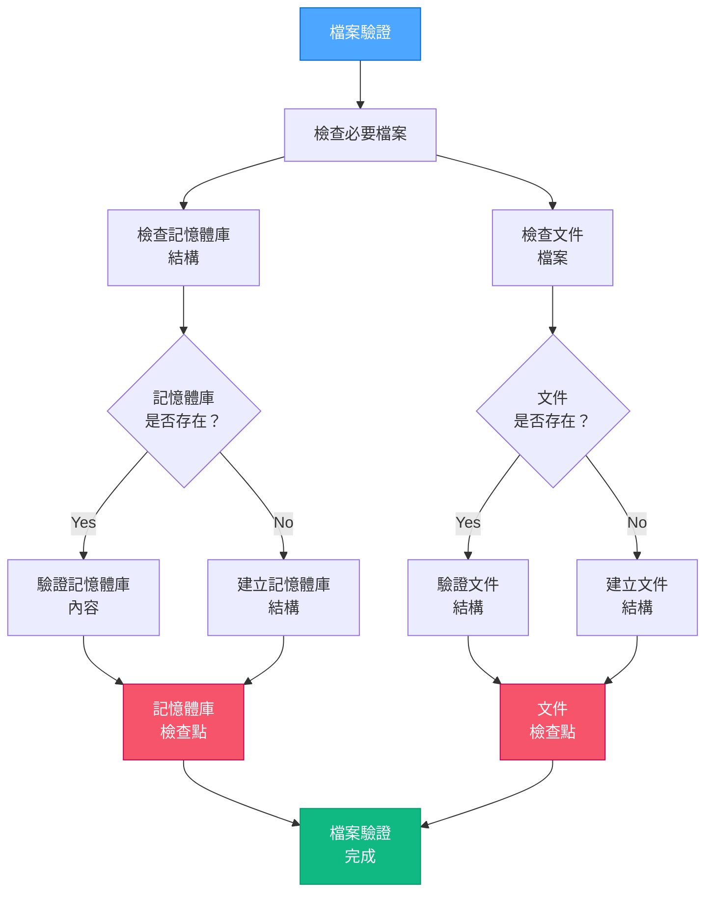

## 🧩 複雜度判定流程

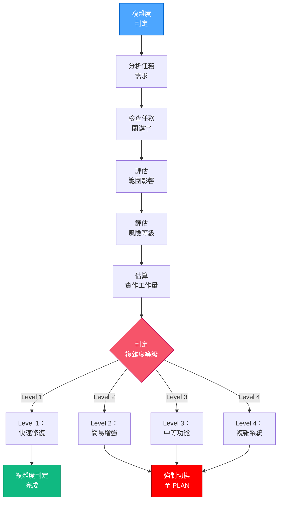

## 🔄 完整流程含 QA 驗證

完整流程於實作前包含技術驗證：


## 🔍 技術驗證總覽

VAN QA 技術驗證流程包含四大驗證點：

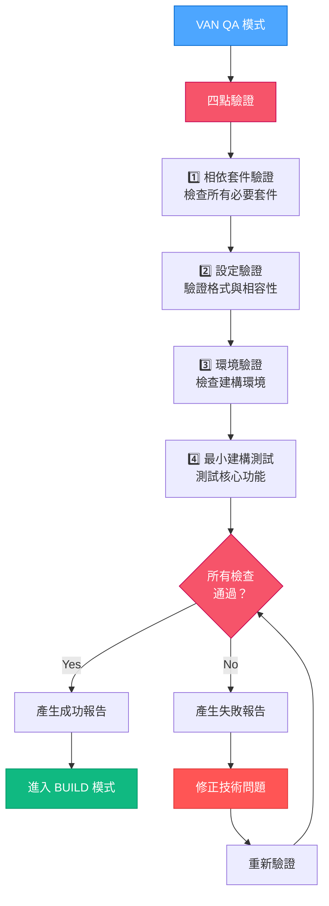

## 📝 驗證狀態格式

QA 驗證步驟包含明確狀態指示：

```
╔═════════════════ 🔍 QA 驗證狀態 ═════════════════╗
│ ✓ 設計決策   │ 已驗證可實作                    │
│ ✓ 相依套件   │ 所有必要套件已安裝              │
│ ✓ 設定檔     │ 格式已驗證，符合平台            │
│ ✓ 環境       │ 適合進行實作                    │
╚══════════════════════════════════════════════════╝
✅ 已驗證 - 可進入 BUILD 模式
```

## 🚨 模式切換觸發條件

### VAN → PLAN 切換

複雜度等級為 2-4 時：

```
🚫 偵測到 Level [2-4] 任務
VAN 模式下禁止實作
此任務必須進入 PLAN 模式
請輸入 'PLAN' 切換至規劃模式
```

### CREATIVE → VAN QA 切換

完成 CREATIVE 模式後：

```
⏭️ 下一模式：VAN QA
為驗證技術需求，請輸入 'VAN QA'
```

### VAN QA → BUILD 切換

驗證成功後：

```
✅ 技術驗證完成
所有前置條件皆已驗證
可進入 BUILD 模式
請輸入 'BUILD' 開始實作
```

## 🔒 BUILD 模式阻擋機制

系統於 QA 驗證未通過前，禁止進入 BUILD 模式：

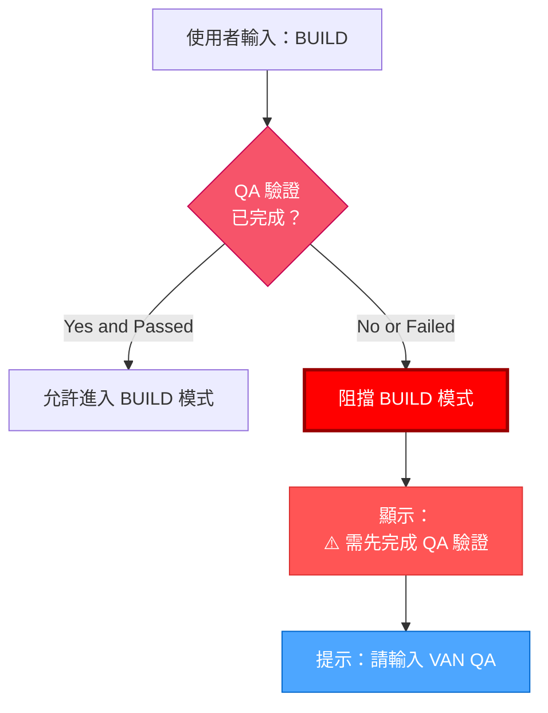

## 🔄 QA 指令優先權

QA 驗證可於任意流程階段呼叫，並立即中斷所有現有步驟（包含強制模式切換）：

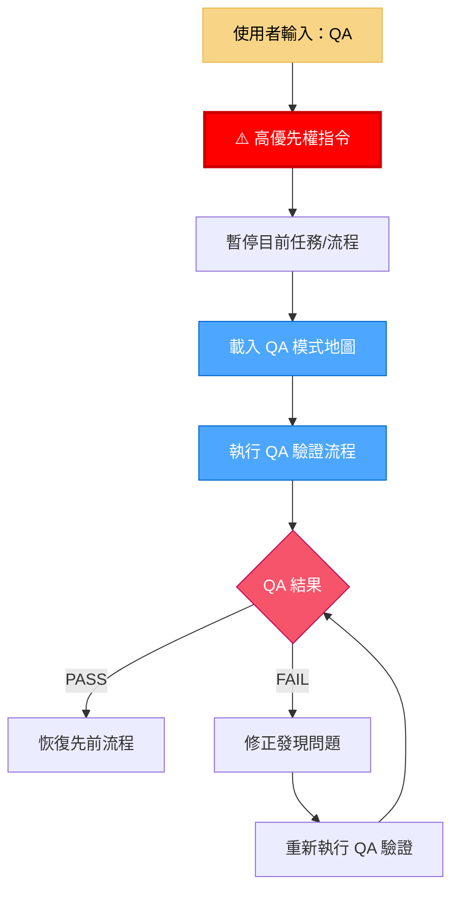

### QA 中斷規則

當使用者於任意時機輸入 **QA**：

1. **QA 指令必須立即取得最高優先權**，即使已觸發複雜度強制模式切換亦然。
2. 系統必須：
   - 立即載入 QA 模式地圖
   - 執行完整 QA 驗證流程
   - 於所有失敗時優先處理修正
3. **修正步驟優先於所有待處理模式切換或複雜度規則**
4. QA 驗證完成且通過後：
   - 恢復原先流程
   - 繼續執行必要模式切換

```
⚠️ QA 覆蓋已啟動
所有其他流程已暫停
QA 驗證檢查執行中...
發現任何問題必須修正後才能繼續流程
```

## 📋 檢查點驗證範本

VAN 模式每個主要檢查點皆使用此格式：

```
✓ 區段檢查點：[區段名稱]
- 項目 1？ [YES/NO]
- 項目 2？ [YES/NO]
- 項目 3？ [YES/NO]

→ 全部 YES：可進入下一區段
→ 任一 NO：請先修正缺漏項目
```

## 🚀 VAN 模式啟動

當使用者輸入 "VAN" 時，請回應並啟動流程：

```
使用者：VAN

回應：OK VAN - 開始初始化流程
```

完成 CREATIVE 模式後，當使用者輸入 "VAN QA" 時，請回應：

```
使用者：VAN QA

回應：OK VAN QA - 開始技術驗證
```

確保每個 VAN 模式階段皆有明確溝通。

## 🔍 詳細 QA 驗證流程

### 1️⃣ 相依套件驗證

此步驟驗證所有必要套件是否已安裝且相容：

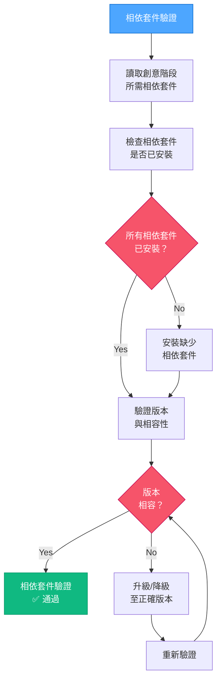

#### Windows (PowerShell) 實作範例：

```powershell
# Example: Verify Node.js dependencies for a React project
function Verify-Dependencies {
    $requiredDeps = @{
        "node" = ">=14.0.0"
        "npm" = ">=6.0.0"
    }

    $missingDeps = @()
    $incompatibleDeps = @()

    # Check Node.js version
    $nodeVersion = $null
    try {
        $nodeVersion = node -v
        if ($nodeVersion -match "v(\d+)\.(\d+)\.(\d+)") {
            $major = [int]$Matches[1]
            if ($major -lt 14) {
                $incompatibleDeps += "node (found $nodeVersion, required >=14.0.0)"
            }
        }
    } catch {
        $missingDeps += "node"
    }

    # Check npm version
    $npmVersion = $null
    try {
        $npmVersion = npm -v
        if ($npmVersion -match "(\d+)\.(\d+)\.(\d+)") {
            $major = [int]$Matches[1]
            if ($major -lt 6) {
                $incompatibleDeps += "npm (found $npmVersion, required >=6.0.0)"
            }
        }
    } catch {
        $missingDeps += "npm"
    }

    # Display results
    if ($missingDeps.Count -eq 0 -and $incompatibleDeps.Count -eq 0) {
        Write-Output "✅ 所有相依套件已驗證且相容"
        return $true
    } else {
        if ($missingDeps.Count -gt 0) {
            Write-Output "❌ 缺少的相依套件：$($missingDeps -join ', ')"
        }
        if ($incompatibleDeps.Count -gt 0) {
            Write-Output "❌ 不相容的版本：$($incompatibleDeps -join ', ')"
        }
        return $false
    }
}
```

#### Mac/Linux (Bash) 實作範例：

```bash
#!/bin/bash

# Example: Verify Node.js dependencies for a React project
verify_dependencies() {
    local missing_deps=()
    local incompatible_deps=()

    # Check Node.js version
    if command -v node &> /dev/null; then
        local node_version=$(node -v)
        if [[ $node_version =~ v([0-9]+)\.([0-9]+)\.([0-9]+) ]]; then
            local major=${BASH_REMATCH[1]}
            if (( major < 14 )); then
                incompatible_deps+=("node (found $node_version, required >=14.0.0)")
            fi
        fi
    else
        missing_deps+=("node")
    fi

    # Check npm version
    if command -v npm &> /dev/null; then
        local npm_version=$(npm -v)
        if [[ $npm_version =~ ([0-9]+)\.([0-9]+)\.([0-9]+) ]]; then
            local major=${BASH_REMATCH[1]}
            if (( major < 6 )); then
                incompatible_deps+=("npm (found $npm_version, required >=6.0.0)")
            fi
        fi
    else
        missing_deps+=("npm")
    fi

    # Display results
    if [ ${#missing_deps[@]} -eq 0 ] && [ ${#incompatible_deps[@]} -eq 0 ]; then
        echo "✅ 所有相依套件已驗證且相容"
        return 0
    else
        if [ ${#missing_deps[@]} -gt 0 ]; then
            echo "❌ 缺少的相依套件：${missing_deps[*]}"
        fi
        if [ ${#incompatible_deps[@]} -gt 0 ]; then
            echo "❌ 不相容的版本：${incompatible_deps[*]}"
        fi
        return 1
    fi
}
```

### 2️⃣ 設定驗證

此步驟驗證設定檔格式與相容性：

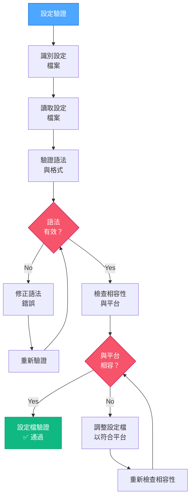

#### 設定驗證實作範例：

```powershell
# Example: Validate configuration files for a web project
function Validate-Configurations {
    $configFiles = @(
        "package.json",
        "tsconfig.json",
        "vite.config.js"
    )

    $invalidConfigs = @()
    $incompatibleConfigs = @()

    foreach ($configFile in $configFiles) {
        if (Test-Path $configFile) {
            # Check JSON syntax for JSON files
            if ($configFile -match "\.json$") {
                try {
                    Get-Content $configFile -Raw | ConvertFrom-Json | Out-Null
                } catch {
                    $invalidConfigs += "$configFile (JSON syntax error: $($_.Exception.Message))"
                    continue
                }
            }

            # Specific configuration compatibility checks
            if ($configFile -eq "vite.config.js") {
                $content = Get-Content $configFile -Raw
                # Check for React plugin in Vite config
                if ($content -notmatch "react\(\)") {
                    $incompatibleConfigs += "$configFile (Missing React plugin for React project)"
                }
            }
        } else {
            $invalidConfigs += "$configFile (file not found)"
        }
    }

    # Display results
    if ($invalidConfigs.Count -eq 0 -and $incompatibleConfigs.Count -eq 0) {
        Write-Output "✅ 所有設定檔已驗證且相容"
        return $true
    } else {
        if ($invalidConfigs.Count -gt 0) {
            Write-Output "❌ 無效的設定檔：$($invalidConfigs -join ', ')"
        }
        if ($incompatibleConfigs.Count -gt 0) {
            Write-Output "❌ 不相容的設定檔：$($incompatibleConfigs -join ', ')"
        }
        return $false
    }
}
```

### 3️⃣ 環境驗證

此步驟檢查環境是否正確設置以進行實作：

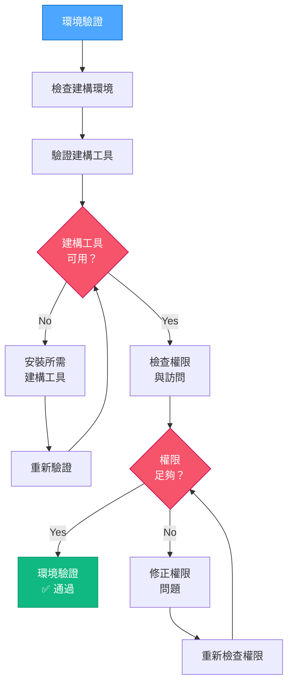

#### 環境驗證實作範例：

```powershell
# Example: Validate environment for a web project
function Validate-Environment {
    $requiredTools = @(
        @{Name = "git"; Command = "git --version"},
        @{Name = "node"; Command = "node --version"},
        @{Name = "npm"; Command = "npm --version"}
    )

    $missingTools = @()
    $permissionIssues = @()

    # Check build tools
    foreach ($tool in $requiredTools) {
        try {
            Invoke-Expression $tool.Command | Out-Null
        } catch {
            $missingTools += $tool.Name
        }
    }

    # Check write permissions in project directory
    try {
        $testFile = ".__permission_test"
        New-Item -Path $testFile -ItemType File -Force | Out-Null
        Remove-Item -Path $testFile -Force
    } catch {
        $permissionIssues += "當前目錄（寫入權限被拒）"
    }

    # Check if port 3000 is available (commonly used for dev servers)
    try {
        $listener = New-Object System.Net.Sockets.TcpListener([System.Net.IPAddress]::Loopback, 3000)
        $listener.Start()
        $listener.Stop()
    } catch {
        $permissionIssues += "3000 埠（已被佔用或訪問被拒）"
    }

    # Display results
    if ($missingTools.Count -eq 0 -and $permissionIssues.Count -eq 0) {
        Write-Output "✅ 環境驗證成功"
        return $true
    } else {
        if ($missingTools.Count -gt 0) {
            Write-Output "❌ 缺少的工具：$($missingTools -join ', ')"
        }
        if ($permissionIssues.Count -gt 0) {
            Write-Output "❌ 權限問題：$($permissionIssues -join ', ')"
        }
        return $false
    }
}
```

### 4️⃣ 最小建構測試

此步驟執行最小建構測試以確保核心功能正常：

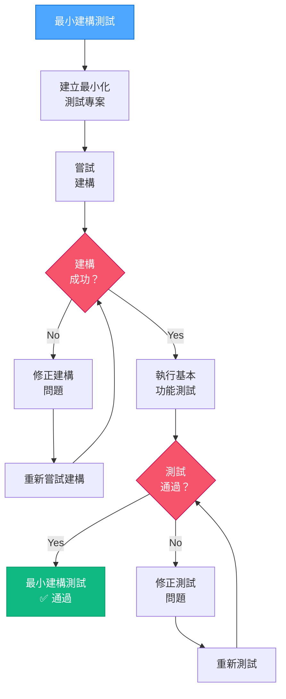

#### 最小建構測試實作範例：

```powershell
# Example: Perform minimal build test for a React project
function Perform-MinimalBuildTest {
    $buildSuccess = $false
    $testSuccess = $false

    # Create minimal test project
    $testDir = ".__build_test"
    if (Test-Path $testDir) {
        Remove-Item -Path $testDir -Recurse -Force
    }

    try {
        # Create minimal test directory
        New-Item -Path $testDir -ItemType Directory | Out-Null
        Push-Location $testDir

        # Initialize minimal package.json
        @"
{
  "name": "build-test",
  "version": "1.0.0",
  "description": "Minimal build test",
  "main": "index.js",
  "scripts": {
    "build": "echo Build test successful"
  }
}
"@ | Set-Content -Path "package.json"

        # Attempt build
        npm run build | Out-Null
        $buildSuccess = $true

        # Create minimal test file
        @"
console.log('Test successful');
"@ | Set-Content -Path "index.js"

        # Run basic test
        node index.js | Out-Null
        $testSuccess = $true

    } catch {
        Write-Output "❌ 建構測試失敗：$($_.Exception.Message)"
    } finally {
        Pop-Location
        if (Test-Path $testDir) {
            Remove-Item -Path $testDir -Recurse -Force
        }
    }

    # Display results
    if ($buildSuccess -and $testSuccess) {
        Write-Output "✅ 最小建構測試通過"
        return $true
    } else {
        if (-not $buildSuccess) {
            Write-Output "❌ 建構過程失敗"
        }
        if (-not $testSuccess) {
            Write-Output "❌ 基本功能測試失敗"
        }
        return $false
    }
}
```

## 📋 綜合 QA 報告格式

執行所有驗證步驟後，產生綜合報告：

```
╔═════════════════════ 🔍 QA 驗證報告 ══════════════════════╗
│                                                                     │
│  專案： [專案名稱]                                                  │
│  時間戳： [當前日期/時間]                                           │
│                                                                     │
│  1️⃣ 相依套件驗證                                                  │
│  ✓ 必要： [必要相依套件列表]                                      │
│  ✓ 已安裝： [已安裝相依套件列表]                                  │
│  ✓ 相容： [是/否]                                                  │
│                                                                     │
│  2️⃣ 設定驗證                                                      │
│  ✓ 設定檔： [設定檔列表]                                          │
│  ✓ 語法有效： [是/否]                                            │
│  ✓ 與平台相容： [是/否]                                         │
│                                                                     │
│  3️⃣ 環境驗證                                                      │
│  ✓ 建構工具： [可用/缺少]                                        │
│  ✓ 權限： [足夠/不足]                                            │
│  ✓ 環境準備： [是/否]                                            │
│                                                                     │
│  4️⃣ 最小建構測試                                                  │
│  ✓ 建構過程： [成功/失敗]                                        │
│  ✓ 功能測試： [通過/未通過]                                      │
│  ✓ 建構準備： [是/否]                                            │
│                                                                     │
│  🚨 最終判定： [通過/失敗]                                          │
│  ➡️ [成功訊息或錯誤詳情]                                          │
╚═════════════════════════════════════════════════════════════════════╝
```

## ❌ 失敗報告格式

若任何驗證步驟失敗，產生詳細失敗報告：

```
⚠️⚠️⚠️ QA 驗證失敗 ⚠️⚠️⚠️

在進入 BUILD 模式前，必須先解決以下問題：

1️⃣ 相依套件問題：
- [相依套件問題詳細描述]
- [建議修正方法]

2️⃣ 設定檔問題：
- [設定檔問題詳細描述]
- [建議修正方法]

3️⃣ 環境問題：
- [環境問題詳細描述]
- [建議修正方法]

4️⃣ 建構測試問題：
- [建構測試問題詳細描述]
- [建議修正方法]

⚠️ 在解決這些問題之前，BUILD 模式將被阻擋。
修正問題後請輸入 'VAN QA' 重新驗證。
```

## 🔄 與設計決策整合

VAN QA 模式從 CREATIVE 階段讀取並驗證設計決策：

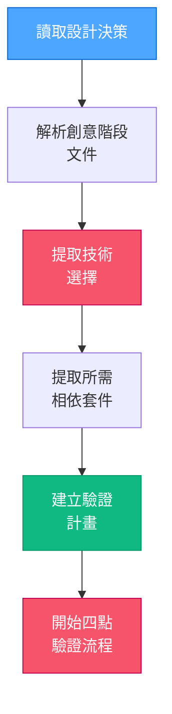

### 技術提取過程：

```powershell
# Example: Extract technology choices from creative phase documentation
function Extract-TechnologyChoices {
    $techChoices = @{}

    # Read from systemPatterns.md
    if (Test-Path "memory-bank\systemPatterns.md") {
        $content = Get-Content "memory-bank\systemPatterns.md" -Raw

        # Extract framework choice
        if ($content -match "Framework:\s*(\w+)") {
            $techChoices["framework"] = $Matches[1]
        }

        # Extract UI library choice
        if ($content -match "UI Library:\s*(\w+)") {
            $techChoices["ui_library"] = $Matches[1]
        }

        # Extract state management choice
        if ($content -match "State Management:\s*([^\\n]+)") {
            $techChoices["state_management"] = $Matches[1].Trim()
        }
    }

    return $techChoices
}
```

## 🚨 實作阻擋機制

若 QA 驗證失敗，系統將阻止進入 BUILD 模式：

```powershell
# Example: Enforce QA validation before allowing BUILD mode
function Check-QAValidationStatus {
    $qaStatusFile = "memory-bank\.qa_validation_status"

    if (Test-Path $qaStatusFile) {
        $status = Get-Content $qaStatusFile -Raw
        if ($status -match "PASS") {
            return $true
        }
    }

    # Display block message
    Write-Output "`n`n"
    Write-Output "🚫🚫🚫🚫🚫🚫🚫🚫🚫🚫🚫🚫🚫🚫🚫🚫🚫🚫🚫🚫🚫🚫🚫🚫🚫🚫🚫🚫🚫"
    Write-Output "⛔️ BUILD 模式被阻擋：需完成 QA 驗證"
    Write-Output "⛔️ 必須先完成 QA 驗證才能進入 BUILD 模式"
    Write-Output "`n"
    Write-Output "請輸入 'VAN QA' 進行技術驗證"
    Write-Output "`n"
    Write-Output "🚫 未經驗證的情況下禁止實作 🚫"
    Write-Output "🚫🚫🚫🚫🚫🚫🚫🚫🚫🚫🚫🚫🚫🚫🚫🚫🚫🚫🚫🚫🚫🚫🚫🚫🚫🚫🚫🚫🚫"

    return $false
}
```

## 🧪 常見 QA 驗證修正

以下為 QA 驗證中常見問題之修正建議：

### 相依套件問題：

- **缺少 Node.js**：從 https://nodejs.org/ 安裝 Node.js
- **npm 版本過舊**：執行 `npm install -g npm@latest` 進行更新
- **缺少套件**：執行 `npm install` 或 `npm install [package-name]`

### 設定檔問題：

- **JSON 格式無效**：使用 JSON 驗證工具檢查語法
- **Vite 設定缺少 React 外掛**：於 vite.config.js 中新增 `import react from '@vitejs/plugin-react'` 及 `plugins: [react()]`
- **TypeScript 設定不相容**：更新 `tsconfig.json` 以符合正確的 React 設定

### 環境問題：

- **權限被拒**：以管理員身份執行終端機（Windows）或使用 sudo（Mac/Linux）
- **埠已被佔用**：終止佔用該埠的進程或變更設定中的埠號
- **缺少建構工具**：安裝所需的命令列工具

### 建構測試問題：

- **建構失敗**：檢查控制台中的具體錯誤訊息
- **測試失敗**：確認最小配置是否正確
- **路徑問題**：確保路徑使用正確的分隔符號，符合平台要求

## 🔒 最終 QA 驗證檢查點

```
✓ SECTION CHECKPOINT: QA VALIDATION
- 相依套件驗證通過？ [YES/NO]
- 設定驗證通過？ [YES/NO]
- 環境驗證通過？ [YES/NO]
- 最小建構測試通過？ [YES/NO]

→ 全部 YES：準備進入 BUILD 模式
→ 任一 NO：請修正識別出的問題後再繼續
```
