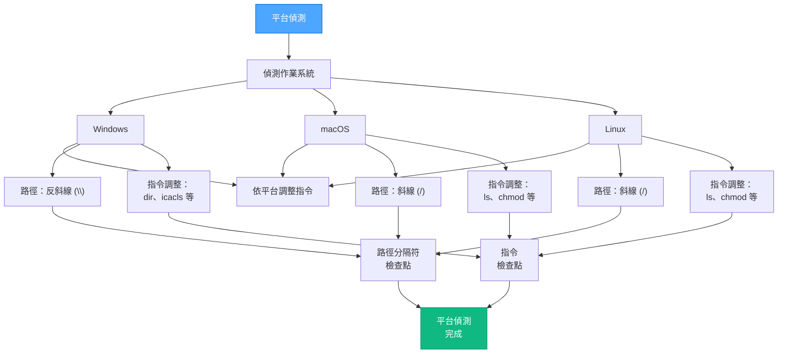

# VAN 模式：平台偵測

> **重點摘要：** 偵測作業系統、判斷路徑分隔符，並記錄所需的指令調整。

## 🌐 平台偵測流程



## 📋 檢查點驗證範本（範例）

```
✓ 區段檢查點：平台偵測
- 作業系統已偵測？ [YES/NO]
- 路徑分隔符已確認？ [YES/NO]
- 指令調整已記錄？ [YES/NO]

→ 全部 YES：平台偵測完成。
→ 任一 NO：請先修正再繼續。
```

**下一步：** 載入並處理 `van-file-verification.md`。
