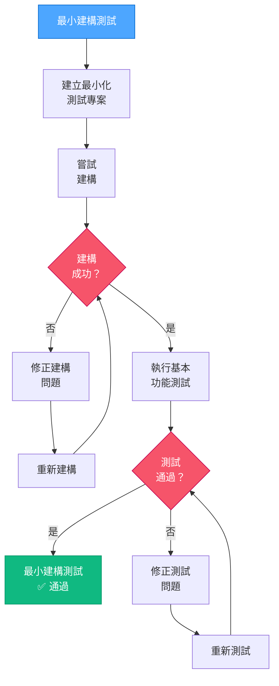

# VAN QA：最小建構測試

> **重點摘要：** 本元件執行最小建構測試，以確保核心建構功能正常運作。

## 4️⃣ 最小建構測試流程



### 最小建構測試實作範例：

```powershell
# 範例：對 React 專案執行最小建構測試
function Perform-MinimalBuildTest {
    $buildSuccess = $false
    $testSuccess = $false

    # 建立最小測試專案
    $testDir = ".__build_test"
    if (Test-Path $testDir) {
        Remove-Item -Path $testDir -Recurse -Force
    }

    try {
        # 建立最小測試目錄
        New-Item -Path $testDir -ItemType Directory | Out-Null
        Push-Location $testDir

        # 初始化最小 package.json
        @"
{
  "name": "build-test",
  "version": "1.0.0",
  "description": "Minimal build test",
  "main": "index.js",
  "scripts": {
    "build": "echo Build test successful"
  }
}
"@ | Set-Content -Path "package.json"

        # 嘗試建構
        npm run build | Out-Null
        $buildSuccess = $true

        # 建立最小測試檔案
        @"
console.log('Test successful');
"@ | Set-Content -Path "index.js"

        # 執行基本測試
        node index.js | Out-Null
        $testSuccess = $true

    } catch {
        Write-Output "❌ 建構測試失敗: $($_.Exception.Message)"
    } finally {
        Pop-Location
        if (Test-Path $testDir) {
            Remove-Item -Path $testDir -Recurse -Force
        }
    }

    # 顯示結果
    if ($buildSuccess -and $testSuccess) {
        Write-Output "✅ 最小建構測試通過"
        return $true
    } else {
        if (-not $buildSuccess) {
            Write-Output "❌ 建構流程失敗"
        }
        if (-not $testSuccess) {
            Write-Output "❌ 基本功能測試失敗"
        }
        return $false
    }
}
```

## 📋 最小建構測試檢查點

```
✓ 檢查點：最小建構測試
- 測試專案建立成功？ [是/否]
- 建構流程順利完成？ [是/否]
- 基本功能測試通過？ [是/否]

→ 若皆為「是」：QA 驗證完成，請產生成功報告。
→ 若有「否」：請先修正建構問題再繼續。
```

**下一步（通過時）：** 載入 `van-qa-utils/reports.md` 產生成功報告。
**下一步（失敗時）：** 請參考 `van-qa-utils/common-fixes.md` 以修正建構測試問題。
