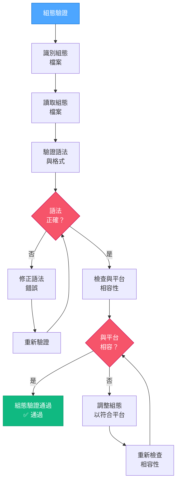

# VAN QA：組態驗證

> **重點摘要：** 本元件驗證組態檔案語法正確且與專案及平台相容。

## 2️⃣ 組態驗證流程



### 組態驗證實作範例：

```powershell
# 範例：驗證網頁專案組態檔案
function Validate-Configurations {
    $configFiles = @(
        "package.json",
        "tsconfig.json",
        "vite.config.js"
    )

    $invalidConfigs = @()
    $incompatibleConfigs = @()

    foreach ($configFile in $configFiles) {
        if (Test-Path $configFile) {
            # 檢查 JSON 檔案語法
            if ($configFile -match "\.json$") {
                try {
                    Get-Content $configFile -Raw | ConvertFrom-Json | Out-Null
                } catch {
                    $invalidConfigs += "$configFile (JSON 語法錯誤: $($_.Exception.Message))"
                    continue
                }
            }

            # 特定組態相容性檢查
            if ($configFile -eq "vite.config.js") {
                $content = Get-Content $configFile -Raw
                # 檢查 Vite 組態是否有 React plugin
                if ($content -notmatch "react\(\)") {
                    $incompatibleConfigs += "$configFile (React 專案缺少 React plugin)"
                }
            }
        } else {
            $invalidConfigs += "$configFile (檔案不存在)"
        }
    }

    # 顯示結果
    if ($invalidConfigs.Count -eq 0 -and $incompatibleConfigs.Count -eq 0) {
        Write-Output "✅ 所有組態已驗證且相容"
        return $true
    } else {
        if ($invalidConfigs.Count -gt 0) {
            Write-Output "❌ 組態錯誤: $($invalidConfigs -join ', ')"
        }
        if ($incompatibleConfigs.Count -gt 0) {
            Write-Output "❌ 組態不相容: $($incompatibleConfigs -join ', ')"
        }
        return $false
    }
}
```

## 📋 組態驗證檢查點

```
✓ 檢查點：組態驗證
- 所有組態檔案皆存在？ [是/否]
- 所有組態語法正確？ [是/否]
- 所有組態與平台相容？ [是/否]

→ 若皆為「是」：繼續進行環境驗證。
→ 若有「否」：請先修正組態問題再繼續。
```

**下一步（通過時）：** 載入 `van-qa-checks/environment-check.md`。
**下一步（失敗時）：** 請參考 `van-qa-utils/common-fixes.md` 以修正組態問題。
