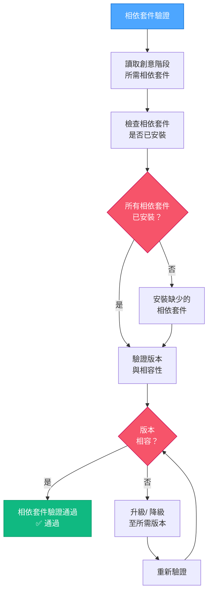

# VAN QA：相依套件驗證

> **重點摘要：** 本元件驗證所有所需相依套件已安裝且與專案需求相容。

## 1️⃣ 相依套件驗證流程



### Windows (PowerShell) 實作範例：

```powershell
# 範例：驗證 React 專案的 Node.js 相依套件
function Verify-Dependencies {
    $requiredDeps = @{ "node" = ">=14.0.0"; "npm" = ">=6.0.0" }
    $missingDeps = @(); $incompatibleDeps = @()

    # 檢查 Node.js 版本
    try {
        $nodeVersion = node -v
        if ($nodeVersion -match "v(\d+)\.(\d+)\.(\d+)") {
            $major = [int]$Matches[1]
            if ($major -lt 14) {
                $incompatibleDeps += "node (found $nodeVersion, required >=14.0.0)"
            }
        }
    } catch {
        $missingDeps += "node"
    }

    # 檢查 npm 版本
    try {
        $npmVersion = npm -v
        if ($npmVersion -match "(\d+)\.(\d+)\.(\d+)") {
            $major = [int]$Matches[1]
            if ($major -lt 6) {
                $incompatibleDeps += "npm (found $npmVersion, required >=6.0.0)"
            }
        }
    } catch {
        $missingDeps += "npm"
    }

    # 顯示結果
    if ($missingDeps.Count -eq 0 -and $incompatibleDeps.Count -eq 0) {
        Write-Output "✅ 所有相依套件已驗證且相容"
        return $true
    } else {
        if ($missingDeps.Count -gt 0) {
            Write-Output "❌ 缺少相依套件: $($missingDeps -join ', ')"
        }
        if ($incompatibleDeps.Count -gt 0) {
            Write-Output "❌ 版本不相容: $($incompatibleDeps -join ', ')"
        }
        return $false
    }
}
```

### Mac/Linux (Bash) 實作範例：

```bash
#!/bin/bash

# 範例：驗證 React 專案的 Node.js 相依套件
verify_dependencies() {
    local missing_deps=()
    local incompatible_deps=()

    # 檢查 Node.js 版本
    if command -v node &> /dev/null; then
        local node_version=$(node -v)
        if [[ $node_version =~ v([0-9]+)\.([0-9]+)\.([0-9]+) ]]; then
            local major=${BASH_REMATCH[1]}
            if (( major < 14 )); then
                incompatible_deps+=("node (found $node_version, required >=14.0.0)")
            fi
        fi
    else
        missing_deps+=("node")
    fi

    # 檢查 npm 版本
    if command -v npm &> /dev/null; then
        local npm_version=$(npm -v)
        if [[ $npm_version =~ ([0-9]+)\.([0-9]+)\.([0-9]+) ]]; then
            local major=${BASH_REMATCH[1]}
            if (( major < 6 )); then
                incompatible_deps+=("npm (found $npm_version, required >=6.0.0)")
            fi
        fi
    else
        missing_deps+=("npm")
    fi

    # 顯示結果
    if [ ${#missing_deps[@]} -eq 0 ] && [ ${#incompatible_deps[@]} -eq 0 ]; then
        echo "✅ 所有相依套件已驗證且相容"
        return 0
    else
        if [ ${#missing_deps[@]} -gt 0 ]; then
            echo "❌ 缺少相依套件: ${missing_deps[*]}"
        fi
        if [ ${#incompatible_deps[@]} -gt 0 ]; then
            echo "❌ 版本不相容: ${incompatible_deps[*]}"
        fi
        return 1
    fi
}
```

## 📋 相依套件驗證檢查點

```
✓ 檢查點：相依套件驗證
- 所需相依套件已識別？ [是/否]
- 所有相依套件已安裝？ [是/否]
- 所有版本皆相容？ [是/否]

→ 若皆為「是」：繼續進行組態驗證。
→ 若有「否」：請先修正相依套件問題再繼續。
```

**下一步（通過時）：** 載入 `van-qa-checks/config-check.md`。
**下一步（失敗時）：** 請參考 `van-qa-utils/common-fixes.md` 以修正相依套件問題。
