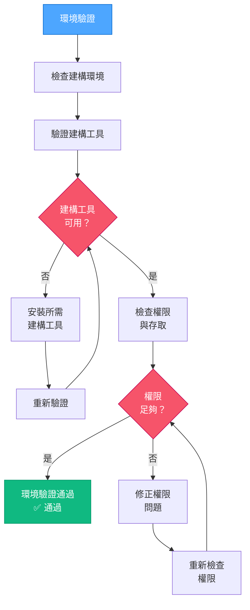

# VAN QA：環境驗證

> **重點摘要：** 本元件驗證建構環境已正確設定，並具備所需工具與權限。

## 3️⃣ 環境驗證流程



### 環境驗證實作範例：

```powershell
# 範例：驗證網頁專案環境
function Validate-Environment {
    $requiredTools = @(
        @{Name = "git"; Command = "git --version"},
        @{Name = "node"; Command = "node --version"},
        @{Name = "npm"; Command = "npm --version"}
    )

    $missingTools = @()
    $permissionIssues = @()

    # 檢查建構工具
    foreach ($tool in $requiredTools) {
        try {
            Invoke-Expression $tool.Command | Out-Null
        } catch {
            $missingTools += $tool.Name
        }
    }

    # 檢查專案目錄寫入權限
    try {
        $testFile = ".__permission_test"
        New-Item -Path $testFile -ItemType File -Force | Out-Null
        Remove-Item -Path $testFile -Force
    } catch {
        $permissionIssues += "目前目錄（無寫入權限）"
    }

    # 檢查 3000 埠口是否可用（常用於開發伺服器）
    try {
        $listener = New-Object System.Net.Sockets.TcpListener([System.Net.IPAddress]::Loopback, 3000)
        $listener.Start()
        $listener.Stop()
    } catch {
        $permissionIssues += "3000 埠口（已被佔用或存取被拒）"
    }

    # 顯示結果
    if ($missingTools.Count -eq 0 -and $permissionIssues.Count -eq 0) {
        Write-Output "✅ 環境驗證成功"
        return $true
    } else {
        if ($missingTools.Count -gt 0) {
            Write-Output "❌ 缺少工具: $($missingTools -join ', ')"
        }
        if ($permissionIssues.Count -gt 0) {
            Write-Output "❌ 權限問題: $($permissionIssues -join ', ')"
        }
        return $false
    }
}
```

## 📋 環境驗證檢查點

```
✓ 檢查點：環境驗證
- 所需建構工具皆已安裝？ [是/否]
- 專案目錄權限足夠？ [是/否]
- 所需埠口可用？ [是/否]

→ 若皆為「是」：繼續進行最小建構測試。
→ 若有「否」：請先修正環境問題再繼續。
```

**下一步（通過時）：** 載入 `van-qa-checks/build-test.md`。
**下一步（失敗時）：** 請參考 `van-qa-utils/common-fixes.md` 以修正環境問題。
