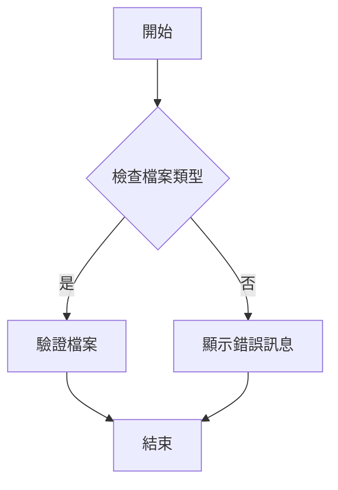

# 檔案驗證

## 檔案驗證規則

1. 所有自然語言描述必須翻譯為繁體中文。
2. 保留技術名詞、變數、指令結構與格式不變。

## 一般說明

本檔案用於驗證其他檔案的正確性與完整性。

## Mermaid 圖

## 節點顯示文字

- 開始：流程開始的起點。
- 檢查檔案類型：確認檔案是否為指定類型。
- 驗證檔案：執行檔案的正確性驗證。
- 顯示錯誤訊息：當檔案類型不正確時，顯示的錯誤提示。
- 結束：流程結束的終點。
