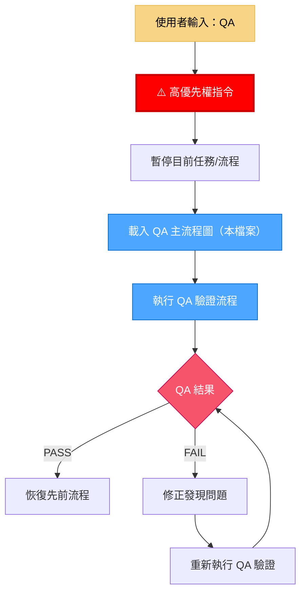
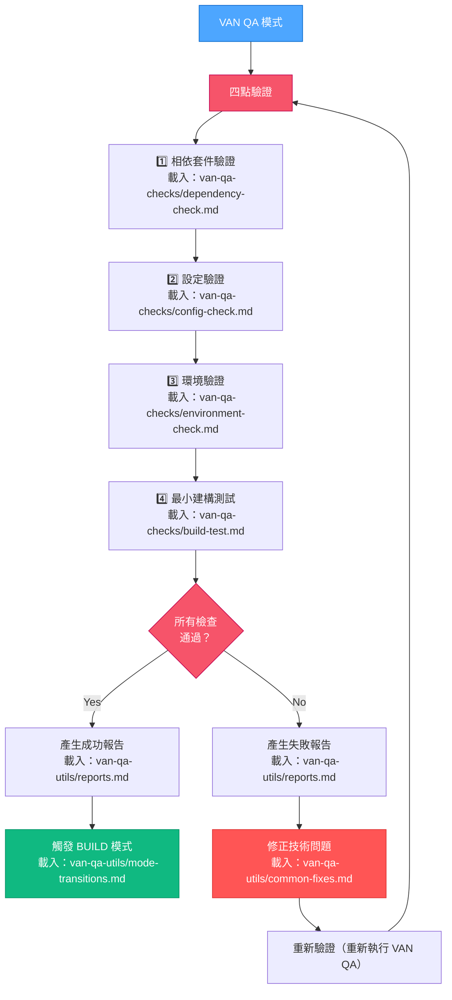
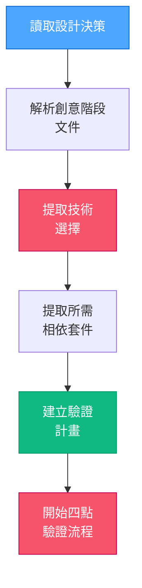

# VAN 模式：QA 技術驗證（主進入點）

> **重點摘要：** 這是 QA 驗證流程的進入點，於 CREATIVE 模式結束後、BUILD 模式開始前執行。確保所有技術需求在實作前皆已符合。

## 📣 如何使用這些 QA 規則

如需存取任一 QA 驗證規則或元件，請使用 `fetch_rules` 工具並輸入正確規則名稱：

```
// 關鍵：請務必使用 fetch_rules 載入驗證元件
// 如需詳細範例與說明，請載入：
// isolation_rules/visual-maps/van-qa-utils/rule-calling-guide
```

## 🚀 VAN QA 模式啟動

完成 CREATIVE 模式後，當使用者輸入 "VAN QA" 時，請回應：



### QA 中斷規則

1. **立即優先權：** `QA` 指令會中斷一切流程。
2. **載入與執行：** 載入本流程圖（`van-qa-main.md`）及其元件（見下）。
3. **修正優先：** 修正步驟優先於所有待處理模式切換。
4. **恢復：** 通過時恢復原流程。

```
⚠️ QA 覆蓋已啟動
所有其他流程已暫停
QA 驗證檢查執行中...
發現任何問題必須修正後才能繼續流程
```

## 🔍 技術驗證總覽

四點驗證流程，並可選擇性載入：



## 🔄 與設計決策整合

讀取 CREATIVE 階段產出以輔助驗證：



## 📋 元件載入順序

QA 驗證流程依下列順序選擇性載入：

1. **主進入點（本檔案）**：`van-qa-main.md`
2. **驗證檢查**：
   - `van-qa-checks/dependency-check.md`
   - `van-qa-checks/config-check.md`
   - `van-qa-checks/environment-check.md`
   - `van-qa-checks/build-test.md`
3. **工具（視需要載入）**：
   - `van-qa-utils/reports.md`
   - `van-qa-utils/common-fixes.md`
   - `van-qa-utils/mode-transitions.md`

## 📋 最終 QA 驗證檢查點

```
✓ 區段檢查點：QA 驗證
- 相依套件驗證通過？ [YES/NO]
- 設定驗證通過？ [YES/NO]
- 環境驗證通過？ [YES/NO]
- 最小建構測試通過？ [YES/NO]

→ 全部 YES：準備進入 BUILD 模式切換。
→ 任一 NO：請修正問題並重新執行 VAN QA。
```

**下一步（通過時）：** 觸發 BUILD 模式（載入 `van-qa-utils/mode-transitions.md`）。
**下一步（失敗時）：** 處理問題（載入 `van-qa-utils/common-fixes.md`）並重新執行 `VAN QA`。
