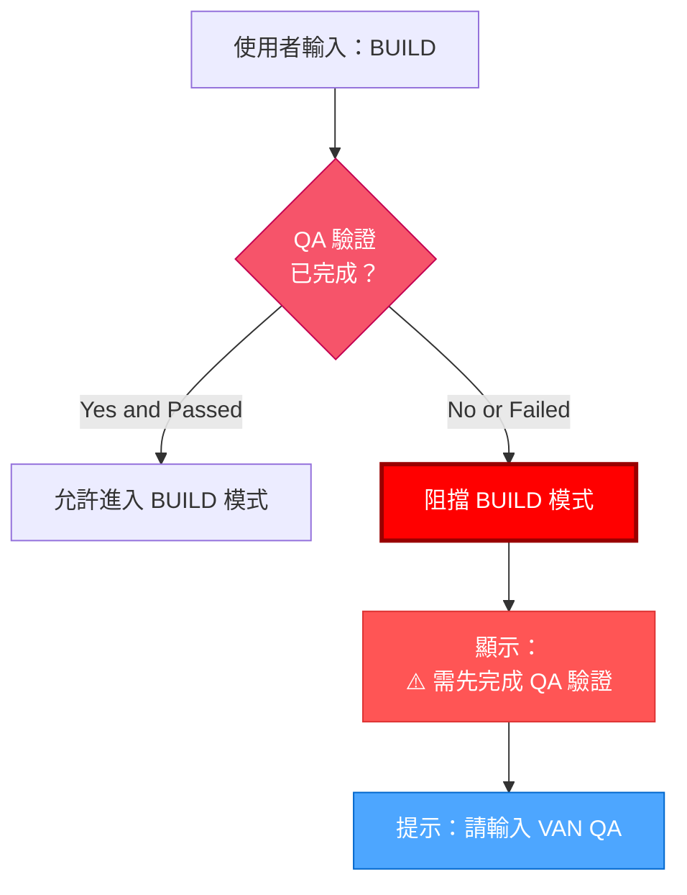

# VAN QA：模式切換

> **重點摘要：** 本元件負責模式間切換，特別是 QA 驗證到 BUILD 模式的切換，並於 QA 驗證未通過時阻擋進入 BUILD 模式。

## 🔒 BUILD 模式阻擋機制

系統於 QA 驗證未通過前，禁止進入 BUILD 模式：



### 實作範例（PowerShell）：

```powershell
# 進入 BUILD 模式前檢查 QA 狀態
function Check-QAValidationStatus {
    $qaStatusFile = "memory-bank\.qa_validation_status" # 狀態由 reports.md 寫入

    if (Test-Path $qaStatusFile) {
        $status = Get-Content $qaStatusFile -Raw
        if ($status -match "PASS") {
            return $true
        }
    }

    # 顯示阻擋訊息
    Write-Output "`n`n"
    Write-Output "🚫🚫🚫🚫🚫🚫🚫🚫🚫🚫🚫🚫🚫🚫🚫🚫🚫🚫🚫🚫🚫🚫🚫🚫🚫🚫🚫🚫🚫"
    Write-Output "⛔️ BUILD 模式被阻擋：需完成 QA 驗證"
    Write-Output "⛔️ 必須先完成 QA 驗證才能進入 BUILD 模式"
    Write-Output "`n"
    Write-Output "請輸入 'VAN QA' 進行技術驗證"
    Write-Output "`n"
    Write-Output "🚫 未經驗證的情況下禁止實作 🚫"
    Write-Output "🚫🚫🚫🚫🚫🚫🚫🚫🚫🚫🚫🚫🚫🚫🚫🚫🚫🚫🚫🚫🚫🚫🚫🚫🚫🚫🚫🚫🚫"

    return $false
}
```

## 🚨 模式切換觸發條件

### CREATIVE → VAN QA 切換：

完成 CREATIVE 階段後，請提示 QA 驗證：

```
⏭️ 下一模式：VAN QA
為驗證技術需求，請輸入 'VAN QA'
```

### VAN QA → BUILD 切換（驗證通過時）：

QA 驗證成功後，請提示可進入 BUILD 模式：

```
✅ 技術驗證完成
所有前置條件皆已驗證
可進入 BUILD 模式
請輸入 'BUILD' 開始實作
```

### 手動進入 BUILD 模式（已通過 QA 驗證時）：

當使用者手動輸入 'BUILD'，請先檢查 QA 狀態再允許進入：

```powershell
# 處理 BUILD 模式請求
function Handle-BuildModeRequest {
    if (Check-QAValidationStatus) {
        # 允許切換至 BUILD 模式
        Write-Output "`n"
        Write-Output "✅ QA 驗證檢查：通過"
        Write-Output "載入 BUILD 模式..."
        Write-Output "`n"

        # 此處可載入 BUILD 模式流程圖
        # [載入 BUILD 模式流程圖的程式碼]

        return $true
    }

    # QA 驗證失敗或未完成，BUILD 模式被阻擋
    return $false
}
```

**下一步（QA 驗證通過時）：** 進入 BUILD 模式。
**下一步（QA 驗證失敗時）：** 返回 QA 驗證流程。
