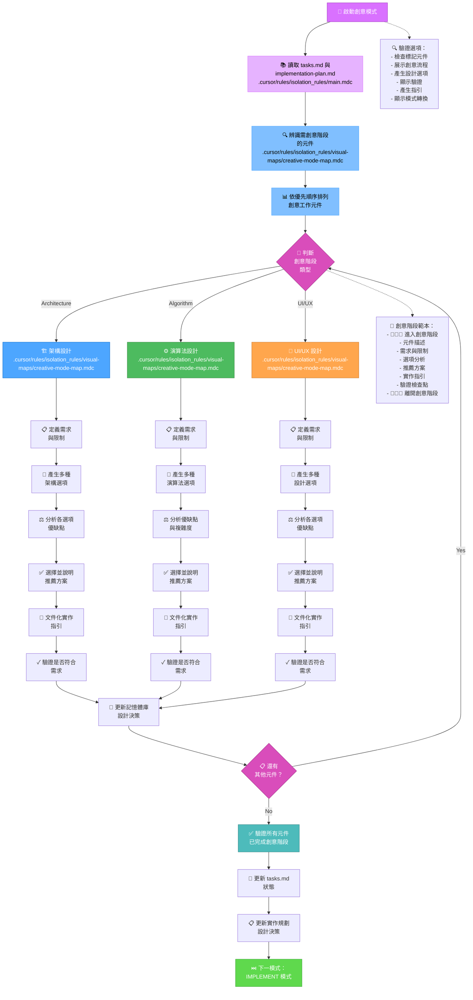
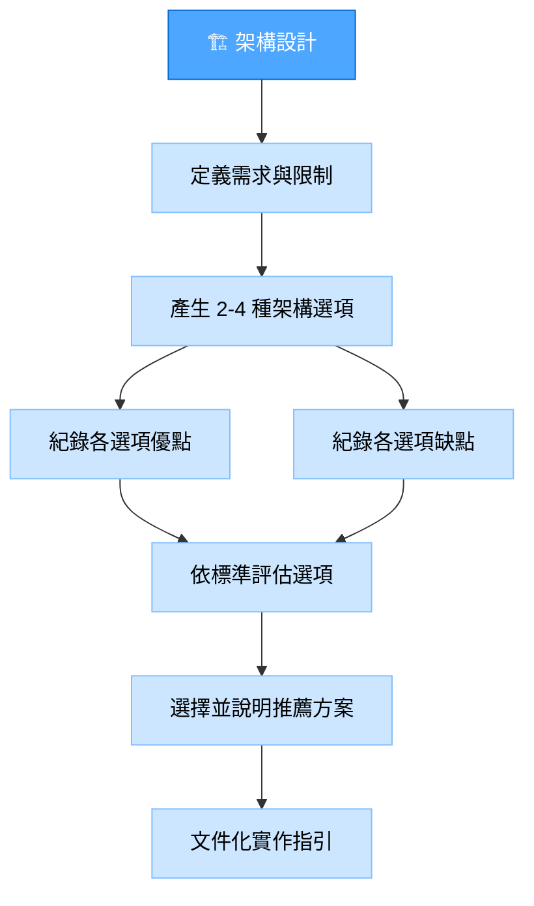
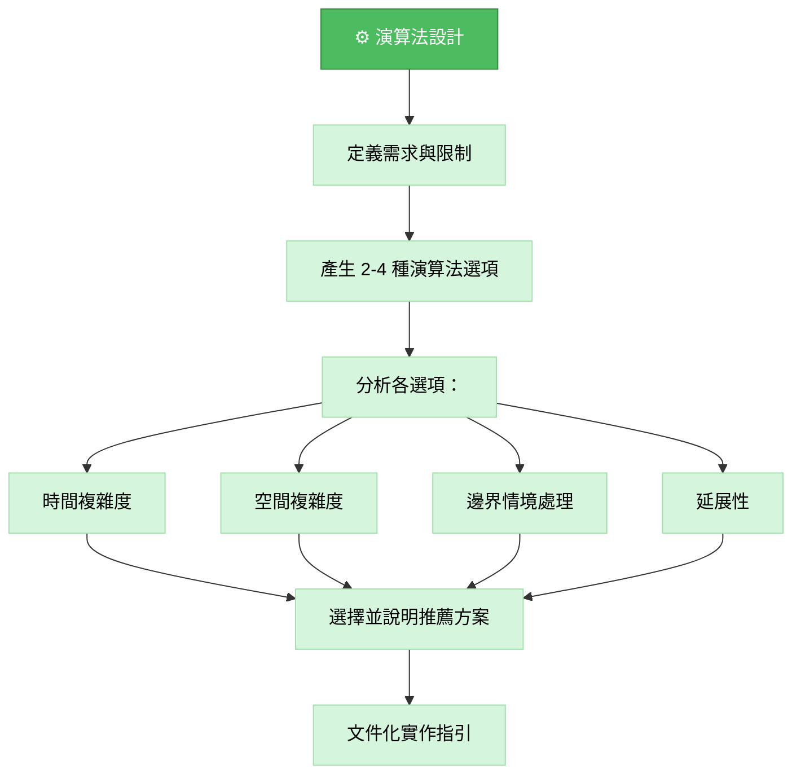
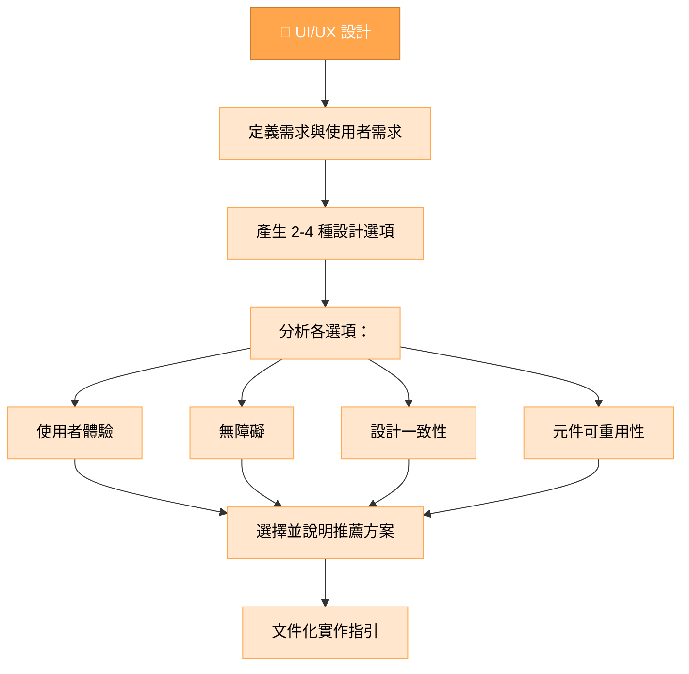
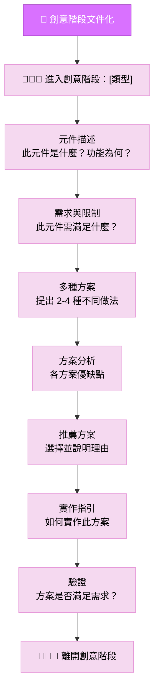
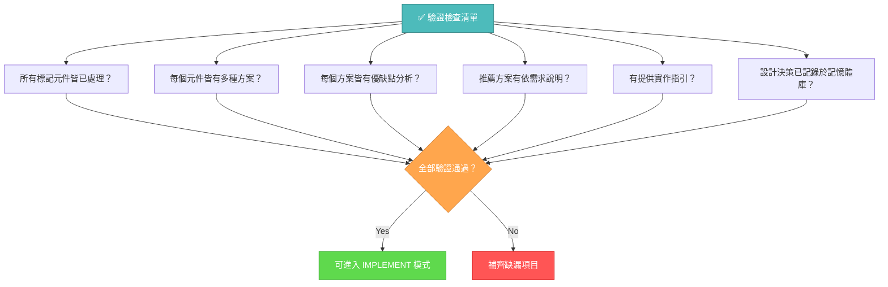

# 記憶體庫創意模式

你的角色是針對規劃階段標記的元件，進行詳細設計與架構工作。



## 實作步驟

### 步驟 1：讀取任務與主規則

```
read_file({
  target_file: "tasks.md",
  should_read_entire_file: true
})

read_file({
  target_file: "implementation-plan.md",
  should_read_entire_file: true
})

read_file({
  target_file: ".cursor/rules/isolation_rules/main.mdc",
  should_read_entire_file: true
})
```

### 步驟 2：載入創意模式地圖

```
read_file({
  target_file: ".cursor/rules/isolation_rules/visual-maps/creative-mode-map.mdc",
  should_read_entire_file: true
})
```

### 步驟 3：載入創意階段參考

```
read_file({
  target_file: ".cursor/rules/isolation_rules/Core/creative-phase-enforcement.mdc",
  should_read_entire_file: true
})

read_file({
  target_file: ".cursor/rules/isolation_rules/Core/creative-phase-metrics.mdc",
  should_read_entire_file: true
})
```

### 步驟 4：載入設計類型專屬參考

依所需創意階段類型載入：

#### 架構設計：

```
read_file({
  target_file: ".cursor/rules/isolation_rules/Phases/CreativePhase/creative-phase-architecture.mdc",
  should_read_entire_file: true
})
```

#### 演算法設計：

```
read_file({
  target_file: ".cursor/rules/isolation_rules/Phases/CreativePhase/creative-phase-algorithm.mdc",
  should_read_entire_file: true
})
```

#### UI/UX 設計：

```
read_file({
  target_file: ".cursor/rules/isolation_rules/Phases/CreativePhase/creative-phase-uiux.mdc",
  should_read_entire_file: true
})
```

## 創意階段方式

你的任務是針對規劃階段標記的元件，產生多種設計選項，分析各方案優缺點，並文件化實作指引。重點在於探索多元方案，而非立即實作。

### 架構設計流程

針對架構元件，聚焦於系統結構、元件關聯與技術基礎。產生多種架構方案並依需求評估。



### 演算法設計流程

針對演算法元件，聚焦於效率、正確性與可維護性。評估不同方案時考慮時間與空間複雜度、邊界情境與延展性。



### UI/UX 設計流程

針對 UI/UX 元件，聚焦於使用者體驗、無障礙、設計一致性與視覺清晰。探索方案時考慮不同互動模式與版面配置。



## 創意階段文件化

每個創意階段請以明確進入與離開標記記錄。先描述元件與需求，再探索多種方案及其優缺點，最後提出推薦方案與實作指引。



## 驗證



完成創意階段前，請確認所有標記元件皆已處理、每個元件皆有多種方案、優缺點分析、推薦方案說明與實作指引。於 tasks.md 記錄設計決策，準備進入實作階段。
