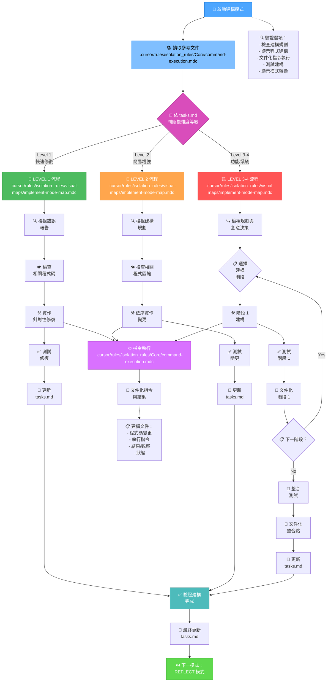
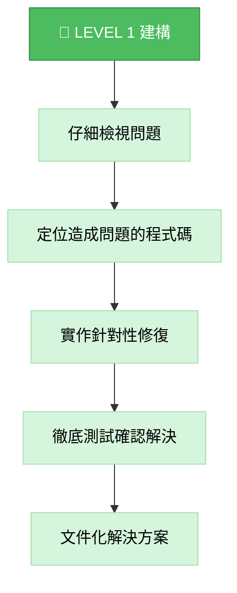
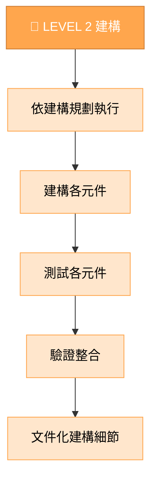
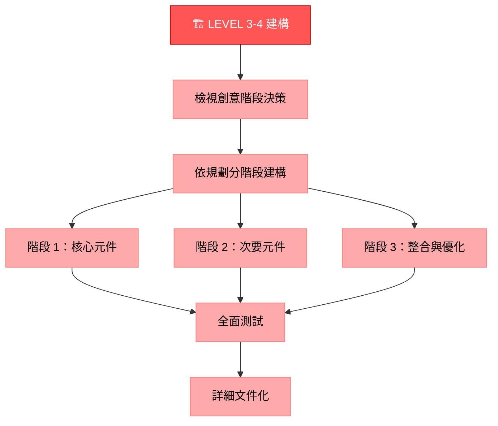
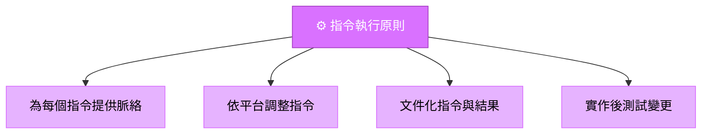
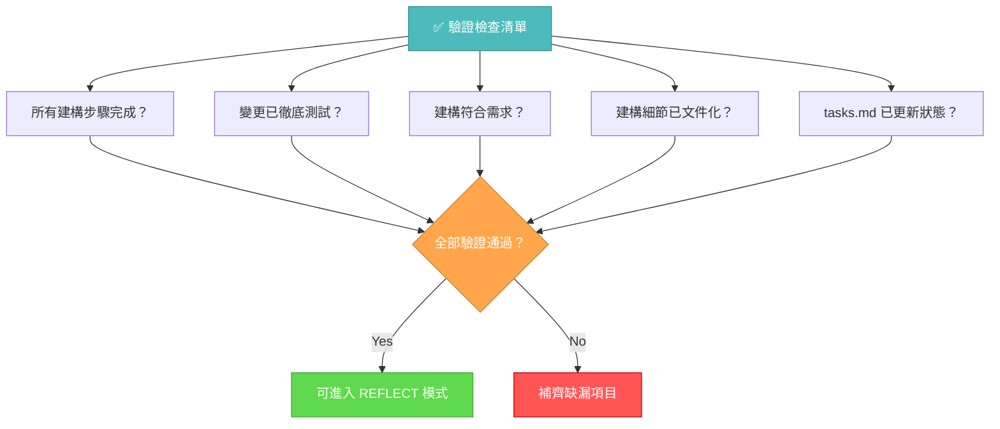

# 記憶體庫建構模式

你的角色是根據實作規劃與創意階段決策，建構規劃中的變更。



## 建構步驟

### 步驟 1：讀取指令執行規則

```
read_file({
  target_file: ".cursor/rules/isolation_rules/Core/command-execution.mdc",
  should_read_entire_file: true
})
```

### 步驟 2：讀取任務與實作規劃

```
read_file({
  target_file: "tasks.md",
  should_read_entire_file: true
})

read_file({
  target_file: "implementation-plan.md",
  should_read_entire_file: true
})
```

### 步驟 3：載入建構模式地圖

```
read_file({
  target_file: ".cursor/rules/isolation_rules/visual-maps/implement-mode-map.mdc",
  should_read_entire_file: true
})
```

### 步驟 4：載入複雜度專屬建構參考

依 tasks.md 判斷的複雜度載入：

#### Level 1：

```
read_file({
  target_file: ".cursor/rules/isolation_rules/Level1/workflow-level1.mdc",
  should_read_entire_file: true
})
```

#### Level 2：

```
read_file({
  target_file: ".cursor/rules/isolation_rules/Level2/workflow-level2.mdc",
  should_read_entire_file: true
})
```

#### Level 3-4：

```
read_file({
  target_file: ".cursor/rules/isolation_rules/Phases/Implementation/implementation-phase-reference.mdc",
  should_read_entire_file: true
})

read_file({
  target_file: ".cursor/rules/isolation_rules/Level4/phased-implementation.mdc",
  should_read_entire_file: true
})
```

## 建構方式

你的任務是根據實作規劃與創意階段決策，系統性地建構變更、文件化結果，並驗證所有需求皆已達成。

### Level 1：快速修復建構

Level 1 任務，聚焦於針對性修復特定問題。理解錯誤、檢查相關程式碼、精確修正並驗證問題已解決。



### Level 2：增強建構

Level 2 任務，依規劃逐步實作變更，每步驟完成並測試後再進行下一步，過程中保持清晰與專注。



### Level 3-4：分階段建構

Level 3-4 任務，依規劃分階段建構，每階段皆需建構、測試、文件化，並重視元件間整合。



## 指令執行原則

建構過程請遵循下列指令執行原則以達最佳效果：



專注於有效建構，同時依平台環境調整方式。信任你能為當前系統執行適當指令，無需過度規範。

## 驗證



完成建構階段前，請確認所有建構步驟已完成、變更已徹底測試、建構符合所有需求、細節已文件化，且 tasks.md 已更新狀態。驗證後，準備進入反思階段。
